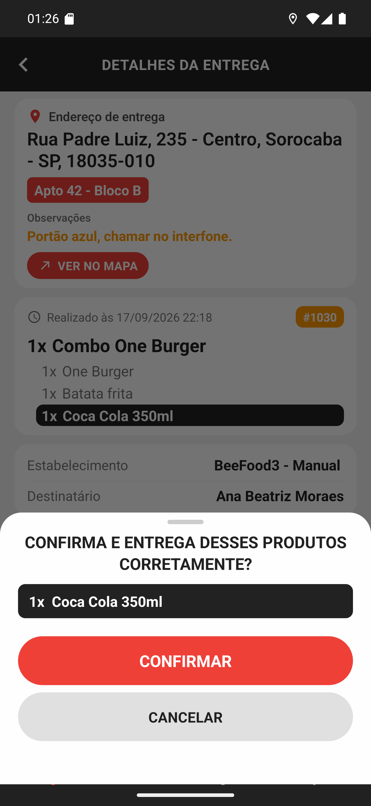

# 02 — A conferência dos itens em destaque

**O que é esta tela.** A folha que sobe ao tocar em INICIAR COBRANÇA, quando o pedido tem item
marcado para conferência: **CONFIRMA E ENTREGA DESSES PRODUTOS CORRETAMENTE?**

**O que aparece na lista.** Só os itens em destaque — aqui, **1x Coca Cola 350ml**, com a mesma
tarja preta dos detalhes. O restante do pedido não entra: a pergunta é sobre o que o
restaurante marcou como "confira antes de sair".

**O que fazer.** Olhe na sacola. Se está lá, **CONFIRMAR**. Se não está, **CANCELAR** e resolva
com o restaurante antes de cobrar.

**Por que existe.** É o item que mais gera reclamação: refrigerante, brinde, sobremesa. Uma vez
cobrado e finalizado, o pedido está fechado — e a falta vira problema para você.

**Nem todo pedido mostra esta folha.** Sem item em destaque, o toque em INICIAR COBRANÇA vai
direto para a tela de pagamento.

**A mesma pergunta aparece no FINALIZAR SEM COBRAR.** A conferência não depende de haver
dinheiro envolvido.
