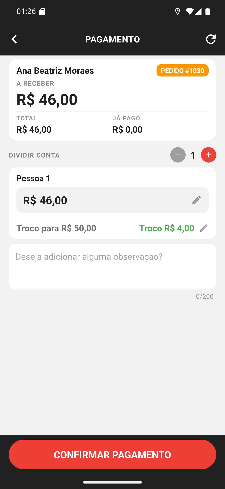

# 03 — A tela de pagamento

**O que é esta tela.** A tela **PAGAMENTO** do pedido #1030. É onde você registra o que o
cliente pagou.

**Na tela**

1. **Ana Beatriz Moraes** e **PEDIDO #1030** — de quem é a conta.
2. **A RECEBER R$ 46,00** — o número grande, o que entra na sua mão agora.
3. **TOTAL** e **JÁ PAGO** — o valor do pedido e o que o cliente já havia pago.
4. **DIVIDIR CONTA** com **−  1  +** — quantas pessoas vão pagar (capítulo 12).
5. **Pessoa 1 · R$ 46,00** com o lápis — o valor dessa pessoa, editável.
6. **Troco para R$ 50,00** e **Troco R$ 4,00**, em verde — quanto você devolve.
7. O campo de observação, até 200 caracteres.
8. **CONFIRMAR PAGAMENTO**, no rodapé.

**O troco é calculado.** Você não faz a conta: o app mostra os R$ 4,00 a devolver. O lápis ao
lado permite mudar a nota, se o cliente chegou com outra.

**O lápis do valor** serve para o cliente que paga um valor diferente do previsto. Mudando o
valor, o troco recalcula.

**A observação vai para o restaurante**, junto com a entrega. É o lugar de registrar o que
fugiu do combinado.

**CONFIRMAR PAGAMENTO não finaliza ainda.** Ele abre a escolha da forma — e é a confirmação
seguinte que registra.

**O ícone de recarregar**, no alto à direita, relê os pagamentos desta venda. Serve quando o
restaurante lançou algo no PDV enquanto você estava na porta.
