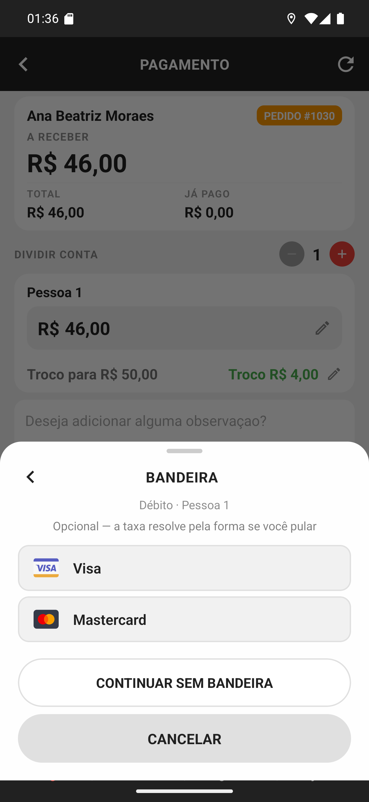

# 05 — A bandeira do cartão

**O que é esta tela.** A folha **BANDEIRA**, aberta ao escolher o Débito. O subtítulo diz de
quem é: **Débito · Pessoa 1**.

**"Opcional — a taxa resolve pela forma se você pular"**, diz a própria tela. Traduzindo: não
saber a bandeira não trava a cobrança. O restaurante calcula a taxa pela forma de pagamento
quando a bandeira não vem.

**As opções** são as bandeiras cadastradas pelo restaurante — aqui, Visa e Mastercard, com os
logos.

**CONTINUAR SEM BANDEIRA** registra o débito e segue. Use quando estiver com pressa ou em
dúvida: errar a bandeira é pior que não informá-la.

**A seta ←**, no alto à esquerda, volta para a lista de formas sem escolher nada.

**Informar a bandeira ajuda o restaurante** a conferir a maquininha no fim do dia — a taxa de
Visa e Mastercard não é a mesma. Se você consegue ver o cartão, informe.

**Crédito e outras formas de cartão** se comportam igual: quem tem bandeira cadastrada mostra
esta folha.
