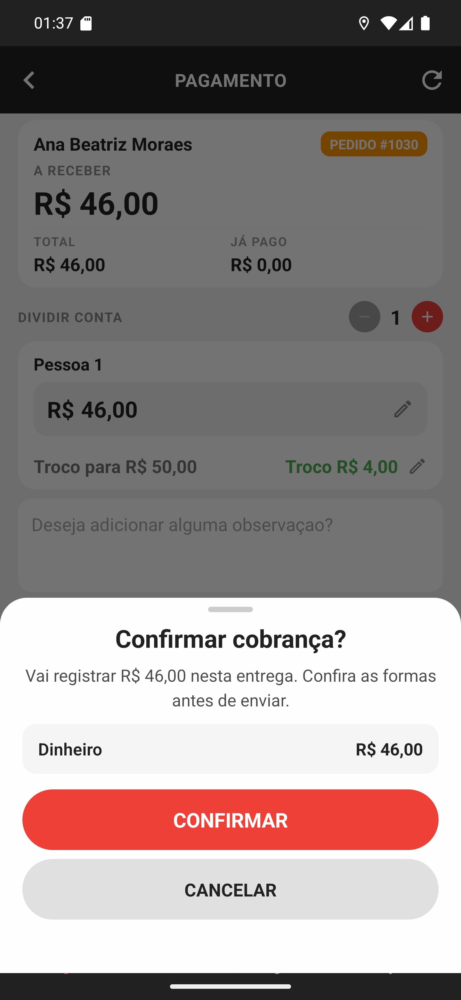

# 07 — A confirmação final

**O que é esta tela.** A última folha antes de registrar: **Confirmar cobrança?** — *Vai
registrar R$ 46,00 nesta entrega. Confira as formas antes de enviar.*

**O resumo.** Uma linha por forma, com o valor de cada uma: aqui, **Dinheiro · R$ 46,00**. Numa
conta dividida ou num pagamento em duas formas, aparecem várias linhas — e a soma precisa ser o
que você recebeu.

**É a sua última chance de conferir.** Depois de **CONFIRMAR**, o valor entra no caixa do
restaurante e a entrega é finalizada.

**CANCELAR** volta para a tela de pagamento com tudo preservado: valores, formas e observação.
Nada foi registrado.

**Toque uma vez.** O app bloqueia o botão enquanto envia, justamente porque não existe proteção
contra registro duplicado do outro lado. Se a tela parecer travada, espere — e, em caso de
dúvida, confira o [histórico](../14-historico/manual.md) antes de tentar de novo.

**Aqui também se fecha a entrega.** Não há um segundo botão de finalizar: confirmar a cobrança
é dar a entrega por concluída.
