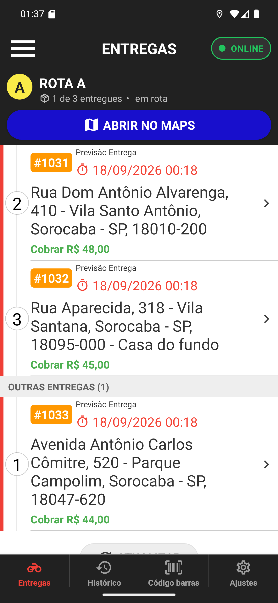

# 09 — A lista depois da cobrança

**O que é esta tela.** A aba Entregas depois de cobrar o #1030. Duas coisas mudaram.

1. **O #1030 não está mais aqui.** Entrega finalizada sai da lista; ela agora vive no
   [histórico](../14-historico/manual.md).
2. **O contador da rota virou 1 de 3 entregues.** Era 0 de 3 antes da cobrança.

**A numeração das paradas não muda.** O #1031 continua sendo o **2** e o #1032 o **3**, mesmo
sem o 1 na tela: o número é a ordem da rota, não a posição na lista.

**OUTRAS ENTREGAS (1)** segue embaixo, com o #1033 — a cobrança de um pedido não mexe nos
outros.

**Quando o contador chegar a 3 de 3**, a rota se encerra e o grupo desaparece da tela.

**A lista recarrega ao voltar.** Você não precisa atualizar nada: o app busca a lista de novo
toda vez que a aba Entregas ganha foco.
