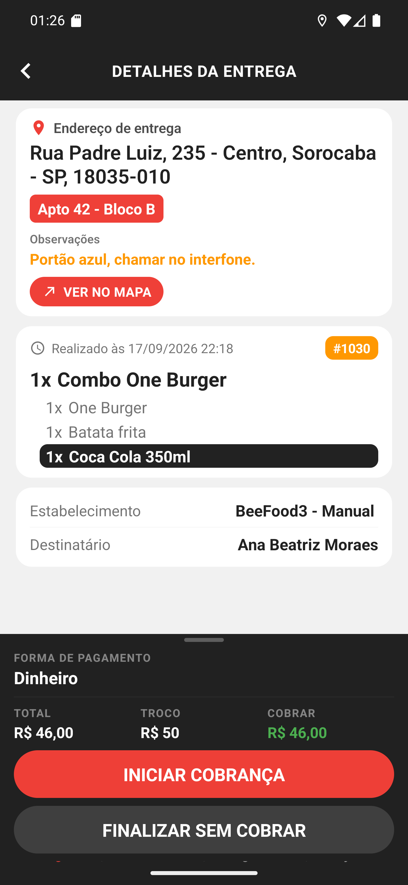
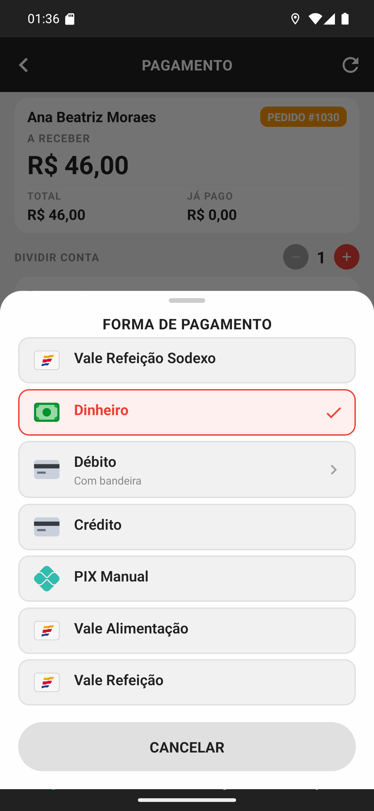
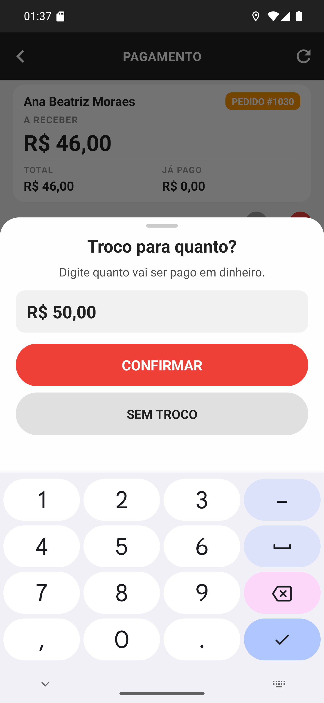
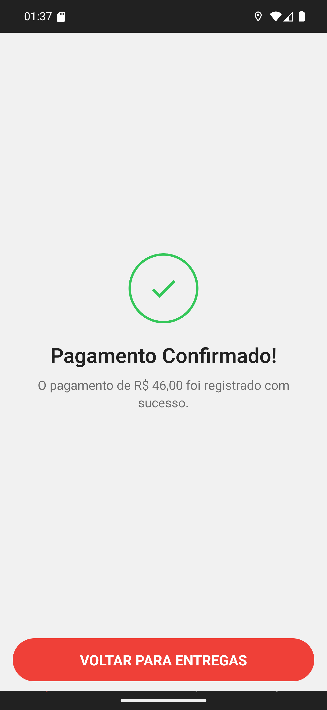

# Manual 11 — Cobrança na porta do cliente

Este é o capítulo do dinheiro. Você chegou, entregou, e agora recebe — em dinheiro, no cartão,
no PIX ou no vale — e o app registra isso no caixa do restaurante na hora.

Ao final da cobrança **a entrega é finalizada**. Não existe "cobrar agora e finalizar depois":
é a mesma operação.

---

## Por onde começa

[Entender o rodapé de cobrança](01-rodape-de-cobranca.md)

Na tela de detalhes da entrega, o rodapé escuro traz **a forma prevista**, o **TOTAL**, o
**TROCO** que o cliente pediu e quanto **COBRAR**. Dois botões: **INICIAR COBRANÇA** e
**FINALIZAR SEM COBRAR** (esse é o capítulo [13](../13-finalizar-sem-cobrar/manual.md)).

A forma no rodapé é **o que o cliente disse ao pedir**, não o que ele vai pagar. Quem decide
na porta é o cliente, e você registra o que aconteceu de fato.

## A conferência dos itens em destaque

[Entender a conferência](02-conferir-destaque.md)

Quando o pedido tem item marcado para conferência (aquele de tarja preta, capítulo
[04](../04-detalhes-da-entrega/manual.md)), o app pergunta antes: **CONFIRMA E ENTREGA DESSES
PRODUTOS CORRETAMENTE?**

É o refrigerante, o brinde, o item que mais volta como reclamação. Olhe na sacola antes de
tocar em CONFIRMAR.

## A tela de pagamento

[Entender a tela de pagamento](03-tela-de-pagamento.md)

Aqui está tudo: **A RECEBER**, o **TOTAL**, o **JÁ PAGO**, o valor da Pessoa 1, o troco
calculado e um campo de observação de até 200 caracteres.

O **DIVIDIR CONTA** com o contador é o assunto do capítulo
[12](../12-divisao-de-conta/manual.md). Com uma pessoa só, é isto: confira o valor e toque em
**CONFIRMAR PAGAMENTO**.

## Escolher a forma

[Entender a lista de formas](04-forma-de-pagamento.md)

A lista vem do cadastro do restaurante, e **a forma prevista já vem marcada** — aqui,
Dinheiro. Se o cliente mudou de ideia, toque na forma certa.

### Bandeira do cartão

[Entender a bandeira](05-bandeira-do-cartao.md)

Forma que aceita bandeira mostra **Com bandeira** e uma seta. Escolher a bandeira é
**opcional**: **CONTINUAR SEM BANDEIRA** registra pela forma, e a taxa se resolve por ela.

### Troco, quando é dinheiro

[Entender o troco](06-troco-para-quanto.md)

Escolhendo dinheiro, o app pergunta **Troco para quanto?** já com o valor que o cliente pediu.
Corrija se ele chegou com outra nota, ou toque em **SEM TROCO** se pagou justo.

## A confirmação final

[Entender a confirmação](07-confirmar-cobranca.md)

A última folha resume **o que vai ser registrado**: cada forma e quanto em cada uma. É a hora
de conferir — depois de CONFIRMAR, o valor está no caixa do restaurante.

## Pronto

[Entender a tela de sucesso](08-pagamento-confirmado.md)

**Pagamento Confirmado!** A entrega foi finalizada junto. **VOLTAR PARA ENTREGAS** te devolve à
lista.

[Entender a lista depois](09-lista-depois.md)

O pedido cobrado saiu da lista e o contador da rota subiu para **1 de 3 entregues**. A entrega
está no [histórico](../14-historico/manual.md) do dia.

## Regras que valem sempre

**Não toque duas vezes em CONFIRMAR.** Não há proteção contra pagamento repetido: o app
bloqueia o botão enquanto envia, e é nisso que você deve confiar. Se a tela travar e você não
souber se passou, **confira no histórico** antes de tentar de novo.

**O valor pode ser diferente do previsto.** Toque no lápis ao lado do valor da pessoa para
mudar. É o caso do cliente que paga parte agora.

**Você registra o que aconteceu, não o que estava combinado.** Pedido marcado como cartão pago
em dinheiro se registra como dinheiro — quem fecha o caixa à noite depende disso.

**Observação é para o restaurante.** Use para o que o dono precisa saber: "cliente pagou R$ 40
e ficou devendo R$ 6", "conferiu a sacola e faltava o refrigerante".

## Se algo não funcionar

**A forma que eu preciso não está na lista.** A lista é o que o restaurante habilitou para
delivery. Fiado, PIX automático e as formas de marketplace não aparecem de propósito — elas não
são dinheiro trocando de mão na calçada.

**"Forma de pagamento não encontrada" ou inativa.** O restaurante mudou o cadastro. O app
recarrega a lista sozinho nesse caso; se insistir, cobre por outra forma e avise a loja.

**Erro ao confirmar.** Nada foi registrado quando o app diz que falhou antes de enviar. Se o
erro veio depois de enviar, confira no histórico antes de repetir.

---

## Como este capítulo foi produzido

A cobrança do pedido **#1030** (Combo One Burger, R$ 46,00, dinheiro com troco para R$ 50) foi
feita de ponta a ponta no emulador, sem atalho: conferência do item em destaque, escolha da
forma, troco e confirmação.

O efeito foi verificado no banco: o pedido saiu de *ENTREGA* para *ENTREGUE* e ganhou uma linha
em `_preVendaPagamento` — forma Dinheiro, R$ 46,00, marcada como paga. A folha de bandeiras foi
aberta pelo Débito só para a captura, e desfeita antes de confirmar.
