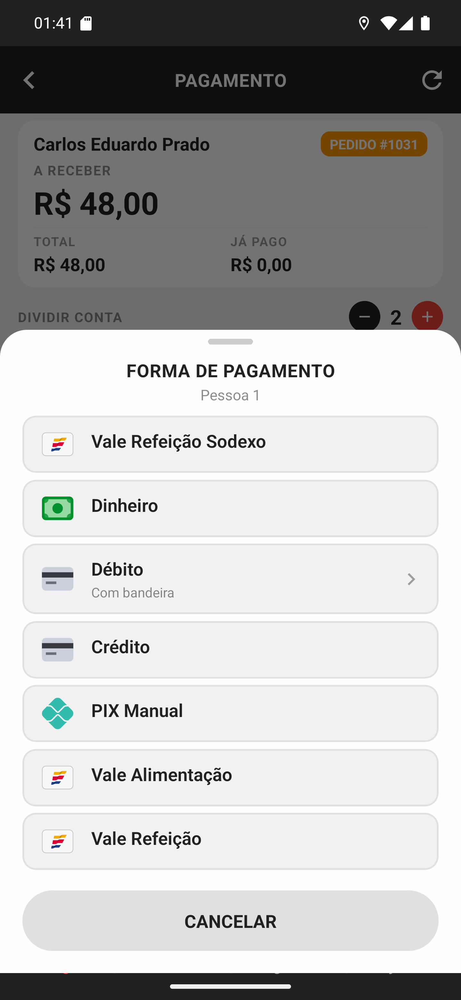

# 02 — A forma de cada pessoa

**O que é esta tela.** A folha **FORMA DE PAGAMENTO** aberta pelo bloco da **Pessoa 1** — o
subtítulo diz de quem é, e é o que evita marcar a forma na pessoa errada.

**A lista é a mesma** da cobrança simples: o que o restaurante aceita no delivery.

**Nada vem pré-selecionado.** Na cobrança de um pagador só, a forma prevista no pedido já vem
marcada. Na conta dividida não: o pedido previu uma forma para a conta inteira, e adivinhar
quem paga como só atrapalharia.

**O que fazer.** Toque na forma que essa pessoa está usando. A folha fecha e o nome dela
aparece no bloco, com o ícone.

**Cartão pergunta a bandeira** aqui também, e a folha de bandeira mostra de quem é (*Débito ·
Pessoa 1*). Escolher é opcional.

**Dinheiro pergunta o troco** da parte dessa pessoa — não do pedido inteiro.

**Repita para cada pessoa.** Enquanto houver bloco sem forma, o app não deixa confirmar.
