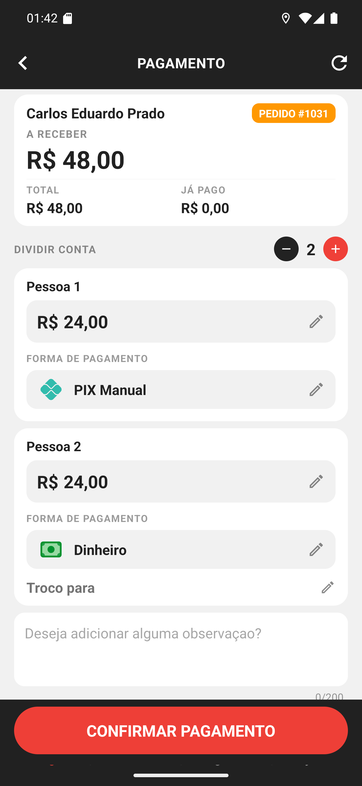

# 03 — Duas formas na mesma entrega

**O que é esta tela.** A conta dividida, com as duas formas já escolhidas: **Pessoa 1 · PIX
Manual · R$ 24,00** e **Pessoa 2 · Dinheiro · R$ 24,00**.

**A linha "Troco para"** aparece só no bloco de quem paga em dinheiro. Aqui ela está vazia
porque a Pessoa 2 pagou justo (**SEM TROCO**); com nota maior, ela mostraria o valor e o troco
a devolver em verde.

**Cada bloco é independente.** Forma, valor e troco de uma pessoa não afetam a outra.

**Os ícones ajudam a conferir de longe** — a nota verde do dinheiro, o losango do PIX, o cartão
cinza. Na porta do cliente, com pressa, é o que evita registrar na forma errada.

**O lápis continua disponível** em cada campo: dá para trocar a forma ou o valor antes de
confirmar.

**Pode conferir a soma.** R$ 24,00 + R$ 24,00 = R$ 48,00, que é o valor a receber no alto da
tela. É exatamente isso que o app exige para liberar a confirmação.

**CONFIRMAR PAGAMENTO** abre o resumo final, com uma linha por pessoa.
