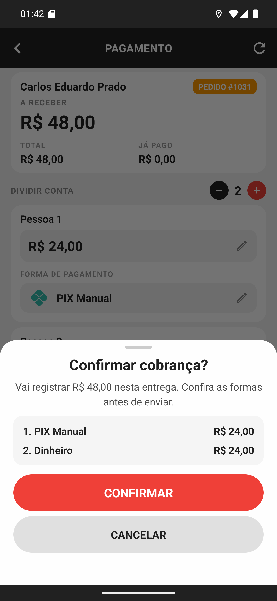

# 04 — A confirmação da conta dividida

**O que é esta tela.** A folha **Confirmar cobrança?** de uma conta dividida: *Vai registrar R$
48,00 nesta entrega.*

**O resumo é numerado**: **1. PIX Manual · R$ 24,00** e **2. Dinheiro · R$ 24,00**. Os números
seguem a ordem das pessoas na tela anterior.

**Confira duas coisas**: se cada valor está na forma certa, e se a soma é o que você recebeu de
fato.

**É tudo ou nada.** As duas partes são enviadas juntas, numa operação só: ou as duas registram,
ou nenhuma. Não existe metade cobrada.

**CANCELAR** volta para a tela com a divisão intacta — pessoas, valores e formas preservados.

**Depois de CONFIRMAR** a entrega está finalizada e os valores entraram no caixa do
restaurante, cada um na sua forma.

**Toque uma vez** e espere. Vale o mesmo aviso da cobrança simples: em caso de dúvida, confira
o [histórico](../14-historico/manual.md) antes de repetir.
