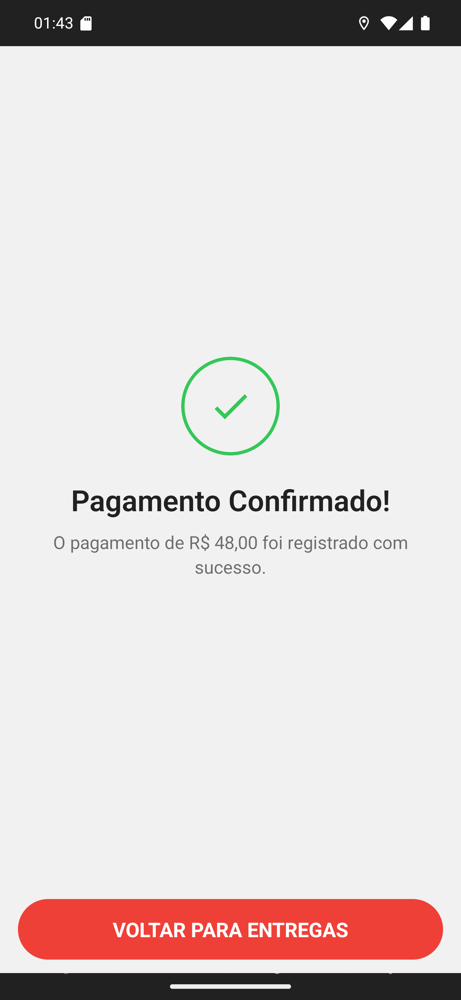

# 05 — Conta dividida confirmada

**O que é esta tela.** A mesma confirmação da cobrança simples: **Pagamento Confirmado!** — *O
pagamento de R$ 48,00 foi registrado com sucesso.*

**O valor é o cheio, não a parte.** R$ 48,00 é a soma das duas partes de R$ 24,00. A tela fala
da entrega, não de cada pagador.

**O que ficou registrado no restaurante** foram **dois** pagamentos separados para o mesmo
pedido: um em PIX Manual e um em dinheiro. É assim que o caixa consegue fechar cada forma no
fim do dia.

**A entrega foi finalizada junto**, como em qualquer cobrança.

**VOLTAR PARA ENTREGAS** devolve à lista, já sem este pedido.

**No histórico** a entrega aparece uma vez, com o valor total. A quebra por forma é informação
do restaurante, não do app.
