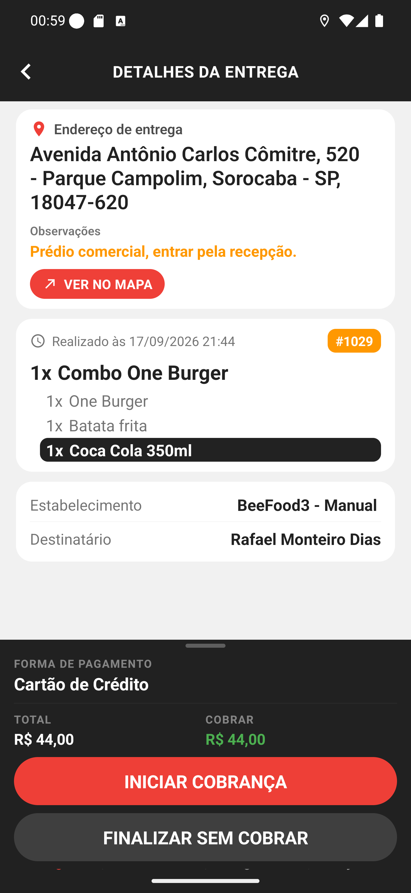
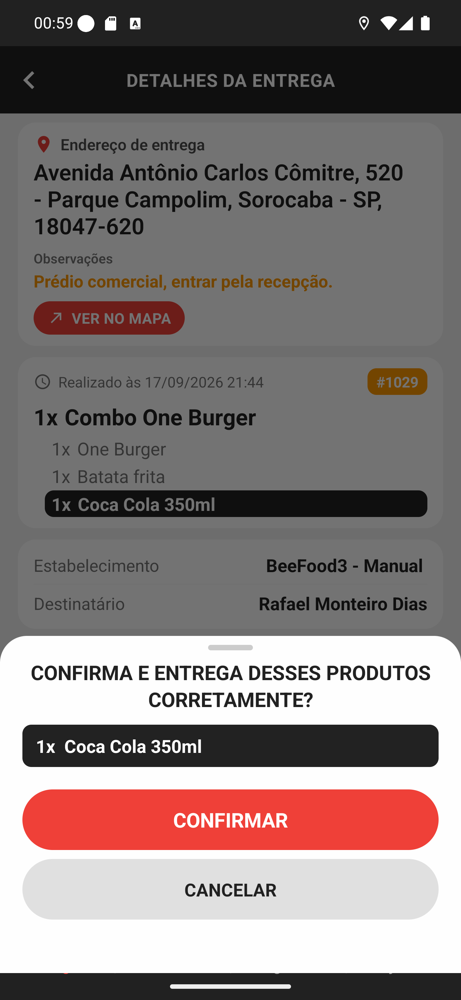
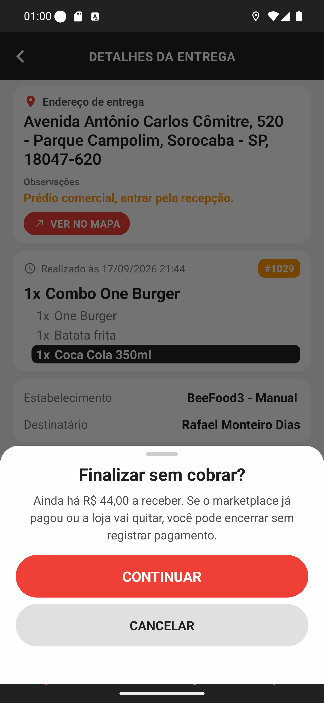
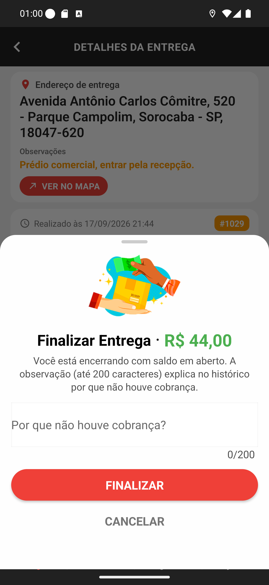
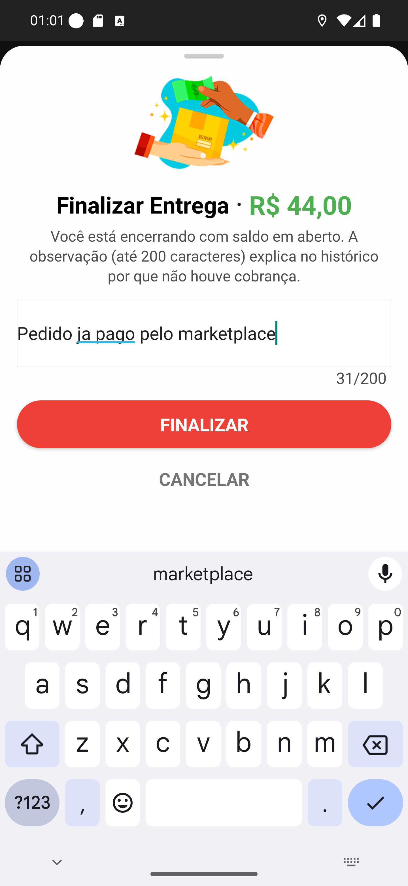
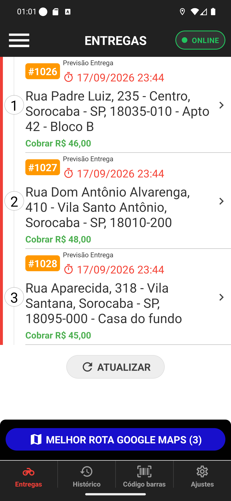

# Manual 13 — Finalizar sem cobrar

**FINALIZAR SEM COBRAR** encerra a entrega sem registrar pagamento nenhum. É o caminho para o
pedido que você entregou mas não recebeu na porta — porque o marketplace já cobrou, porque a
loja vai acertar depois, ou porque foi combinado assim.

O app não te impede de usar, mas te avisa três vezes antes. Este capítulo mostra as três.

---

## Antes: a entrega aberta

[Entender o ponto de partida](01-detalhes-antes.md)

O pedido **#1029**, R$ 44,00 a receber, com **INICIAR COBRANÇA** e **FINALIZAR SEM COBRAR** no
rodapé. Toque no segundo.

## Aviso 1 — confira os itens em destaque

[Entender a conferência](02-conferir-destaque.md)

Como o pedido tem item marcado (a Coca Cola), o app pede a conferência antes de qualquer
coisa. Mesma folha do [manual 04](../04-detalhes-da-entrega/02-conferir-destaque.md).

## Aviso 2 — você está deixando dinheiro na mesa

[Entender o aviso de saldo](03-confirmar-finalizacao.md)

**Finalizar sem cobrar?** — *Ainda há R$ 44,00 a receber. Se o marketplace já pagou ou a loja
vai quitar, você pode encerrar sem registrar pagamento.*

O valor exato aparece no texto de propósito: se você tocou por engano, é aqui que percebe.

## Aviso 3 — explique por quê

| | |
|---|---|
| [O campo de observação](04-observacao.md) |  |
| [Preenchido](05-observacao-preenchida.md) |  |

A última folha mostra **Finalizar Entrega · R$ 44,00** e pede uma observação de até 200
caracteres: *Por que não houve cobrança?*

**Escreva sempre.** Essa frase é o que vai aparecer no histórico e é a sua explicação para a
loja quando alguém perguntar por que o pedido fechou sem pagamento. Um "Pedido já pago pelo
marketplace" resolve a dúvida meses depois.

## Depois

[Entender a lista depois](06-lista-depois.md)

A entrega sai da lista na hora — de quatro cartões para três, e o botão azul passa a dizer
**(3)**. Ela agora está no [Histórico](../14-historico/manual.md), marcada como entrega sem
cobrança.

## Quando usar

| Situação | Caminho certo |
|---|---|
| Cliente paga na porta | **INICIAR COBRANÇA** ([manual 11](../11-cobranca-na-porta/manual.md)) |
| Pedido iFood/99Food já pago no app | **FINALIZAR SEM COBRAR** |
| A loja vai cobrar do cliente depois | **FINALIZAR SEM COBRAR**, explicando na observação |
| Cliente não estava em casa | **nenhum dos dois** — ligue para o restaurante |

Entrega que não aconteceu não deve ser finalizada de jeito nenhum: finalizar é dizer que o
pedido foi entregue.

## Não tem como desfazer

Uma vez finalizada, a entrega sai da sua lista e você não consegue reabri-la pelo app. Corrigir
depende do restaurante, pelo sistema dele.

## Se algo não funcionar

**O botão não responde depois do toque.** Ele fica bloqueado durante o envio para não
finalizar duas vezes. Espere; se falhar, o app avisa e a entrega continua na lista.

**Finalizou e a entrega continuou na lista.** O envio não chegou ao servidor. Puxe a lista para
atualizar antes de tentar de novo.

**Você finalizou o pedido errado.** Fale com o restaurante imediatamente — pelo app não há
volta.
