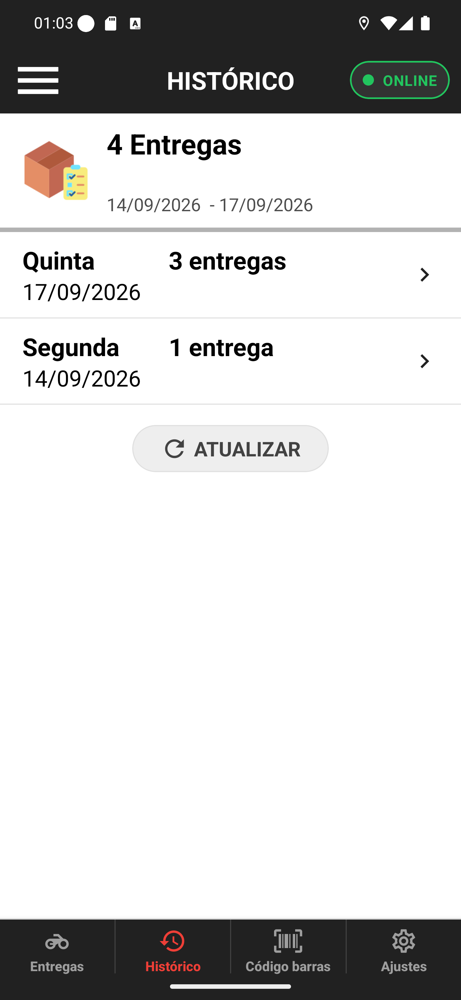

# 01 — O histórico por dia

**O que é esta tela.** A aba **Histórico**, com as entregas que você já fechou, agrupadas por
dia.

**Na tela**

1. **Cabeçalho escuro** com o título **HISTÓRICO** e a mesma pílula **● ONLINE** da tela de
   entregas.
2. **O cartão de resumo**, com o ícone da caixa: **4 Entregas** e o período
   **14/09/2026 - 17/09/2026**.
3. **Um cartão por dia**: *Quinta 17/09/2026 — 3 entregas* e *Segunda 14/09/2026 — 1 entrega*,
   cada um com a flecha `>`.
4. **ATUALIZAR**, o botão cinza.

**O que fazer.** Toque no dia que você quer ver.

**Só dias com entrega aparecem.** Entre 14 e 17 de setembro há dois cartões, não quatro: dia
sem entrega não ocupa espaço na tela.

**O total de cima é a soma do período**, não do dia — os 3 da quinta mais 1 da segunda fecham
as 4 entregas.

**A pílula de disponibilidade continua aqui**, e funciona igual: você pode entrar em pausa de
dentro do histórico, sem voltar para Entregas.

**Detalhe útil.** O período não é ajustável pelo app. Se você precisa de um recorte específico
— fechamento de semana, por exemplo — quem tem essa tela é o restaurante.
