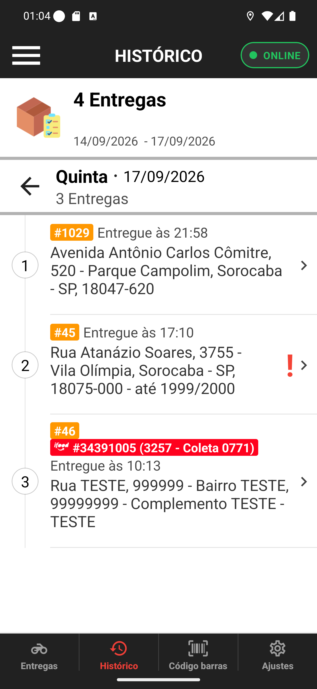

# 02 — As entregas de um dia

**O que é esta tela.** O dia aberto: **Quinta · 17/09/2026 — 3 Entregas**. A flecha à esquerda
do título volta para a lista de dias.

**Na tela**

1. **#1029 Entregue às 21:58** — *Avenida Antônio Carlos Cômitre, 520 - Parque Campolim*. É a
   entrega que finalizamos sem cobrar no [manual 13](../13-finalizar-sem-cobrar/manual.md).
2. **#45 Entregue às 17:10**, com um **`!` vermelho grande** à direita.
3. **#46**, com a **etiqueta vermelha do iFood** e o código *#34391005 (3257 - Coleta 0771)*,
   entregue às 10:13.
4. **A flecha `>`** de cada linha, que abre o detalhe.

**O que fazer.** Toque na entrega que você quer conferir.

**O `!` vermelho significa entrega atrasada** — fechada depois da previsão prometida ao
cliente. Não é erro do app nem pendência de pagamento: é um registro de que aquela entrega
passou do horário.

**A etiqueta colorida é o pedido no marketplace.** Além do número interno da loja (#46), o
pedido tem o código da plataforma, e é por ele que o restaurante conversa com o iFood. As cores
seguem as marcas: iFood vermelho, 99Food amarelo, Uber Eats preto.

**Sobre os dados estranhos desta captura:** as entregas #45 e #46 vêm de testes anteriores
feitos nesta mesma loja, por isso os endereços aparecem como *Rua TESTE, 999999*. Num dia real
de trabalho essas linhas mostram endereços normais.

**Detalhe útil.** A hora exibida é a da **entrega**, não a do pedido — é o horário em que você
fechou aquela entrega no app.
