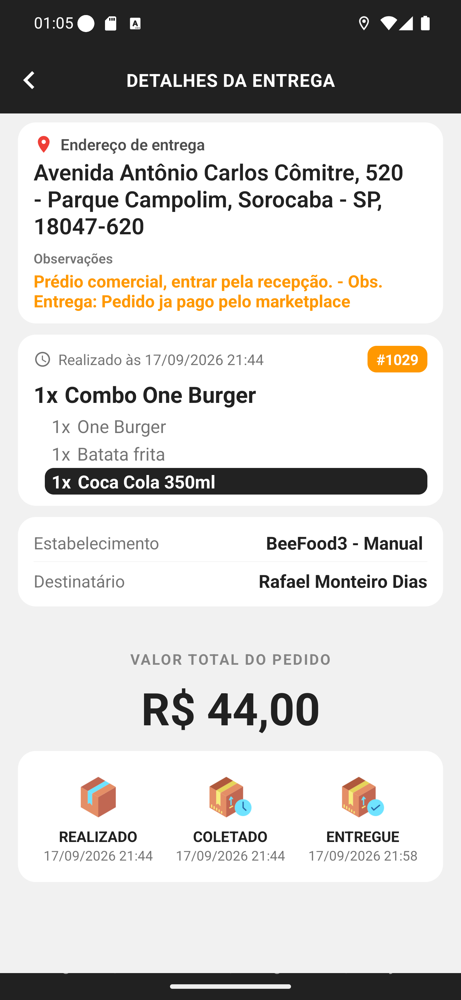

# Manual 14 — Histórico

A aba **Histórico** guarda o que você já entregou. Serve para conferir o dia, achar um pedido
antigo e tirar dúvida sobre valores — é o seu comprovante dentro do app.

---

## A tela, por dia

[Entender a lista de dias](01-historico-do-dia.md)

O topo mostra o total do período (**4 Entregas**, de **14/09/2026 a 17/09/2026**) e, abaixo, um
cartão por dia com o dia da semana, a data e quantas entregas você fez.

## Abrir um dia

[Entender as entregas do dia](02-dia-expandido.md)

Toque no cartão do dia e ele abre as entregas daquela data, numeradas, com **número do
pedido**, **hora da entrega** e o endereço.

Dois detalhes importantes aparecem neste print:

- **O `!` vermelho grande** (entrega #45) marca a entrega que foi **entregue com atraso** em
  relação à previsão.
- **A etiqueta vermelha com o logo do iFood** (entrega #46) mostra o código do pedido na
  plataforma. Cada marketplace tem sua cor: iFood em vermelho, 99Food em amarelo, Uber Eats em
  preto.

> Neste print, as entregas #45 e #46 são de testes anteriores da loja, com endereços de teste —
> e por isso aparecem com dados estranhos. A #1029 é a entrega do nosso cenário.

## Abrir uma entrega

[Entender o detalhe no histórico](03-detalhe-no-historico.md)

A tela é parecida com os detalhes da entrega aberta, com três diferenças:

| | Entrega aberta | No histórico |
|---|---|---|
| Rodapé | botões de cobrar e finalizar | não existe |
| Valor | TOTAL / TROCO / COBRAR | **VALOR TOTAL DO PEDIDO** |
| Fim da tela | — | **linha do tempo** REALIZADO → COLETADO → ENTREGUE |

A linha do tempo com os três horários é o que você usa para provar quando a entrega aconteceu.

## A sua observação fica registrada

Repare na linha de observações do print: além do recado do cliente, aparece
**"- Obs. Entrega: Pedido ja pago pelo marketplace"** — o texto que você escreveu ao
[finalizar sem cobrar](../13-finalizar-sem-cobrar/manual.md).

É por isso que vale escrever com cuidado: ela vira o registro permanente daquela entrega.

## O período é escolhido pela loja, não por você

O app não tem filtro de data. O período mostrado no topo vem do servidor, e o histórico traz
apenas **as suas** entregas — pedido que outro entregador levou não aparece aqui.

Os itens de cada pedido também não vêm de uma vez: eles são buscados quando você abre aquela
entrega, para a lista do histórico carregar rápido.

## Se algo não funcionar

**Uma entrega que você fez não está no histórico.** Se ela ainda aparece na aba Entregas, não
foi finalizada. Se não aparece em nenhuma das duas, fale com o restaurante.

**O histórico está vazio.** Ou você ainda não finalizou nada, ou o app perdeu a conexão. Toque
em **ATUALIZAR**.

**Os itens do pedido não carregam.** Eles vêm na hora em que você abre a entrega; sem internet,
o cartão fica vazio. Volte e abra de novo com sinal.
