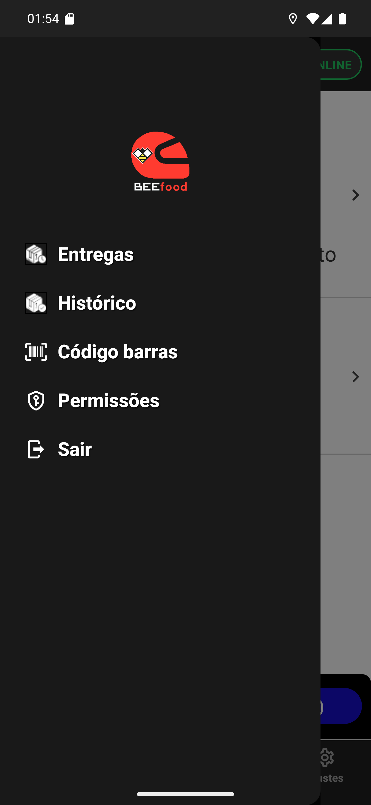

# 01 — O menu do app

**O que é esta tela.** O menu que abre pela aba **Ajustes** do rodapé — ou pelo ícone de três
riscos, no canto esquerdo do cabeçalho. Ele desliza por cima da tela, que continua visível à
direita.

**Os itens**

1. **Entregas** — a lista de entregas abertas.
2. **Histórico** — o que você já entregou.
3. **Código barras** — o leitor de etiquetas.
4. **Permissões** — o estado das permissões do aparelho.
5. **Sair** — encerra a sessão.

**Os três primeiros são atalhos** para as mesmas abas do rodapé. Não há diferença entre chegar
pelo menu ou pela aba.

**Permissões e Sair só existem aqui.** É por isso que a aba se chama Ajustes: ela é a porta para
essas duas.

**O logo BEEfood no alto** é decoração — não é botão.

**Para fechar o menu**, toque na parte visível da tela, à direita, ou arraste para a esquerda.
