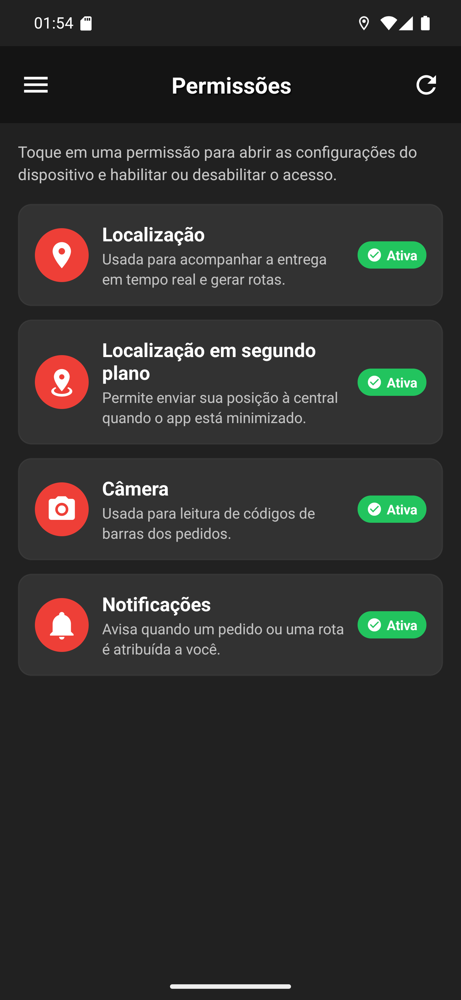

# 02 — A tela de permissões

**O que é esta tela.** O painel de permissões do app: *Toque em uma permissão para abrir as
configurações do dispositivo e habilitar ou desabilitar o acesso.*

**Os quatro cartões**, cada um com ícone vermelho, nome, explicação e o selo de estado:

1. **Localização** — *Usada para acompanhar a entrega em tempo real e gerar rotas.*
2. **Localização em segundo plano** — *Permite enviar sua posição à central quando o app está
   minimizado.*
3. **Câmera** — *Usada para leitura de códigos de barras dos pedidos.*
4. **Notificações** — *Avisa quando um pedido ou uma rota é atribuída a você.*

**Aqui todas estão Ativa**, com o selo verde. Permissão negada aparece com selo diferente, e o
cartão vira um convite a resolver.

**O app não liga permissão nenhuma.** Tocar no cartão abre as configurações do Android, e é lá
que você concede. É uma regra do sistema, não uma limitação do app.

**A de segundo plano é a que mais se perde.** Em muitos aparelhos, ela exige escolher **Permitir
o tempo todo** — sem isso, sua posição para de chegar ao restaurante quando você guarda o
celular no bolso.

**O ícone de recarregar**, no cabeçalho, relê o estado. Use depois de mexer nas configurações do
Android.

**Vale olhar no começo do turno.** O Android revoga permissão de app que fica dias sem uso, e
não avisa ninguém.
