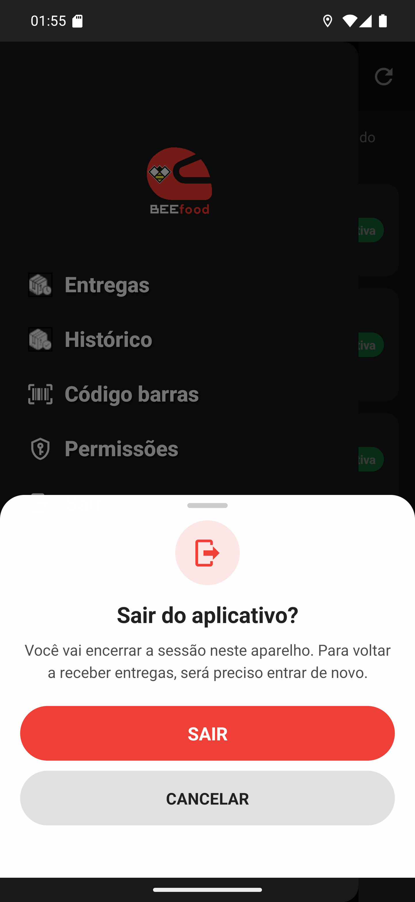

# 03 — Sair do aplicativo

**O que é esta tela.** A folha de confirmação do **Sair**: *Sair do aplicativo?* — *Você vai
encerrar a sessão neste aparelho. Para voltar a receber entregas, será preciso entrar de novo.*

**SAIR**, vermelho, encerra a sessão e leva à tela de login. **CANCELAR** volta ao menu sem
mexer em nada.

**A confirmação existe porque sair custa caro**: você precisa do login e da senha para voltar, e
enquanto estiver fora não recebe notificação de entrega nova.

**Sair não é o mesmo que ficar offline.** Para uma pausa, use a pílula de disponibilidade no
cabeçalho da lista — ela avisa o restaurante que você parou, sem encerrar a sessão.

**Quando sair faz sentido**: fim do expediente em aparelho compartilhado, troca de turno, ou
quando outra pessoa vai usar o mesmo celular.

**O que é apagado do aparelho**: a sessão, a lista de entregas e as formas de pagamento
guardadas. As entregas em si estão no restaurante — nada se perde ao sair.

> **Nesta captura, CANCELAR foi o caminho escolhido.** Sair encerraria a sessão usada pelas
> capturas dos outros capítulos.
