# Estudo completo dos grupos de acesso

Este estudo cobre **todas as permissões** que existem hoje em **Configuração → Usuários → Grupos
de Acesso**: são **93 chaves**, distribuídas em **10 categorias**. Para cada uma, ele diz o que
exatamente muda na tela de quem está no grupo.

O material está organizado em três blocos, porque as permissões **não funcionam todas do mesmo
jeito**:

1. **As que apagam uma tela inteira** — o item sai do menu e a URL digitada à mão não abre. É a
   maioria: **83 das 93**.
2. **As que mexem por dentro de uma tela** — a tela continua lá, mas com menos campos, menos
   botões ou menos colunas. São **9**, e é aqui que entra o cadastro de produto.
3. **A que só põe um cadeado** — o item continua visível, apagado, com o aviso *Acesso
   restrito*. É **1** (Multilojas). Outras seis põem cadeado em algum aplicativo **além** de
   apagar a própria tela.

E há um quarto grupo, que é a causa mais comum de confusão: **restrições que existem no BeeFood
mas não moram no grupo de acesso**. Elas estão no fim do estudo.

> As imagens têm **setas com números** (1, 2, 3...). No texto, cada número indica exatamente o
> campo ou botão correspondente na tela.

---

## Índice

- [1. O mapa geral](#1-o-mapa-geral)
- [2. Onde tudo se configura](#2-onde-tudo-se-configura)
- [3. Seis regras que evitam dor de cabeça](#3-seis-regras-que-evitam-dor-de-cabeça)
- [4. Catálogo completo, por categoria](#4-catálogo-completo-por-categoria)
- [5. A tela de cadastro de produto, restrição por restrição](#5-a-tela-de-cadastro-de-produto-restrição-por-restrição)
- [6. As restrições de dentro do Caixa](#6-as-restrições-de-dentro-do-caixa)
- [7. O que o grupo de acesso não controla](#7-o-que-o-grupo-de-acesso-não-controla)
- [8. Uma permissão, duas telas](#8-uma-permissão-duas-telas)
- [9. Perfis prontos](#9-perfis-prontos)
- [10. Resumo: quero que ele não consiga…](#10-resumo-quero-que-ele-não-consiga)

---

## 1. O mapa geral

Um **grupo de acesso** é um conjunto de permissões. Cada usuário pertence a **um** grupo, e o
grupo define o que ele vê. Mexer num switch do grupo muda a tela de **todas** as pessoas
daquele grupo.

As 93 permissões se dividem em **38 itens principais** e **55 sub-itens**. Sub-item só aparece
quando você clica na setinha (`>`) à esquerda do nome do item principal.

| Categoria (o sistema chama de *recurso*) | Itens principais | Sub-itens | Do que trata |
|-----------------------------------------|-----------------:|----------:|--------------|
| **Empresa** | 8 | 0 | Cadastros da empresa: usuários, funcionários, caixas, impressoras, TEF, plano |
| **Gestão** | 6 | 22 | Estoque, Financeiro, WhatsApp, PIX, Aplicativos, Fidelidade (CRM) |
| **Venda** | 6 | 3 | Caixa, PDV, Delivery, Mesas, Histórico de Vendas, KDS |
| **Fiscal** | 5 | 0 | NFe, NFCe, notas recebidas e as duas telas de configuração fiscal |
| **Cliente** | 3 | 0 | Clientes, Fiado, Avaliações |
| **Cadastros Básicos** | 3 | 0 | Mesas, Comandas, Formas de Recebimento |
| **Configurações** | 3 | 1 | Cardápio Digital, Cardápio Digital Tablet, IA (ChatGPT) |
| **Cadastros** | 2 | 6 | Cardápio: o cadastro em si e o Exibir / Ocultar |
| **Relatórios** | 1 | 20 | Desempenho — um switch por relatório |
| **Marketing** | 1 | 3 | Food Marketing: Pixel, Segmentação, SMS |
| **Total** | **38** | **55** | |

### Os três comportamentos

**Apaga a tela.** O item desaparece do menu lateral. Se a pessoa digitar o endereço, o sistema
devolve ela para a tela inicial, sem mensagem de erro. Vale para quase tudo: Caixa, PDV,
Delivery, Financeiro, Fiscal, Estoque, relatórios, cadastros.

**Mexe por dentro.** A tela abre, mas incompleta. São nove permissões:

| Permissão | Onde age |
|-----------|----------|
| Adicionar Novo | esconde os botões de criar no Cardápio |
| Editar (exceto preço) | trava os campos gerais do produto |
| Editar Preço | trava Preço de Venda e Custo |
| Editar Ativo (Delivery, Presencial, etc) | trava as chaves de ativação |
| Editar em Lote | esconde a edição em lote |
| Excluir | esconde os comandos de excluir |
| Visualizar Valores de Referência | apaga os valores do caixa |
| Visualizar Caixas Fechados | limita a listagem ao caixa aberto |
| Transferência de Operações | tira o TRANSFERIR e o histórico de cancelados |

> As três últimas são sub-itens de **Abrir e Fechar Caixa** e estão detalhadas no manual
> **Restrições de caixa** (#13). As seis primeiras são sub-itens de **Cadastro de Cardápio** e
> são o assunto da seção 5.

**Põe cadeado.** Na tela de Aplicativos, seis permissões deixam o cartão do aplicativo visível,
apagado, com o aviso **Acesso restrito**: **Cardápio Digital** (que atinge sete aplicativos de
uma vez), **WhatsApp**, **Inteligência Artificial (ChatGPT)**, **KDS**, **Cadastro de
Impressoras** e **Multilojas**. Só a última faz *apenas* isso; as outras cinco também apagam a
tela correspondente no menu.

---

## 2. Onde tudo se configura

O caminho é **Configuração → Usuários**. A tela tem duas abas.

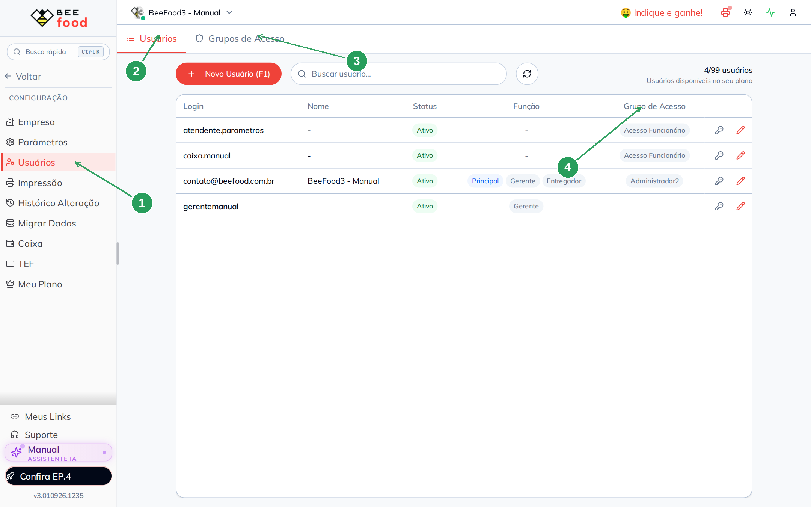

| Nº | Item | O que é |
|----|------|---------|
| 1 | Menu **Usuários** | Dentro de Configuração, no menu lateral. |
| 2 | Aba **Usuários** | Lista as pessoas. É aqui que você escolhe o grupo de cada uma e marca **Gerente**. |
| 3 | Aba **Grupos de Acesso** | Lista os grupos e dá acesso às permissões. |
| 4 | Coluna **Grupo de Acesso** | Mostra a qual grupo cada pessoa pertence. |

Clicando na linha de uma pessoa você chega ao cadastro dela — é onde o grupo é atribuído.

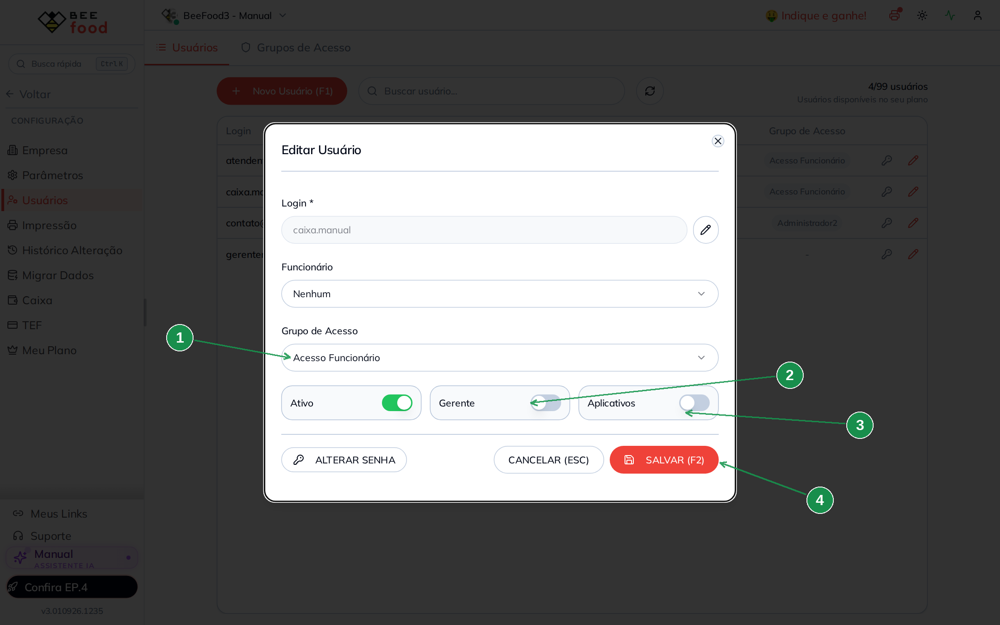

| Nº | Campo | O que faz |
|----|-------|-----------|
| 1 | **Grupo de Acesso** | Define quais das 93 permissões a pessoa herda. |
| 2 | **Gerente** | Não é permissão de grupo. Libera Copiar do iFood, Copiar de Imagem, Migrar Dados, a aba Cancelamentos do caixa e **dispensa a senha de gerente** nas ações protegidas por Parâmetros. Veja a seção 7.1. |
| 3 | **Aplicativos** | Liga o acesso da pessoa aos aplicativos. Não muda nada no painel web. |
| 4 | **SALVAR (F2)** | Este cadastro **precisa** de Salvar; os switches do grupo, não. |

Na aba **Grupos de Acesso** ficam os grupos da empresa. Clique no lápis para abrir as permissões.

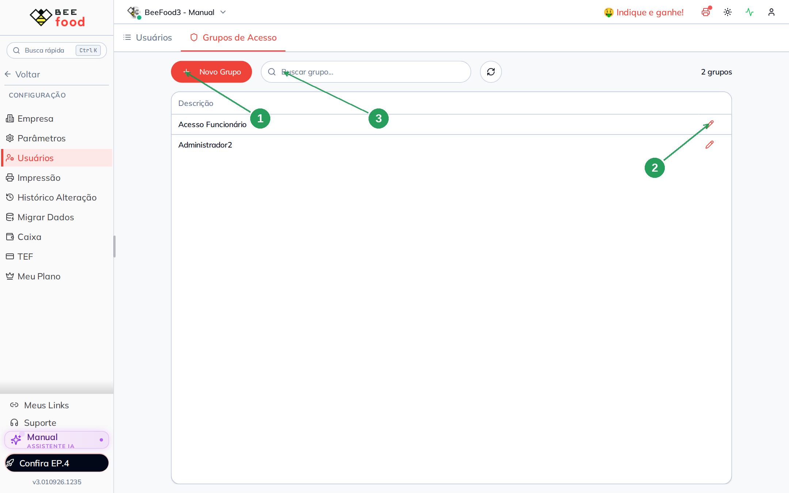

| Nº | Item | O que fazer |
|----|------|-------------|
| 1 | **+ Novo Grupo** | Cria um grupo. Ele nasce com **todas** as permissões ligadas. |
| 2 | A linha do grupo | Clique no lápis para abrir as permissões. |
| 3 | **Buscar grupo...** | Filtra a lista quando há muitos grupos. |

### O modal de permissões

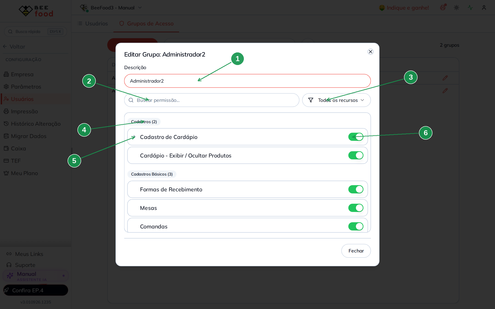

| Nº | Item | O que é |
|----|------|---------|
| 1 | **Descrição** | O nome do grupo. **Este** campo precisa do botão Salvar; os switches não. |
| 2 | **Buscar permissão...** | Filtra pelo nome da permissão. |
| 3 | **Todos os recursos** | Filtra por categoria. |
| 4 | O selo da categoria | Mostra o nome da categoria e quantos itens ela tem (`Cadastros (2)`). |
| 5 | A setinha (`>`) | Aparece só em item que tem sub-itens. Clique para expandir. |
| 6 | O switch | Verde = liberado. Cinza = bloqueado. **Salva no clique.** |

O filtro por categoria é o caminho mais rápido para percorrer o catálogo: as dez categorias
aparecem na ordem alfabética.

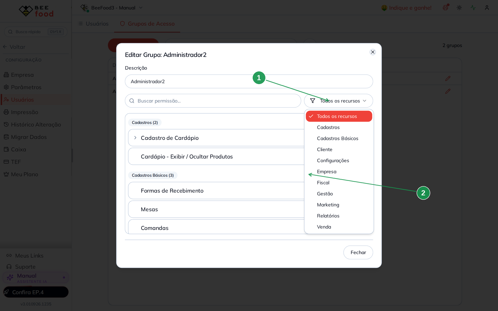

| Nº | Item | O que observar |
|----|------|----------------|
| 1 | **Todos os recursos** | A opção padrão, que mostra tudo. |
| 2 | A lista | As dez categorias da tabela da seção 1. |

A busca por texto serve para achar uma permissão específica — mas tem uma pegadinha.

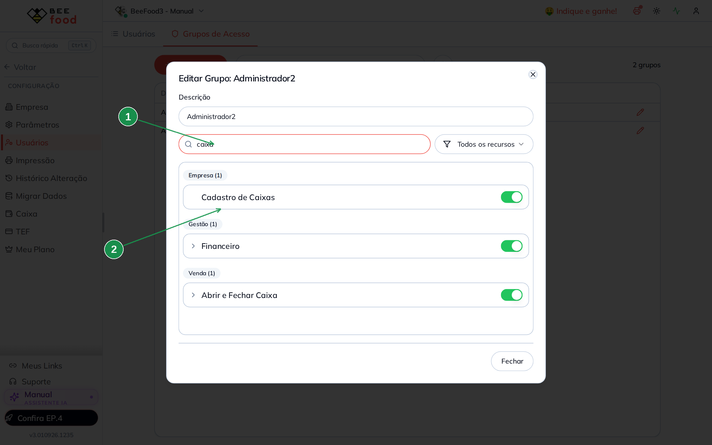

| Nº | Item | O que observar |
|----|------|----------------|
| 1 | **Buscar permissão...** | O texto digitado. |
| 2 | O resultado | Todos os itens cujo nome casa com o texto, de qualquer categoria. |

> **A busca esconde sub-itens.** Ela compara o texto com o nome do item, e sub-item cujo nome
> não casa desaparece. Buscar exatamente **"Abrir e Fechar"** não mostra os três sub-itens do
> caixa — parece que eles não existem. Busque um termo mais curto (**"caixa"**) e expanda pela
> setinha.

---

## 3. Seis regras que evitam dor de cabeça

**1. Cada switch salva na hora.** Não existe "salvar tudo no final". No instante do clique a
permissão já mudou para todo o grupo. O botão **Salvar** serve apenas para o campo
**Descrição**.

**2. A mudança leva até um minuto e meio para valer.** O sistema guarda as permissões em memória
por cerca de um minuto, e o aplicativo guarda outra cópia no navegador. Se a tela do funcionário
continuar igual: espere **cerca de 85 segundos** e peça para ele **sair e entrar de novo**.
Recarregar a página não basta.

**3. Nunca desligue "Usuários" no seu próprio grupo.** É a permissão que dá acesso a esta tela.
Desligando, você perde o caminho de volta e não há como religar por dentro do sistema.

**4. O usuário Principal não é exceção.** Ele não ignora as restrições do grupo. Se você
desligar uma permissão no grupo que é o seu, ela sai da **sua** tela também. Para testar,
use um usuário de teste em um grupo separado.

**5. Permissão que não existe é permissão liberada.** Quando o sistema não encontra a permissão,
ele **libera**. É por isso que grupo novo nasce com tudo ligado, e por isso todas as integrações
da tela de Aplicativos ficam visíveis para qualquer grupo (seção 7).

**6. Desligar o item principal não desliga os sub-itens.** Os switches dos sub-itens continuam
verdes; eles simplesmente perdem o efeito, porque a tela onde agiriam não existe mais. Ao
religar o item principal, tudo volta como estava.

---

## 4. Catálogo completo, por categoria

As tabelas abaixo têm as 93 permissões e, em cada linha, **o que desaparece** quando o switch é
desligado. `↳` marca sub-item.

### Venda

| Permissão | O que desaparece |
|-----------|------------------|
| **Abrir e Fechar Caixa** | **Caixa** no menu lateral |
| ↳ Visualizar Valores de Referência | valores dentro do Caixa — veja a seção 6 |
| ↳ Visualizar Caixas Fechados | histórico dentro do Caixa — veja a seção 6 |
| ↳ Transferência de Operações | TRANSFERIR e cancelados — veja a seção 6 |
| **PDV** | **PDV** no menu lateral |
| **Pedidos Delivery** | **Delivery** no menu lateral |
| **Mesas** | **Mesas/Comandas** no menu lateral |
| **Histórico de Vendas** | **Histórico de Vendas** no menu lateral |
| **KDS** | **KDS** no menu lateral e cadeado em Aplicativos → Monitor KDS |

### Cadastros — o cardápio

| Permissão | O que desaparece |
|-----------|------------------|
| **Cadastro de Cardápio** | o grupo **Cardápio** inteiro do menu, com **Produtos**, **Grupo de Opções**, **Complementos** e **Reordenar** |
| ↳ Adicionar Novo | os botões de criar dentro do Cardápio |
| ↳ Editar (exceto preço) | trava os campos gerais do produto |
| ↳ Editar Preço | trava **Preço de Venda** e **Custo** |
| ↳ Editar Ativo (Delivery, Presencial, etc) | trava as chaves de ativação |
| ↳ Editar em Lote | a edição em lote |
| ↳ Excluir | os comandos de excluir |
| **Cardápio - Exibir / Ocultar Produtos** | **Exibir / Ocultar**, **Rodízio** e **Preço Programado** |

Os seis sub-itens são o assunto da seção 5.

### Cadastros Básicos

| Permissão | O que desaparece |
|-----------|------------------|
| **Mesas** | Cadastros → **Mesas** |
| **Comandas** | Cadastros → **Comandas** |
| **Formas de Recebimento** | Cadastros → **Formas Recebimento** |

### Cliente

| Permissão | O que desaparece |
|-----------|------------------|
| **Clientes** | **Clientes** no menu lateral |
| **Fiado** | **Fiado** no menu lateral |
| **Avaliações** | **Avaliações** no menu lateral |

### Empresa

| Permissão | O que desaparece |
|-----------|------------------|
| **Usuários** | Configuração → **Usuários** (esta tela!) |
| **Funcionários** | Cadastros → **Funcionários** |
| **Dados da Empresa** | Configuração → **Empresa** *e* Configuração → **Parâmetros** |
| **Cadastro de Caixas** | Configuração → **Caixa** |
| **Cadastro de Impressoras** | Configuração → **Impressão** e cadeado em Aplicativos → Impressão Cupom |
| **Cadastro de TEF** | Configuração → **TEF** |
| **Histórico Alterações** | Configuração → **Histórico Alteração** |
| **Plano** | Configuração → **Meu Plano** |

> **Dados da Empresa leva os Parâmetros com ela.** É a pegadinha mais custosa deste catálogo:
> quem perde o cadastro da empresa perde também a tela de Parâmetros — onde ficam a senha de
> gerente, o operador do PDV e dezenas de comportamentos do sistema. Não existe permissão
> separada para Parâmetros.

### Configurações

| Permissão | O que desaparece |
|-----------|------------------|
| **Cardápio Digital** | o grupo **Cardápio Digital** inteiro (11 abas) e cadeado em sete aplicativos: Cardápio Digital, Cashback, Cupom Desconto, Facebook Pixel, Google Analytics, Google Tag Manager e Cardápio QR Code |
| ↳ Multilojas | **Link Multilojas** fica com cadeado, e o app Multi Lojas também |
| **Cardápio Digital Tablet** | **Cardápio Digital Tablet** no menu e o app correspondente |
| **Inteligência Artificial (ChatGPT)** | WhatsApp → **Inteligência Artificial** e cadeado no app |

### Gestão — Estoque

| Permissão | O que desaparece |
|-----------|------------------|
| **Estoque** | o grupo **Estoque** inteiro, junto com **Meu Estoque** |
| ↳ Movimentações de Estoque | Estoque → **Movimentações** |
| ↳ Importação de NF-e | Estoque → **Importar NFe** |
| ↳ Receitas | Estoque → **Receitas** |
| ↳ Produção | Estoque → **Produção** |

### Gestão — Financeiro

| Permissão | O que desaparece |
|-----------|------------------|
| **Financeiro** | o grupo **Financeiro** inteiro |
| ↳ Lançamentos | Financeiro → **Lançamentos** |
| ↳ Fluxo de Caixa | Financeiro → **Fluxo Caixa** |
| ↳ Relatório Recebimentos | Financeiro → **Recebimentos** |
| ↳ Relatório Pagamentos | Financeiro → **Pagamentos** |
| ↳ Relatório DRE | Financeiro → **DRE** |
| ↳ Categorias | Financeiro → **Categorias Despesas** |
| ↳ Fornecedores | Financeiro → **Fornecedores** |
| ↳ Formas Pagamento | Financeiro → **Formas Pagamento** |
| ↳ Contas Bancárias | Financeiro → **Contas Bancárias** |

### Gestão — WhatsApp, PIX, Aplicativos e CRM

| Permissão | O que desaparece |
|-----------|------------------|
| **WhatsApp** | o grupo **WhatsApp** inteiro, junto com **Conexão**, e cadeado no app WhatsApp |
| ↳ Resumo / Histórico de Mensagens | WhatsApp → **Histórico** |
| ↳ Campanhas | WhatsApp → **Envios em Massa** *e* Food Marketing → **Campanhas WhatsApp** e **Campanhas Inteligentes** |
| ↳ Resumo diário / semanal | WhatsApp → **Resumo Diário** |
| ↳ Notificações | WhatsApp → **Notificações** |
| ↳ Respostas Automática | WhatsApp → **Respostas** |
| **PIX** | **Pix Online** no menu e o app Pix Online |
| **Aplicativos** | **Aplicativos** no menu lateral (a tela inteira das integrações) |
| **Fidelidade (CRM)** | o grupo **Fidelidade (CRM)** inteiro |
| ↳ Relatório de Fidelidade | Fidelidade (CRM) → **Fidelidade** |
| ↳ Cupom de Desconto | Fidelidade (CRM) → **Cupom de Desconto** |
| ↳ Cashback | Fidelidade (CRM) → **Cashback** |
| ↳ Avaliações | Fidelidade (CRM) → **Avaliações** |

### Fiscal

| Permissão | O que desaparece |
|-----------|------------------|
| **NFCe - Nota Fiscal do Consumidor Eletrônica** | Fiscal → **NFCe** |
| **NFe - Nota Fiscal Eletrônica** | Fiscal → **NFe** |
| **NFe - Recebidas** | Fiscal → **NFe Recebidas** |
| **Configuração Fiscal - Regra Fiscal** | Fiscal → **Configuração** |
| **Configuração Fiscal - Edição** | Fiscal → **Edição Fiscal** |

### Marketing

| Permissão | O que desaparece |
|-----------|------------------|
| **Food Marketing** | o grupo **Food Marketing** inteiro |
| ↳ BeeFood Pixel Analytics | Food Marketing → **BeeFood Pixel Analytics** |
| ↳ Segmentação de Clientes | Food Marketing → **Segmentação de Cliente** |
| ↳ Campanhas SMS | Food Marketing → **Campanhas SMS** |

> **Campanhas de WhatsApp não fica aqui.** Ela é sub-item de **WhatsApp**, na categoria Gestão.
> Desligar Food Marketing esconde o grupo inteiro do menu, inclusive as campanhas; religar Food
> Marketing e deixar **Campanhas** (do WhatsApp) desligado esconde só as duas telas de campanha.

### Relatórios — Desempenho

O item principal **Desempenho (Gráficos)** tira o **Desempenho** do menu. Os 20 sub-itens
controlam um relatório cada, dentro da tela.

| Sub-item | Relatório |
|----------|-----------|
| Resumo | **Resumo** |
| Vendas - Origem | Vendas → **Origem** |
| Vendas - Resumo | Vendas → **Resumo** |
| Vendas - Recebimento | Vendas → **Recebimento** |
| Vendas - Descontos | Vendas → **Descontos** |
| Vendas - Cancelamentos | Vendas → **Cancelamentos** |
| Produtos - Produtos | Produtos → **Produtos** |
| Produtos - Setor | Produtos → **Setor** |
| Produtos - Sem opções | Produtos → **Produtos sem opções** |
| Produtos - Com opções | Produtos → **Produtos com opções** |
| Produtos - Grupo de opções | Produtos → **Grupo de Opções** |
| Delivery - Mapa de calor | Delivery → **Mapa de Calor** *e* **Top Bairros** |
| Delivery - Oportunidades | Delivery → **Oportunidades** |
| Delivery - Sugestões | Delivery → **Sugestões** |
| Presencial - Taxa Serviço | Presencial → **Taxa Serviço** |
| Presencial - Pedidos (Mobile e Comissão) | Presencial → **Pedidos (Mobile e Comissão)** |
| Presencial - Sugestões | Presencial → **Sugestões** |
| Clientes - Base de clientes | Clientes → **Base de Clientes** |
| Clientes - Análise RFV | Clientes → **Análise RFV** |
| Clientes - Análise Recorrência | Clientes → **Análise Recorrência** |

Três detalhes do Desempenho:

- **Os cabeçalhos Vendas, Produtos, Delivery, Presencial e Clientes não têm switch.** Cada um
  desaparece sozinho quando **todos** os relatórios de dentro dele estão desligados.
- **Um switch, dois relatórios.** *Delivery - Mapa de calor* controla também o **Top Bairros**.
- **Um relatório sem permissão.** *Entregador (Taxa / KM)* não tem switch: quem chega ao
  Desempenho vê esse relatório.

---

## 5. A tela de cadastro de produto, restrição por restrição

O cadastro de produto é a tela que mais responde ao grupo de acesso: **seis** permissões agem
dentro dela, todas sub-itens de **Cadastro de Cardápio**, na categoria **Cadastros**.

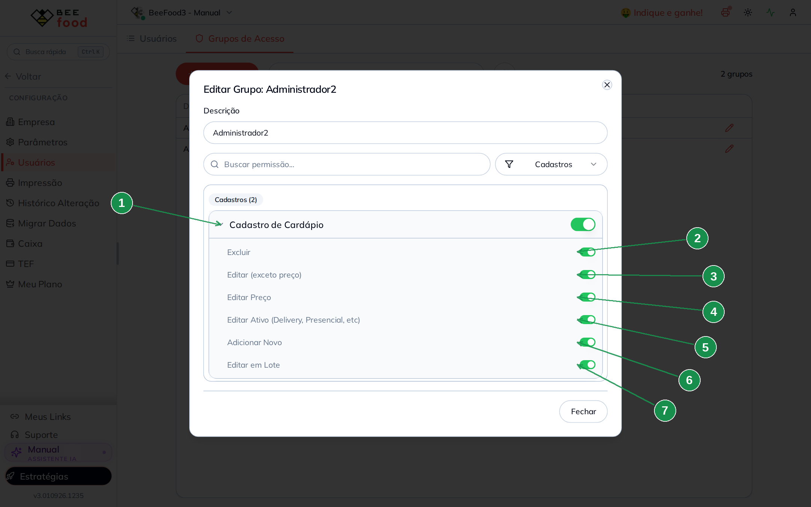

| Nº | Item | O que controla |
|----|------|----------------|
| 1 | A setinha de **Cadastro de Cardápio** | Expande os seis sub-itens. |
| 2 | **Excluir** | Os comandos de excluir produto, opção e setor. |
| 3 | **Editar (exceto preço)** | Praticamente todos os campos do produto. |
| 4 | **Editar Preço** | Preço de Venda e Custo. |
| 5 | **Editar Ativo (Delivery, Presencial, etc)** | As chaves de ativação. |
| 6 | **Adicionar Novo** | Os botões de criar. |
| 7 | **Editar em Lote** | A edição em lote. |

> **Elas valem no cardápio inteiro**, não só no produto: os mesmos seis switches controlam
> opções, complementos, grupos de opções e setores.

### 5.1 O ponto de partida: a tela completa

Guarde estas duas telas. Todas as comparações da seção são contra elas.

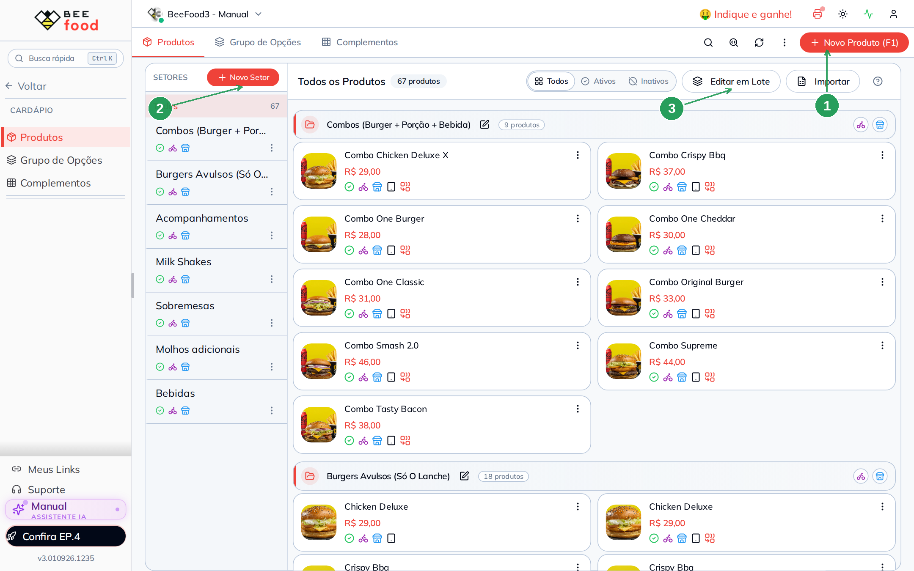

| Nº | Item | O que é |
|----|------|---------|
| 1 | **+ Novo Produto (F1)** | Cria produto. Depende de *Adicionar Novo*. |
| 2 | **+ Novo Setor** | Cria setor. Depende de *Adicionar Novo*. |
| 3 | **Editar em Lote** | Depende de *Editar em Lote*. |
| 4 | Os três pontos (`⋮`) do produto | Abre o menu com *Em falta*, *Desativar Delivery*, *Desativar Presencial* e *Excluir*. |

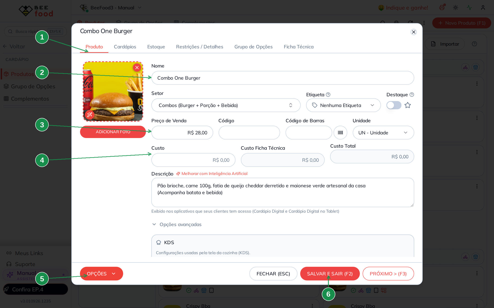

| Nº | Item | O que é |
|----|------|---------|
| 1 | As seis abas | **Produto**, **Cardápios**, **Estoque**, **Restrições / Detalhes**, **Grupo de Opções**, **Ficha Técnica**. |
| 2 | **Nome** (e Setor, Código, Unidade, Descrição) | Campos gerais. Dependem de *Editar (exceto preço)*. |
| 3 | **Preço de Venda** | Depende de *Editar Preço*. |
| 4 | **Custo** | Também depende de *Editar Preço* — e **aparece para qualquer um** que abra o produto. |
| 5 | **OPÇÕES** | Menu do rodapé; é onde fica o *Excluir Produto*. |
| 6 | **SALVAR E SAIR (F2)** | Só funciona se pelo menos uma das três permissões de edição estiver ligada. |

> As chaves **Ativo**, **Delivery**, **Presencial** e **Totem** não estão nesta aba: elas ficam
> na aba **Cardápios**, e é lá que a restrição de ativação aparece (item 5.4).

### 5.2 Sem "Editar (exceto preço)"

Esta é a restrição mais silenciosa do BeeFood, e vale entender bem: **a tela quase não avisa**.

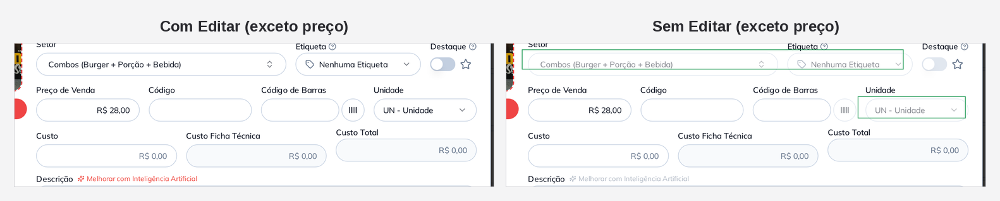

| O que muda | Como fica sem a permissão |
|------------|---------------------------|
| **Setor** e **Etiqueta** | Apagados (cinza claro). Clicar não abre a lista. |
| **Unidade** | Apagada, do mesmo jeito. |
| **Melhorar com Inteligência Artificial** | Apagado, não responde ao clique. |
| **Nome**, **Código**, **Código de Barras**, **Descrição** | Continuam com a **mesma aparência** de sempre. A diferença é que não aceitam digitação. |

**O que o funcionário sente:** ele clica no campo Nome, o cursor aparece, ele digita — e nada
acontece. Sem mensagem, sem cadeado. Só as listas (Setor, Etiqueta, Unidade) e os botões ficam
visivelmente apagados. Vale avisar a equipe, porque parece defeito.

Campos travados por esta permissão, em toda a tela:

| Aba | Campos |
|-----|--------|
| **Produto** | Nome, Setor, Subsetor, Código, Código de Barras, Unidade, Descrição, botão de IA, Observações internas, Sem taxa de serviço, Somente agendamento, Enviar para balança, Setor de produção, Nome de produção |
| **Restrições / Detalhes** | a aba inteira |

> Quando **as três** permissões de edição estão desligadas (Editar, Editar Preço e Editar
> Ativo), o botão **SALVAR E SAIR (F2)** fica apagado — a tela vira consulta pura.

### 5.3 Sem "Editar Preço"

Aqui vem a informação mais importante desta seção: **os dois lados são idênticos**.

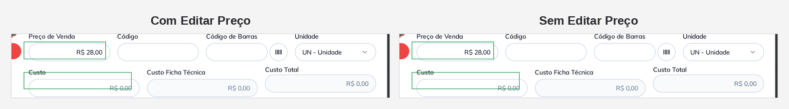

Os campos destacados são exatamente os que a permissão controla — e eles não mudam de aparência.
O valor continua à vista, o campo aceita o clique, mas **não aceita digitação**. Na aba
**Cardápios**, os preços de Delivery e Presencial de cada filial ficam travados do mesmo jeito
(esses sim ficam visivelmente apagados).

> **Não existe permissão para esconder o custo.** *Editar Preço* controla apenas a **edição**.
> Quem abre o cadastro do produto vê **Custo**, **Custo Ficha Técnica** e **Custo Total**. Se a
> margem não pode circular, o único caminho é tirar o acesso ao Cardápio inteiro (item 5.7).

### 5.4 Sem "Editar Ativo (Delivery, Presencial, etc)"

As chaves de ativação ficam na aba **Cardápios** do produto — uma linha por cardápio da empresa.

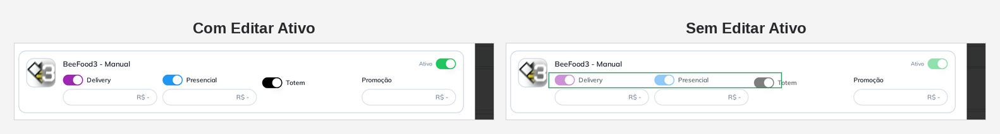

As chaves **Delivery**, **Presencial**, **Totem** e **Ativo** ficam apagadas. O estado continua
legível (o funcionário vê que o produto está no delivery), mas o clique não muda nada.

O efeito mais visível é na lista de produtos, no menu de três pontos (`⋮`) de cada item:

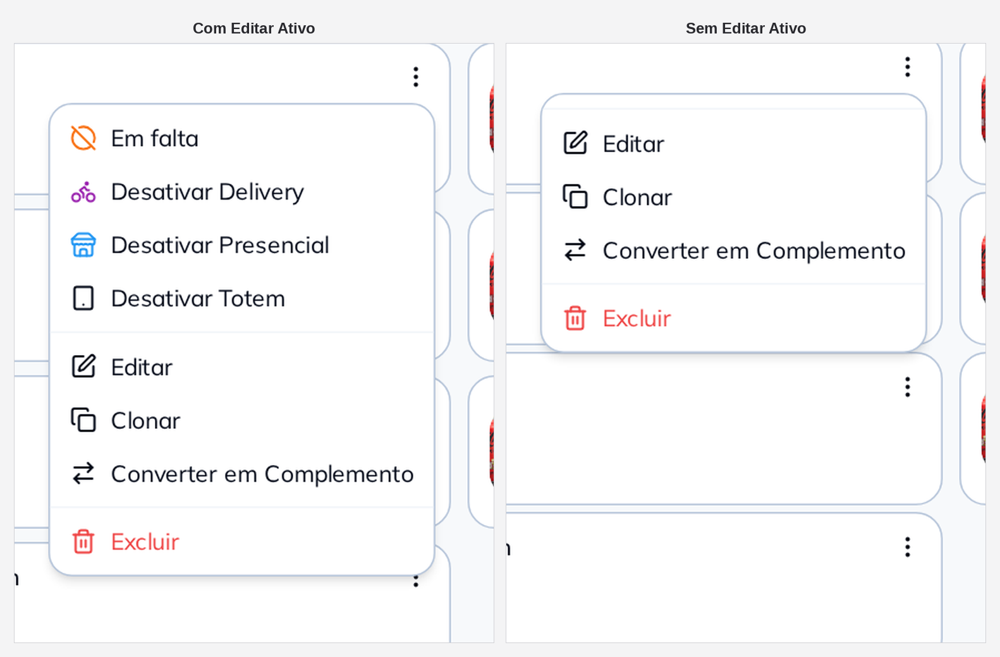

| O que muda | Como fica sem a permissão |
|------------|---------------------------|
| **Em falta** | desaparece |
| **Desativar Delivery** | desaparece |
| **Desativar Presencial** | desaparece |
| **Desativar Totem** | desaparece |
| Editar, Clonar, Converter em Complemento, Excluir | continuam |

**Para que serve:** é a restrição do dia a dia de quem não pode tirar produto do ar. O
funcionário continua consultando ficha, preço e descrição, mas não derruba item do cardápio.

### 5.5 Sem "Excluir"

Na lista, o `⋮` de cada produto perde a última linha:

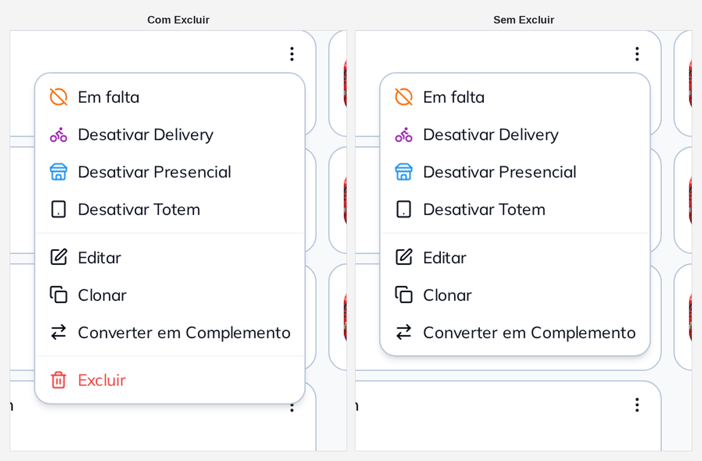

E dentro do produto, o menu **OPÇÕES** do rodapé fica vazio:

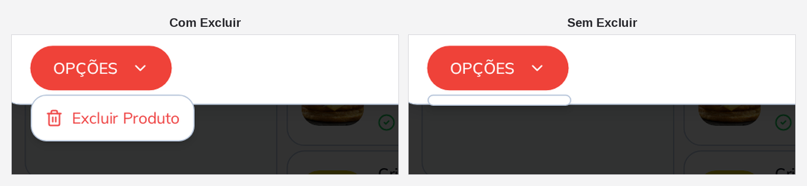

Cada **setor** também perde o **Excluir** do próprio menu `⋮`, na coluna SETORES. O mesmo vale
para opções, complementos e grupos de opções.

### 5.6 Sem "Adicionar Novo" e sem "Editar em Lote"

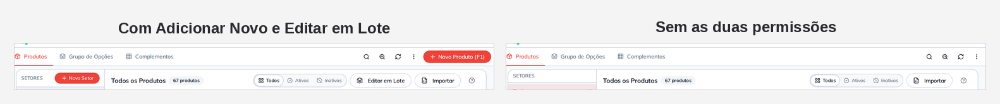

| O que muda | Como fica sem as permissões |
|------------|-----------------------------|
| **+ Novo Produto (F1)** | desaparece (*Adicionar Novo*) |
| **+ Novo Setor** | desaparece (*Adicionar Novo*) |
| **Editar em Lote** | desaparece (*Editar em Lote*) |
| Todos, Ativos, Inativos, Importar | continuam |

São duas permissões diferentes, e a diferença importa: *Adicionar Novo* impede **criar**;
*Editar em Lote* impede **alterar muitos de uma vez**. Deixar só a segunda desligada é o
arranjo mais comum — cria-se produto normalmente, mas ninguém muda 60 preços num clique.

### 5.7 Sem "Cadastro de Cardápio" (o item principal)

É a restrição mais ampla: **o cardápio deixa de existir** para o usuário.

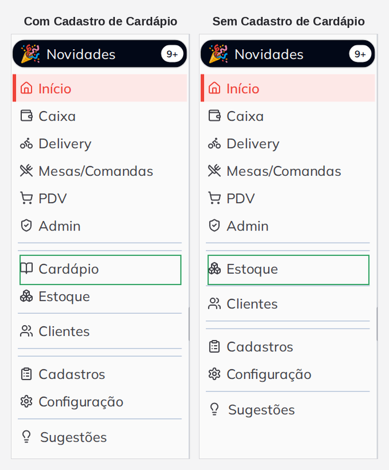

O grupo **Cardápio** sai do menu lateral — e com ele **Produtos**, **Grupo de Opções**,
**Complementos** e **Reordenar**. No lugar dele, o menu passa direto de **Admin** para
**Estoque**.

Digitar o endereço não adianta: testado com `/cardapio?tab=produtos`, o sistema devolve o
usuário para a tela inicial, sem mensagem de erro.

> Os seis sub-itens continuam com o switch verde, mas sem efeito — não há mais cardápio para
> restringir. É a única forma, hoje, de impedir que alguém **veja** o custo dos produtos.

### 5.8 O que não dá para restringir na tela de produto

| Você gostaria de… | Hoje |
|-------------------|------|
| esconder o **Custo** deixando o resto visível | não existe |
| esconder a aba **Ficha Técnica** | não existe permissão própria |
| esconder a aba **Grupo de Opções** | não existe permissão própria |
| travar o switch **Aceita Estoque Negativo** | a permissão existe no sistema (Estoque → Estoque Negativo), mas **não tem switch** na tela de grupos |
| esconder a aba **Estoque** do produto | indiretamente: ela só aparece para quem tem **Estoque** e **Meu Estoque** |
| permitir editar preço **até um limite** | não existe |

---

## 6. As restrições de dentro do Caixa

**Abrir e Fechar Caixa** tem três sub-itens que não escondem tela: eles mudam o que o Caixa
mostra por dentro.

| Sub-item | O que acontece no Caixa |
|----------|-------------------------|
| **Visualizar Valores de Referência** | Saldo Final, Conf. Saldo Final e Quebra de Caixa saem da listagem; o painel Resumo fica vazio; o fechamento vira **conferência cega** (o operador digita o que contou sem ver o que o sistema esperava) |
| **Visualizar Caixas Fechados** | a listagem passa a mostrar só o caixa aberto agora |
| **Transferência de Operações** | o botão **TRANSFERIR** e os ícones de **Cancelamentos** e **Excluídos** desaparecem, e a transferência é recusada pelo servidor |

Estas três, mais a **Função Gerente** e o **Usuário Fixo** do cadastro de caixas, estão
detalhadas com telas no manual **Restrições de caixa** (`manuais/caixa-restricoes/`). Aqui
importa saber que elas são de outra natureza: não passam pelo menu, e sim pelo que o servidor
devolve para a tela do caixa.

---

## 7. O que o grupo de acesso não controla

Esta é a seção que responde à maioria dos "por que não consigo bloquear isso?".

### 7.1 Restrições que existem, mas moram em outro lugar

| Restrição | Onde fica de verdade |
|-----------|----------------------|
| Aba **Cancelamentos** do caixa | **Gerente**, no cadastro do usuário |
| **Copiar do iFood**, **Copiar de Imagem**, **Migrar Dados** | **Gerente**, no cadastro do usuário — o grupo não tem efeito nenhum sobre eles |
| Tela inicial diferente (gerente x funcionário) | **Gerente**, no cadastro do usuário |
| Cards de resumo da NFe/NFCe | **Gerente**, no cadastro do usuário |
| Linha **Taxa de Serviço** no resumo do caixa | **Gerente**, no cadastro do usuário |
| Pedir senha para cancelar venda, estornar pagamento, excluir item, dar desconto, mexer no estoque | **Configuração → Parâmetros**, seção Gerente |
| Limite máximo de desconto | **Configuração → Parâmetros** |
| Exigir identificação do operador no PDV | **Configuração → Parâmetros** |
| Cada um vê só o próprio caixa | campo **Usuário Fixo**, em Configuração → Caixa |
| Acesso da pessoa aos aplicativos | switch **Aplicativos**, no cadastro do usuário |

> A **Função Gerente** é um atalho poderoso: quem é gerente **não precisa** digitar senha de
> gerente nas ações protegidas por Parâmetros. Marcar alguém como gerente para "resolver" um
> bloqueio abre bem mais do que se imagina.

> O switch **Aplicativos** do cadastro do usuário não muda nada no painel web — o usuário de
> teste deste estudo estava com ele desligado e continuou entrando normalmente pelo navegador.

### 7.2 Itens que nenhum grupo consegue esconder

- **Todas as integrações da tela de Aplicativos** — iFood, Keeta, 99Food, Rappi, UaiRango,
  Aiqfome, Delivery Much, Google Business, Uber Direct, Machine, Lets Express, Foody Delivery,
  Pick n Go, Agilizone, Open Delivery, Mapas Google, BeeFood Entregador, Gestão de Entregas, App
  Garçom, Totem, Balança, Pesagem Automática, Mercado Pago, TEF PayGo, AutoTEF Stone, Repediu,
  Domínio Próprio, Super Avaliações e as seis categorias. O único bloqueio possível é desligar
  **Aplicativos** e esconder a tela inteira.
- **Início** — não sai do menu.
- **Meus Links**, **Manual** e **Suporte**, no pé do menu.
- **Os cabeçalhos Cadastros, Configuração e Fiscal** — o cabeçalho fica; o que desaparece são os
  itens de dentro. Um grupo sem nenhuma permissão de Configuração ainda vê o cabeçalho
  Configuração, vazio.
- **As 11 abas do Cardápio Digital** (Configurações, Agendamento, Marketing, Pagamento Online,
  Formas Recebimento, Horário Atendimento, Pausa Programada, Área de Entrega, Cupom de Desconto,
  Cashback, Avisos) — não há switch por aba. Só o item **Cardápio Digital**, que esconde tudo.
- **Fluxo Caixa** — aparece sempre com o selo *Em breve!*, apagado, independentemente da
  permissão.

### 7.3 Uma tela que a URL abre mesmo sem permissão

**Fiscal → NFe Recebidas** respeita a permissão no menu, mas o endereço digitado à mão abre a
tela. Se o sigilo das notas recebidas importa, considere também a permissão **Dados da
Empresa** e o acesso fiscal como um todo.

---

## 8. Uma permissão, duas telas

Treze permissões produzem efeito em mais de um lugar. Vale conferir esta lista antes de
desligar qualquer uma delas.

| Permissão | Além do óbvio, também… |
|-----------|------------------------|
| **Dados da Empresa** | esconde **Parâmetros** |
| **Cardápio - Exibir / Ocultar Produtos** | esconde **Rodízio** e **Preço Programado** |
| **Cadastro de Cardápio** | esconde Produtos, Grupo de Opções, Complementos e Reordenar |
| **Estoque** | esconde **Meu Estoque** |
| **Cadastro de Impressoras** | põe cadeado em Aplicativos → Impressão Cupom |
| **Cardápio Digital** | põe cadeado em sete aplicativos |
| **Cardápio Digital Tablet** | esconde o app Cardápio Digital Tablet |
| **Inteligência Artificial (ChatGPT)** | põe cadeado no app de IA |
| **WhatsApp** | esconde **Conexão** e põe cadeado no app WhatsApp |
| **Campanhas** (sub de WhatsApp) | esconde **Campanhas WhatsApp** e **Campanhas Inteligentes**, no Food Marketing |
| **PIX** | esconde o app Pix Online |
| **KDS** | põe cadeado em Aplicativos → Monitor KDS |
| **Multilojas** (sub de Cardápio Digital) | põe cadeado no app Multi Lojas |

---

## 9. Perfis prontos

Ponto de partida para montar grupos. Crie o grupo, deixe **desligado** o que está na coluna da
direita e teste com um usuário do próprio grupo.

### Atendente de caixa

Opera caixa e PDV, não vê dinheiro consolidado nem mexe em cadastro.

Desligue: Usuários, Funcionários, Dados da Empresa, Cadastro de Caixas, Cadastro de Impressoras,
Cadastro de TEF, Plano, Histórico Alterações, Financeiro, Fiscal (as cinco), Desempenho
(Gráficos), Food Marketing, Fidelidade (CRM), WhatsApp, PIX, Aplicativos, Cardápio Digital,
Cardápio Digital Tablet, IA, Estoque, Histórico de Vendas, Cadastro de Cardápio,
Cardápio - Exibir / Ocultar.
Mantenha: Abrir e Fechar Caixa, PDV, Mesas, Pedidos Delivery, Clientes.
Considere: desligar **Visualizar Valores de Referência** para conferência cega.

### Gerente de cardápio

Cuida do cardápio inteiro, sem tocar em dinheiro nem em configuração.

Desligue: Usuários, Dados da Empresa, Cadastro de Caixas/Impressoras/TEF, Plano, Financeiro,
Fiscal, Abrir e Fechar Caixa, Histórico de Vendas, PIX.
Mantenha: Cadastro de Cardápio (com os seis sub-itens), Cardápio - Exibir / Ocultar, Cardápio
Digital, Estoque, Desempenho → Produtos.

### Estoquista

Desligue: tudo de Venda, Financeiro, Fiscal, Marketing, CRM, Usuários, Dados da Empresa.
Mantenha: Estoque e os quatro sub-itens.
Sobre o cardápio: mantenha **Cadastro de Cardápio** com **Editar (exceto preço)** ligado e
**Editar Preço**, **Editar Ativo**, **Excluir** e **Adicionar Novo** desligados — ele ajusta
ficha técnica e unidade sem mexer em preço nem tirar produto do ar.

### Consulta (somente leitura do cardápio)

Mantenha **Cadastro de Cardápio** ligado e desligue os **seis** sub-itens. A tela abre, os
valores aparecem, o botão **SALVAR E SAIR** fica apagado e não há como criar nem excluir nada.
Lembre que **o custo continua visível**.

---

## 10. Resumo: quero que ele não consiga…

| Quero que o usuário não… | Desligue | Onde |
|--------------------------|----------|------|
| …abra o cardápio (nem veja custo) | **Cadastro de Cardápio** | Cadastros |
| …crie produto ou setor | **Adicionar Novo** | sub de Cadastro de Cardápio |
| …mude nome, descrição, setor, unidade | **Editar (exceto preço)** | sub de Cadastro de Cardápio |
| …mude preço nem custo | **Editar Preço** | sub de Cadastro de Cardápio |
| …tire produto do ar | **Editar Ativo (Delivery, Presencial, etc)** | sub de Cadastro de Cardápio |
| …exclua produto, opção ou setor | **Excluir** | sub de Cadastro de Cardápio |
| …altere muitos itens de uma vez | **Editar em Lote** | sub de Cadastro de Cardápio |
| …oculte produto nem mexa em Preço Programado | **Cardápio - Exibir / Ocultar Produtos** | Cadastros |
| …entre no caixa | **Abrir e Fechar Caixa** | Venda |
| …veja saldos e quebras do caixa | **Visualizar Valores de Referência** | sub de Abrir e Fechar Caixa |
| …veja o faturamento | **Histórico de Vendas** + **Desempenho (Gráficos)** + **Financeiro** | Venda / Relatórios / Gestão |
| …mexa nos Parâmetros | **Dados da Empresa** *(leva a tela Empresa também)* | Empresa |
| …crie nem edite usuários | **Usuários** | Empresa |
| …veja o custo do produto, mas continue no cardápio | *não é possível hoje* | — |
| …abra uma integração específica (só o iFood, por exemplo) | *não é possível hoje* | — |
| …veja os Parâmetros mas continue com Dados da Empresa | *não é possível hoje* | — |

---

## Dicas finais

- **Teste com um usuário de teste**, num grupo separado. Mexer no próprio grupo tem volta, mas
  desligar **Usuários** não.
- **Mude uma coisa por vez.** Três switches de uma vez e um efeito estranho depois = nenhuma
  pista de qual causou.
- **Anote o que desligou.** A tela não guarda histórico de "o que estava ligado antes".
- **Espere 85 segundos e relogue** antes de concluir que a mudança não pegou.
- **Se algo sumiu e ninguém sabe por quê**, comece pelo grupo de acesso: quase toda tela que
  "desapareceu" do BeeFood é permissão, não erro. Se o grupo está todo ligado, olhe a **Função
  Gerente** do usuário (seção 7.1).

---

### Referências internas (não publicar)

Método do levantamento, mapeamento chave por chave e evidências: `MEMORIA.md` e
`fluxo-codigo.md` desta pasta.
