# Manual do Horário de Atendimento

Este manual ensina a definir **que horas a sua loja abre e fecha** no cardápio digital: a grade
da semana, dois turnos no mesmo dia (almoço e jantar), o tempo de entrega por dia e o caso de
quem fecha depois da meia-noite.

> Para **fechar a loja agora** (fila cheia, feriado, imprevisto), veja o manual
> **Fechar a loja fora do horário** — é outro caminho, e não passa por esta tela.

> As imagens têm **setas numeradas** (1, 2, 3…). Cada número indica o campo ou botão
> correspondente na tela.

---

## Duas coisas para saber antes de começar

**1. São duas grades separadas.** Delivery e Presencial têm horários independentes, em sub-abas
diferentes. Configurar uma **não** configura a outra — e é o erro mais comum aqui.

| Sub-aba | Vale para |
|---------|-----------|
| **Delivery** | Entrega, Retirada e Consumo Local |
| **Presencial** | QR Code das mesas e comandas |

**2. Não existe botão de salvar.** A tela grava sozinha, e aparece um aviso de *Salvo
automaticamente* a cada alteração. Se você procurar um "Salvar", não vai achar — e não precisa.

---

## Onde fica

No menu lateral: **Cardápio Digital → Horário Atendimento**.

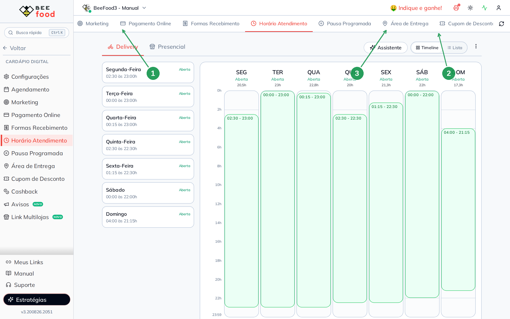

| Nº | Item | Para que serve |
|----|------|----------------|
| 1 | **Delivery** e **Presencial** | As duas grades. Confira sempre em qual você está. |
| 2 | **Timeline** e **Lista** | Duas formas de ver a mesma coisa. A Timeline mostra a semana em blocos; a Lista mostra os horários em campos. |
| 3 | **Assistente** | Monta a semana inteira em três passos. É por onde vale começar. |

A grade acima é o exemplo de uma loja **desorganizada**: horários que ninguém escolheu de
propósito (02:30 às 23:00, 00:15 às 23:00, 04:00 às 21:15). Vamos arrumar.

Na visão **Lista**, a mesma bagunça fica ainda mais clara:

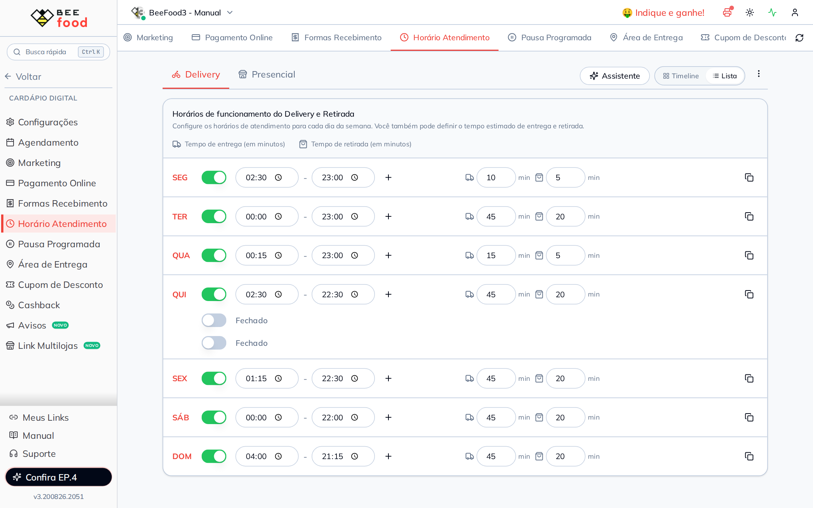

E a grade **Presencial**, que é independente, estava com outros horários — igualmente sem
padrão:

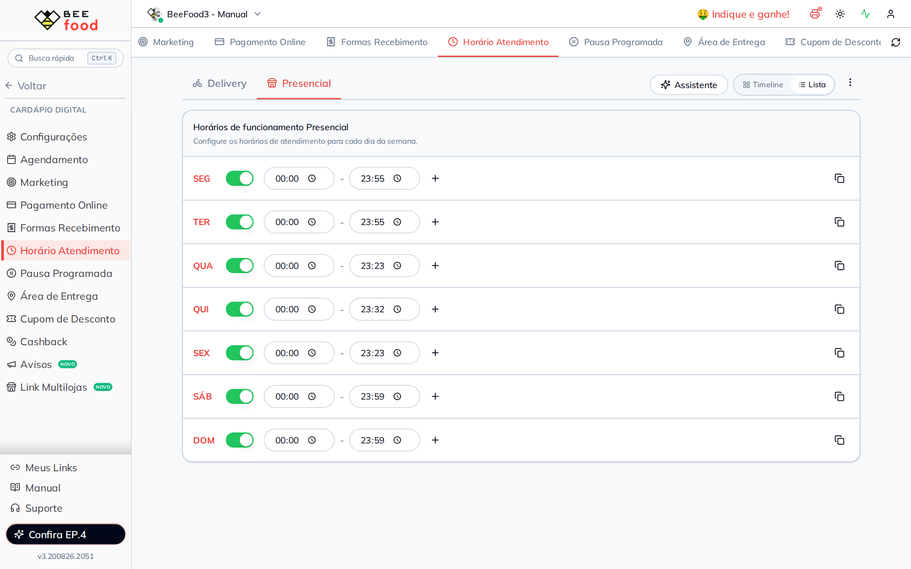

---

## Parte 1 — Começar do zero (opcional)

Quando a grade está muito confusa, o caminho mais rápido é apagar tudo e recomeçar. No menu de
três pontos, à direita:

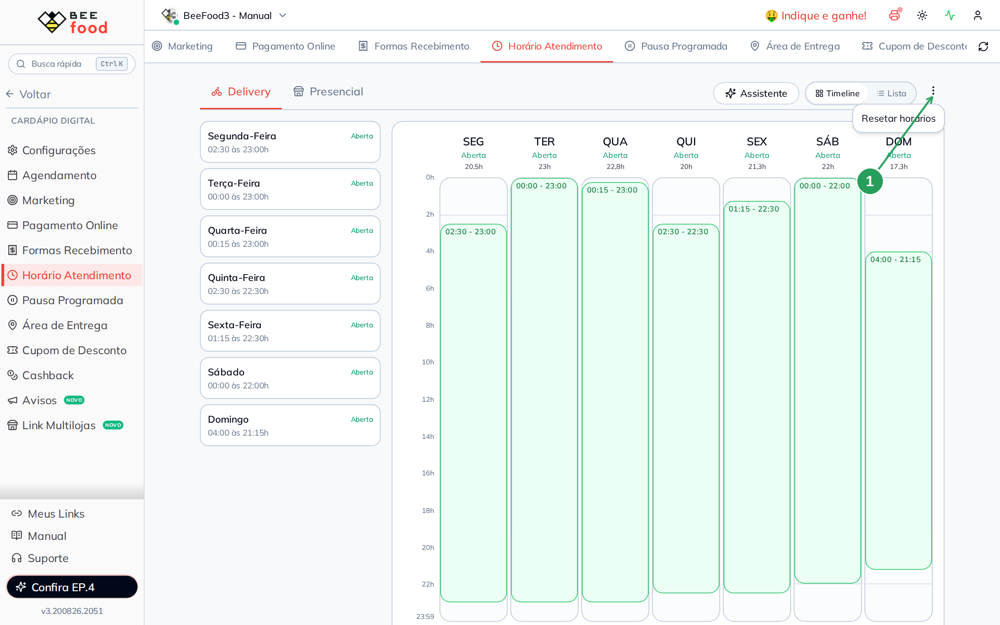

| Nº | Item | O que faz |
|----|------|-----------|
| 1 | **Resetar horários** | Apaga todos os horários e deixa todos os dias fechados. |

O sistema pede confirmação:

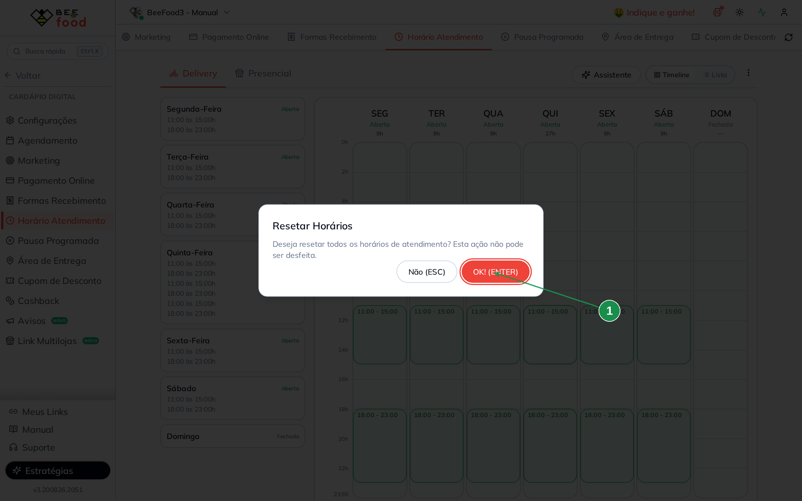

| Nº | Botão | O que fazer |
|----|-------|-------------|
| 1 | **OK! (ENTER)** | Confirma. O texto avisa: *"Esta ação não pode ser desfeita."* |

⚠️ **O reset apaga as duas grades, não só a que está na tela.** Rodamos o reset na sub-aba
Delivery e a grade **Presencial** também ficou toda fechada. Se você só quer arrumar um canal,
**não use o reset** — ajuste os dias na mão ou use o Assistente, que substitui apenas a grade
da sub-aba onde você está.

Depois do reset, a semana fica assim:

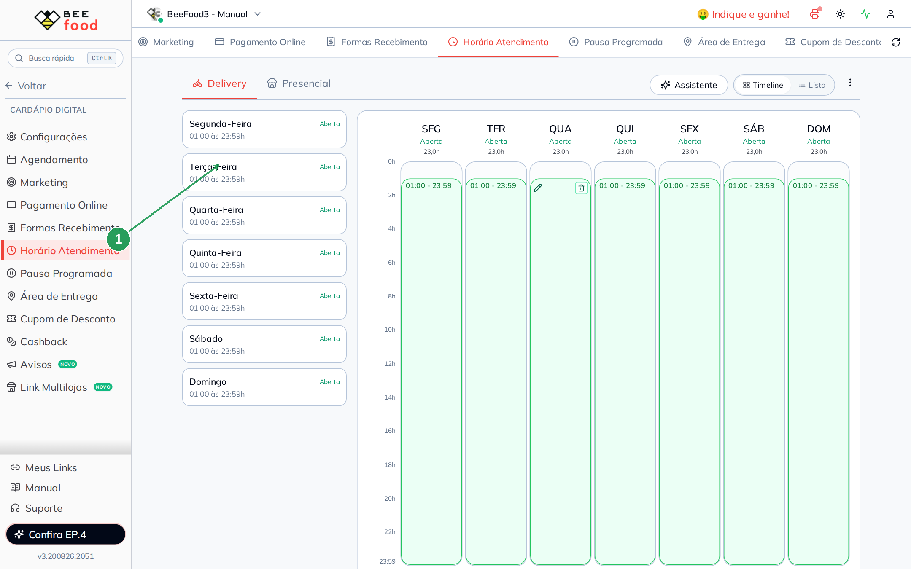

| Nº | Item | O que confere |
|----|------|---------------|
| 1 | **Todos os dias fechados** | Nenhum horário. Com a grade assim, a loja não abre — nem no delivery, nem no presencial. |

> **Loja fechada de verdade.** Enquanto a grade estiver zerada, o cliente vê a loja fechada.
> Configure na sequência.

---

## Parte 2 — Montar a semana com o Assistente

Clique em **Assistente**. Se já existe horário, aparece um aviso:

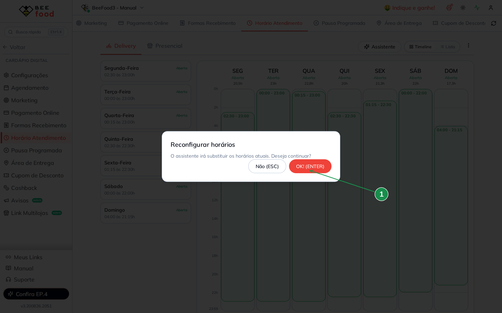

| Nº | Botão | O que fazer |
|----|-------|-------------|
| 1 | **OK! (ENTER)** | Confirma. *"O assistente irá substituir os horários atuais."* |

### Passo 1 — em quais dias você abre

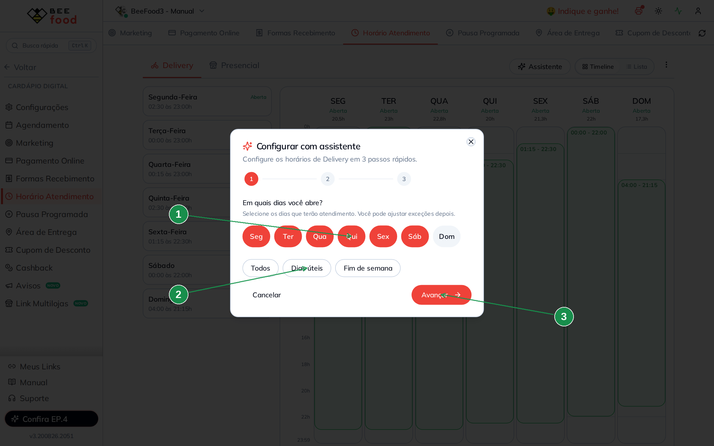

| Nº | Item | O que fazer |
|----|------|-------------|
| 1 | **Dias da semana** | Clique para marcar e desmarcar. No exemplo, Segunda a Sábado marcados e **Domingo de fora**. |
| 2 | **Todos · Dias úteis · Fim de semana** | Atalhos para marcar vários de uma vez. |
| 3 | **Avançar** | Vai para o passo 2. |

> Se a sua loja tem um dia com horário diferente dos outros, deixe-o de fora aqui e ajuste
> depois, na mão (Parte 4). O Assistente aplica **o mesmo horário** a todos os dias marcados.

### Passo 2 — como você opera

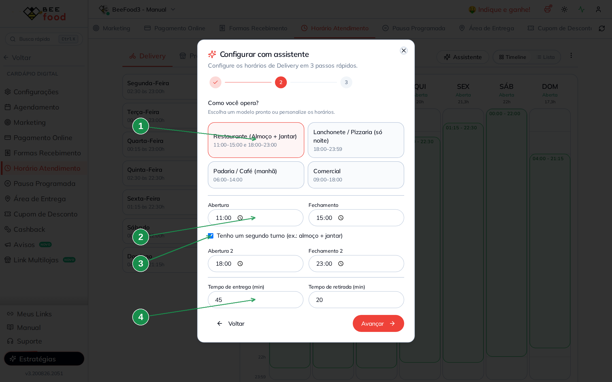

| Nº | Campo | O que fazer |
|----|-------|-------------|
| 1 | **Modelos prontos** | Quatro perfis de operação: **Restaurante (Almoço + Jantar)** 11:00–15:00 e 18:00–23:00 · **Lanchonete / Pizzaria (só noite)** 18:00–23:59 · **Padaria / Café (manhã)** 06:00–14:00 · **Comercial** 09:00–18:00. |
| 2 | **Abertura** e **Fechamento** | O primeiro turno. O modelo preenche, e você ajusta. |
| 3 | **Tenho um segundo turno** | Marque para fechar no meio do dia (o intervalo entre almoço e jantar). Libera **Abertura 2** e **Fechamento 2**. |
| 4 | **Tempo de entrega** e **Tempo de retirada** | Em minutos. É o prazo que o cliente vê no cardápio. |

> **Escolher um modelo não te prende a ele.** Ele só preenche os campos; tudo pode ser alterado
> na mesma tela.

### Passo 3 — revisar antes de aplicar

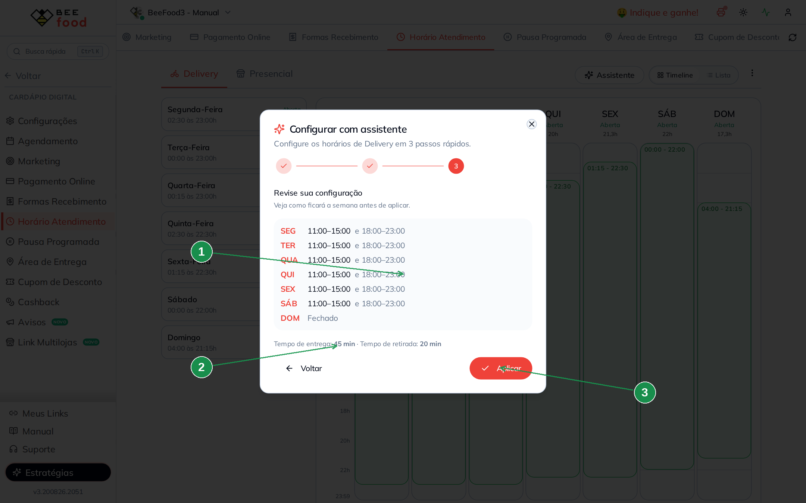

| Nº | Item | O que confere |
|----|------|---------------|
| 1 | **A semana** | Segunda a Sábado com os dois turnos e **Domingo Fechado**. |
| 2 | **Os tempos** | Entrega 45 min e retirada 20 min, que valem para todos os dias aplicados. |
| 3 | **Aplicar** | Grava a semana. |

---

## Parte 3 — Conferir o resultado

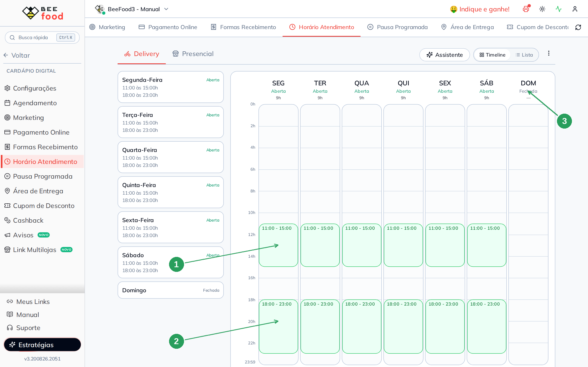

| Nº | Item | O que confere |
|----|------|---------------|
| 1 | **Bloco do almoço** | 11:00 – 15:00, de Segunda a Sábado. |
| 2 | **Bloco do jantar** | 18:00 – 23:00. O espaço entre os dois é o intervalo em que a loja fica fechada. |
| 3 | **Domingo** | **Fechada**, como definimos. |

O cabeçalho de cada dia mostra o total de horas abertas (9h no exemplo). Na visão **Lista**, os
dois turnos aparecem como duas linhas:

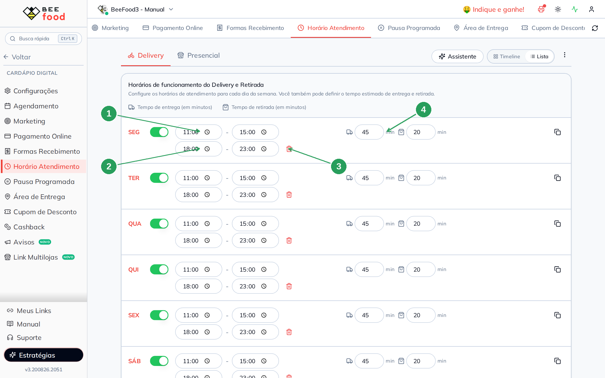

| Nº | Item | O que faz |
|----|------|-----------|
| 1 | **Primeiro turno** | Almoço. |
| 2 | **Segundo turno** | Jantar. |
| 3 | **Lixeira** | Remove o segundo turno, deixando o dia com um único horário corrido. |
| 4 | **Tempo de entrega e de retirada** | Por dia. Sábado lotado pede um prazo maior que uma terça. |

Abaixo da grade há um resumo útil para conferir se a semana faz sentido:

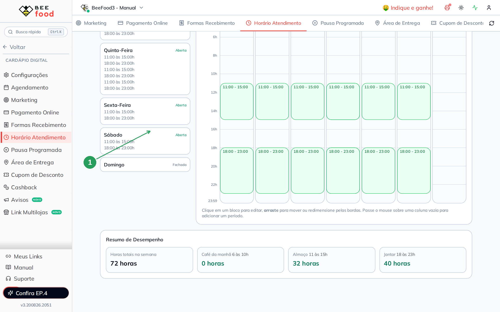

| Nº | Item | O que mostra |
|----|------|--------------|
| 1 | **Resumo de Desempenho** | Horas totais na semana e quanto disso cai em café da manhã, almoço e jantar. |

---

## Parte 4 — Ajustar um dia na mão

Na **Timeline**, clique em cima de um bloco:

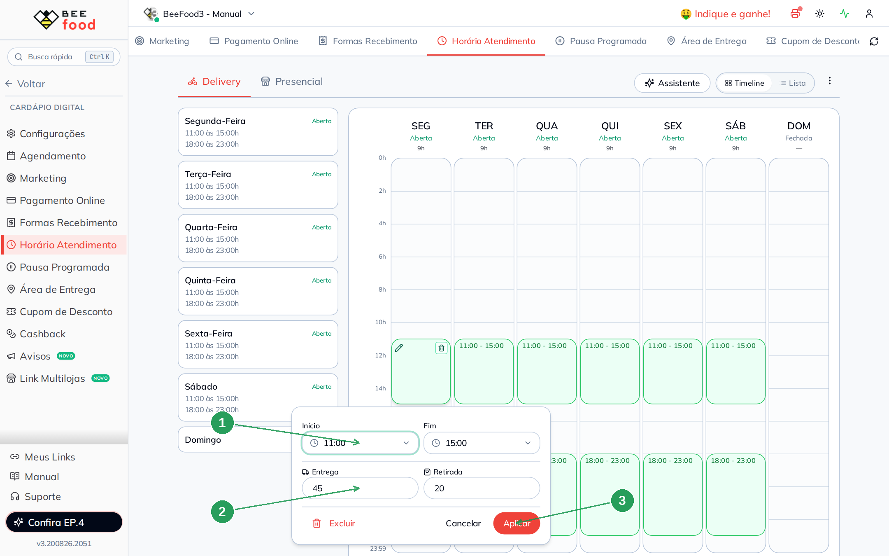

| Nº | Campo | O que fazer |
|----|-------|-------------|
| 1 | **Início** e **Fim** | Escolha na lista (de 15 em 15 minutos) ou digite. |
| 2 | **Entrega** e **Retirada** | O prazo daquele dia. |
| 3 | **Aplicar** | Confirma. **Excluir** apaga o turno. |

Na visão **Lista**, é mais direto: digite nos campos de hora. Os dois caminhos dão no mesmo.

> **Precisa de um terceiro turno no mesmo dia?** Use o botão de **clonar** (à direita da linha,
> na Lista). Ele duplica o dia numa nova linha, e você ajusta os horários dela.

> ⚠️ **Não existe "copiar Segunda para Terça".** O clonar duplica turno **no mesmo dia**, não
> entre dias. Para repetir um horário em vários dias, o caminho é o **Assistente**.

---

## Parte 5 — Fechar um dia

Desligue o switch do dia. Ele passa a mostrar **Fechado** e a loja não abre nesse dia.

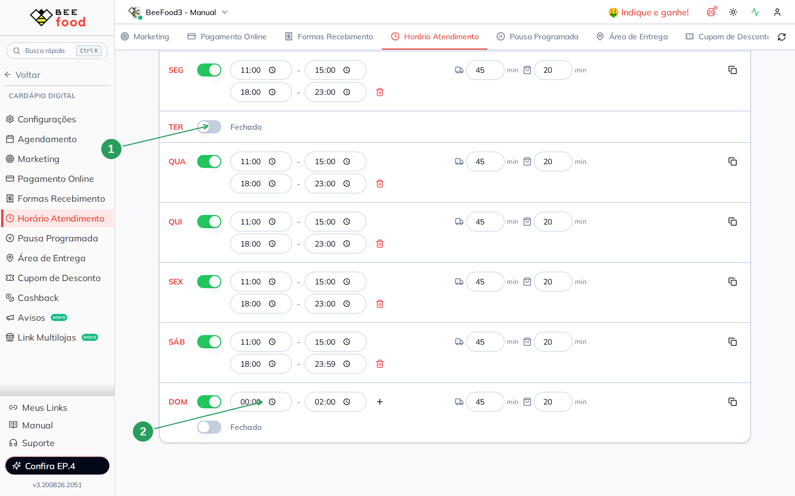

| Nº | Item | O que confere |
|----|------|---------------|
| 1 | **Switch desligado** | Terça como **Fechado**. Os horários não são apagados — voltam se você religar. |
| 2 | **Domingo com 00:00 – 02:00** | Este é o resultado da Parte 6, logo abaixo. |

---

## Parte 6 — Quem fecha depois da meia-noite

É a dúvida mais comum de pizzaria e hamburgueria: *"abro às 18:00 e fecho às 02:00, como coloco
isso?"*

Você digita normalmente **18:00** no início e **02:00** no fim. O sistema entende que passou da
meia-noite e **divide o turno em dois automaticamente**:

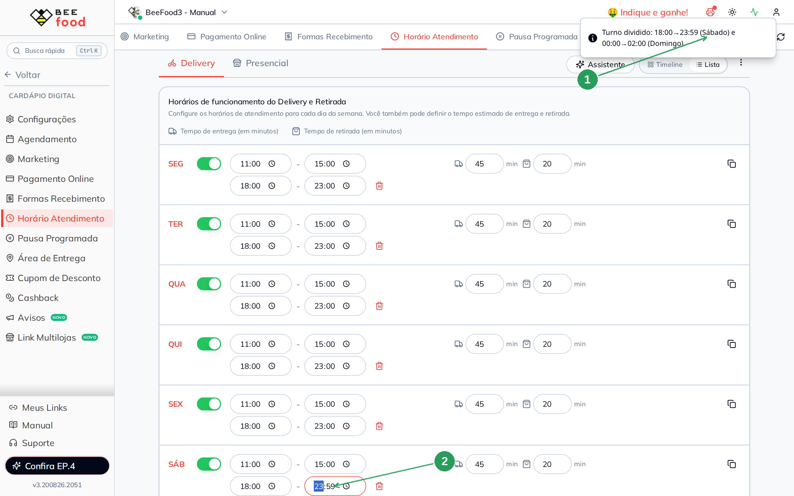

| Nº | Item | O que aconteceu |
|----|------|-----------------|
| 1 | **Aviso** | *"Turno dividido: 18:00 → 23:59 (Sábado) e 00:00 → 02:00 (Domingo)"* |
| 2 | **O campo mudou** | O fim do sábado virou **23:59** — o último minuto do dia. |

E no **domingo** aparece um turno novo, de **00:00 às 02:00** (é a seta 2 da imagem da Parte 5).
Somados, os dois representam o seu horário real: das 18:00 de sábado às 02:00 de domingo.

> **Isso muda uma coisa importante:** se o domingo estava marcado como Fechado, ele passa a ter
> um turno de madrugada. Confira o domingo depois de configurar o sábado — e vice-versa, se você
> abre na madrugada de segunda.

---

## Parte 7 — O que o sistema recusa

Duas situações não são salvas, e vale saber para não achar que a tela travou.

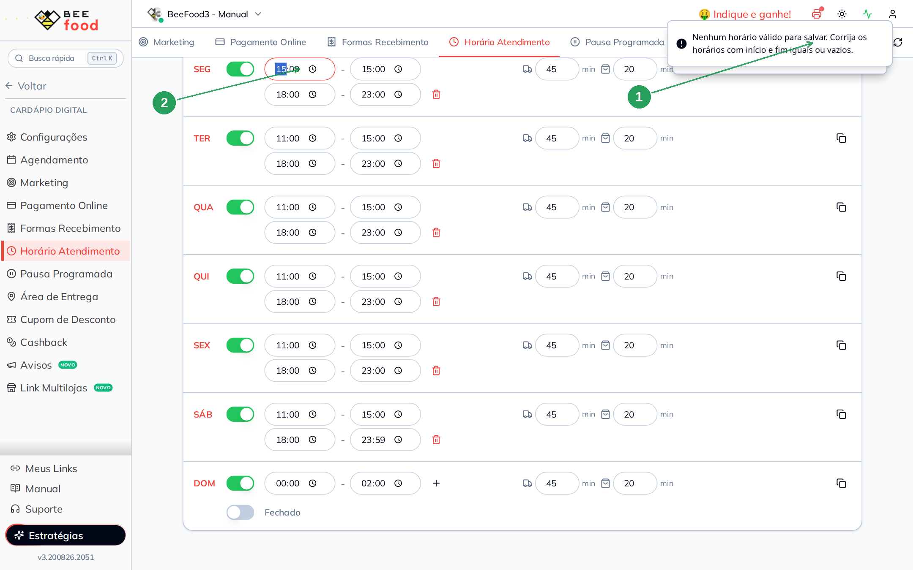

| Nº | Item | O que acontece |
|----|------|----------------|
| 1 | **Mensagem** | *"Nenhum horário válido para salvar. Corrija os horários com início e fim iguais ou vazios."* |
| 2 | **O campo problemático** | Início igual ao fim (15:00 – 15:00). Corrija e ele grava sozinho. |

A outra recusa é **sobreposição**: dois turnos que se cruzam no mesmo dia (por exemplo, 11:00 às
15:00 e 14:00 às 18:00). A mensagem é *"Horários não podem se sobrepor no mesmo dia."*

> Para abrir o dia inteiro sem intervalo, use um turno só, de **00:00 às 23:59**. Não use
> 00:00 às 00:00 — início igual ao fim é recusado.

---

## Parte 8 — Não esqueça a grade Presencial

Depois do reset, a grade **Presencial** ficou toda fechada:

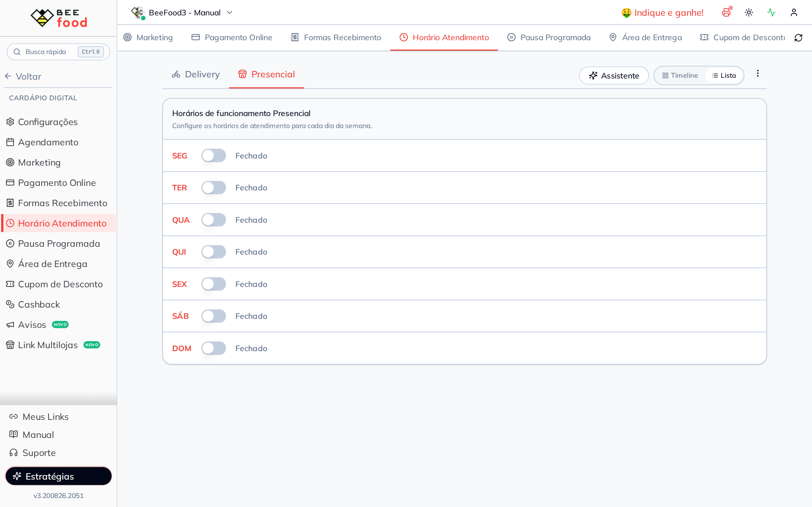

Com ela assim, o QR Code das mesas não funciona, **mesmo que o delivery esteja aberto**. Clique
na sub-aba **Presencial** e repita o processo — o Assistente também funciona aqui:

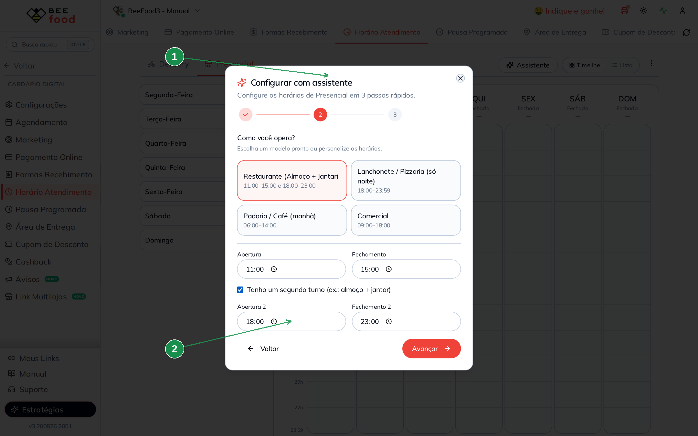

| Nº | Item | O que muda em relação ao Delivery |
|----|------|-----------------------------------|
| 1 | **O título** | Diz *"Configure os horários de **Presencial**"* — confirmação de que você está na grade certa. |
| 2 | **Fim dos campos** | Aqui **não existe** tempo de entrega nem de retirada, porque não há entrega no presencial. |

Aplicado, a grade Presencial fica de pé:

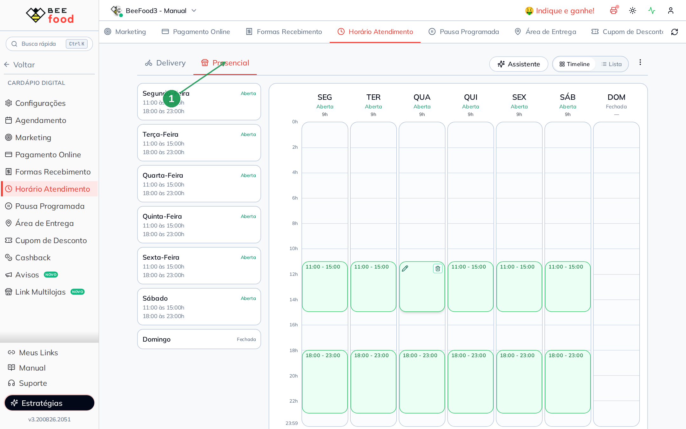

| Nº | Item | O que confere |
|----|------|---------------|
| 1 | **Sub-aba Presencial** | Em destaque, com a semana montada. |

---

## Resumo do caminho

```
1. Cardápio Digital → Horário Atendimento
2. Escolha a sub-aba: Delivery ou Presencial
3. Assistente → dias → modelo e horários → revisar → Aplicar
4. Ajuste na mão os dias diferentes (clique no bloco ou digite na Lista)
5. Feche os dias que não abre (switch)
6. Repita na outra sub-aba
7. Confira o resumo de horas
```

Não há botão de salvar: cada alteração grava sozinha.

---

## Perguntas frequentes

**Mudei o horário e o cliente continua vendo o antigo.**
A atualização pode levar até um minuto. Se persistir, verifique três coisas: se você mexeu na
sub-aba certa, se há uma **pausa** ativa e se os switches de canal estão ligados — os dois
últimos estão no manual **Fechar a loja fora do horário**.

**Tenho duas lojas. O horário é o mesmo?**
Não. A grade é **por cardápio**. Troque de cardápio no seletor do topo e configure cada um.

**Como abro só no almoço?**
Um turno por dia (11:00 às 15:00) e o segundo turno desmarcado no Assistente. Na Lista, basta
não criar a segunda linha.

**Como faço horário de feriado?**
Não é aqui. A grade é semanal e se repete. Para um dia específico, use **Pausa Programada** —
veja o outro manual.

**Meu horário some quando eu digito.**
Provavelmente início igual ao fim, que é recusado. A mensagem aparece no canto da tela.

**Dá para ter horário diferente para Entrega e para Retirada?**
Não. As duas seguem a mesma grade (a sub-aba Delivery). O que muda entre elas é só o **tempo**
— entrega e retirada têm campos separados.

**O que é "Fechado" com o horário ainda preenchido?**
O switch desligado ignora o horário sem apagá-lo. É o jeito de fechar um dia mantendo a
configuração para quando reabrir.

---

## Manuais relacionados

| Manual | O que traz |
|--------|------------|
| **Fechar a loja fora do horário** | Pausa temporária, pausa programada e os switches de canal |
| **Cardápio — fundamentos** | Cadastro de produtos, grupos de opções e complementos |
