# Inteligência Artificial do ChatGPT no WhatsApp

A IA do ChatGPT atende seus clientes no WhatsApp com os dados do restaurante e do
cardápio: responde pergunta de produto, horário, taxa e pedido de forma mais
humanizada.

A BeeFood só **intermedia** a integração. Quem cria a conta, gera a chave e
**paga os créditos** é o restaurante, no painel da OpenAI.

> **Cuidado:** a chave secreta (`sk-proj-…`) some depois que você copia. Guarde em
> lugar seguro e **não** compartilhe em print público.

As imagens do BeeFood têm **marcações em verde** (setas e números).

---

## Antes de começar

1. Conta no [platform.openai.com](https://platform.openai.com/) (ou crie uma no
   Passo 1).
2. Cartão de crédito para comprar créditos na OpenAI (mínimo **US$ 5**).
3. WhatsApp do restaurante já conectado no BeeFood.
4. Acesso a **Aplicativos** (ou ao menu **WhatsApp → Inteligência Artificial**).

---

## Parte 1 — OpenAI: criar a chave secreta

### Passo 1. Entrar ou criar a conta

Acesse [platform.openai.com](https://platform.openai.com/) e clique em **Log in**.
Se ainda não tem conta, use **Sign up**.

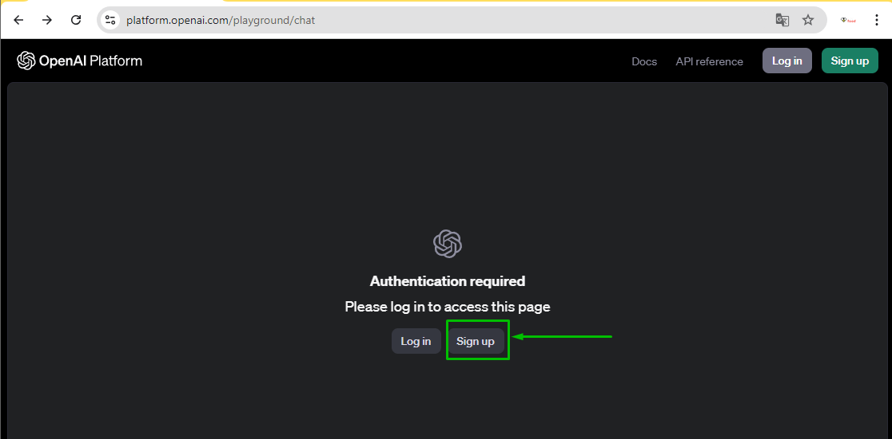

### Passo 2. Verificar o telefone (se pedir)

Se aparecer o aviso de verificação, clique em **Start verification**, informe o
celular e digite o código do SMS.

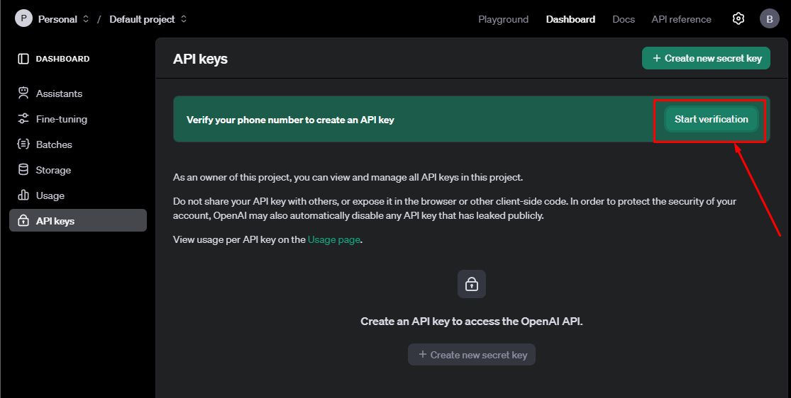

### Passo 3. Abrir API Keys

No **Dashboard**, clique em **API keys** e depois em **Create new secret key**.

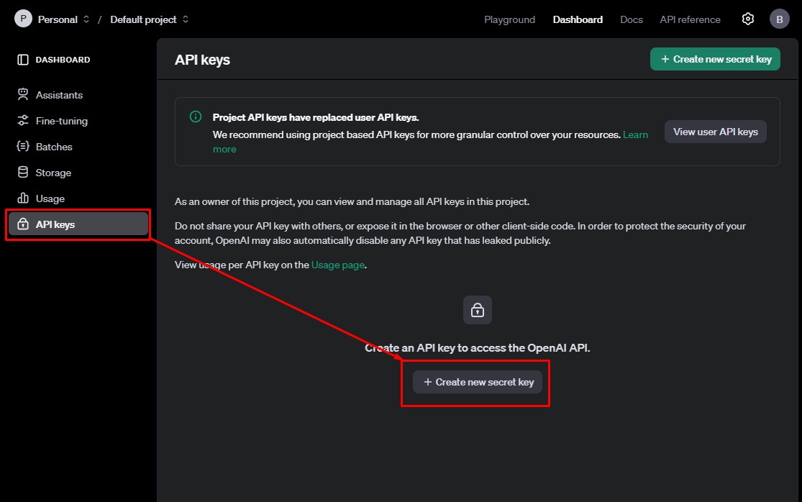

### Passo 4. Nomear a chave

Use um nome fácil de achar depois, por exemplo **BeeFood-WhatsApp**. Clique em
**Create secret key**.

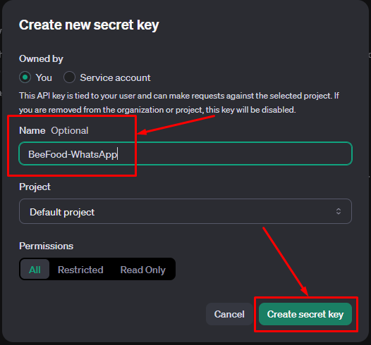

### Passo 5. Copiar a chave

Clique em **Copy**. Essa chave **não volta a aparecer** inteira.

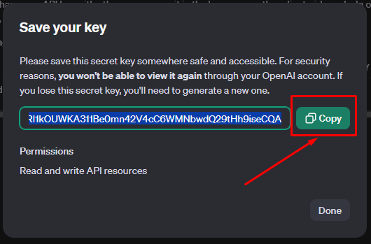

---

## Parte 2 — OpenAI: cartão e créditos

Sem créditos a IA não responde. O gasto é cobrado pela OpenAI, não pela BeeFood.

### Passo 6. Abrir Settings

No canto superior direito, clique em **Settings**.

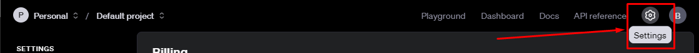

### Passo 7. Billing

Em **Billing**, clique em **Add payment details**.

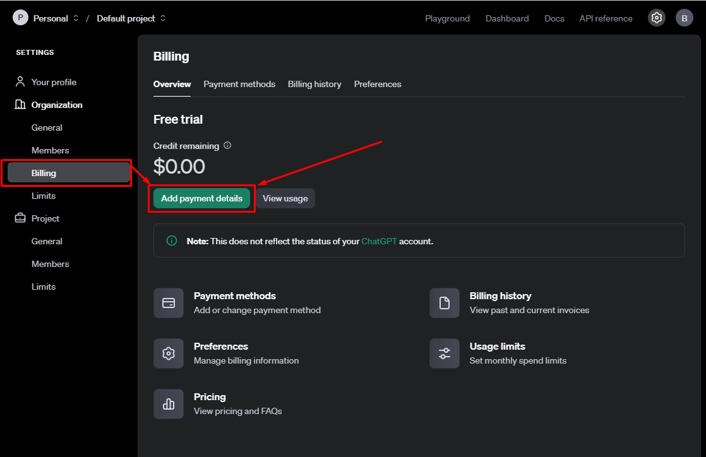

### Passo 8. Individual

Escolha **Individual** para continuar. **Company** também funciona.

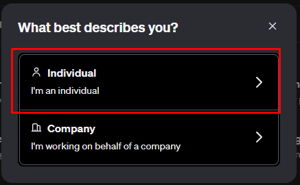

### Passo 9. Cartão e endereço

Preencha os dados do cartão e o endereço. Clique em **Continue**.

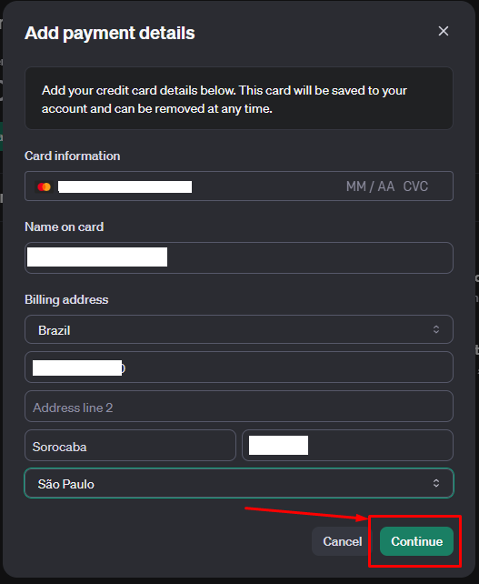

### Passo 10. Créditos e recarga automática

Configure assim:

- **Initial credit purchase:** valor mínimo de **US$ 5**.
- **Automatic recharge:** deixe **ligado**.
- **When credit balance goes below:** **US$ 5**.
- **Bring credit balance back up to:** **US$ 10**.

Com isso, sempre que o saldo cair abaixo de US$ 5 a OpenAI recarrega até US$ 10.

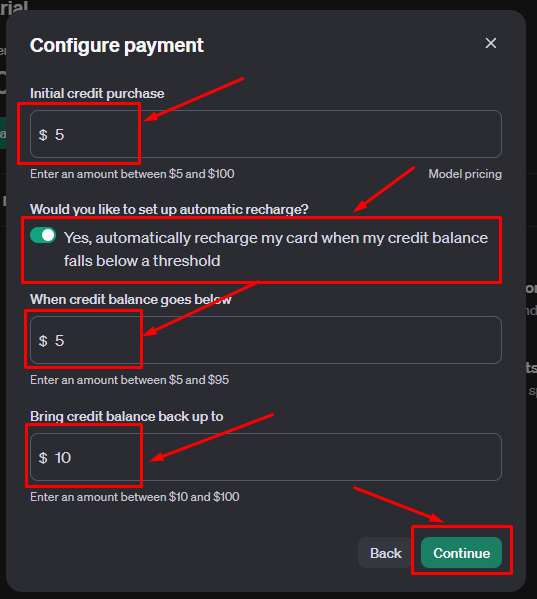

---

## Parte 3 — OpenAI: ver o gasto

### Passo 11. Usage

No **Dashboard**, abra **Usage** para ver o consumo por dia.

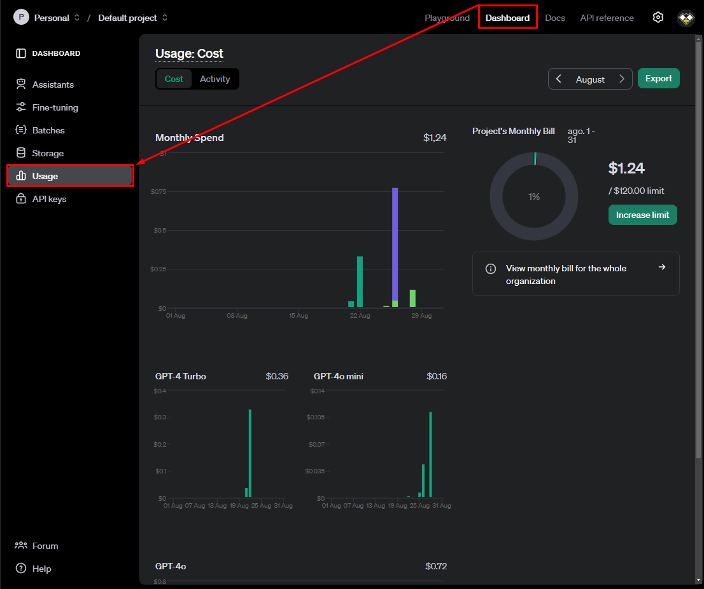

---

## Parte 4 — BeeFood: colar a chave e configurar

### Passo 12. Abrir Inteligência Artificial

No BeeFood, clique em **Aplicativos** (1). Na seção **Marketing e CRM**, abra o
card **Inteligência Artificial** (2).

Também dá para ir pelo menu **WhatsApp → Inteligência Artificial**.

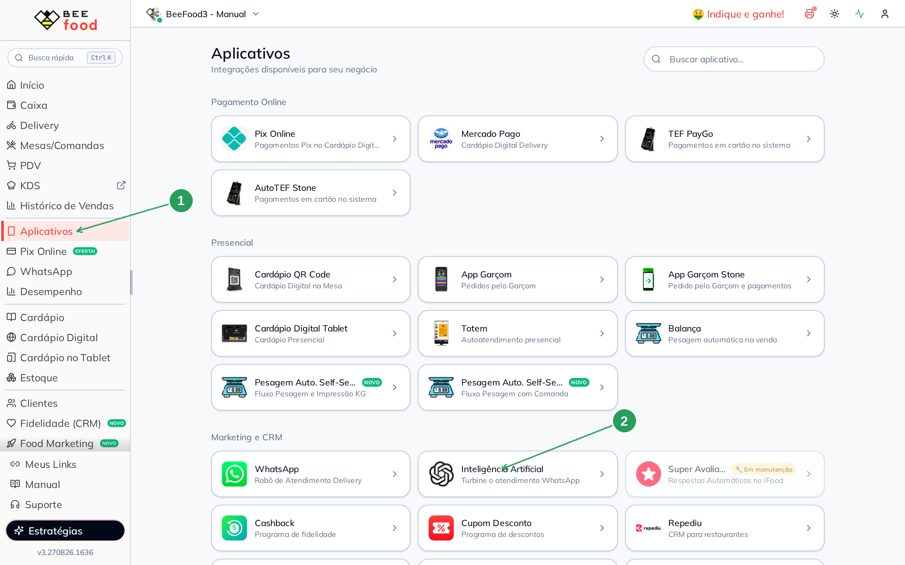

### Passo 13. Iniciar a configuração

Na primeira visita aparece a tela de boas-vindas. Clique em
**INICIAR CONFIGURAÇÃO** (1).

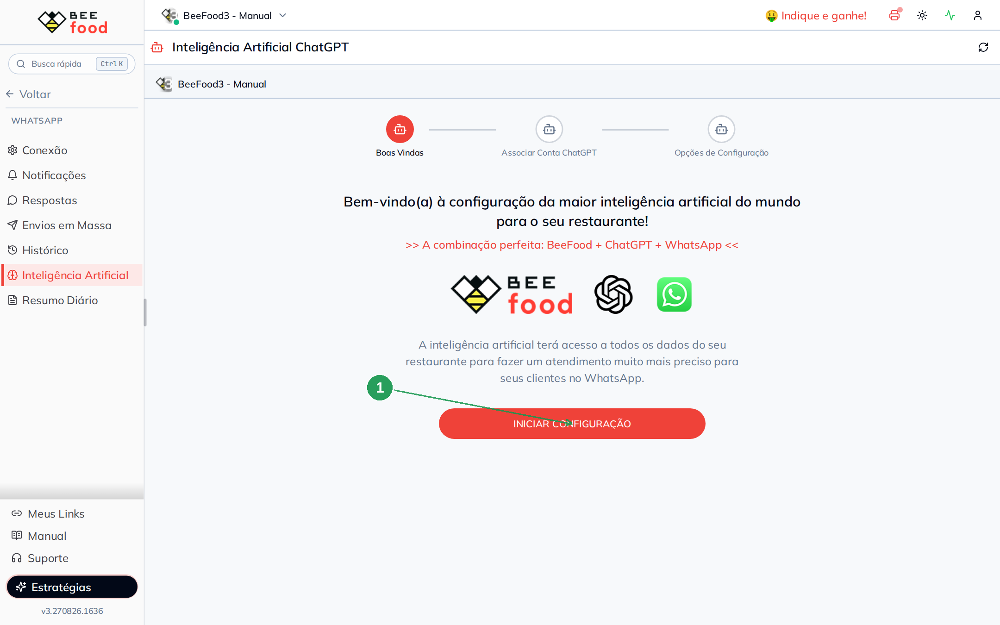

### Passo 14. Colar a Chave Secreta

No passo **Associar Conta ChatGPT**, cole a chave copiada no Passo 5 no campo
**Chave Secreta** (1) e clique em **CONTINUAR**.

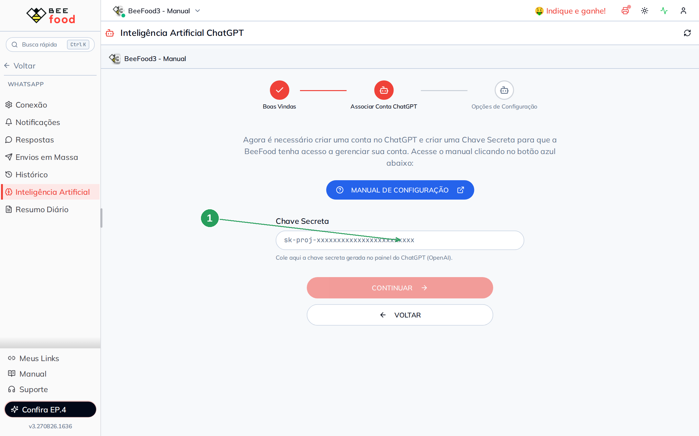

Não cole uma chave de teste inventada. A tela só avança se a OpenAI aceitar a
chave.

### Passo 15. Ativar, escolher o modelo e salvar

No passo **Opções de Configuração**:

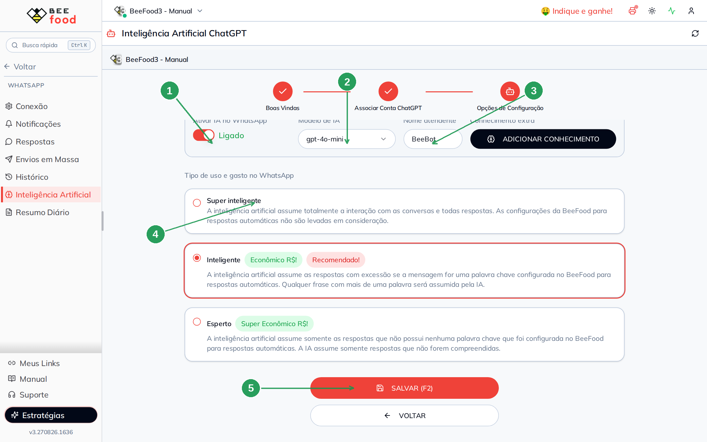

| Nº | Campo | O que fazer |
|----|--------|-------------|
| 1. | **Ativar IA no WhatsApp** | Deixe **Ligado** para a IA responder no WhatsApp |
| 2. | **Modelo de IA** | Use **gpt-4o-mini** (recomendado: melhor custo × qualidade) |
| 3. | **Nome atendente** | Nome com que a IA se apresenta (ex.: Daia ou BeeBot) |
| 4. | **Tipo de uso** | Use **Inteligente** (recomendado) |
| 5. | **SALVAR (F2)** | Grava a configuração |

**Conhecimento extra** (botão **ADICIONAR CONHECIMENTO**) é opcional: título +
texto com regra da casa que a IA deve lembrar (ex.: “não vendemos refrigerante
lata aos domingos”). Não é obrigatório para ligar a IA.

#### Modelos

O custo depende do tamanho da resposta. Os valores abaixo são **estimativa**
interna (cerca de 10 respostas):

| Modelo | Custo | Quando usar |
|--------|-------|-------------|
| **gpt-4o-mini** | Baixo a médio (~R$ 0,03 a R$ 0,05) | **Recomendado** no dia a dia |
| **gpt-4o** | Alto, cerca de 10× o mini (~R$ 0,30 a R$ 0,50) | Resposta mais sofisticada |
| **gpt-4-turbo** | Médio (~R$ 0,15 a R$ 0,25) | Equilíbrio entre velocidade e qualidade |
| **gpt-3.5-turbo** | Mais barato (~R$ 0,02 a R$ 0,04) | Volume alto, tarefas simples |

#### Tipo de uso e gasto

- **Super inteligente** — a IA assume **todas** as mensagens. As respostas
  automáticas do BeeFood (palavra-chave) **não** entram.
- **Inteligente** — **recomendado**. A IA responde frases; se a mensagem for
  exatamente uma palavra-chave cadastrada no BeeFood, vale a resposta automática.
- **Esperto** — a IA só entra quando a mensagem **não** tem palavra-chave e o
  BeeFood não entendeu. É o modo mais econômico.

---

## Exemplos de conversa

Assim a IA se comporta no WhatsApp depois de ligada:

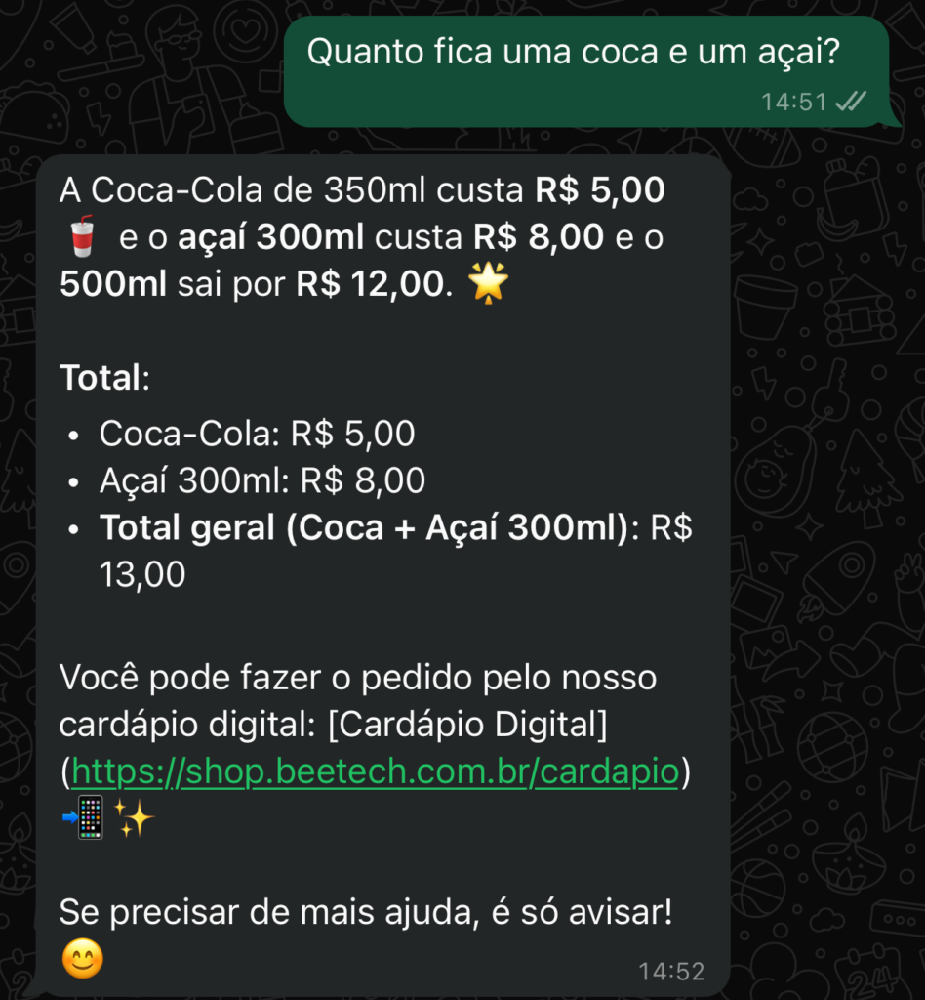

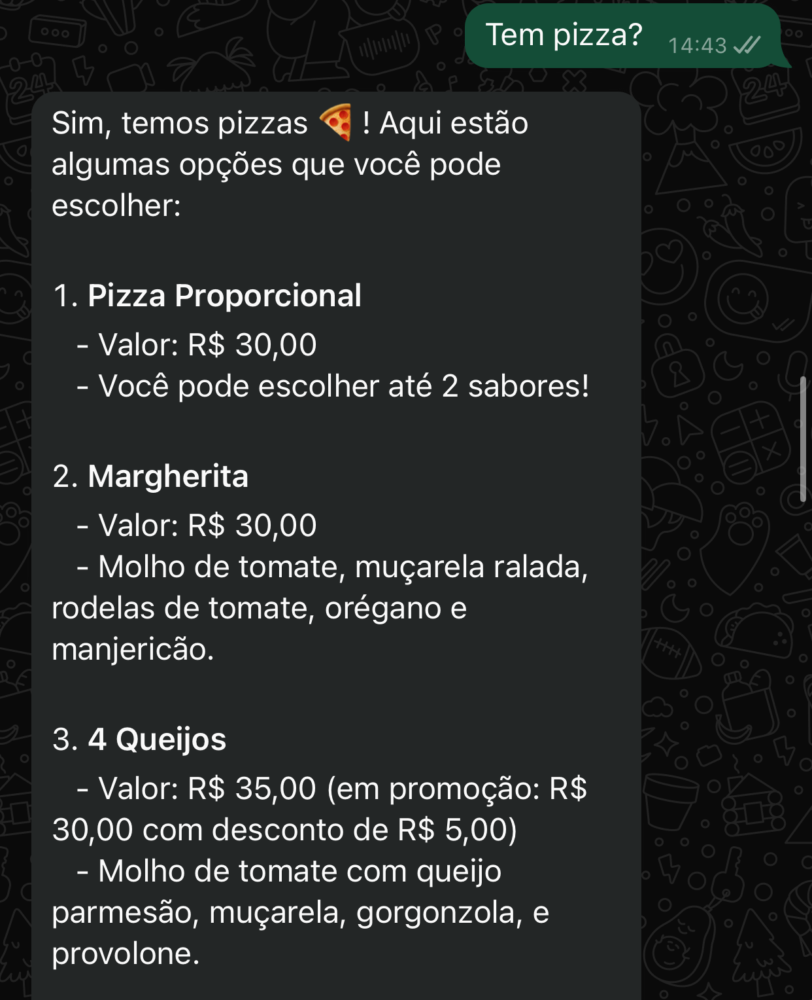

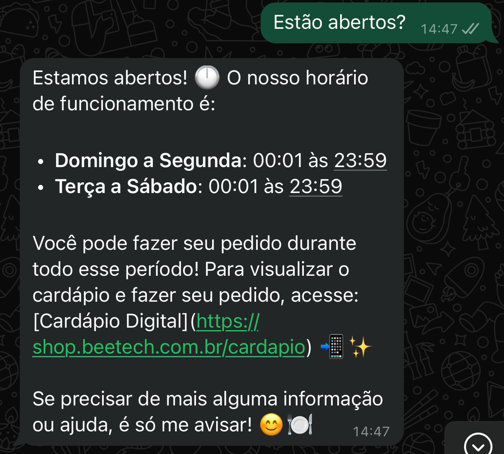

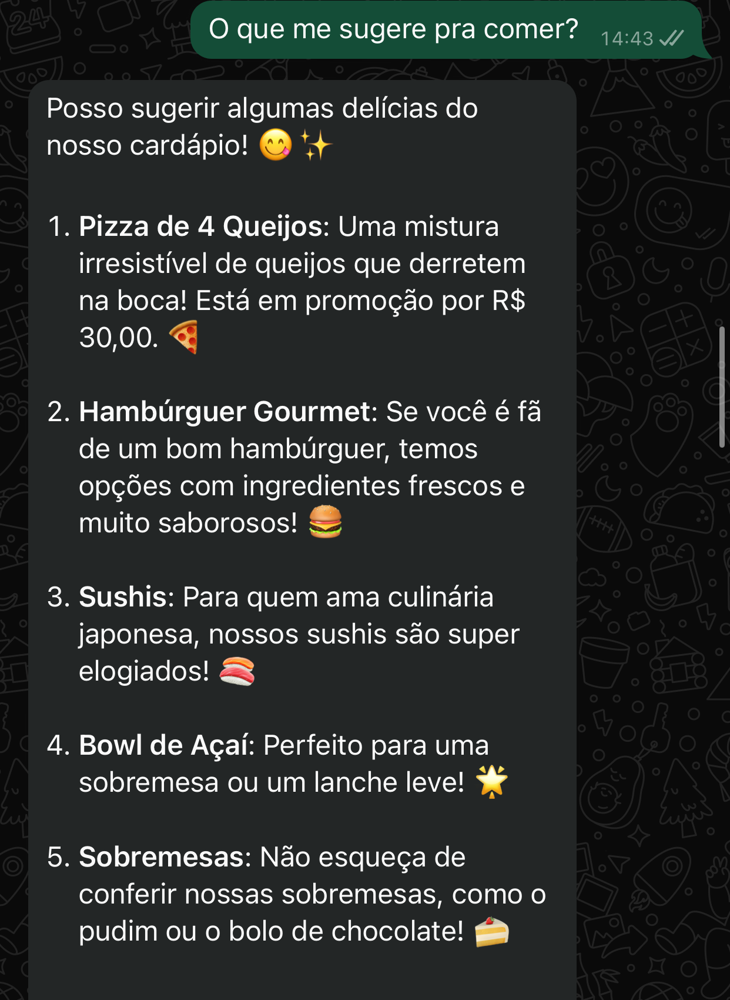

---

## Problemas comuns

| Sintoma | O que verificar |
|---------|-----------------|
| A tela não sai de **Chave Secreta** | A chave foi copiada inteira? Tem crédito na OpenAI? |
| IA não responde no WhatsApp | **Ativar IA no WhatsApp** está **Ligado**? Clicou em **SALVAR (F2)**? WhatsApp está conectado? |
| Resposta cara demais | Troque o modelo para **gpt-4o-mini** e o tipo para **Inteligente** ou **Esperto** |
| Saldo zerou | Abra **Usage** e **Billing** na OpenAI; confira a recarga automática |

---

## Precisa de ajuda?

Fale com o **suporte BeeFood** informando: nome da loja e **CNPJ**. **Não** envie a
chave secreta inteira em canal público.

---

*Última atualização: agosto/2026 — BeeFood · IA ChatGPT no WhatsApp*
