# Entregas Expressas — o pedido de entrega sai sozinho para o aplicativo

Ligue o **BeeFood** ao **Entregas Expressas** e pare de redigitar pedido: cada pedido de
entrega aceito no BeeFood entra sozinho no aplicativo, com endereço, cliente, itens, forma de
pagamento e troco. Quando o entregador coleta, o pedido vira **despachado** no BeeFood; quando
entrega, vira **entregue**.

A ligação tem duas pontas, e você passa por elas nesta ordem: **pega a credencial no BeeFood**,
**cadastra a integração no Entregas Expressas** e **volta ao BeeFood para cadastrar o webhook**.
Sem o webhook a integração não funciona — é ele que avisa cada pedido na hora.

> **Tudo pelo painel do BeeFood.** A tela do Entregas Expressas manda ir ao portal de
> desenvolvedor (`developer.beefood.com.br`) para criar credencial e webhook. Você **não
> precisa**: os dois se cadastram em **Aplicativos → API Aberta**, dentro do BeeFood, e é esse
> o caminho deste manual. Ele também evita o erro mais comum do portal, que é criar a
> credencial no ambiente de testes — pelo painel não existe essa escolha.

> As imagens têm **marcações em verde** (setas e números) indicando onde clicar ou o que
> observar em cada tela.

---

## O que a integração faz

- **Todo pedido de entrega** aceito no BeeFood vira uma entrega no Entregas Expressas — PDV,
  cardápio digital, WhatsApp e marketplaces.
- **O status volta sozinho:** coleta do entregador = pedido **despachado** no BeeFood; entrega
  concluída = **entregue**.
- **Cancelou no BeeFood antes da coleta?** A entrega é cancelada no Entregas Expressas também.
- **Pedido de retirada, balcão ou mesa não entra.** Só pedido de entrega vira entrega.
- **Pedido entregue pela logística do próprio marketplace nunca vira entrega** — só o que a sua
  loja entrega.

---

## Antes de começar

1. Conta **BeeFood** ativa, e permissão para abrir o menu **Aplicativos**.
2. Conta no **Entregas Expressas**, com o estabelecimento já cadastrado como cliente.
3. O card **API Aberta** visível em Aplicativos. Ele está em liberação por etapas: se não
   aparecer na sua conta, fale com o **suporte BeeFood** antes de seguir.
4. Deixe as duas telas abertas em abas separadas — você vai e volta uma vez entre elas.

---

## Parte 1 — No BeeFood: a credencial

### Passo 1. Abrir Aplicativos → API Aberta

No menu lateral, clique em **Aplicativos** (1). Na seção **API e MCP**, clique no card
**API Aberta** (2).

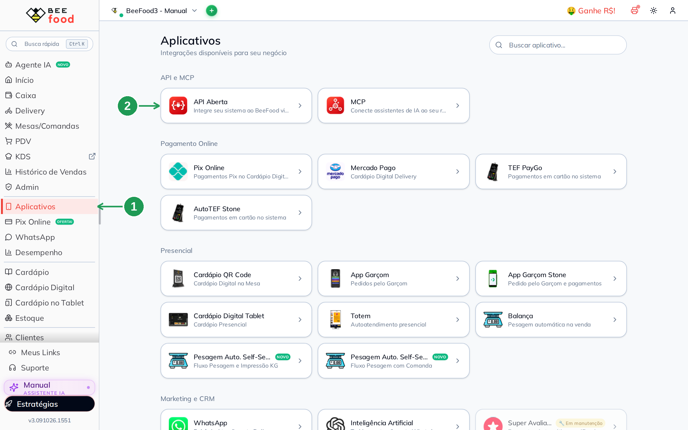

| Nº | O que fazer |
|----|-------------|
| 1 | **Aplicativos**, no menu lateral. |
| 2 | Card **API Aberta** — *Integre seu sistema ao BeeFood via API REST*. |

### Passo 2. Copiar o Client ID e o Client Secret

O painel abre na aba **Credencial** (1), e a **credencial principal da sua loja já existe** —
não há nada para criar. Copie o **Client ID** (2) com o botão ao lado do campo. O **Client
Secret** vem escondido: clique no **ícone de olho** (3) para revelá-lo e copie do mesmo jeito.
Confira que o selo diz **Ativa** (4).

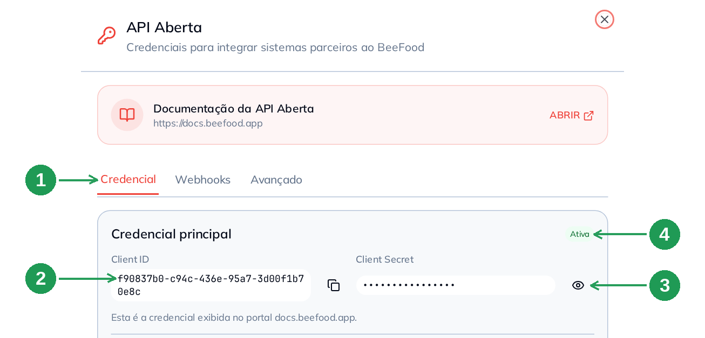

| Nº | Campo | O que fazer |
|----|-------|-------------|
| 1 | Aba **Credencial** | É onde ficam o Client ID e o Client Secret. |
| 2 | **Client ID** | Copie com o botão ao lado. É o valor público da credencial. |
| 3 | **Ícone de olho** | Revela o **Client Secret**. Depois de revelado, aparece o botão de copiar. |
| 4 | Selo **Ativa** | Credencial desativada não deixa o parceiro entrar. A chave que liga e desliga está no fim do cartão. |

> **O segredo não se perde aqui.** O portal de desenvolvedor mostra o Client Secret uma única
> vez; no painel, este ícone de olho revela quantas vezes você precisar.

### Passo 3. Conferir as permissões

Role o painel até **Permissões**. O Entregas Expressas precisa de dois recursos: **Pedidos**
(1), com *Consultar* e *Alterar* ligados, e **Loja** (2), com *Consultar*. A credencial
principal já vem com tudo ligado, então normalmente não há o que mudar — e o botão **SALVAR
PERMISSÕES** (3) só acende se você mexer em algo.

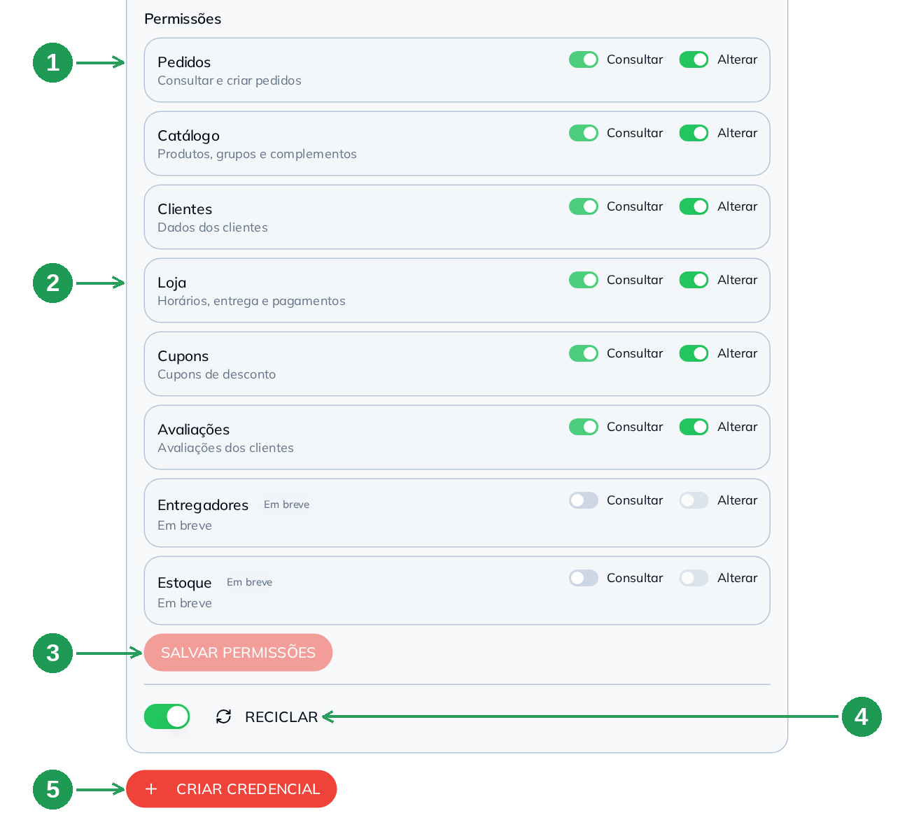

| Nº | Campo | O que fazer |
|----|-------|-------------|
| 1 | **Pedidos** | Deixe **Consultar** e **Alterar** ligados. É o que permite ler o pedido e marcar despachado e entregue. |
| 2 | **Loja** | Deixe **Consultar** ligado. É o que permite ler horários, entrega e formas de pagamento. |
| 3 | **SALVAR PERMISSÕES** | Só habilita depois de uma mudança. Se não mexeu em nada, ignore. |
| 4 | **RECICLAR** | ⚠️ **Não clique** depois que a integração estiver funcionando: ele troca o Client ID e o Client Secret, e **toda conexão para na hora**. Só use se precisar invalidar a credencial, e avise o parceiro para colar os valores novos. |
| 5 | **CRIAR CREDENCIAL** | Opcional — cria uma credencial separada, só para este parceiro. Veja o Passo 4. |

> **Quem altera também consulta.** Ao ligar *Alterar*, o *Consultar* do mesmo recurso liga
> sozinho e fica travado. Não é defeito: é a regra da API.

### Passo 4. (opcional) Uma credencial só para o parceiro

Dá para usar a credencial principal, e funciona. Mas se você pretende ligar mais de um sistema,
vale criar **uma credencial por parceiro**: aí é possível desligar ou apagar uma sem derrubar as
outras. Clique em **CRIAR CREDENCIAL** (a seta 5 da imagem acima), confira **Pedidos** (1) e
**Loja** (2) — a nova já nasce com todos os recursos liberados — e clique em **CRIAR (F2)** (3).

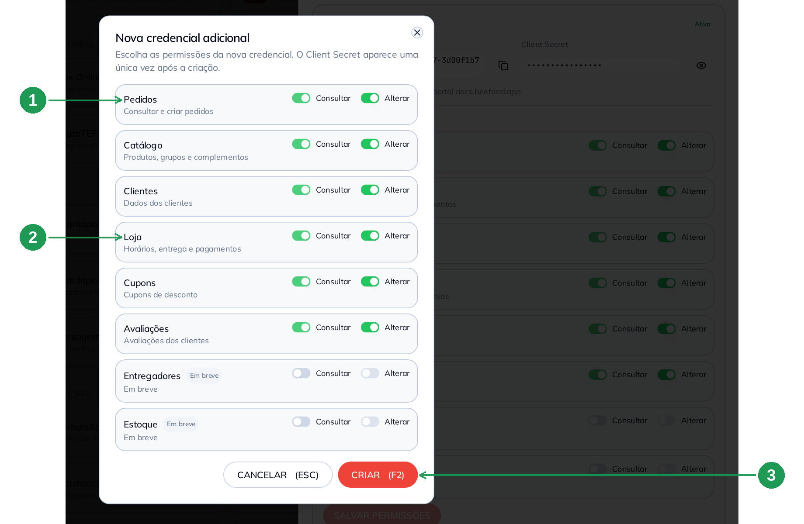

| Nº | Campo | O que fazer |
|----|-------|-------------|
| 1 | **Pedidos** | Já vem com *Consultar* e *Alterar*. Deixe assim. |
| 2 | **Loja** | Já vem com *Consultar*. Deixe assim. |
| 3 | **CRIAR (F2)** | Grava a credencial. **CANCELAR (ESC)** desiste sem criar. |

Depois de criar, o BeeFood mostra o **clientId** e o **clientSecret** para você copiar, e a
credencial passa a aparecer em **Todas as credenciais**, no fim da aba. É de lá que você copia
os dois valores depois, com o botão de copiar e o ícone de olho.

---

## Parte 2 — No Entregas Expressas: cadastrar a integração

### Passo 5. Abrir Configurações › Integrações › BeeFood

No painel do Entregas Expressas, abra **Configurações** (1) e vá em **Integrações › BeeFood**.
Clique em **CADASTRAR INTEGRAÇÃO** (2). Depois, escolha o **Cliente** — o estabelecimento dono
da loja no BeeFood.

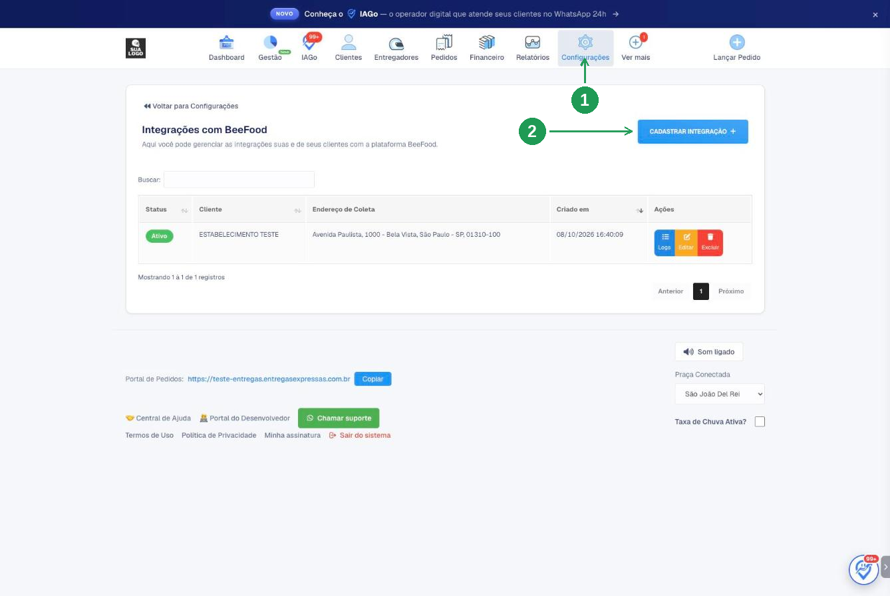

| Nº | O que fazer |
|----|-------------|
| 1 | **Configurações**, no menu do topo. |
| 2 | **CADASTRAR INTEGRAÇÃO** — abre o formulário. Se a integração já existe, use **Editar** na linha dela. |

### Passo 6. Colar a credencial e testar

Em **Lojas**, cole o **Client ID** (1) e o **Client Secret** (2) que você copiou no Passo 2 (ou
no Passo 4) e clique em **Testar credencial** (3). A mensagem de sucesso mostra o **nome da sua
loja no BeeFood** — é assim que você sabe que colou os valores certos e na ordem certa.

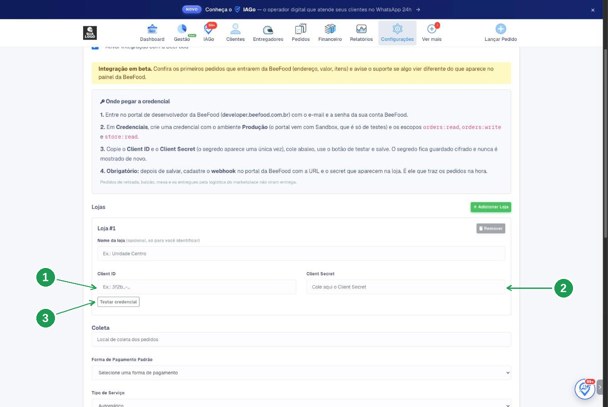

| Nº | Campo | O que fazer |
|----|-------|-------------|
| 1 | **Client ID** | Cole o valor da seta 2 da imagem do Passo 2. |
| 2 | **Client Secret** | Cole o valor revelado pelo ícone de olho (seta 3 do Passo 2). |
| 3 | **Testar credencial** | Confirma que o BeeFood aceitou. A resposta traz o nome da loja. |

> A caixa **Onde pegar a credencial**, no alto dessa tela, manda ir ao
> `developer.beefood.com.br` e trocar o ambiente de *Sandbox* para *Produção*. **Ignore**: a
> credencial que você colou saiu do painel do BeeFood e já é de produção, porque o painel não
> cria credencial de teste.

Ainda na mesma tela, logo abaixo, ficam os campos do dia a dia:

| Campo | O que faz |
|-------|-----------|
| **Nome da loja** | Opcional, só para você identificar a loja na lista. |
| **Coleta** | Endereço onde o entregador retira o pedido. |
| **Forma de Pagamento Padrão** | Forma usada nas entregas criadas pela integração. |
| **Tipo de Serviço** | *Automático* deixa o Entregas Expressas escolher o tipo de veículo. |

Tem mais de uma loja no BeeFood? Use **+ Adicionar Loja** e repita o Passo 2 para cada uma —
**cada loja tem a sua credencial**.

### Passo 7. Escolher quando o pedido vira entrega

Role até **Quando o pedido vira entrega**. A opção recomendada é **Quando a loja aceita o
pedido** (1): o entregador é chamado no momento em que você aceita o pedido no BeeFood.

Pedido de marketplace só entra se você marcar (2). E duas opções mudam o que acontece **do lado
do BeeFood**: o retorno do entregador (3) e a atualização do status (4). Por fim, o tempo de
espera antes de chamar o entregador (5).

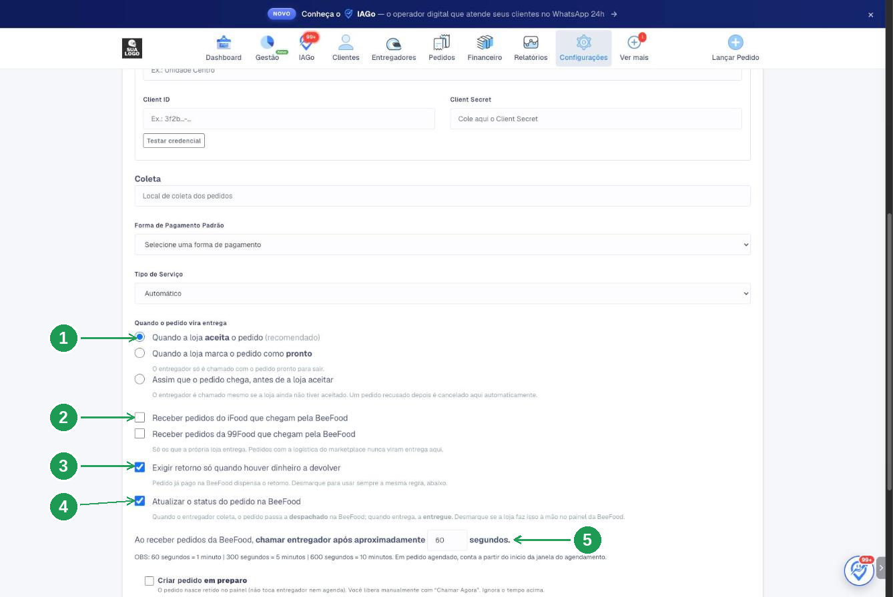

| Nº | Campo | O que fazer |
|----|-------|-------------|
| 1 | **Quando a loja aceita o pedido** | Recomendado. As outras opções chamam o entregador quando o pedido fica **pronto**, ou **antes** de você aceitar — nesta última, pedido recusado depois tem a entrega cancelada sozinha. |
| 2 | **Receber pedidos do iFood / da 99Food que chegam pela BeeFood** | Vem **desmarcado**. Marque só se a sua loja é que entrega esses pedidos. |
| 3 | **Exigir retorno só quando houver dinheiro a devolver** | Pedido já pago no BeeFood dispensa o entregador de voltar à loja. |
| 4 | **Atualizar o status do pedido na BeeFood** | ⭐ Deixe **marcado**: é o que faz a coleta virar **despachado** e a entrega virar **entregue** no seu painel. Desmarque só se a sua equipe faz isso à mão. |
| 5 | **Chamar entregador após aproximadamente … segundos** | Tempo de espera depois que o pedido entra (60 = 1 minuto, 300 = 5, 600 = 10). Em pedido agendado, conta a partir do horário do agendamento. |

Mais abaixo há ainda **Criar pedido em preparo**, que deixa o pedido retido no painel do
Entregas Expressas até você liberar com *Chamar Agora* — e que, por isso, ignora o tempo da
seta 5.

Clique em **Salvar**, no fim da página. A tela abre a integração já no passo do webhook, com a
**URL**, o **Usuário** e a **Senha** que você vai usar agora. Use os botões de copiar.

---

## Parte 3 — De volta ao BeeFood: o webhook (obrigatório)

O webhook é o aviso que a BeeFood manda ao Entregas Expressas a cada pedido. **Sem ele a
integração não recebe nada**, mesmo com a credencial funcionando.

### Passo 8. Abrir a aba Webhooks

No painel da **API Aberta**, clique na aba **Webhooks** e depois em **NOVO WEBHOOK** (1). Na
primeira vez, a lista está vazia — *Nenhum webhook cadastrado* é o normal aqui.

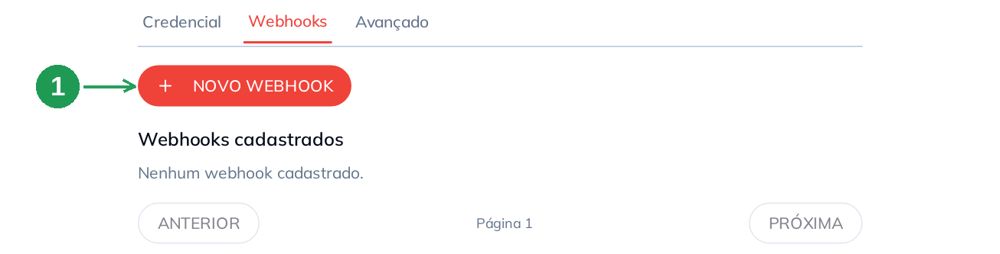

| Nº | O que fazer |
|----|-------------|
| 1 | **NOVO WEBHOOK** — abre o formulário. |

### Passo 9. Preencher com os dados do Entregas Expressas

Cole a **URL** (1) que o Entregas Expressas mostrou. Deixe **todos os cinco eventos** ligados
(2). Preencha o **E-mail de contato** (3) — é para lá que vai o aviso se a entrega do webhook
falhar. Em **Autenticação Basic** (4), cole o **Usuário** e a **Senha** do Entregas Expressas.
Clique em **SALVAR (F2)** (5).

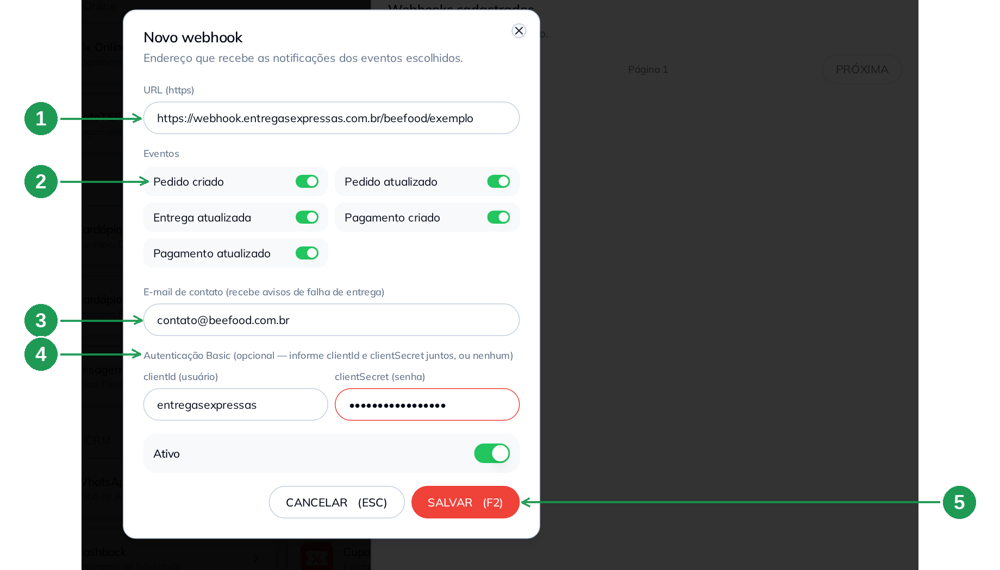

| Nº | Campo | O que fazer |
|----|-------|-------------|
| 1 | **URL (https)** | Cole a URL do bloco *Webhook* do Entregas Expressas. Tem de começar com `https://`. |
| 2 | **Eventos** | Ligue os cinco: *Pedido criado*, *Pedido atualizado*, *Entrega atualizada*, *Pagamento criado* e *Pagamento atualizado*. |
| 3 | **E-mail de contato** | Seu e-mail. Recebe os avisos de falha de entrega do webhook. |
| 4 | **Autenticação Basic** | ⚠️ O BeeFood chama os campos de **clientId (usuário)** e **clientSecret (senha)**, mas aqui vão o **Usuário** e a **Senha** que o **Entregas Expressas** mostrou — **não** o Client ID e o Client Secret do Passo 2. Os dois juntos, ou nenhum. |
| 5 | **SALVAR (F2)** | Grava o webhook. **CANCELAR (ESC)** desiste. |

> **Não há ambiente para escolher.** O portal de desenvolvedor pede *Sandbox* ou *Produção* e
> vem com Sandbox marcado; pelo painel, o webhook já nasce de produção.

### Passo 10. Guardar o secret e conferir a linha

Depois de salvar, o BeeFood mostra o **Secret do webhook** (1) **uma única vez**. Copie e
guarde; depois clique em **JÁ GUARDEI** (2) para fechar o aviso. Confira que a linha do webhook
aparece em **Webhooks cadastrados** com o selo **Ativo** (3).

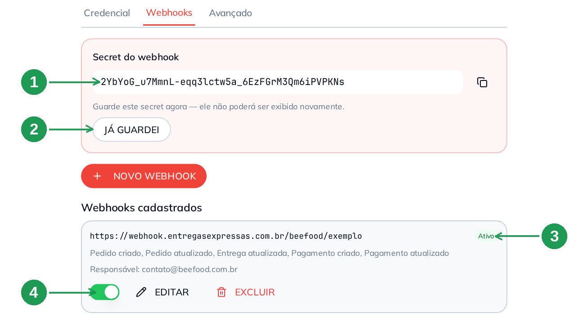

| Nº | Campo | O que fazer |
|----|-------|-------------|
| 1 | **Secret do webhook** | Copie e guarde num lugar seguro. Ele **não** é exibido de novo. É um valor da BeeFood, para quem recebe conferir que o aviso é legítimo — **não** é a senha que você preencheu no Passo 9, e o Entregas Expressas não pede por ele. |
| 2 | **JÁ GUARDEI** | Fecha o aviso do secret. |
| 3 | Selo **Ativo** | Webhook desativado não envia nada. |
| 4 | **Chave, EDITAR e EXCLUIR** | A chave **desativa sem apagar** (útil para pausar). **EDITAR** muda URL, eventos e senha — deixar a senha em branco mantém a que está gravada. **EXCLUIR** é definitivo. |

No Entregas Expressas, o bloco do webhook fica **vermelho**, com *aguardando o primeiro envio*,
até a sua loja aceitar o próximo pedido. Quando o primeiro aviso chega, ele fica **verde**, com
o status *recebendo*.

---

## Parte 4 — Pronto: o pedido chegando

Daqui para frente não há mais nada a configurar. O pedido de entrega aceito no BeeFood aparece
no painel do Entregas Expressas com número próprio (1), os valores e a distância (2), o
entregador sendo buscado (3) e, na observação, a marca **PEDIDO VIA BEEFOOD** com o canal de
venda e o valor a receber do cliente (4).

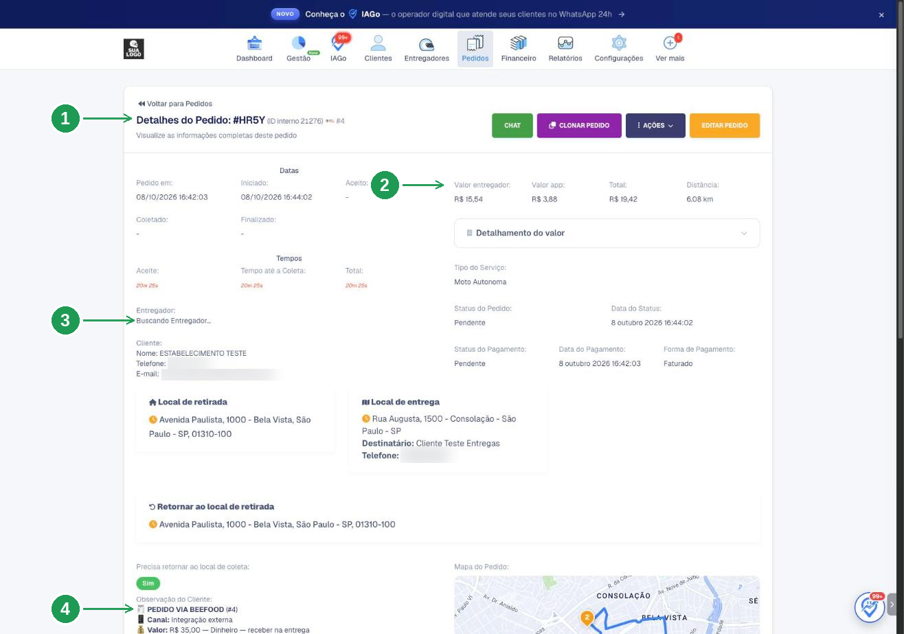

| Nº | O que observar |
|----|----------------|
| 1 | **Número do pedido** no Entregas Expressas, com o ID interno e o número do pedido no BeeFood. |
| 2 | **Valor do entregador, valor do app, total e distância** da corrida. |
| 3 | **Entregador** — *Buscando Entregador…* enquanto a corrida não é aceita. |
| 4 | **PEDIDO VIA BEEFOOD**, o **canal de venda** e o **valor a receber** com a forma de pagamento. É por aqui que o entregador sabe se cobra na porta. |

---

## Como funciona no dia a dia

1. O pedido de entrega entra no BeeFood (cardápio, PDV, WhatsApp ou marketplace).
2. Você **aceita** o pedido.
3. Passado o tempo configurado, o Entregas Expressas chama o entregador.
4. O entregador **coleta** → o pedido vira **despachado** no BeeFood.
5. O entregador **entrega** → o pedido vira **entregue** no BeeFood.

Pedido cancelado no BeeFood **antes** da coleta cancela a entrega. Depois da coleta, a entrega
segue — o entregador já está com o pacote — e o cancelamento fica registrado no histórico do
pedido.

---

## Quando algo não funciona

| Sintoma | O que verificar |
|---------|-----------------|
| Não encontro o card **API Aberta** | Ele está em liberação por etapas. Confirme com o suporte BeeFood se a sua conta já tem, e se o seu usuário tem permissão no menu **Aplicativos**. |
| O painel mostra **Ambiente de testes** em vez da credencial | Sua empresa está em ambiente de testes. Nesse caso as credenciais ficam em `docs.beefood.app`. |
| **A credencial foi recusada** | Confira se o selo diz **Ativa**, se o **Client Secret** foi colado inteiro (revele com o olho e copie pelo botão) e se **Pedidos** e **Loja** estão ligados (Passo 3). |
| O Entregas Expressas diz **ambiente de testes (sandbox)** ao lado da loja | A credencial colada veio do portal, criada em Sandbox. Troque pelos valores do painel (Passo 2) e salve — pelo painel não existe credencial de teste. |
| Bloco do webhook **vermelho**, *aguardando o primeiro envio* | Normal até o primeiro pedido aceito depois do cadastro. Aceite um pedido de entrega e olhe de novo. |
| Bloco do webhook **com falha** | Algum aviso não chegou. Volte à aba **Webhooks** e confira se a linha está **Ativo** — o Entregas Expressas informa que a BeeFood desativa o webhook depois de **5 falhas seguidas**. Religue pela chave. Enquanto isso, ele faz uma conferência a cada 10 minutos para não perder pedido. |
| Os pedidos pararam de chegar de uma hora para outra | Alguém clicou em **RECICLAR** na credencial, ou a desativou. Copie os valores novos e cole no Entregas Expressas. |
| Pedido de **retirada** ou de **mesa** não virou entrega | É o comportamento esperado: só pedido de entrega vira entrega. |
| Pedidos antigos não entraram | Só entram pedidos feitos **depois** de a integração ser ativada. |

---

## Perguntas frequentes

**Preciso do portal de desenvolvedor da BeeFood para integrar o Entregas Expressas?**
Não. A credencial e o webhook se cadastram em **Aplicativos → API Aberta**, dentro do painel do
BeeFood. O portal continua existindo e mostra a mesma credencial principal.

**Onde fica a API Aberta no BeeFood?**
Menu **Aplicativos**, seção **API e MCP**, card **API Aberta**. O painel abre à direita com as
abas **Credencial**, **Webhooks** e **Avançado**.

**Como pego o Client ID e o Client Secret da minha loja?**
Em **Aplicativos → API Aberta**, aba **Credencial**. O Client ID tem botão de copiar; o Client
Secret aparece ao clicar no ícone de olho.

**Perdi o Client Secret. Preciso criar outra credencial?**
Não. Clique no ícone de olho no campo **Client Secret** e ele é exibido de novo. Isso vale no
painel — no portal de desenvolvedor o segredo aparece só na criação.

**Preciso escolher o ambiente Produção?**
Pelo painel, não existe essa escolha: credencial e webhook criados em **Aplicativos → API
Aberta** já são de produção. A escolha de ambiente só aparece no portal de desenvolvedor, e é lá
que mora o erro de criar tudo em Sandbox.

**Quais permissões o Entregas Expressas precisa?**
**Pedidos** com *Consultar* e *Alterar*, e **Loja** com *Consultar*. A credencial principal e
qualquer credencial nova já vêm com tudo ligado.

**O que o botão RECICLAR faz?**
Troca o Client ID e o Client Secret da credencial. **Todas as integrações que a usam param na
hora** e precisam dos valores novos. Não clique por curiosidade.

**O webhook é obrigatório?**
Sim. Sem ele o Entregas Expressas não é avisado dos pedidos, e a integração fica pela metade,
mesmo com a credencial aceita.

**Quais eventos devo ligar no webhook?**
Todos os cinco: *Pedido criado*, *Pedido atualizado*, *Entrega atualizada*, *Pagamento criado* e
*Pagamento atualizado*.

**No webhook, o que vai em clientId (usuário) e clientSecret (senha)?**
O **Usuário** e a **Senha** que o **Entregas Expressas** mostra no bloco do webhook — não o
Client ID e o Client Secret da sua credencial. Os nomes dos campos são parecidos, os valores
não. E eles vão **juntos**: ou os dois, ou nenhum.

**Para que serve o Secret do webhook que apareceu depois de salvar?**
É um valor da BeeFood para quem recebe o aviso conferir que ele é legítimo. O Entregas Expressas
não pede por ele. Guarde de todo jeito: a tela não o mostra de novo.

**Posso pausar o envio sem apagar o webhook?**
Sim. Use a **chave** na linha do webhook: ele fica *Desativado* e para de enviar, mantendo URL,
eventos e senha.

**Como mudo a URL ou a senha de um webhook já cadastrado?**
Botão **EDITAR** na linha. Deixar os campos de senha em branco mantém o que está gravado.

**Tenho mais de uma loja. Uso a mesma credencial?**
Não. No Entregas Expressas use **+ Adicionar Loja** e informe a credencial de cada loja do
BeeFood.

**Pedido de retirada, balcão ou mesa vira entrega?**
Não. Só pedido de entrega.

**Pedido do iFood que chega pela BeeFood entra?**
Só se você marcar **Receber pedidos do iFood que chegam pela BeeFood** no Entregas Expressas. E
nunca entra pedido que o próprio marketplace entrega.

**O pedido vira despachado e entregue sozinho no BeeFood?**
Sim, com a opção **Atualizar o status do pedido na BeeFood** marcada: a coleta marca
**despachado** e a entrega marca **entregue**.

**Cancelei o pedido no BeeFood. A entrega cancela?**
Antes da coleta, sim. Depois da coleta a entrega segue, porque o entregador já está com o
pacote, e o cancelamento fica no histórico do pedido.

**Os pedidos antigos entram quando eu ligo a integração?**
Não. Só os feitos depois de a integração ser ativada.

---

## Precisa de ajuda?

Fale com o **suporte BeeFood** informando: nome da loja e **CNPJ**, **filial**, o **Client ID**
usado (nunca o Client Secret), se o webhook está **Ativo**, a **URL** cadastrada e o horário da
tentativa. Para o que é do lado do aplicativo — praça, valor da corrida, entregador —
fale com o suporte do **Entregas Expressas**.

---

## Onde continuar

- **Outras entregas terceirizadas:** *Let's Express*, *Foody Delivery*, *Pick N Go!* e
  *Uai Rango* têm manual próprio, e ficam em **Aplicativos → Entrega**.
- **Gestão de Entregas:** para entregador próprio, o BeeFood tem a tela de rota, despacho e
  fechamento.

---

*Última atualização: outubro/2026 — BeeFood · Aplicativos · API Aberta · Entregas Expressas*
