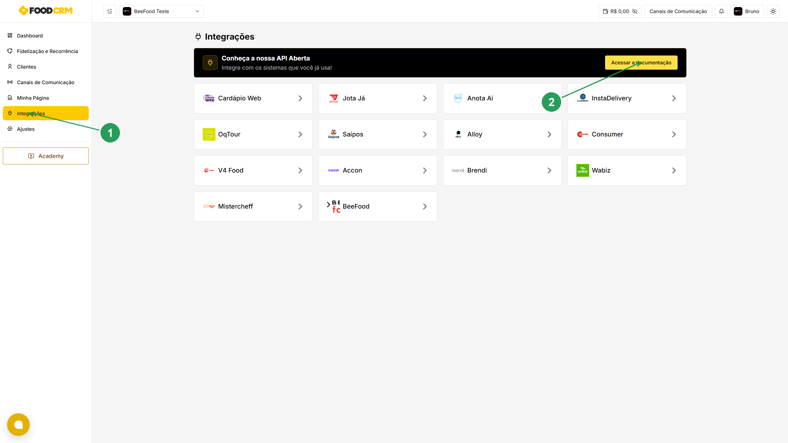
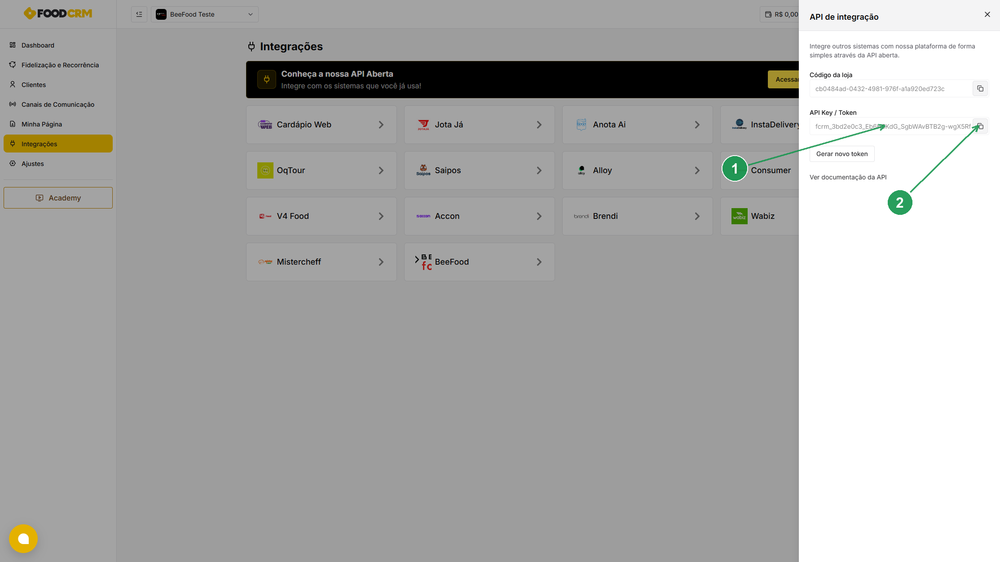
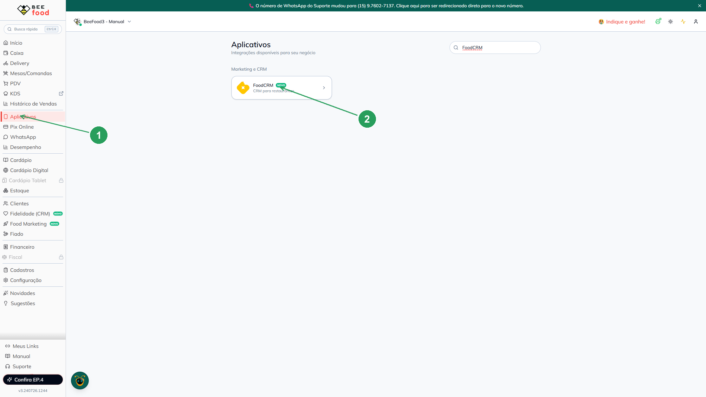
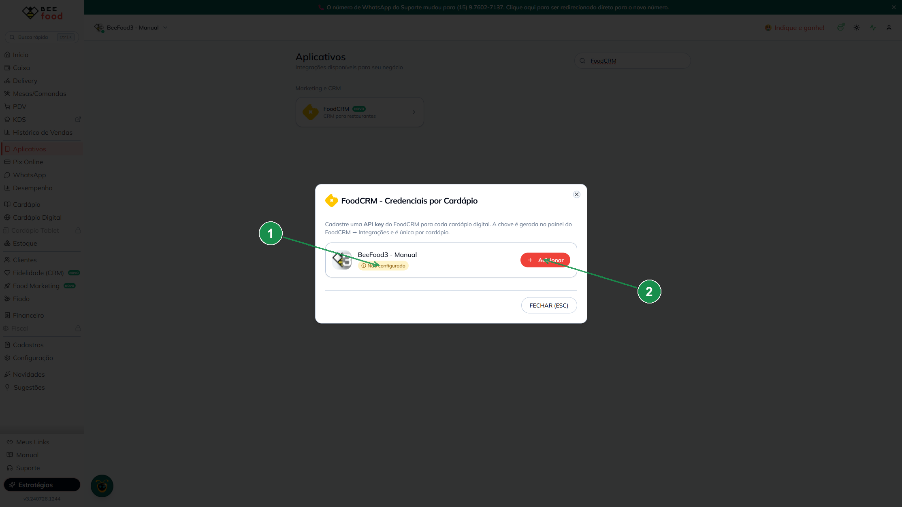
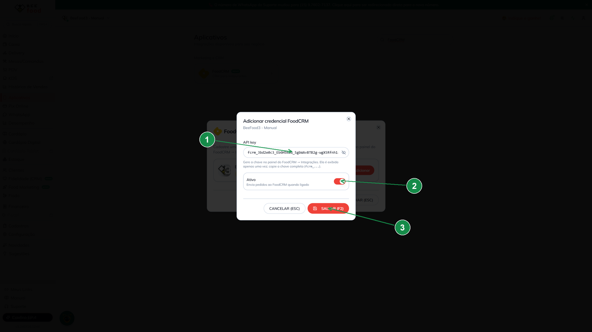
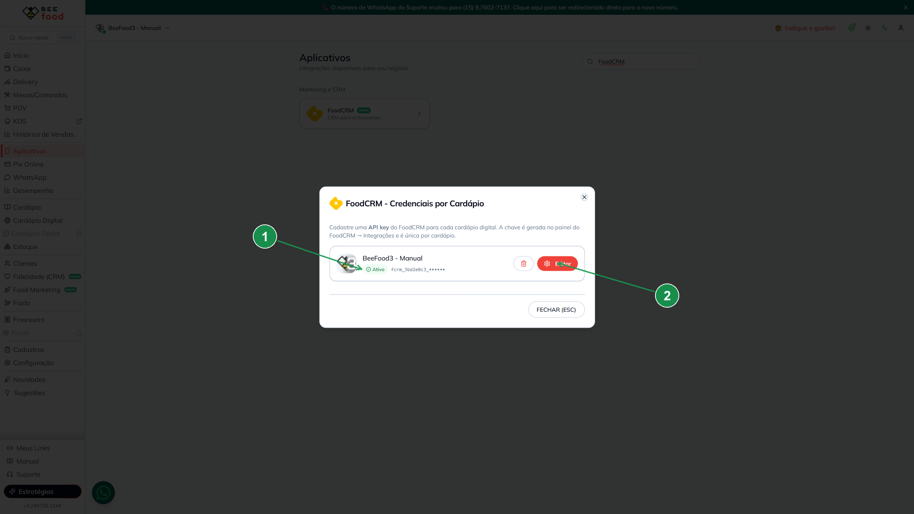

# Integração FoodCRM — envie suas vendas automaticamente para o CRM

Conecte sua operação **BeeFood** ao **FoodCRM** (CRM para restaurantes) e alimente sua base de
clientes sem trabalho manual: **todas as vendas são enviadas automaticamente, todos os dias de
madrugada**, para o FoodCRM usar em campanhas, fidelização e recorrência.

A ligação é feita com **uma única credencial** — a **API Key / Token** — que você gera no painel do
FoodCRM e cola no BeeFood. A configuração é **por cardápio digital** (cada cardápio tem a sua chave).

> As imagens têm **marcações em verde** (setas e números) indicando onde clicar ou o que copiar em cada tela.

---

## O que você ganha

- **Envio automático de vendas:** o BeeFood envia as vendas ao FoodCRM **diariamente, de madrugada** — sem exportar planilha nem digitar nada.
- **Base de clientes sempre atualizada:** o FoodCRM recebe os pedidos e mantém histórico para campanhas e recorrência.
- **Liga/desliga quando quiser:** cada cardápio tem uma chave própria e um botão **Ativo** para pausar ou retomar o envio.

---

## Antes de começar

1. **Conta BeeFood** ativa, com pelo menos um **cardápio digital**.
2. **Conta no FoodCRM** (`https://app.foodcrm.com.br`) com acesso ao menu **Integrações**.
3. Ter a **API Key / Token** em mãos — ela é gerada no próprio FoodCRM (Parte 1 abaixo).

---

## Parte 1 — FoodCRM: gerar a API Key / Token

### Passo 1. Abrir Integrações e acessar a documentação

No menu lateral do FoodCRM, clique em **Integrações** (1). No topo da página, no bloco **"Conheça a
nossa API Aberta"**, clique no botão **Acessar a documentação** (2).

### Passo 2. Copiar a API Key / Token

Um painel **"API de integração"** abre à direita. Copie a **API Key / Token** (1) usando o botão
**Copiar** (2). É essa chave (que começa com `fcrm_...`) que você vai colar no BeeFood.

| Nº | Campo no FoodCRM | O que é |
|----|------------------|---------|
| 1. | **API Key / Token** | A chave `fcrm_...` que autentica o envio das vendas |
| 2. | **Copiar** | Copia a chave completa para colar no BeeFood |

> **Guarde a chave completa.** Se você clicar em **Gerar novo token**, a chave anterior deixa de valer
> e será preciso atualizar o BeeFood com a chave nova.
>
> O **Código da loja** que aparece acima da chave **não é necessário** no BeeFood — basta a API Key / Token.

---

## Parte 2 — BeeFood: cadastrar a chave no cardápio

### Passo 3. Abrir Aplicativos → FoodCRM

No BeeFood, clique em **Aplicativos** (1) no menu lateral e, na seção **Marketing e CRM**, abra o card
**FoodCRM** (2).

### Passo 4. Escolher o cardápio e clicar em Adicionar

A janela **FoodCRM – Credenciais por Cardápio** lista cada cardápio digital com seu status (1). No
cardápio que você quer integrar, clique em **+ Adicionar** (2).

> Cada cardápio tem uma credencial independente. Repita o processo para cada cardápio que usar o FoodCRM.

### Passo 5. Colar a chave e salvar

No formulário, cole a chave copiada no Passo 2, deixe o botão **Ativo** ligado e clique em
**SALVAR (F2)**:

| Nº | Campo no BeeFood | O que fazer |
|----|------------------|-------------|
| 1. | **API key** \* | Cole a **API Key / Token** copiada do FoodCRM (Passo 2) |
| 2. | **Ativo** | Deixe **ligado** para o BeeFood enviar as vendas |
| 3. | **SALVAR (F2)** | Salva a credencial |

> O ícone de **olho** ao lado do campo permite mostrar/ocultar a chave digitada.

### Passo 6. Confirmar que está ativo

Após salvar, o cardápio passa a exibir o status **Ativo** (1) e a chave aparece mascarada
(`fcrm_..._••••••`). Use **Editar** (2) para trocar a chave ou desligar o envio a qualquer momento.

---

## Como funciona no dia a dia

1. Durante o dia, você opera o BeeFood normalmente — **não precisa fazer nada** para o FoodCRM.
2. **De madrugada**, o BeeFood envia automaticamente as vendas do período para o FoodCRM.
3. O FoodCRM usa esses dados para **campanhas, fidelização e recorrência** dos seus clientes.

> Por ser um envio diário, as vendas do dia costumam aparecer no FoodCRM **no dia seguinte**.

---

## Problemas comuns

| Sintoma | O que verificar |
|---------|-----------------|
| Vendas não aparecem no FoodCRM | O status do cardápio está **Ativo**? A chave foi colada **completa** (começando com `fcrm_`)? |
| Parou de enviar de repente | A chave foi **regenerada** no FoodCRM (**Gerar novo token**)? Gere/copie a nova e atualize no BeeFood via **Editar** |
| Tenho vários cardápios | Cada cardápio precisa da **sua própria** chave — repita o cadastro em cada um |
| Quero pausar o envio | Abra **Editar** e desligue o botão **Ativo** (a chave continua salva) |

---

## Precisa de ajuda?

Fale com o **suporte BeeFood** informando: nome da loja e **CNPJ**, qual **cardápio digital** está
configurando e um print da tela de configuração (evite expor a chave em canais públicos).

---

*Última atualização: julho/2026 — BeeFood · integração FoodCRM*
