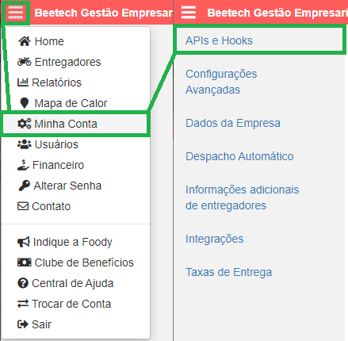
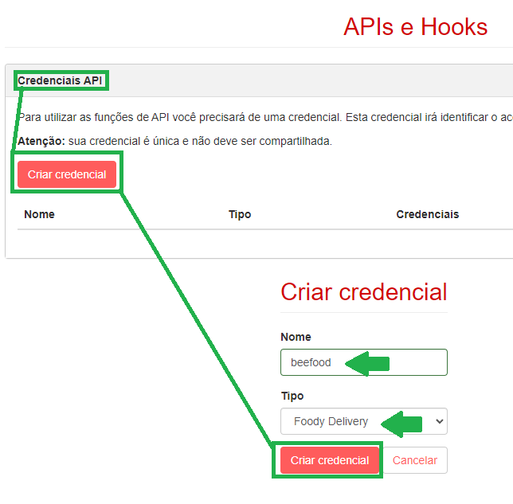
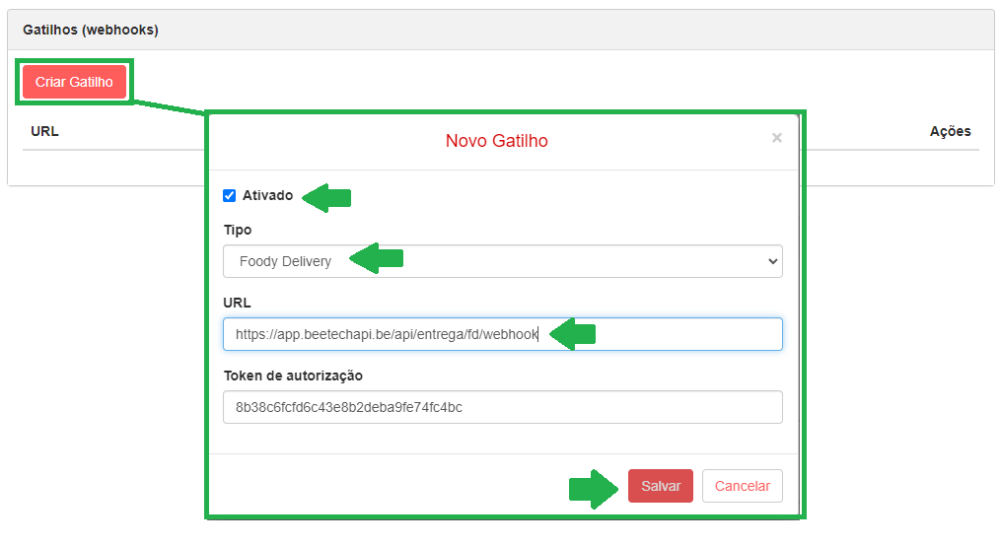
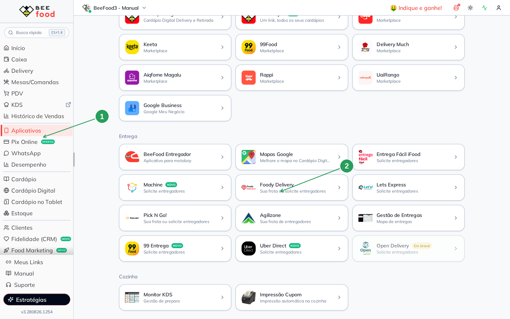
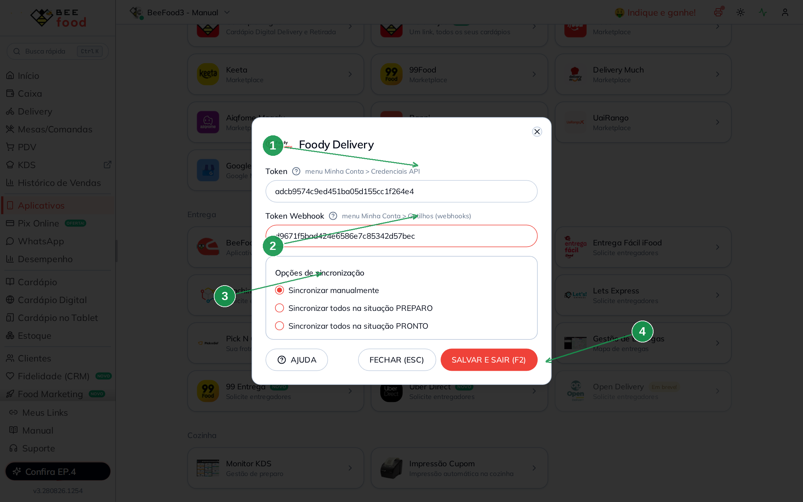
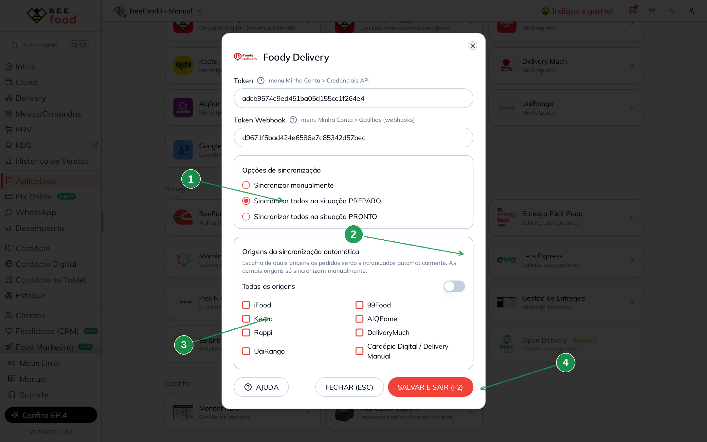
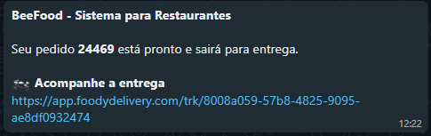

# Foody Delivery — gestão de entregas e rastreamento de motoboys

Com a integração ativa, os pedidos **Delivery para Entrega** feitos no BeeFood
podem ser sincronizados com a **Foody Delivery** para gerenciar a entrega e o
rastreamento dos motoboys.

> Toda negociação e contratação dos serviços da Foody Delivery são feitas
> **direto com a Foody Delivery**. Veja os detalhes em
> [foodydelivery.com/lp-foody-delivery-beefood](https://foodydelivery.com/lp-foody-delivery-beefood/).

> As imagens do **painel Foody** vêm do tutorial original. A tela em que o BeeFood
> **salva** o Token e o Token Webhook é a tela **nova**:
> **Aplicativos → Entrega → Foody Delivery**.

---

## Antes de começar

1. Conta ativa na **Foody Delivery**.
2. Acesso a **Aplicativos** no BeeFood.
3. Pedidos do tipo **Delivery / Entrega** (retirada no balcão não sincroniza).

---

## Parte 1 — Painel Foody: Token e Token Webhook

Precisamos criar **duas** configurações no painel da Foody Delivery. Acesse
**Minha Conta → APIs e Hooks**.

### Passo 1. Criar o Token (Credenciais API)

Em **Credenciais API**, clique em **Criar credencial**. Preencha:

- **Nome:** `beefood`
- **Tipo:** Foody Delivery

Clique em **Criar credencial** e copie o Token gerado.

### Passo 2. Criar o Token Webhook (Gatilhos)

Em **Gatilhos (webhooks)**, clique em **Criar Gatilho** e preencha:

- **Ativado:** deixe marcado
- **Tipo:** Foody Delivery
- **URL:** cole exatamente

`https://app.beetechapi.be/api/entrega/fd/webhook`

Clique em **Salvar** e copie o **Token** do gatilho (é o Token Webhook).

Guarde os dois valores. Eles entram no BeeFood no próximo passo.

---

## Parte 2 — BeeFood: colar os tokens e escolher a sincronização

### Passo 3. Abrir Aplicativos → Foody Delivery

No BeeFood, clique em **Aplicativos** (1). Na seção **Entrega**, abra o card
**Foody Delivery** (2).

| Nº | O que fazer |
|----|-------------|
| 1. | Menu **Aplicativos** |
| 2. | Card **Foody Delivery** — *Sua frota ou solicite entregadores* |

### Passo 4. Colar Token, Token Webhook e salvar

No modal **Foody Delivery**:

| Nº | Campo no BeeFood | O que fazer |
|----|------------------|-------------|
| 1. | **Token** \* | Cole o Token de **Credenciais API** (Minha Conta → Credenciais API) |
| 2. | **Token Webhook** \* | Cole o Token do **gatilho** (Minha Conta → Gatilhos) |
| 3. | **Opções de sincronização** | Escolha uma das três formas (veja a tabela abaixo) |
| 4. | **SALVAR E SAIR (F2)** | Grava a configuração |

**Formas de sincronização:**

| Opção na tela | Quando o pedido vai para a Foody |
|---------------|----------------------------------|
| **Sincronizar manualmente** | Só quando você escolhe a Foody no entregador do pedido |
| **Sincronizar todos na situação PREPARO** | Sozinho, ao criar ou mover o pedido para **PREPARO** |
| **Sincronizar todos na situação PRONTO** | Sozinho, ao mover o pedido para **PRONTO / EM ENTREGA** |

### Passo 5. (Opcional) Filtrar as origens da sincronização automática

Se escolher **PREPARO** ou **PRONTO**, aparece o bloco **Origens da sincronização
automática**. Com **Todas as origens** ligado, o comportamento é o de sempre:
qualquer canal entra na Foody. Desligue o switch para marcar só os canais
desejados — os demais continuam no BeeFood e podem ser sincronizados **na mão**.

| Nº | O que fazer |
|----|-------------|
| 1. | **Sincronizar todos na situação PREPARO** (ou PRONTO) — libera o bloco de origens |
| 2. | **Todas as origens** — desligue para escolher canal a canal |
| 3. | Marque pelo menos uma origem (iFood, 99Food, Keeta, AIQFome, Rappi, DeliveryMuch, UaiRango ou Cardápio Digital / Delivery Manual) |
| 4. | **SALVAR E SAIR (F2)** |

Use isso quando quiser, por exemplo, iFood na logística do próprio iFood e só o
**Cardápio Digital** na Foody.

---

## Parte 3 — Operar no dia a dia

### Sincronizar um pedido na mão

Com a opção **Sincronizar manualmente** (ou para um canal que ficou de fora do
filtro de origens):

1. Abra o **Delivery** e o pedido.
2. Clique em **Adicionar Entregador**.
3. Em **Entrega Terceirizada**, selecione **Foody Delivery**.

O pedido vai para a Foody com endereço, cliente e forma de pagamento já
preenchidos.

> Com a sincronização automática (PREPARO ou PRONTO), esse passo acontece
> sozinho ao avançar a situação do pedido.

### Entregador Foody Delivery

No primeiro pedido sincronizado, o BeeFood cria o entregador **Foody Delivery**.
Os pedidos seguintes ficam atrelados a ele — na tela de Delivery e nos
relatórios fica fácil ver o que também está na Foody.

### Acompanhar e ver o histórico

O status no BeeFood acompanha a Foody (entregador a caminho, entregue,
cancelado). Para o registro de cada sincronização ou cancelamento, abra
**Histórico de Alterações** nos detalhes do pedido (e também na tela de
Delivery).

### WhatsApp: link de acompanhamento

Com o **BeeBot** conectado, quando a entrega é da Foody e o pedido sai para
entrega, o cliente recebe no WhatsApp o link de rastreamento — além da
notificação que o BeeFood já envia.

### Cancelar a sincronização (sem cancelar o pedido)

No detalhe do pedido, na guia do entregador, use **Cancelar entrega Foody
Delivery** (ícone de lixeira). O pedido **não** é cancelado no BeeFood: ele só
sai da Foody e fica livre para outro entregador.

---

## Problemas comuns

| Sintoma | O que verificar |
|---------|-----------------|
| Erro ao salvar | Token e Token Webhook estão completos? Vieram da Foody, nos menus certos? |
| Pedido não sincroniza | A integração foi salva? A forma é manual ou automática? O pedido é **Delivery / Entrega**? |
| Automático não pega um canal | O filtro de **origens** está restrito? Esse canal precisa ir na mão |
| Status não atualiza | O gatilho na Foody está **Ativado**, tipo **Foody Delivery** e a URL está igual à do Passo 2? |
| Foody aparece *Não configurado* no entregador | Salve de novo o modal em Aplicativos e recarregue o Delivery |

---

## Precisa de ajuda?

Fale com o **suporte BeeFood** informando: nome da loja, **CNPJ**, filial e um
print do erro (se houver), sem expor os tokens inteiros em canais públicos.
Contratação e dúvidas da operação da Foody: direto com a Foody Delivery.

---

*Última atualização: agosto/2026 — BeeFood · integração Foody Delivery*
