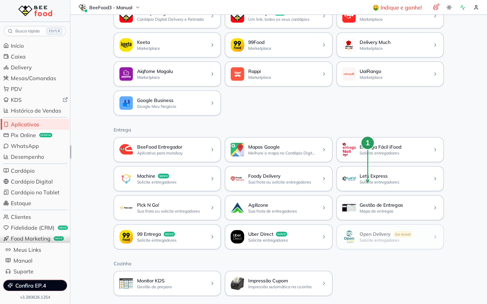
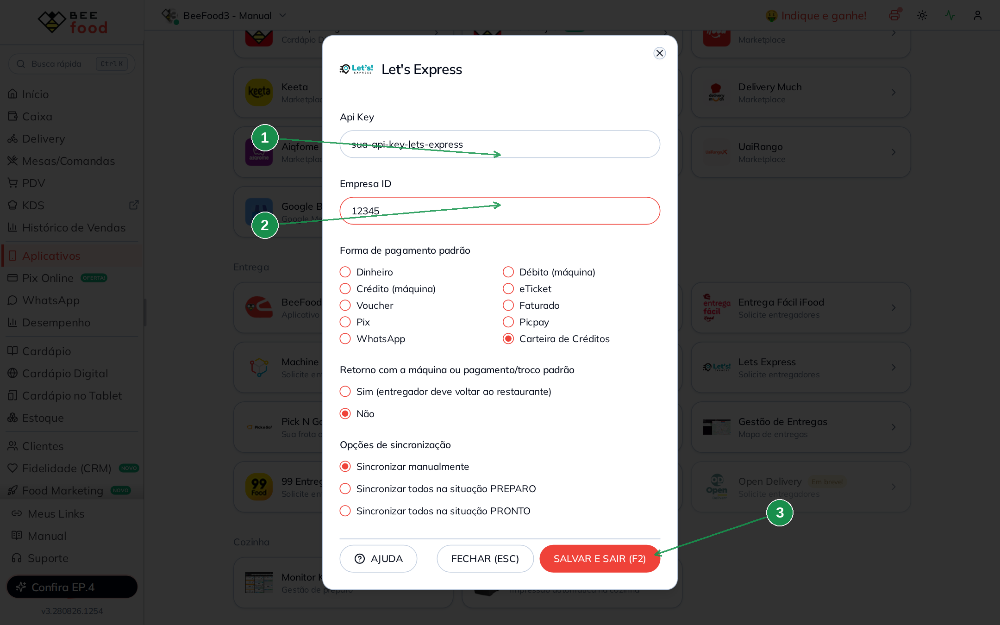
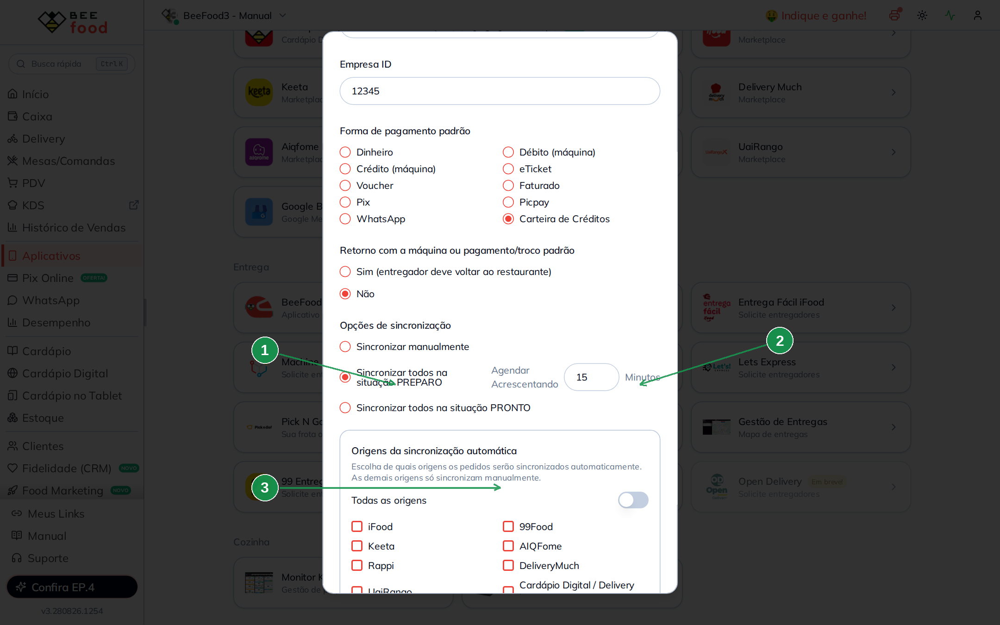
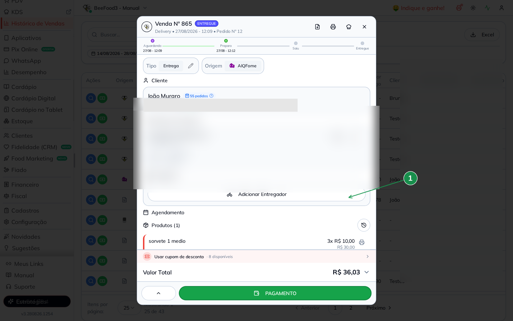
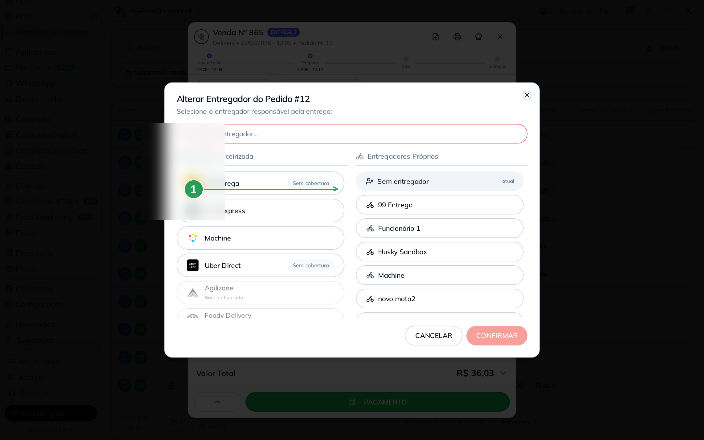
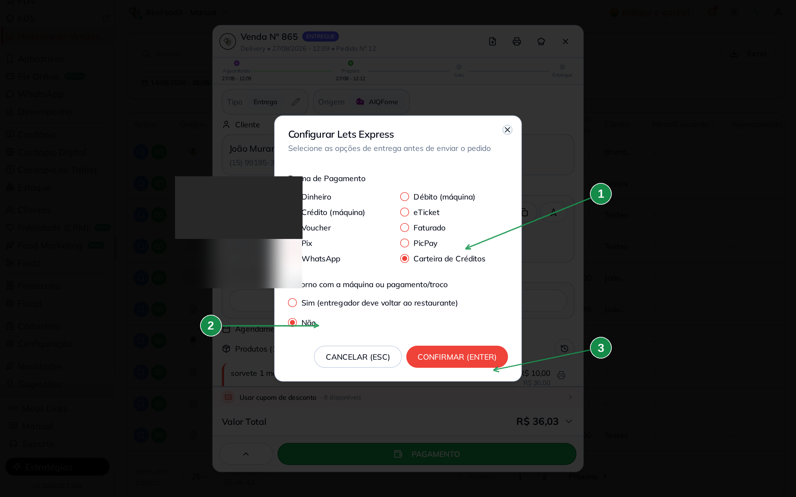

# Let's Express — solicitar entregador para Delivery

Conecte o **BeeFood** à **Let's Express** e peça um entregador sem sair do
painel: configure as credenciais, escolha quando sincronizar e acompanhe o
pedido na tela de Delivery.

> As imagens têm **marcações em verde** (setas e números) indicando onde clicar
> ou o que observar em cada tela.

---

## O que você consegue fazer

- **Solicitar um entregador** Let's Express para um pedido delivery.
- **Sincronizar automaticamente** quando o pedido for para **PREPARO** ou
  **PRONTO**.
- **Cancelar** só a corrida na Let's Express — o pedido continua no BeeFood.

A cotação de valor e disponibilidade **não aparece** nesta integração (no
Windows antigo já estava *em manutenção*). Você solicita o entregador direto.

---

## Antes de começar

1. Conta BeeFood ativa.
2. **API Key** e **Empresa ID** fornecidos pelo suporte da Let's Express.
   Ao pedir, mencione que deseja ativar a integração via API com o
   **BeeFood – Sistema para Restaurantes**.

---

## Parte 1 — Configurar a integração

### Passo 1. Abrir Aplicativos → Entrega → Lets Express

No menu, abra **Aplicativos**. Na seção **Entrega**, clique no card
**Lets Express** (1).

| Nº | O que fazer |
|----|-------------|
| 1 | Card **Lets Express** — *Solicite entregadores*. |

### Passo 2. Colar as credenciais e salvar

O modal pede os dados da Let's Express. Preencha e clique em
**SALVAR E SAIR (F2)** (3).

| Nº | Campo | O que fazer |
|----|-------|-------------|
| 1 | **Api Key** (*) | Cole a chave enviada pela Let's Express. |
| 2 | **Empresa ID** (*) | Cole o ID da sua loja na Let's Express (não é o ID do BeeFood). |
| 3 | **SALVAR E SAIR (F2)** | Grava a configuração. |

No mesmo modal você define o dia a dia:

| Campo | O que faz |
|-------|-----------|
| **Forma de pagamento padrão** | Forma usada ao sincronizar (Dinheiro, Pix, máquina, Carteira de Créditos, etc.). |
| **Retorno com a máquina ou pagamento/troco** | **Sim** = o entregador deve voltar ao restaurante depois da entrega. |
| **Opções de sincronização** | **Manual**, automático em **PREPARO** ou automático em **PRONTO**. |

> Para usar **PREPARO** ou **PRONTO**, a forma de pagamento padrão e o retorno
> são obrigatórios — o BeeFood envia esses dados sozinho em cada pedido.

### Passo 3. Sincronização automática e origens (opcional)

Se escolher **Sincronizar todos na situação PREPARO** (1), o pedido vai para a
Let's Express assim que entra em Preparo. Dá para **agendar acrescentando
minutos** (2): a corrida só abre depois desse tempo de preparo.

Com PREPARO ou PRONTO, aparece o bloco **Origens da sincronização automática**
(3). Deixe **Todas as origens** ligado para enviar tudo, ou desligue e marque
só os canais que devem ir sozinhos (iFood, Cardápio Digital, etc.). Os demais
continuam podendo ser enviados **manualmente**.

| Nº | O que fazer |
|----|-------------|
| 1 | **Sincronizar todos na situação PREPARO**. |
| 2 | **Agendar Acrescentando** — minutos de preparo antes de abrir a entrega. |
| 3 | **Origens** — todas ou só as marcadas. É preciso marcar ao menos uma se desligar *Todas as origens*. |

**Sincronizar todos na situação PRONTO** faz o mesmo, mas só quando o pedido
vai para Pronto / Em entrega — sem o campo de minutos.

---

## Parte 2 — Solicitar o entregador (manual)

Com a sincronização **manual**, você escolhe o pedido.

### Passo 4. Abrir o pedido e adicionar entregador

Na tela de **Delivery** (ou no **Histórico de Vendas**), abra o pedido. Na
seção **Entregador**, clique em **Adicionar Entregador** (1).

| Nº | O que fazer |
|----|-------------|
| 1 | **Adicionar Entregador**. Se já houver um, o botão vira o lápis **Alterar entregador**. |

### Passo 5. Escolher Lets Express

No modal, em **Entrega Terceirizada**, clique em **Lets Express** (1).

| Nº | O que fazer |
|----|-------------|
| 1 | **Lets Express**. Se aparecer *Não configurado*, volte ao Passo 2 e salve a Api Key e o Empresa ID. |

### Passo 6. Confirmar pagamento e retorno

O BeeFood abre **Configurar Lets Express**. Confira a **Forma de Pagamento**
(1) e o **Retorno** (2) e clique em **CONFIRMAR (ENTER)** (3).

| Nº | O que fazer |
|----|-------------|
| 1 | **Forma de Pagamento** — já vem a padrão da configuração; mude só neste pedido se precisar. |
| 2 | **Retorno** — se o entregador deve voltar com a máquina ou o troco. |
| 3 | **CONFIRMAR (ENTER)** — envia o pedido. **CANCELAR (ESC)** desiste sem enviar. |

No primeiro envio o BeeFood cria o entregador **Lets Express**. Os próximos
pedidos sincronizados ficam atrelados a ele — na tela de Delivery e nos
relatórios fica fácil ver o que também está na Let's Express.

---

## Parte 3 — Acompanhar e cancelar

### Histórico

Para ver se o pedido foi sincronizado ou cancelado na Let's Express, abra o
**histórico do pedido** (ícone de relógio ao lado de **Produtos**, no detalhe)
ou, na tela de Delivery, o menu **⋮ → Histórico Alterações**.

Procure eventos como *Lets Express – Pedido Sincronizado* e
*Lets Express – Pedido Cancelado*.

### Cancelar só a Let's Express

Se o pedido já está **Entregue por Lets Express**, use a **lixeira** na seção
**Entregador** e confirme **Cancelar Entrega**. O pedido **não** é cancelado
no BeeFood — só sai da Let's Express e fica livre para outro entregador.

---

## Como funciona no dia a dia

1. O pedido entra no BeeFood (cardápio, marketplace ou balcão).
2. Você avança o status na cozinha.
3. Na hora certa — **manual** (Passos 4 a 6) ou **automática** (PREPARO/PRONTO)
   — o BeeFood envia o pedido à Let's Express.
4. A Let's Express aloca o entregador.
5. O pedido fica vinculado ao entregador **Lets Express**.

---

## Problemas comuns

| Sintoma | O que verificar |
|---------|-----------------|
| *Não configurado* no modal de entregador | Api Key e Empresa ID salvos? **SALVAR E SAIR (F2)** no Passo 2. |
| Pedido não vai sozinho | A sincronização está em **Manual**? Origem do pedido está marcada no filtro? |
| Erro ao salvar | Confira Api Key e Empresa ID com o suporte da Let's Express. |
| Quer só alguns canais no automático | Desligue **Todas as origens** e marque os canais (Passo 3). |

---

## Precisa de ajuda?

Fale com o **suporte BeeFood** informando: nome da loja e **CNPJ**, **filial**,
**Empresa ID** da Let's Express, print do erro (se houver) e horário da
tentativa.

---

*Última atualização: agosto/2026 — BeeFood · integração Let's Express*
