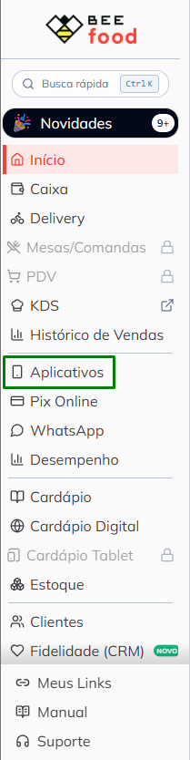
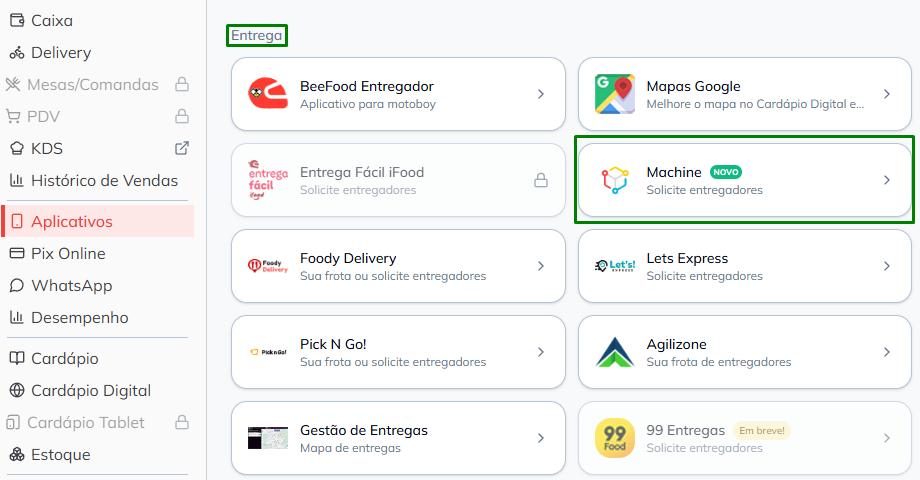
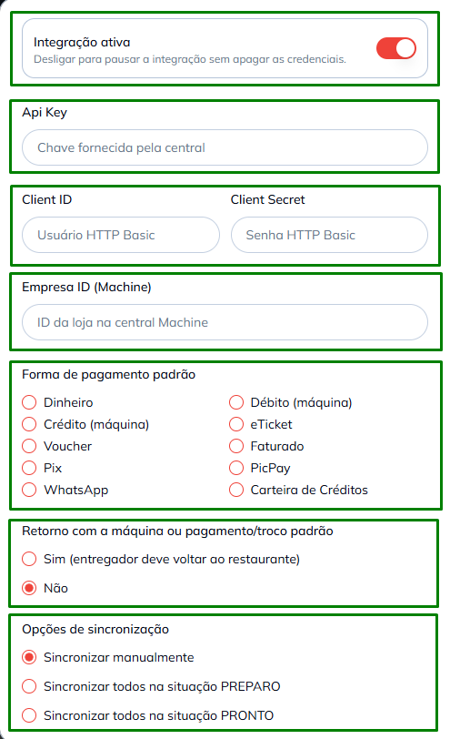
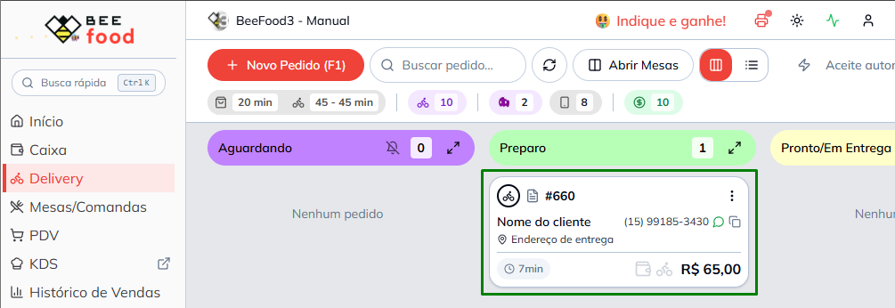
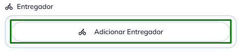
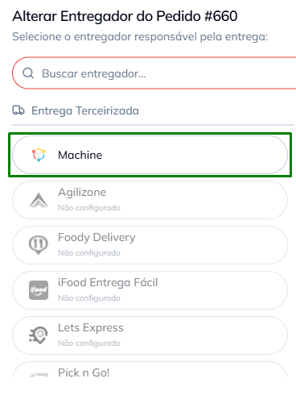
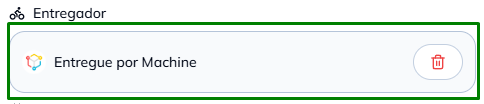

# Integração Machine — despache entregas pelo BeeFood

Conecte sua operação **BeeFood** à central de entregas **Machine** e despache corridas sem sair do
painel: cotação, abertura, cancelamento e atualização automática dos pedidos.

> As imagens têm **marcações em verde** (destaques) indicando onde clicar ou o que observar em cada tela.

---

## O que você ganha

- **Despacho integrado:** cotação e abertura de corrida a partir do painel BeeFood.
- **Atualizações em tempo real:** o status da Machine reflete automaticamente na tela de Delivery.
- **Múltiplas origens:** iFood, cardápio digital, balcão e demais canais suportados pelo BeeFood.
- **Agendamento:** defina o tempo de preparo em minutos e o BeeFood agenda a chamada do entregador
  (com sincronização automática habilitada).
- **Agrupamento:** envie um ou mais pedidos na mesma solicitação; cada um é atualizado de forma isolada.

---

## Antes de começar

1. **Conta BeeFood** ativa.
2. **Empresa cadastrada na central Machine** pela operadora local.
3. **Credenciais fornecidas pela central Machine** (usadas no Passo 3).

---

## Parte 1 — Solicitar as credenciais à central

### Passo 1. Pedir os dados à Machine

Entre em contato com a central e solicite:

- `api-key`
- `client_id`
- `client_secret`
- `empresa_id`
- `forma_pagamento`

Com essas informações em mãos, siga para a configuração no BeeFood.

---

## Parte 2 — Configurar a integração no BeeFood

### Passo 2. Abrir Aplicativos → Entrega → Machine

No menu lateral, clique em **Aplicativos**.

Na aba **Entrega**, selecione o card **Machine**.

---

### Passo 3. Preencher credenciais e salvar

Deixe a **Integração ativa** ligada, preencha os campos com os dados da central, configure as opções de
operação e clique em **Salvar**.

**Credenciais:**

| Campo no BeeFood | O que é na Machine |
|------------------|--------------------|
| **Api Key** | Chave de API da central |
| **Client ID** | Usuário (HTTP Basic) |
| **Client Secret** | Senha (HTTP Basic) |
| **Empresa ID (Machine)** | ID da empresa/loja na plataforma Machine |

**Opções de operação:**

| Opção | O que faz |
|-------|-----------|
| **Forma de pagamento padrão** | Forma de pagamento usada nas solicitações (ex.: Carteira de Créditos) |
| **Retorno com a máquina / pagamento / troco** | **Sim** = o entregador deve voltar ao restaurante após a entrega |
| **Opções de sincronização** | **Manual** ou automática ao mover o pedido para **PREPARO** ou **PRONTO** |
| **Tempo de preparo (minutos)** | Agenda a chamada do entregador para daqui a X minutos (com sincronização automática) |

> Com a integração **ativa**, o BeeFood registra o webhook na Machine para receber atualizações de status.
> Se ocorrer erro ao salvar, confira os dados com a central e tente novamente.

---

### Passo 4. Confirmar que está ativa

Volte à tela de integrações e verifique se a **Machine** aparece como **configurada e ativa**.

---

## Parte 3 — Despachar e acompanhar

### Passo 5. Despachar um pedido (sincronização manual)

1. Abra a tela de **Delivery** e localize o pedido desejado.

2. No pedido, clique em **Adicionar Entregador**.

3. Em **Entrega Terceirizada**, selecione **Machine** e confirme — o pedido vai à central com endereço,
   cliente e forma de pagamento já preenchidos.

> Com a **sincronização automática** habilitada (PREPARO ou PRONTO), esse despacho acontece sozinho ao
> mover o pedido — não é preciso fazer manualmente.

---

### Passo 6. Acompanhar em tempo real

Após o despacho, o pedido fica vinculado à Machine na guia **Entregador** (**Entregue por Machine**).

O status no BeeFood acompanha a operação na central:

| Situação | O que você vê no BeeFood |
|----------|--------------------------|
| Entregador a caminho | Pedido em **Pronto/Em Entrega** |
| Entrega concluída | Pedido **Entregue** |
| Cancelado na central | Integração desfeita; pedido disponível para novo despacho |

---

## Como funciona no dia a dia

1. O pedido entra no BeeFood (site, iFood, balcão ou outro canal).
2. Você avança o pedido no fluxo normal da cozinha.
3. Na hora certa — manual ou automática — o BeeFood solicita a entrega à Machine.
4. A central aloca um entregador.
5. As mudanças de status voltam sozinhas para o BeeFood e atualizam o pedido, o WhatsApp e os
   marketplaces quando aplicável.

---

## Pedidos agrupados

É possível enviar **mais de um pedido** na mesma solicitação. Cada pedido continua visível e atualizado
no BeeFood de forma independente — inclusive quando um é entregue antes do outro.

---

## Cancelar uma entrega

Com o pedido ainda em andamento na Machine, use **Cancelar entrega Machine** no BeeFood (ícone de
**lixeira** na guia **Entregador**, conforme a imagem do Passo 6). O cancelamento é repassado à central e
o pedido deixa de ficar vinculado ao entregador.

---

## Problemas comuns

| Sintoma | O que verificar |
|---------|-----------------|
| Erro ao salvar credenciais | Confirme `api-key`, `client_id`, `client_secret` e `empresa_id` com a central |
| Pedidos não são despachados | A integração está **ativa**? A sincronização é manual ou automática? |
| Status não atualiza | O webhook depende da central; confirme com a Machine se os eventos estão sendo enviados |

---

## Precisa de ajuda?

Entre em contato com o **suporte BeeFood** informando: nome da loja e **CNPJ**, **filial**, **Empresa ID
(Machine)** usado, print do erro (se houver) e horário da tentativa.

---

*Última atualização: julho/2026 — BeeFood · integração Machine*
