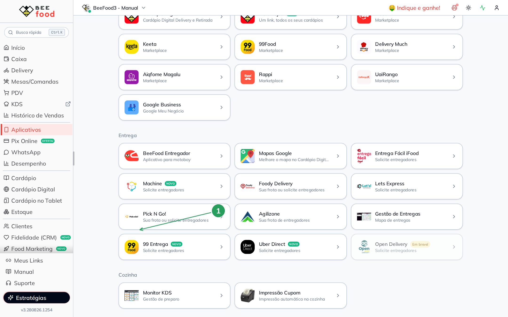
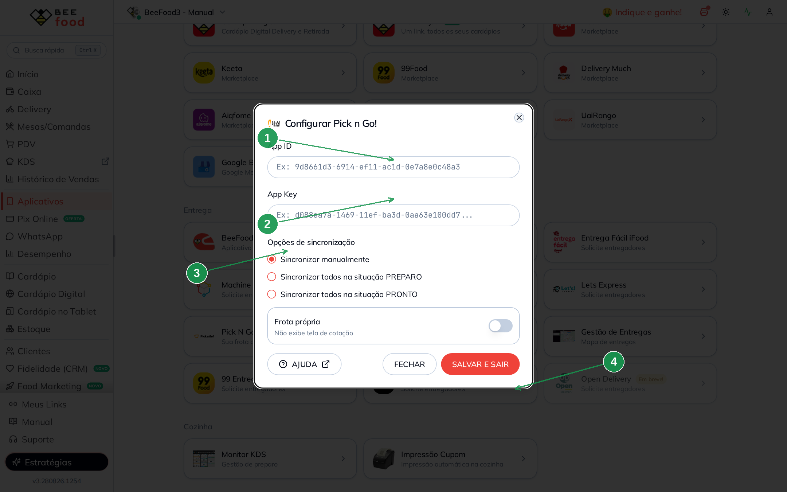
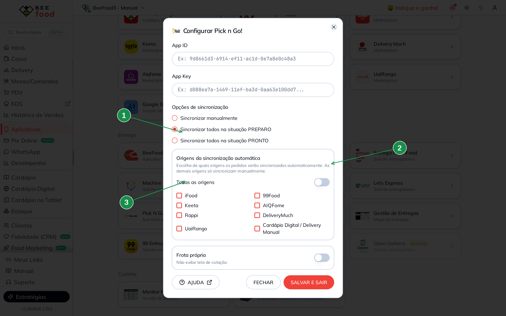

# Pick N Go! — cotar e solicitar entregador no Delivery

Com a integração **Pick n Go!** no BeeFood você consegue, nos pedidos de **entrega**:

- Cotar disponibilidade, distância e valor da corrida
- Solicitar um entregador
- Cancelar a entrega na Pick n Go! (sem cancelar o pedido no BeeFood)

> As imagens têm **marcações em verde** (setas e números). O artigo antigo era do BeeFood Windows;
> aqui vale a tela **nova** do painel web.

---

## Antes de começar

1. Conta BeeFood ativa e permissão para **Aplicativos**.
2. **App ID** e **App Key** da Pick n Go! — peça ao **suporte da Pick n Go!** e diga que quer
   ativar a integração via API com o **BeeFood – Sistema para Restaurantes**.
3. Chave do **Google Maps** configurada no BeeFood (Aplicativos → Entrega → Mapas Google). Sem
   mapa, a cotação e o botão da integração podem não aparecer. O passo a passo da chave está no
   manual **Mapas Google**.
4. O pedido precisa ser **Delivery com endereço de entrega**. Pedido de retirada ou sem endereço
   não mostra a cotação.

---

## Parte 1 — Configurar no BeeFood

### Passo 1. Abrir o card Pick N Go!

No menu, abra **Aplicativos**. Na seção **Entrega**, clique em **Pick N Go!** (1).

| Nº | O que fazer |
|----|-------------|
| 1 | Card **Pick N Go!** — *Sua frota ou solicite entregadores*. |

### Passo 2. Colar as credenciais e escolher a sincronização

O modal **Configurar Pick n Go!** é a tela em que o BeeFood grava a integração.

| Nº | Campo | O que fazer |
|----|-------|-------------|
| 1 | **App ID** (*) | Cole o App ID enviado pela Pick n Go!. |
| 2 | **App Key** (*) | Cole o App Key. |
| 3 | **Opções de sincronização** | Escolha **uma**: manual, PREPARO ou PRONTO. |
| 4 | **SALVAR E SAIR** | Grava a configuração (atalho **F2**). |

**Opções de sincronização:**

| Opção | O que faz |
|-------|-----------|
| **Sincronizar manualmente** | Você escolhe o pedido e clica em Pick n Go! na hora da entrega. |
| **Sincronizar todos na situação PREPARO** | Todo pedido novo ou atualizado para **Preparo** vai sozinho para a Pick n Go!. |
| **Sincronizar todos na situação PRONTO** | O envio automático acontece quando o pedido vai para **Pronto / Em entrega**. |

**Frota própria:** se a sua operação usa motoboys da Pick n Go! em frota própria, ligue o switch.
Nesse modo o BeeFood **não abre a tela de cotação** e envia o pedido direto. Frota terceirizada
(switch desligado) mostra a cotação antes de confirmar.

Revise e clique em **SALVAR E SAIR**.

### Passo 3. (Opcional) Filtrar as origens da sincronização automática

Se você escolheu **PREPARO** ou **PRONTO**, o modal mostra **Origens da sincronização automática**.

| Nº | O que fazer |
|----|-------------|
| 1 | Radio **Sincronizar todos na situação PREPARO** (ou PRONTO) — é o que libera o bloco de origens. |
| 2 | Switch **Todas as origens** — ligado = comportamento padrão (tudo sincroniza). |
| 3 | Lista de origens — desligue *Todas as origens* e marque só os canais que devem ir sozinhos. |

Origens disponíveis: **iFood**, **99Food**, **Keeta**, **AIQFome**, **Rappi**, **DeliveryMuch**,
**UaiRango** e **Cardápio Digital / Delivery Manual**.

Os pedidos das origens de fora da lista continuam no BeeFood — só não disparam o envio automático.
Você ainda pode sincronizá-los **manualmente**.

---

## Parte 2 — Pedir o entregador no dia a dia

### Sincronização manual

1. Abra **Delivery** e localize um pedido do tipo **entrega** (com endereço).
2. Clique em **Adicionar Entregador** (ou **Selecionar entregador** nos detalhes do pedido).
3. Em **Entrega Terceirizada**, escolha **Pick n Go!**.
4. Se houver outros serviços ativos (iFood Entrega Fácil, 99 Entrega…), o BeeFood consulta as
   cotações ao mesmo tempo e pode marcar **Mais rápido**, **Mais barato** ou **Melhor escolha**.
5. Confira a cotação no modal **Cotação Pick n Go!**:
   - **Taxa cobrada do cliente**
   - **Taxa do entregador**
   - **Distância calculada**
   - **Forma de pagamento** — o BeeFood tenta pré-selecionar a do pedido (selo *Pré-selecionada*).
     Se nenhuma forma for informada, a Pick n Go! trata o pedido como **já pago online**.
6. Clique em **Confirmar Entrega**.

Frota própria: o passo 5 some. O BeeFood envia direto e o botão vira **Enviar para Pick n Go**.

> Frota terceirizada aceita **um pedido por vez**. Para mandar vários de uma vez, use frota própria
> ou sincronize um a um.

### Sincronização automática (PREPARO ou PRONTO)

Com o radio automático ligado, o despacho acontece sozinho ao mover o pedido. Não é preciso abrir
o modal de entregador. Vale o filtro de origens do Passo 3.

---

## Parte 3 — Acompanhar, histórico e cancelar

### Entregador Pick n Go!

No primeiro pedido sincronizado, o BeeFood cria o entregador **Pick n Go!**. Os próximos pedidos
da integração ficam atrelados a ele. Na lista de Delivery e nos relatórios fica fácil ver o que
também está na Pick n Go!.

Nos detalhes do pedido a guia **Entregador** mostra **Entregue por Pick n Go!**.

### WhatsApp — link de acompanhamento

Com o **BeeBot** conectado, quando o pedido sai para entrega o cliente recebe o **link de
acompanhamento** da corrida, além da notificação que o WhatsApp já envia.

### Histórico

Para ver a sincronização e o cancelamento, use o **Histórico** da tela de Delivery (menu de mais
opções) ou o histórico nos **detalhes do pedido**. As linhas típicas são *Pedido Sincronizado* e
*Pedido Cancelado* da Pick n Go!.

### Cancelar a sincronização

Na guia **Entregador**, clique na **lixeira** (**Cancelar entrega Pick n Go!**). Confirme.

O pedido **não** é cancelado no BeeFood — só some da Pick n Go! e fica livre para outro entregador.

---

## Como funciona no dia a dia

1. O pedido entra no BeeFood (cardápio, iFood, balcão ou outro canal).
2. Você avança o pedido no fluxo da cozinha.
3. Na hora da entrega — manual ou automática — o BeeFood pede a cotação e cria a corrida.
4. A Pick n Go! aloca o entregador.
5. O status volta para o BeeFood e atualiza o pedido, o WhatsApp e os marketplaces quando aplicável.

---

## Se o botão ou a cotação não aparecer

| Sintoma | O que verificar |
|---------|-----------------|
| Card ou botão some | Integração salva? App ID e App Key corretos? |
| Cotação não abre | O pedido é **Delivery com endereço**? A chave do **Google Maps** está configurada? |
| *Não configurado* no modal de entregador | Volte ao Passo 2 e clique em **SALVAR E SAIR**. |
| *Selecione apenas uma venda* | Frota terceirizada: marque **um** pedido só. |
| Automático não dispara | O radio é PREPARO ou PRONTO? A origem do pedido está no filtro? |
| Status não atualiza | Confira o **Histórico** do pedido e o suporte da Pick n Go!. |

---

## Precisa de ajuda?

Fale com o **suporte BeeFood** e informe: nome da loja e CNPJ, filial, se já tem App ID/App Key,
print do erro e horário da tentativa. As credenciais vêm do **suporte da Pick n Go!**.
