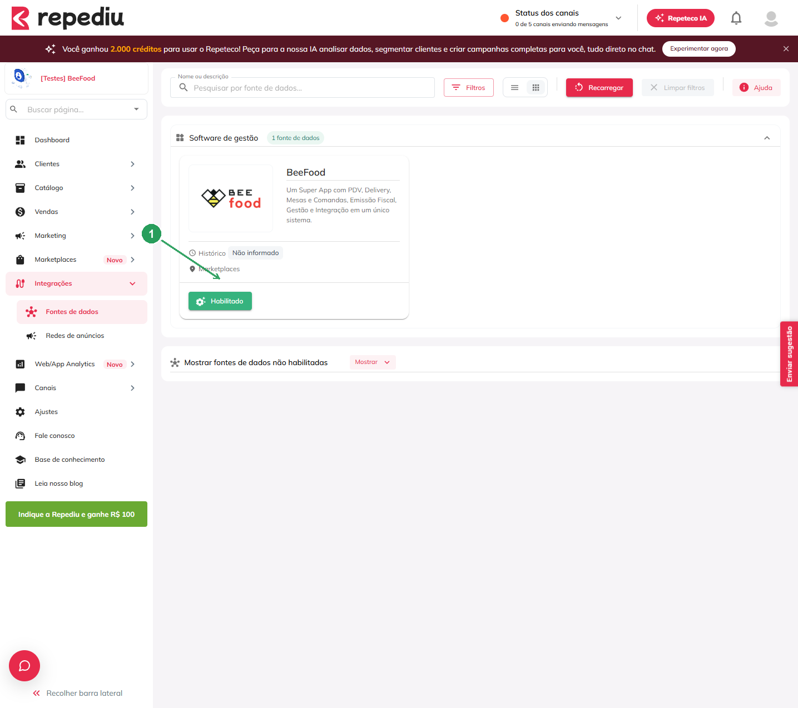
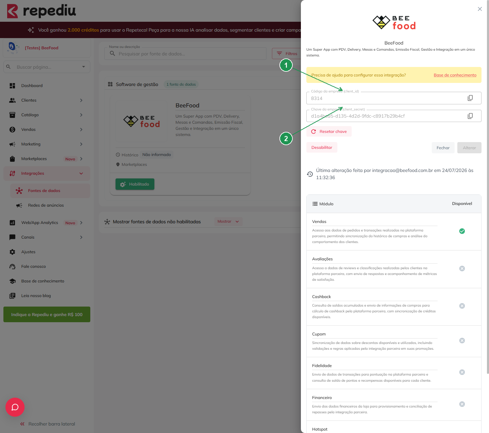
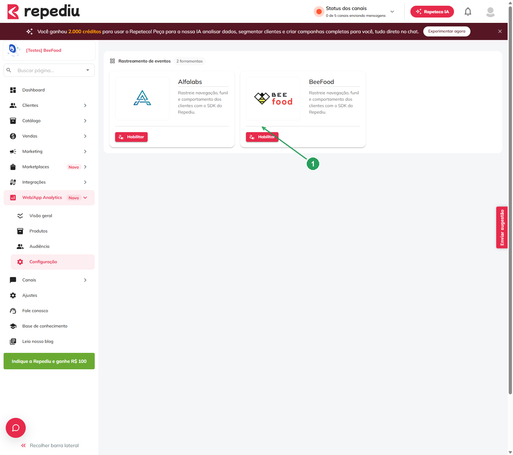
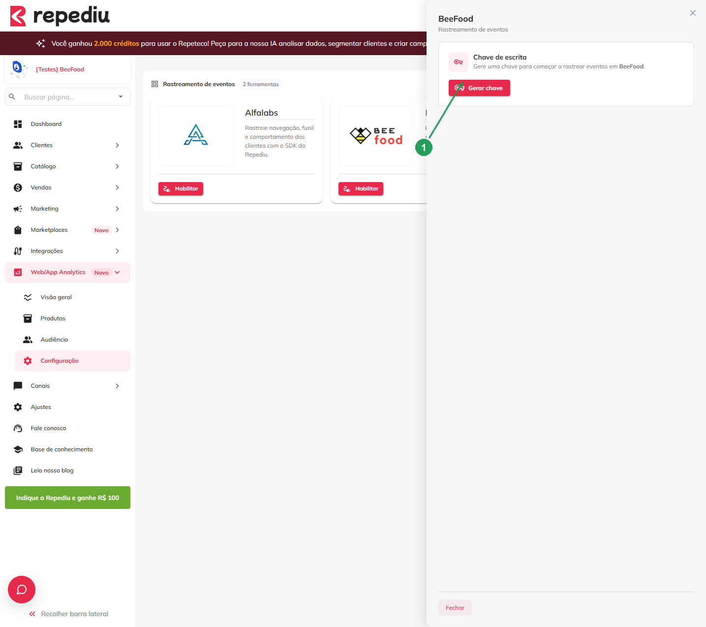
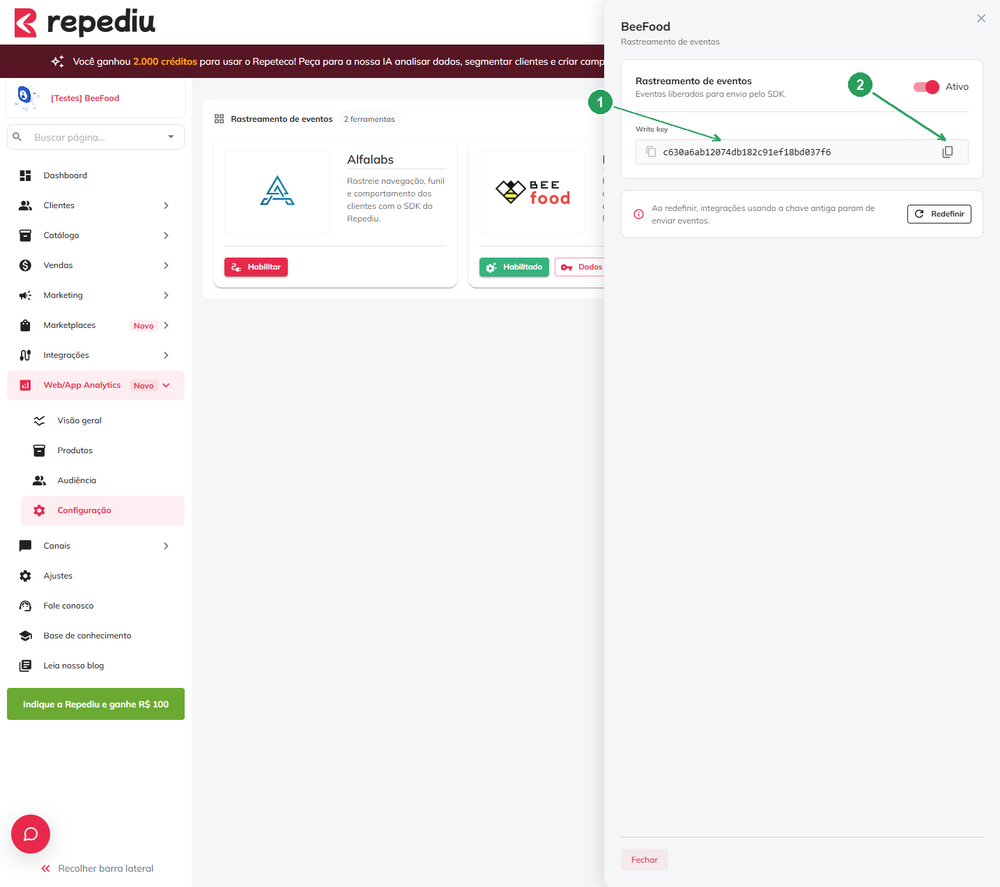
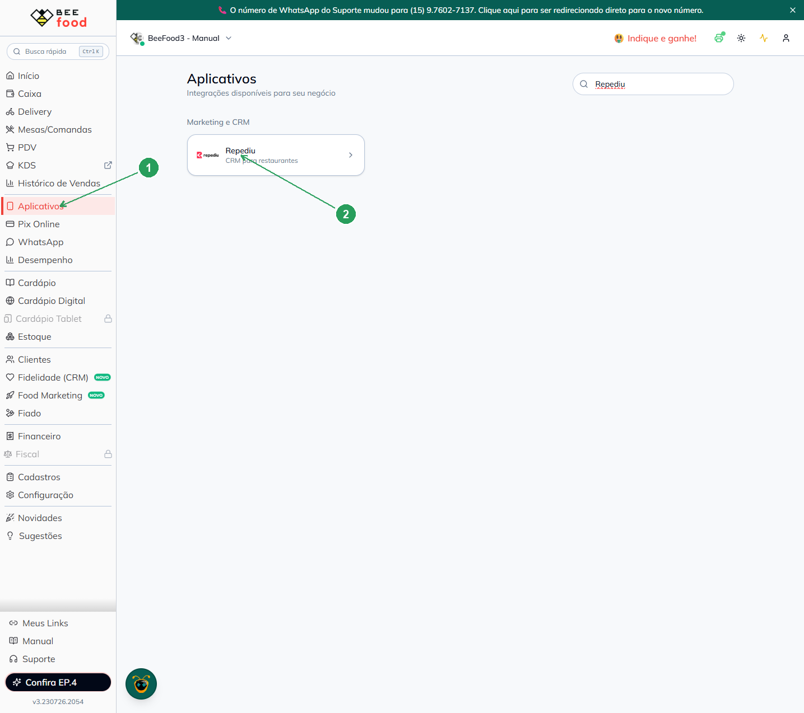
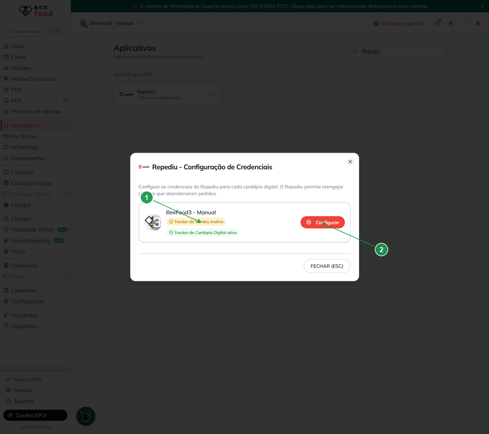
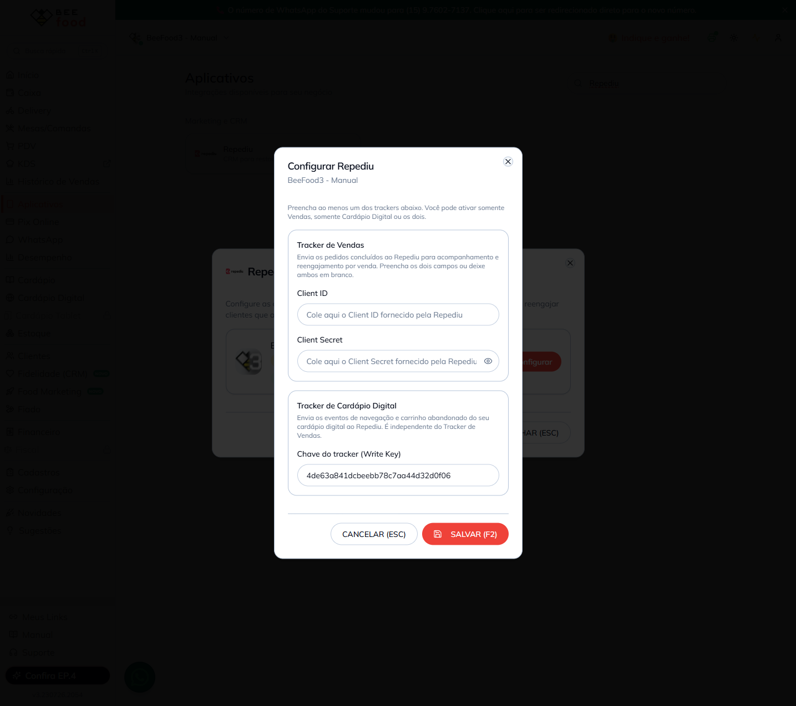
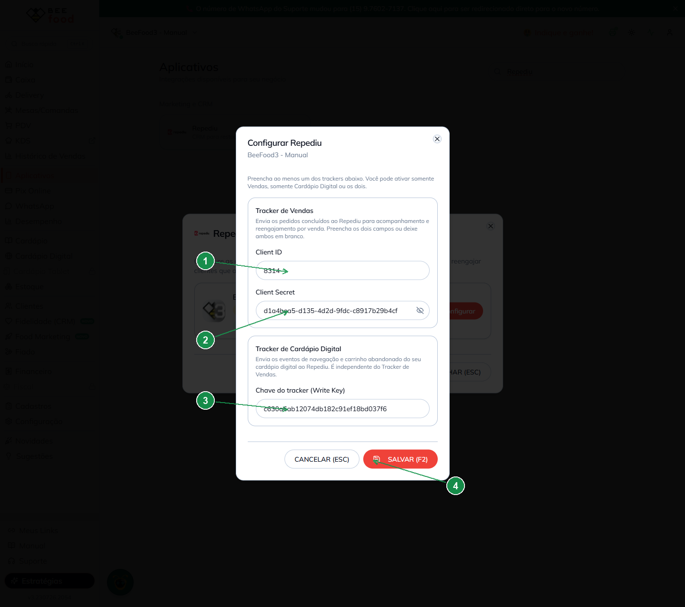
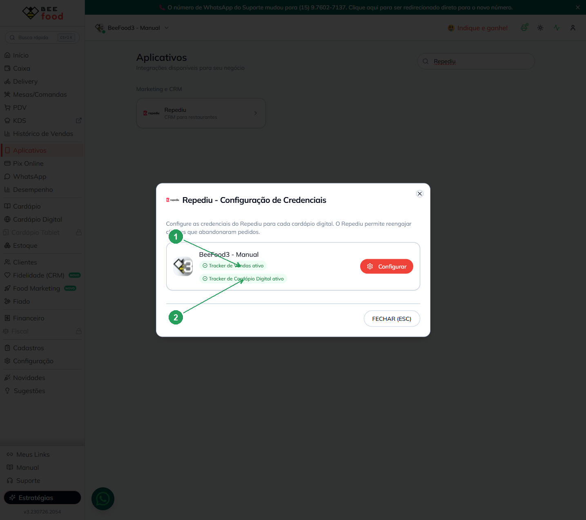

# Integração Repediu — sincronize vendas e rastreie o cardápio digital

Conecte sua operação **BeeFood** ao **Repediu** (CRM para restaurantes) e reengaje clientes: envie
as **vendas** e rastreie a **navegação e o carrinho abandonado** do seu cardápio digital.

São **duas configurações independentes**, cada uma com sua credencial gerada no painel do Repediu:

- **Tracker de Vendas** → precisa do **Client ID** e do **Client Secret**.
- **Tracker de Cardápio Digital** → precisa da **Chave de escrita (Write Key)**.

> As imagens têm **marcações em verde** (setas e números) indicando onde clicar ou o que copiar em cada tela.

---

## O que você ganha

- **Sincronização de vendas:** os pedidos concluídos vão ao Repediu para acompanhamento e reengajamento.
- **Rastreamento do cardápio digital:** eventos de navegação e carrinho abandonado enviados ao Repediu.
- **Configuração flexível:** ative **só Vendas**, **só Cardápio Digital** ou **os dois**.

---

## Antes de começar

1. **Conta BeeFood** ativa (com pelo menos um cardápio digital).
2. **Conta no Repediu** (`https://app.repediu.com.br`) com acesso às áreas de **Integrações** e **Web/App Analytics**.
3. Ter as credenciais em mãos — elas são geradas no próprio Repediu (Partes 1 e 2 abaixo).

---

## Parte 1 — Repediu: gerar as credenciais de Vendas

### Passo 1. Habilitar a integração BeeFood no Repediu

No menu lateral do Repediu, acesse **Integrações → Fontes de dados**. Localize o card **BeeFood** e
clique em **Habilitado** (1) para abrir o painel de credenciais.

### Passo 2. Copiar o Client ID e o Client Secret

No painel lateral que abre à direita, copie os dois valores:

| Nº | Campo no Repediu | O que é |
|----|------------------|---------|
| 1. | **Código da empresa (client_id)** \* | É o seu **Client ID** |
| 2. | **Chave da empresa (client_secret)** \* | É o seu **Client Secret** |

> Use o botão **Copiar** ao lado de cada campo. Guarde esses dois valores — eles serão colados no BeeFood.

---

## Parte 2 — Repediu: gerar a Chave do Cardápio Digital (Write Key)

### Passo 3. Habilitar o rastreamento do BeeFood

No menu lateral do Repediu, acesse **Web/App Analytics → Configuração**. No card **BeeFood**, clique em
**Habilitar** (1).

### Passo 4. Gerar a chave

No painel lateral **Rastreamento de eventos**, clique em **Gerar chave** (1).

### Passo 5. Copiar a Write Key

A chave é criada e o switch fica em **Ativo**. Copie o valor gerado:

| Nº | Campo no Repediu | O que é |
|----|------------------|---------|
| 1. | **Write key** \* | É a **Chave do tracker (Write Key)** |
| 2. | **Copiar** | Copia a chave para colar no BeeFood |

> **Atenção:** se você **redefinir** essa chave depois, a integração que usa a chave antiga para de
> enviar eventos. Só redefina quando for realmente necessário.

---

## Parte 3 — BeeFood: preencher e salvar as credenciais

### Passo 6. Abrir Aplicativos → Repediu

No BeeFood, clique em **Aplicativos** (1) no menu lateral e, na seção **Marketing e CRM**, abra o card
**Repediu** (2).

### Passo 7. Clicar em Configurar

Na janela **Repediu - Configuração de Credenciais**, veja o status de cada cardápio (1) e clique em
**Configurar** (2).

> O status mostra, para cada cardápio, se o **Tracker de Vendas** e o **Tracker de Cardápio Digital**
> estão **ativos** ou **inativos**.

### Passo 8. Entender o formulário

O formulário **Configurar Repediu** tem os dois trackers. Você pode preencher **um** ou **os dois**:

- **Tracker de Vendas** — preencha **os dois campos** (Client ID e Client Secret) ou deixe **ambos em branco**.
- **Tracker de Cardápio Digital** — informe a **Chave do tracker (Write Key)**. É independente do Tracker de Vendas.

### Passo 9. Preencher as credenciais e salvar

Cole os valores copiados do Repediu e clique em **SALVAR (F2)**:

| Nº | Campo no BeeFood | O que colar (do Repediu) |
|----|------------------|--------------------------|
| 1. | **Client ID** \* | Código da empresa (client_id) — Passo 2 |
| 2. | **Client Secret** \* | Chave da empresa (client_secret) — Passo 2 |
| 3. | **Chave do tracker (Write Key)** \* | Write key — Passo 5 |
| 4. | **SALVAR (F2)** | Salva a configuração |

> O ícone de **olho** ao lado do Client Secret permite mostrar/ocultar o valor digitado.

### Passo 10. Confirmar que está ativo

Após salvar, o status do cardápio passa a exibir **Tracker de Vendas ativo** (1) e **Tracker de Cardápio
Digital ativo** (2).

---

## Como funciona no dia a dia

1. O cliente navega no seu **cardápio digital** → o Repediu recebe os eventos (via **Write Key**).
2. O pedido é concluído no BeeFood → a **venda** é enviada ao Repediu (via **Client ID/Secret**).
3. O Repediu usa esses dados para **reengajar** clientes (ex.: quem abandonou o carrinho).

---

## Problemas comuns

| Sintoma | O que verificar |
|---------|-----------------|
| Não consigo salvar o Tracker de Vendas | Preencha **os dois** campos (Client ID **e** Client Secret) ou deixe ambos em branco |
| Cardápio digital não rastreia | A **Write Key** foi colada corretamente? No Repediu, o switch está **Ativo**? |
| Parou de enviar eventos de repente | A chave foi **redefinida** no Repediu? Gere e cole a nova Write Key no BeeFood |
| Status continua **inativo** | Confira se salvou (SALVAR/F2) e reabra a janela para atualizar o status |

---

## Precisa de ajuda?

Fale com o **suporte BeeFood** informando: nome da loja e **CNPJ**, qual **cardápio digital** está
configurando e um print da tela de configuração (sem expor credenciais em canais públicos).

---

*Última atualização: julho/2026 — BeeFood · integração Repediu*
