# Configurar Uber Direct no BeeFood

Siga este passo a passo para criar sua conta na Uber, cadastrar o cartão de pagamento e conectar o Uber Direct ao seu restaurante no BeeFood.

Configure sua conta Uber Direct, cadastre o método de pagamento e vincule a integração ao BeeFood para solicitar entregas com a rede de entregadores da Uber.

O Uber Direct permite que seu estabelecimento contrate entregas sob demanda diretamente pelo BeeFood, utilizando a mesma infraestrutura de entregadores da Uber.

> **Por onde começar:** o cadastro é feito no site da Uber, em **[https://direct.uber.com/accounts](https://direct.uber.com/accounts)**. Ao final você voltará ao BeeFood, em **Aplicativos → Entregas → Uber Direct**, para colar as credenciais.

Esse recurso é indicado para restaurantes que desejam contratar entregas diretamente com a Uber, mantendo controle sobre pagamentos e contrato, sem depender de cobrança centralizada por um parceiro.

Antes de começar a chamar entregadores, você vai precisar: **(1)** entrar na Uber, **(2)** cadastrar o restaurante no Uber Direct, **(3)** cadastrar um cartão para pagar as entregas, **(4)** fazer uma configuração rápida no site da Uber para o BeeFood receber as atualizações das entregas e **(5)** colar os dados da sua conta no BeeFood. Fique tranquilo(a) pois, neste guia, iremos te ensinar a fazer todo o processo necessário.

## Antes de começar

Separe estas informações antes de iniciar:

- **Telefone ou e-mail** do responsável pelo restaurante.
- **Nome fantasia** do restaurante.
- **CNPJ** do restaurante.
- **Endereço completo** de onde o entregador vai buscar os pedidos (cozinha ou balcão).
- **Cartão de crédito ou débito** para pagar as entregas.

## Passo a passo

### 1. Acesse o site do Uber Direct e entre na sua conta Uber

Abra o navegador e acesse **[https://direct.uber.com/accounts](https://direct.uber.com/accounts)**.

Na tela da Uber, informe seu **telefone** ou **e-mail** e clique em **Continuar**. Se ainda não tiver conta, a Uber vai guiar o cadastro; se já tiver, use o mesmo telefone ou e-mail de sempre.

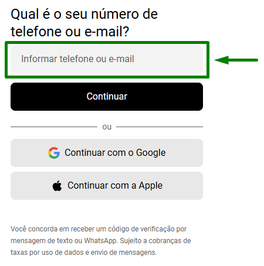

A Uber enviará um código de verificação para confirmar o contato informado.

### 2. Confirme o código e a senha da conta Uber

Digite o **código de 4 dígitos** que você recebeu e clique em **Avançar**.

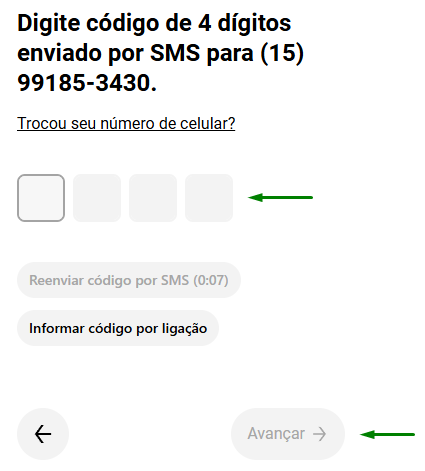

Em seguida, crie uma **senha** para a conta Uber (primeiro acesso) ou informe a senha existente e clique em **Avançar**.

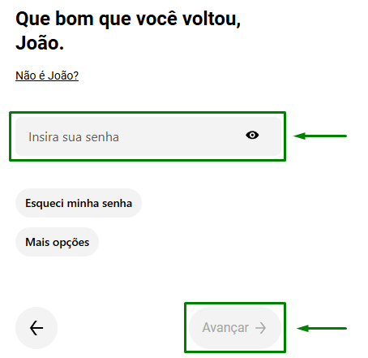

Concluída esta etapa, você estará autenticado na **conta Uber**. O próximo passo é cadastrar a **conta Uber Direct** do restaurante.

### 3. Cadastre o restaurante no Uber Direct

Preencha o formulário **Crie sua conta** com os dados da loja:

- **E-mail:** e-mail de acesso do estabelecimento.
- **Nome da empresa:** nome do restaurante, como *Pizzaria Centro*.
- **Tipo de empresa:** escolha a opção que combina com o seu negócio — por exemplo, *Restaurante*.
- **Endereço:** endereço real de onde o entregador busca os pedidos. Use o da cozinha ou do balcão — um endereço errado pode atrapalhar a entrega.
- **CNPJ:** CNPJ do estabelecimento, como solicitado no campo.

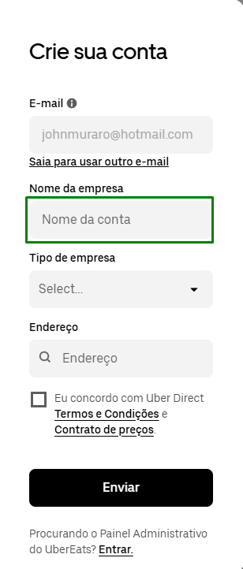

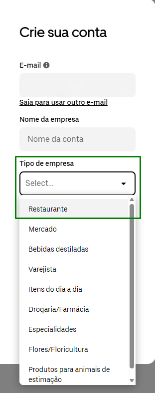

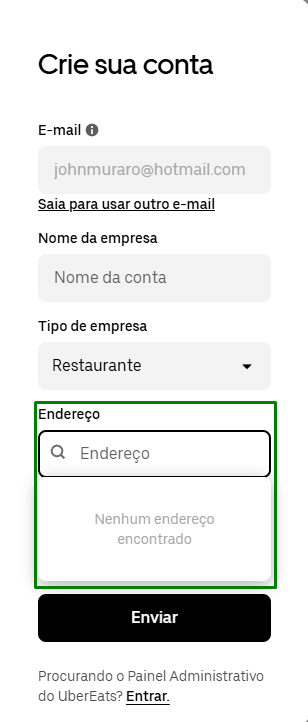

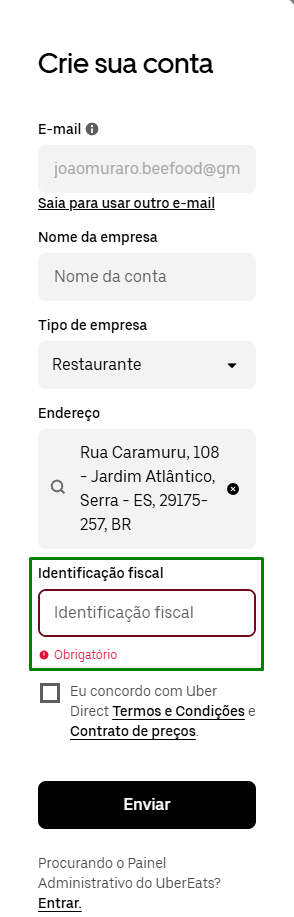

### 4. Aceite os termos e finalize o cadastro Uber Direct

Marque a caixa para concordar com os **Termos e Condições** e o **Contrato de preços** e clique em **Enviar**.

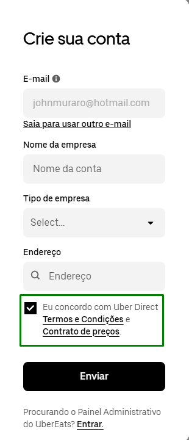

Com o cadastro concluído, você entra no painel do Uber Direct. Antes de chamar entregadores, cadastre um cartão para pagamento.

### 5. Configure o pagamento

No menu lateral do painel Uber Direct, dentro de **Gerenciamento**, clique em **Pagamento**.

Sem cartão cadastrado, não é possível solicitar entregas.

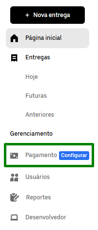

Na tela **Configurar o pagamento**, clique no botão **Configurar o pagamento**.

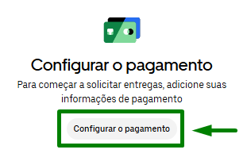

A Uber vai pedir os dados do cartão que será usado para cobrar as entregas.

### 6. Cadastre o cartão de pagamento

Preencha os dados do cartão:

- **Número do cartão**
- **Data de validade** (mês e ano)
- **Código de segurança** (os 3 dígitos no verso)
- **País**
- **Nome de apresentação** (opcional): um nome para você identificar o cartão, como *Cartão da loja*

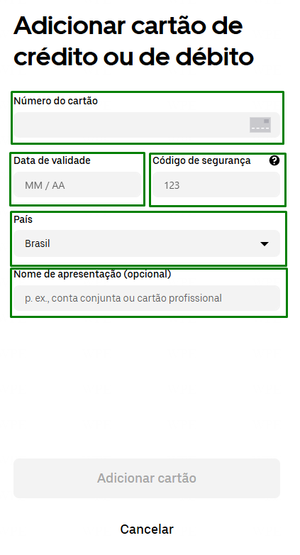

Revise e clique em **Adicionar cartão**.

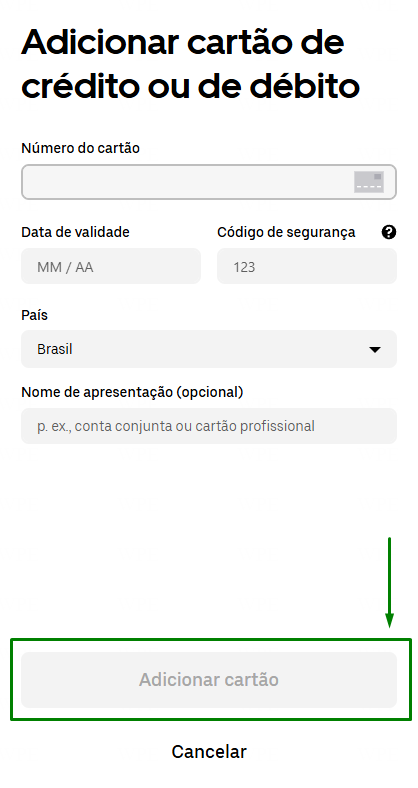

Se tudo der certo, o cartão aparecerá em **Gerenciamento → Pagamento**. A Uber cobrará as entregas diretamente nesse cartão.

### 7. Configure as notificações de entrega

Essa etapa permite que o BeeFood saiba quando o entregador saiu, está a caminho ou já entregou o pedido.

No menu lateral do painel Uber Direct, clique em **Desenvolvedor**.

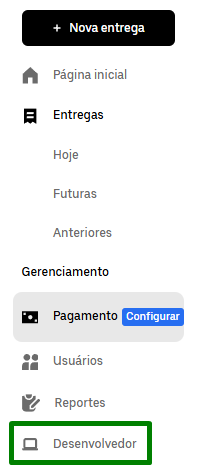

Abra a aba **Webhooks**.

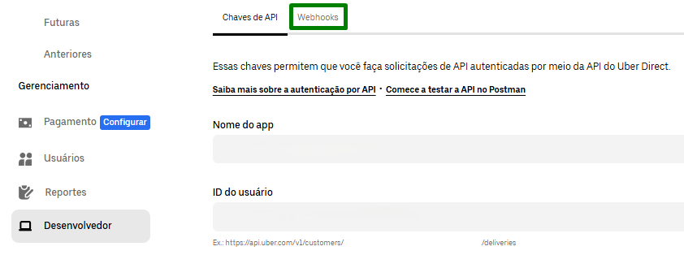

Clique em **+ Criar webhook**.

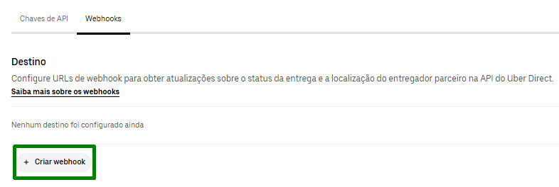

Na janela **Crie um endpoint**, preencha o campo **URL do Webhook** com exatamente o link abaixo e marque o evento **event.delivery_status**, conforme a imagem.

`https://entregas.beefoodapi.be/api/uberDirect/webhook`

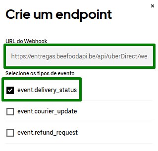

Revise e clique em **Salvar**.

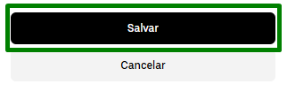

### 8. Copie os dados da sua conta

Ainda em **Desenvolvedor**, abra a aba **Chaves de API**.

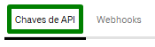

Ao lado de cada informação, clique no botão **Copiar** para guardar estes três valores — você vai colá-los no BeeFood na próxima etapa:

- **ID do usuário** → corresponde ao **Customer ID** no BeeFood.
- **ID de cliente do desenvolvedor** → corresponde ao **Client ID** no BeeFood.
- **Client Secret** → corresponde ao **Client Secret** no BeeFood (clique em *Mostrar* antes de copiar, se necessário).

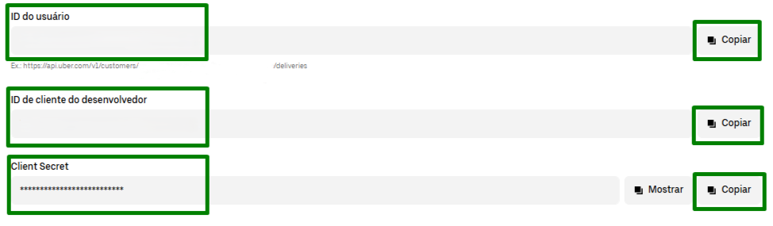

### 9. Cole os dados no BeeFood

Agora volte ao BeeFood. No menu lateral, clique em **Aplicativos**.

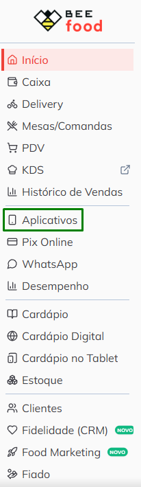

Na seção **Entregas**, selecione **Uber Direct** e preencha os três campos com os valores que você copiou:

- **Customer ID** — cole o **ID do usuário**.
- **Client ID** — cole o **ID de cliente do desenvolvedor**.
- **Client Secret** — cole o **Client Secret**.

Clique em **Salvar**.

## Pronto! O que você pode fazer agora

Com tudo configurado, seu restaurante pode:

- **Chamar entregadores** da Uber pelos pedidos do BeeFood.
- **Acompanhar** onde está o entregador e o status da entrega.
- **Cancelar** uma entrega em andamento, quando necessário.

O pagamento das corridas é feito pela Uber direto no cartão que você cadastrou. O BeeFood não cobra as entregas em seu lugar.

**Resumo do que você fez**

1. Uber — acessou **direct.uber.com/accounts** e entrou ou criou sua **conta**
2. Uber Direct — cadastrou o **restaurante** (CNPJ, endereço, termos)
3. Uber Direct — cadastrou o **cartão** em Gerenciamento → Pagamento
4. Uber Direct — configurou as **notificações** em Desenvolvedor → Webhooks
5. Uber Direct — copiou os **dados da conta** em Desenvolvedor → Chaves de API
6. BeeFood — abriu **Aplicativos → Entregas → Uber Direct** e colou os dados

## Dicas importantes

> - Use **conta e cartão separados** para cada filial — não compartilhe entre lojas diferentes.
> - Mantenha o cartão sempre válido para não travar novas entregas.
> - Se trocar de cartão, atualize em **Gerenciamento → Pagamento** no site da Uber antes de pedir novas entregas.
> - Se o login não funcionar, verifique se o e-mail ou telefone já não está em uso em outra conta Uber.
> - Cadastre o **endereço real** de onde o entregador busca o pedido — endereço errado atrapalha a entrega.
