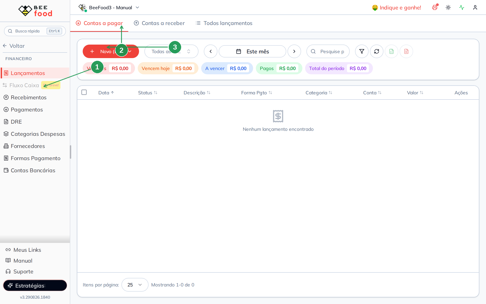
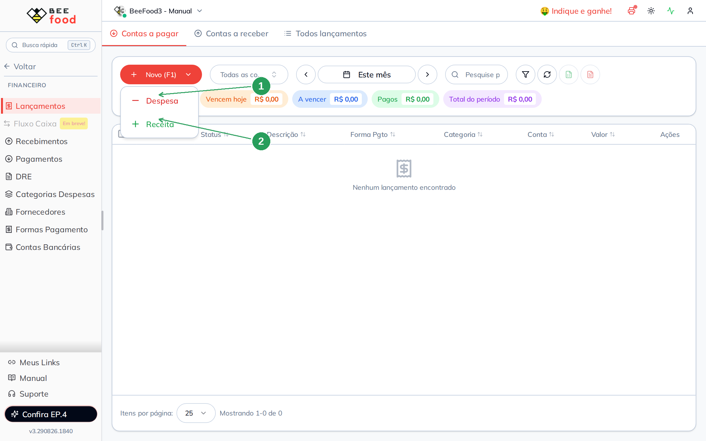
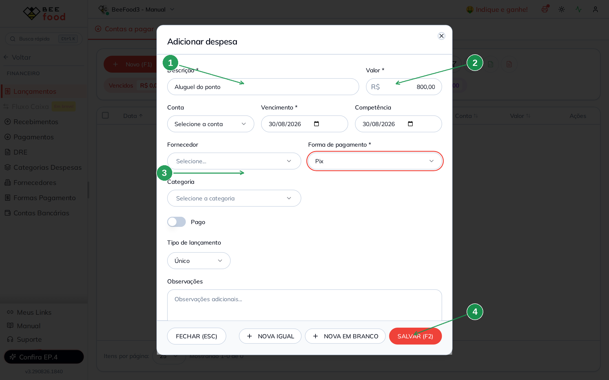
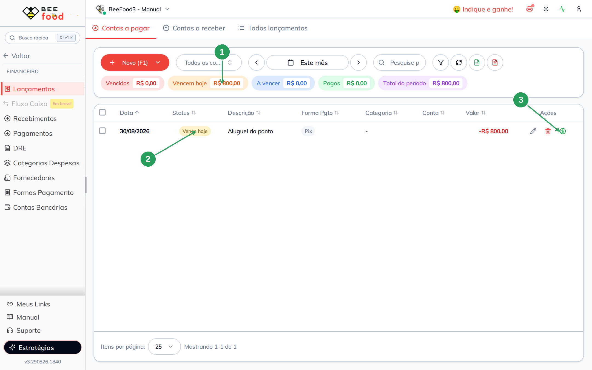
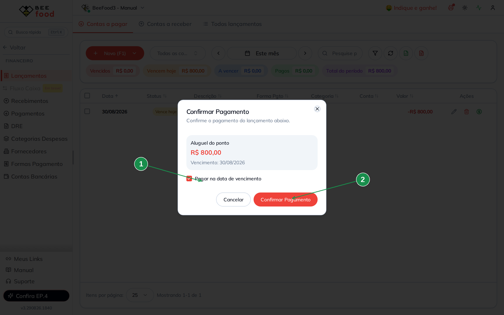
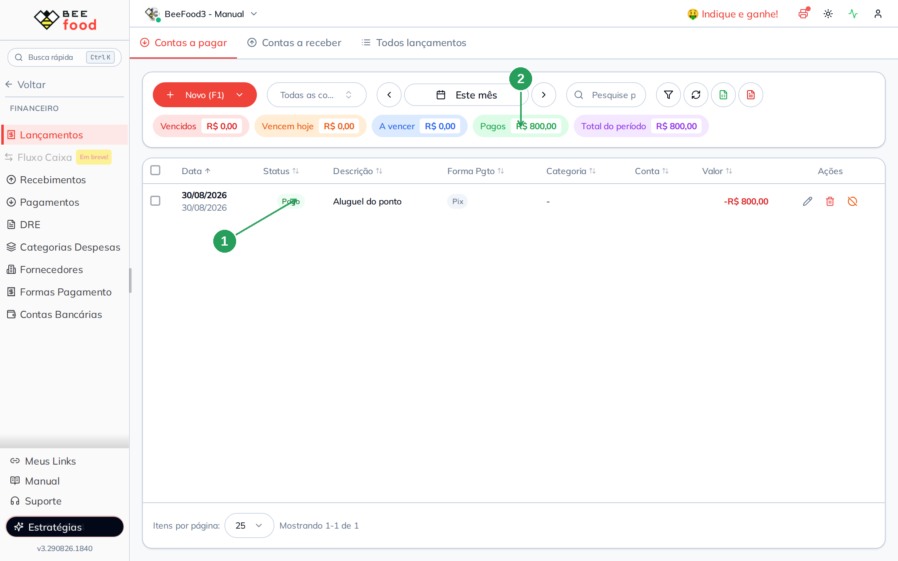
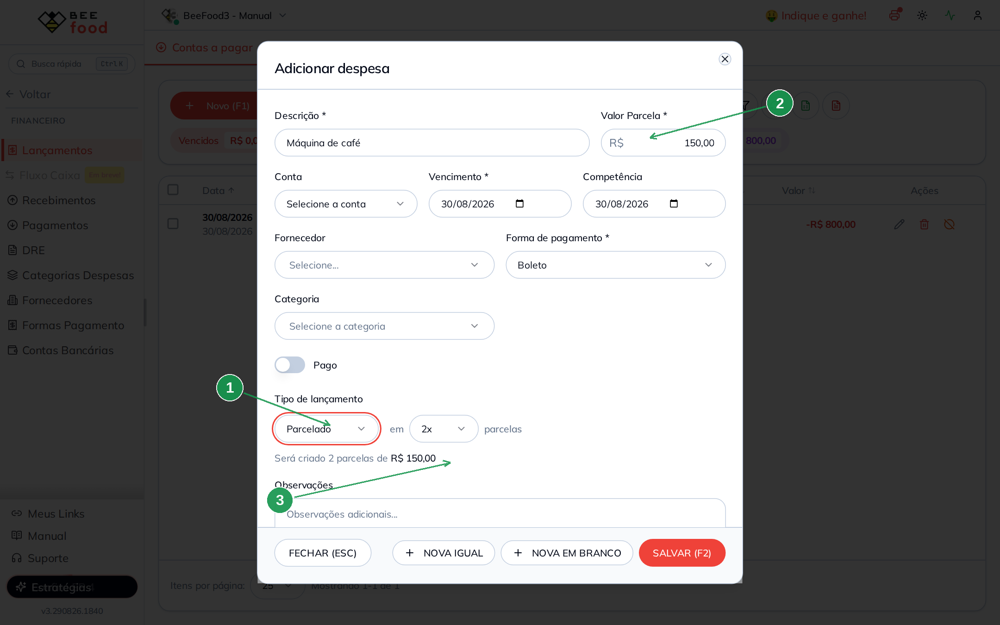
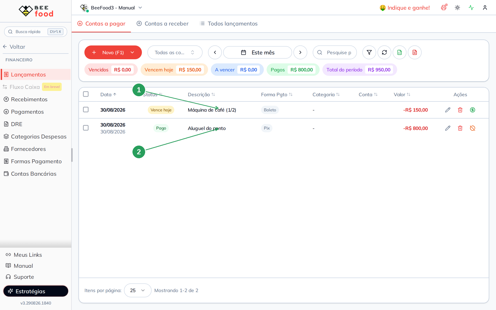

# Lançamentos — contas a pagar

A conta de **luz**, o **aluguel** e a **máquina parcelada** não nascem
de uma venda. Você lança à mão em **Financeiro → Lançamentos**.

Neste manual: achar a tela, criar uma **despesa única**, **marcar
como paga** e lançar um **parcelado**.

> As imagens têm **setas com números** (1, 2, 3…). No texto, cada número
> indica o campo ou botão correspondente na tela. Campos com **\*** são
> obrigatórios.

---

## Antes de começar

1. Menu **Financeiro → Lançamentos**.
2. A forma (Pix, Boleto, Dinheiro…) é a do **topo** de **Formas
   Pagamento** — a das contas, não a da venda no PDV.
3. **Conta** e **categoria** são opcionais. Sem conta bancária
   cadastrada, deixe o campo vazio.

---

## Parte 1 — Onde fica

No menu: **Financeiro → Lançamentos** (1). Três abas: **Contas a
pagar** (2) (despesa, valor em vermelho), **Contas a receber** e
**Todos lançamentos**. **+ Novo (F1)** (3) abre o cadastro.

O período padrão é **Este mês**. Os cards no topo somam o que venceu,
o que vence hoje, o que ainda vai vencer e o que já foi pago.

| Nº | Campo | O que faz |
|----|--------|-----------|
| 1. | **Lançamentos** | Dentro de Financeiro |
| 2. | **Contas a pagar** | Só despesas |
| 3. | **+ Novo (F1)** | Abre Despesa ou Receita |

---

## Parte 2 — Nova despesa

Clique em **+ Novo (F1)**. Escolha **Despesa** (1). **Receita** (2)
fica no manual de contas a receber.

| Nº | Campo | O que faz |
|----|--------|-----------|
| 1. | **Despesa** | Conta a pagar |
| 2. | **Receita** | Conta a receber (outro manual) |

No modal, o obrigatório é pouco:

- **Descrição \*** (1) — o que é. Ex.: **Aluguel do ponto**
- **Valor \*** (2) — **R$ 800,00**
- **Vencimento \*** — o dia de pagar (já vem hoje)
- **Forma de pagamento \*** (3) — **Pix**
- **Tipo de lançamento** — **Único**
- **SALVAR (F2)** (4)

**Conta**, **fornecedor**, **categoria** e **observações** podem
ficar vazios. O switch **Pago** fica desligado se a conta ainda
não foi quitada.

| Nº | Campo | O que faz |
|----|--------|-----------|
| 1. | **Descrição \*** | Nome da conta |
| 2. | **Valor \*** | Quanto vai sair |
| 3. | **Forma de pagamento \*** | Pix, Boleto, Dinheiro… |
| 4. | **SALVAR (F2)** | Grava. Fechar descarta |

**NOVA IGUAL** salva e abre outra com os mesmos dados.
**NOVA EM BRANCO** salva e abre vazia.

---

## Parte 3 — Marcar como paga

Depois de salvar, a linha entra em **Vencem hoje** (1) (ou **A
vencer**, se a data for outra). Status **Vence hoje** (2). O
**cifrão verde** (3) registra o pagamento.

| Nº | Campo | O que mostra |
|----|--------|--------------|
| 1. | **Vencem hoje** | Soma do dia (R$ 800,00) |
| 2. | **Status** | Ainda não paga |
| 3. | **Cifrão** | Confirma o pagamento |

O sistema pergunta se paga na data de vencimento (1). **Confirmar
Pagamento** (2) quita. A data pode ser outra, se você desmarcar
a opção.

| Nº | Campo | O que faz |
|----|--------|-----------|
| 1. | **Pagar na data de vencimento** | Usa o vencimento como data do pagamento |
| 2. | **Confirmar Pagamento** | Marca como paga |

A linha vira **Pago** (1). O card **Pagos** (2) passa a ter o
valor. O lápis edita; o ícone laranja desfaz o pagamento.

| Nº | Campo | O que mostra |
|----|--------|--------------|
| 1. | **Pago** | Status depois de confirmar |
| 2. | **Pagos** | Soma das despesas já quitadas |

Dá para marcar **Pago** já no cadastro (switch no modal). Aí
aparecem data, encargos, desconto e valor pago.

---

## Parte 4 — Despesa parcelada

No mesmo **+ Novo → Despesa**, mude o tipo para **Parcelado**
(1) e escolha **2x**. O campo vira **Valor Parcela \*** (2).
O texto avisa: **Será criado 2 parcelas de R$ 150,00** (3).

A primeira parcela vence no dia do vencimento. A seguinte, no
mês de depois.

| Nº | Campo | O que faz |
|----|--------|-----------|
| 1. | **Parcelado** | Cria várias linhas |
| 2. | **Valor Parcela \*** | Valor de **cada** parcela |
| 3. | **Aviso** | Quantas parcelas e de quanto |

No mês atual aparece a **1/2** (1). A **2/2** cai no mês
seguinte — mude o período do filtro para vê-la. O aluguel pago
continua na lista (2).

| Nº | Campo | O que mostra |
|----|--------|--------------|
| 1. | **Máquina de café (1/2)** | Primeira parcela, ainda em aberto |
| 2. | **Aluguel do ponto** | A despesa única, já paga |

---

## O que esta tela não é

- **Venda no PDV:** o pagamento do cliente vira conta a **receber**,
  sozinho. Veja o manual de contas a receber.
- **Desconto do cardápio** e **taxa da maquininha:** outras telas
  (#64 e #65).
- **Recebimentos / Pagamentos / DRE:** telas vizinhas, agregam o
  que já foi lançado. Não é aqui que se cria a despesa.
