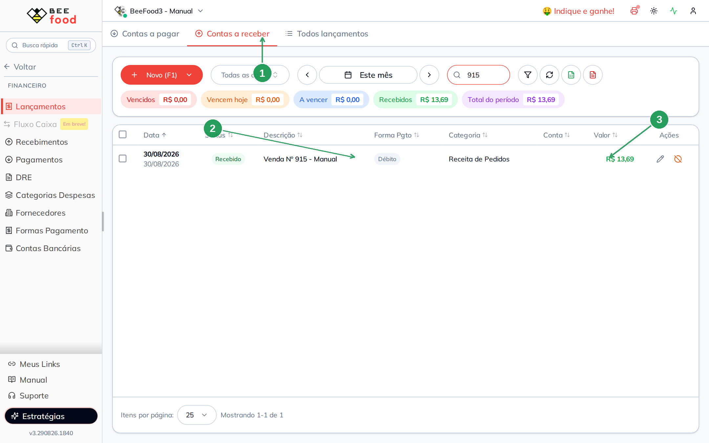
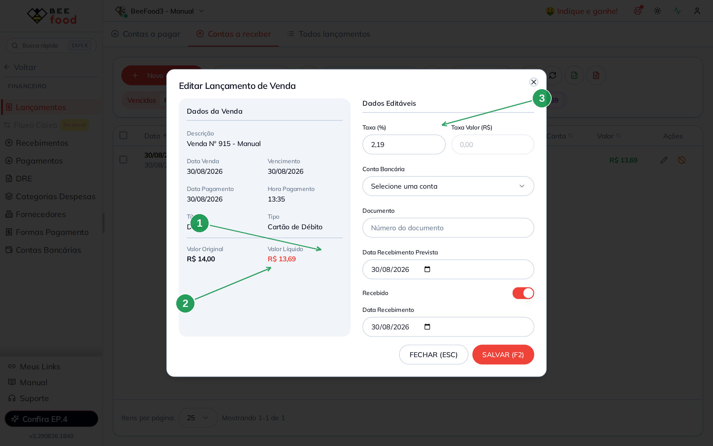
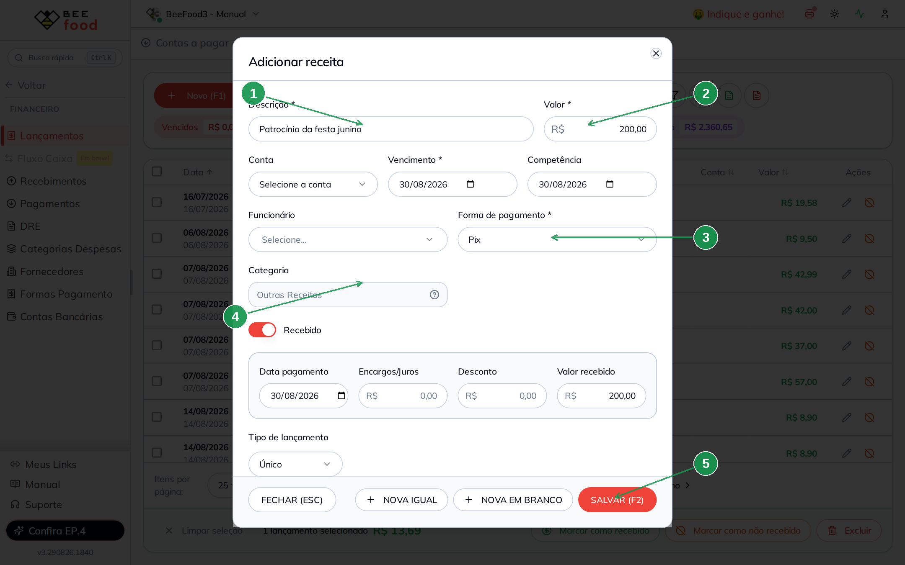
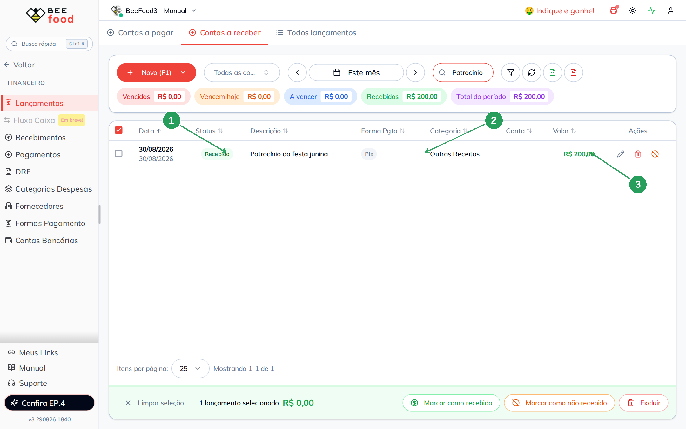
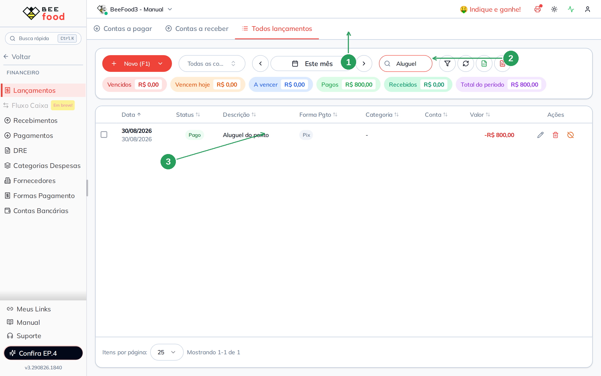

# Lançamentos — contas a receber

Quando a venda é **paga no PDV**, o sistema já cria a conta a receber.
Você não lança de novo. O valor que aparece aqui é o **líquido** — o
que sobra depois da taxa da forma de pagamento (#65).

Neste manual: o receber que veio da venda, uma **receita extra**
lançada na mão e a aba **Todos lançamentos**.

> As imagens têm **setas com números** (1, 2, 3…). No texto, cada número
> indica o campo ou botão correspondente na tela. Campos com **\*** são
> obrigatórios.

---

## Antes de começar

1. Menu **Financeiro → Lançamentos**, aba **Contas a receber**.
2. A forma da receita extra (Pix, Boleto, Dinheiro…) é a do **topo**
   de **Formas Pagamento** — a das contas, não a da venda no PDV.
3. **Conta** é opcional. Sem conta bancária cadastrada, deixe vazia.

---

## Parte 1 — O receber que veio da venda

Abra **Financeiro → Lançamentos** e clique na aba **Contas a
receber** (1). Cada venda paga no PDV vira uma linha. A descrição
costuma ser **Venda Nº …** (2). A categoria é **Receita de Pedidos**.
O valor (3) é o **líquido** daquela forma.

Neste exemplo a busca está em `915`: a venda #915, Débito Visa,
já está **Recebido**.

| Nº | Campo | O que mostra |
|----|--------|--------------|
| 1. | **Contas a receber** | Só o que entra |
| 2. | **Venda Nº 915 - Manual** | Veio do PDV, sozinha |
| 3. | **R$ 13,69** | Líquido depois da taxa 2,19% |

Clique no **lápis** da linha (não no checkbox). Abre o detalhe da
venda.

No PDV o cliente pagou **R$ 14,00** (1). A taxa da Visa é **2,19%**
(3) (#65). O receber fica **R$ 13,69** (2).

| Nº | Campo | O que mostra |
|----|--------|--------------|
| 1. | **Valor original** | O que o cliente pagou no PDV |
| 2. | **Valor líquido** | O que entra depois da taxa |
| 3. | **Taxa (%)** | A taxa da forma / bandeira (#65) |

O sistema já considera essa linha **recebida** — a venda foi paga
no caixa. Você não confirma de novo.

Não pague de novo uma venda que já está no receber. E não use as
formas do **topo** da tela Formas Pagamento (Dinheiro, Boleto,
Pix…) para receber venda. Venda usa as formas de **baixo**.

---

## Parte 2 — Receita extra (não é venda)

Patrocínio, aluguel de espaço, reembolso: isso **não** passa pelo
PDV. Você lança na mão.

1. **+ Novo (F1)** → **Receita**.
2. **Descrição \*** (1) — `Patrocínio da festa junina`
3. **Valor \*** (2) — `200`
4. Vencimento: hoje
5. **Forma de pagamento \*** (3) — **Pix**
6. **Categoria** (4) — o sistema já coloca **Outras Receitas**.
   Não muda.
7. Conta: deixe vazia se não cadastrou banco.
8. Ligue **Recebido** se o dinheiro já entrou (aparecem data,
   encargos, desconto e valor recebido).
9. **SALVAR (F2)** (5)

| Nº | Campo | O que faz |
|----|--------|-----------|
| 1. | **Descrição \*** | Nome da receita |
| 2. | **Valor \*** | Quanto entra |
| 3. | **Forma de pagamento \*** | Pix, Boleto, Dinheiro… |
| 4. | **Categoria** | Sempre **Outras Receitas** |
| 5. | **SALVAR (F2)** | Grava. Fechar descarta |

A linha entra em Contas a receber como **Recebido** (1). A
categoria é **Outras Receitas** (2). O valor (3) fica em verde.

| Nº | Campo | O que mostra |
|----|--------|--------------|
| 1. | **Recebido** | Já entrou (switch no cadastro ou cifrão depois) |
| 2. | **Outras Receitas** | Receita que não veio de venda |
| 3. | **R$ 200,00** | Valor da receita extra |

---

## Parte 3 — Todos os lançamentos

A terceira aba (1) junta pagar e receber. Use quando quiser ver o
mês inteiro sem trocar de aba.

O campo de busca (2) filtra pela descrição. Digite `Aluguel` e
aparece só a despesa do manual de contas a pagar (3).

| Nº | Campo | O que faz |
|----|--------|-----------|
| 1. | **Todos lançamentos** | Pagar e receber juntos |
| 2. | **Busca** | Filtra pela descrição |
| 3. | **Aluguel do ponto** | A despesa do outro manual, já paga |

---

## O que esta tela não é

- **Relatório Recebimentos / Pagamentos:** totais do dia — manuais
  seguintes. Aqui você lança e quita a linha.
- **DRE** e cadastros (banco, fornecedor, funcionário, categoria).
- **Taxa da forma de pagamento:** isso é o #65. Aqui você só vê o
  efeito: o receber da venda nasce no líquido.
