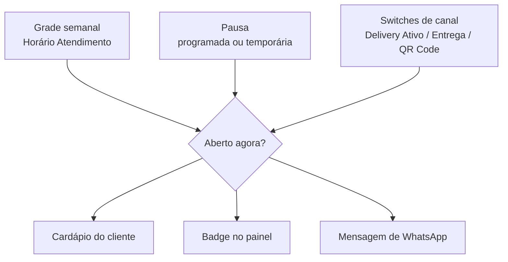

# Fluxo de código — Fechar a loja fora do horário

> Mapeamento técnico do que o manual **#33 Fechar a loja fora do horário** documenta.
> Fonte: `beefood-web-react`, somente leitura. Levantado em 21/08/2026, versão
> **v3.200826.2051** em produção.
> A grade semanal está em `manuais/horario-atendimento/fluxo-codigo.md`.

---

## 1. Três mecanismos, um resultado

O backend decide se a loja está aberta combinando **três coisas independentes**:

Qualquer um dos três fecha a loja sozinho. É por isso que "pausei e continua aberto" quase
sempre é o canal errado, e "a pausa acabou e não abriu" quase sempre é a grade.

---

## 2. Pausa: uma API, duas telas

| Tela | Arquivo |
|------|---------|
| Aba **Pausa Programada** | `src/components/cardapio-digital/PausaProgramadaTab.tsx` |
| Modal de criação | `src/components/cardapio-digital/ModalAdicionarPausa.tsx` |
| Atalho no topo (**Pausa Temporária**) | `src/components/cardapio-digital/HeaderCardapiosPopover.tsx` |

As duas gravam no mesmo lugar:

| Operação | Método | Path |
|----------|--------|------|
| Listar | GET | `/api/empresaDelivery2/cardapioDigital/pausa/{empresaID}/{filialID}/{usuarioID}` |
| Criar / atualizar | POST | `/api/empresaDelivery2/cardapioDigital/pausa` (body com `pausas[]`) |

### Colunas da aba

`Ativo` · `Delivery` · `Presencial` · `Período` · `Motivo` · `Cardápios` · `Criado por`

Estado vazio: *"Nenhuma pausa programada encontrada"*.

### Campos do modal

| Campo | Tipo | Default |
|-------|------|---------|
| **15 MINUTOS**, **30 MINUTOS**, **45 MINUTOS**, **1 HORA**, **2 HORAS** | presets | — |
| **HOJE**, **AMANHÃ** | presets de dia inteiro | — |
| **Início** / **Fim** | `date` + `time` | vazio |
| **Delivery/Retirada** | switch Sim/Não | **Sim** |
| **Presencial** | switch Sim/Não | **Sim** |
| **Motivo** | texto | vazio |
| **Aplicar para todos os cardápios** | checkbox (só com 2+ filiais) | desmarcado |
| **CANCELAR (ESC)** / **CONFIRMAR PAUSA (F2)** | botões | — |

Confirmação: diálogo **Confirmar pausa programada** com duração, início e fim, e os botões
**CANCELAR (ESC)** / **CONFIRMAR (ENTER)**.

Validações:

| Mensagem |
|----------|
| `Informe data/hora de início e fim da pausa` |
| `A data/hora de fim deve ser maior que a de início` |
| `Informe início e fim válidos para calcular a duração` |
| `Pausa programada adicionada com sucesso` / `Erro ao adicionar pausa programada` |

### O atalho do topo

Submenu **Pausa Temporária**, dentro do popover **Cardápios Digitais**:

| Opção | Efeito |
|-------|--------|
| **Pausas ativas · N** | lista as pausas vigentes |
| **Pausar por 15 / 30 / 45 minutos** | cada linha mostra o horário-alvo (*até 22:17*) |
| **Pausar por hoje** | até **amanhã às 05:00** |

A pausa rápida grava `motivo: "Pausa temporária"` e **delivery = presencial = true** — fecha os
dois canais. Para escolher canal, é preciso usar o modal da aba.

Mensagem depois de criar: *"Pausa criada com sucesso. A atualização pode levar até 1 minuto para
refletir."*

---

## 3. Switches de canal

Dois lugares, mesma API:

| Onde | Arquivo |
|------|---------|
| Cardápio Digital → **Configurações** | `src/components/cardapio-digital/ConfiguracoesTab.tsx` |
| Popover do topo | `src/components/cardapio-digital/HeaderCardapiosPopover.tsx` |

| Rótulo | Campo | Efeito |
|--------|-------|--------|
| **Delivery Ativo** / **Delivery Inativo** | `abertoDelivery` | liga/desliga o delivery inteiro |
| **Entrega** | `entrega` | tipo dentro do delivery |
| **Retirada** | `retirada` | idem |
| **Consumo Local** / **Consumo no Local** | `consumoLocal` | idem |
| **Presencial Ativo** / **QR Code Presencial** | `qrCodePresencial` | liga/desliga o presencial |

No popover, cada switch traz o texto de ajuda *"Habilitado · Clique para desabilitar"* (ou o
inverso).

| Operação | Método | Path |
|----------|--------|------|
| Status por filial | GET | `/api/empresaDelivery2/cardapioDigital/status/{empresaID}/{usuarioID}` |
| Alterar | POST | `/api/empresaDelivery2/cardapioDigital/status` |
| Configurações gerais | POST | `/api/empresaDelivery2/cardapioDigital/configuracoes` |

**Não existe alerta no painel** avisando que um canal está desligado — só o badge no popover.
Daí a recomendação do manual de preferir pausa quando o fechamento é temporário.

---

## 4. Como o status "aberto agora" é calculado

O front **não calcula**: consome do backend.

| Fonte | O que traz |
|-------|-----------|
| `GET .../cabecalho/{empresaID}/{filialID}/{usuarioID}` | `deliveryAberto`, `presencialAberto`, `horarioAtendimentoAgora` (texto pronto) |
| `CardapiosStatusContext` | polling de **60 s** em `.../cardapioDigital/status/...` → `abertoDelivery`, `abertoPresencial` |

O badge do popover mostra o texto do backend. Com a pausa criada no sandbox, ele passou a exibir
**Fora do horário de atendimento** nos dois canais — foi assim que confirmamos o efeito.

O polling de 60 s explica o aviso de que a mudança leva até um minuto.

---

## 5. Agendamento com a loja fechada

Arquivo: `src/components/cardapio-digital/AgendamentoTab.tsx`.

| Switch | Descrição exata na tela |
|--------|-------------------------|
| **Agendamento** | *Aceita agendamento no cardápio digital delivery (Entrega / Retirada)* |
| **Agendamento com o Cardápio Digital fechado** | *Aceita agendamento mesmo com o cardápio digital fechado fora do horário de atendimento* |
| **Só aceita agendamento** | *Ative para permitir apenas pedidos agendados, desativando pedidos imediatos* |

O segundo depende do primeiro estar ligado. Aviso fixo no topo: *"O agendamento de pedidos é
válido somente para o Cardápio de Delivery (Entrega / Retirada)"*.

Campos de prazo (quando o agendamento está ligado), com as faixas aceitas:

| Campo | Faixa |
|-------|-------|
| Dias mínimo | 0 a 30 |
| Dias máximo | 1 a 60 |
| Iniciar depois de aberto / Finalizar antes de fechar | 0 a 720 min |
| Tempo mínimo para agendamento agora | 0 a 1440 min |
| Intervalo entre agendamentos | 1 a 240 min |
| Quantidade máxima de pedidos por intervalo | 1 a 999 |

Endpoints: `GET`/`POST /api/empresaDelivery2/cardapioDigital/agendamento`.

Há também um switch **Somente Agendamento** no cadastro do produto (`ModalEditarProduto.tsx`),
que faz o item aparecer só em pedido agendado.

---

## 6. Mensagem de loja fechada no WhatsApp

Arquivo: `src/components/whatsapp/LinhaLojaFechada.tsx`, em **WhatsApp → Respostas**.

Variáveis disponíveis: `**SAUDACAO**`, `**CLIENTE_NOME**`, `**MEU_NOME_FANTASIA**`,
`**MEU_HORARIO**` (*Horário de funcionamento*) e `**MEU_LINK**`.

Quando a filial aceita pedido agendado com a loja fechada, existe uma mensagem adicional
específica para isso.

---

## 7. O que foi alterado no sandbox

Para as capturas: uma pausa de **30 minutos** criada pelo preset (20/08/2026 21:58 → 22:28) e
depois **desativada** pelo switch. A pausa antiga de 16/07/2026 já existia e continua desligada.
Nenhum switch de canal foi mexido.
