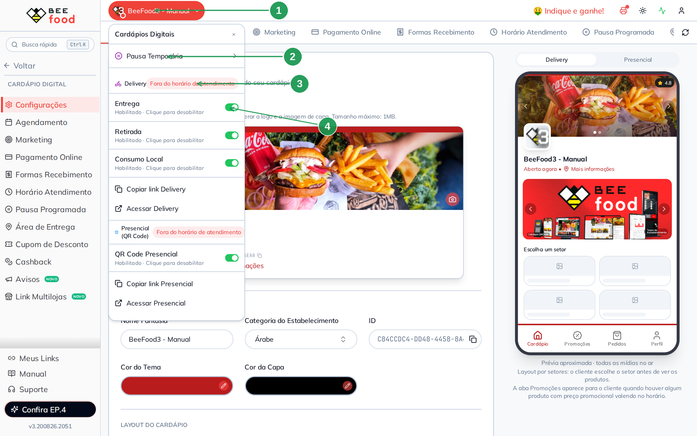
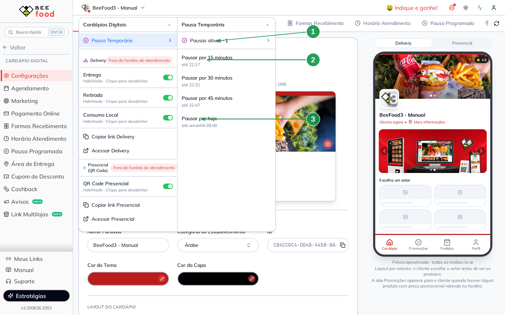
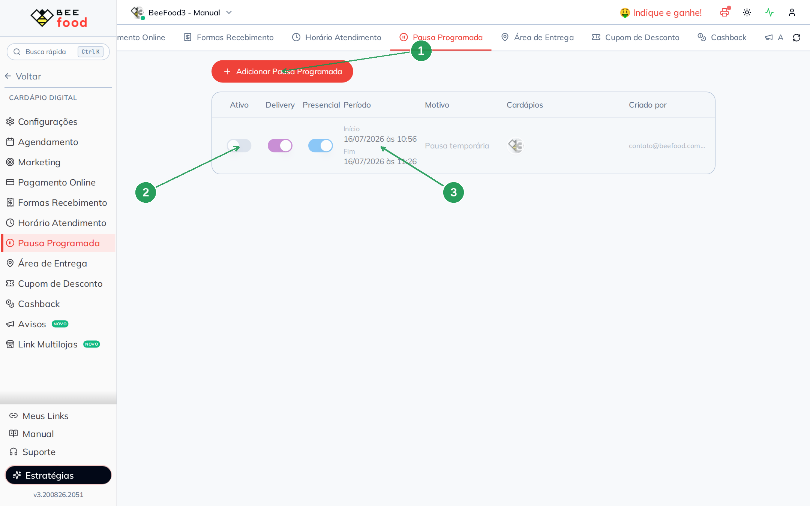
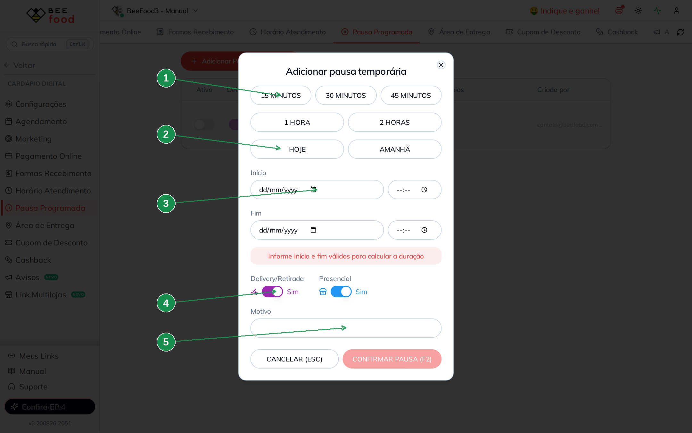
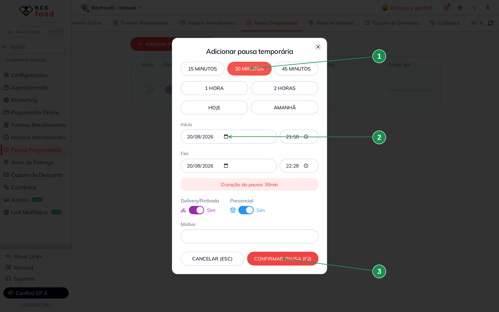
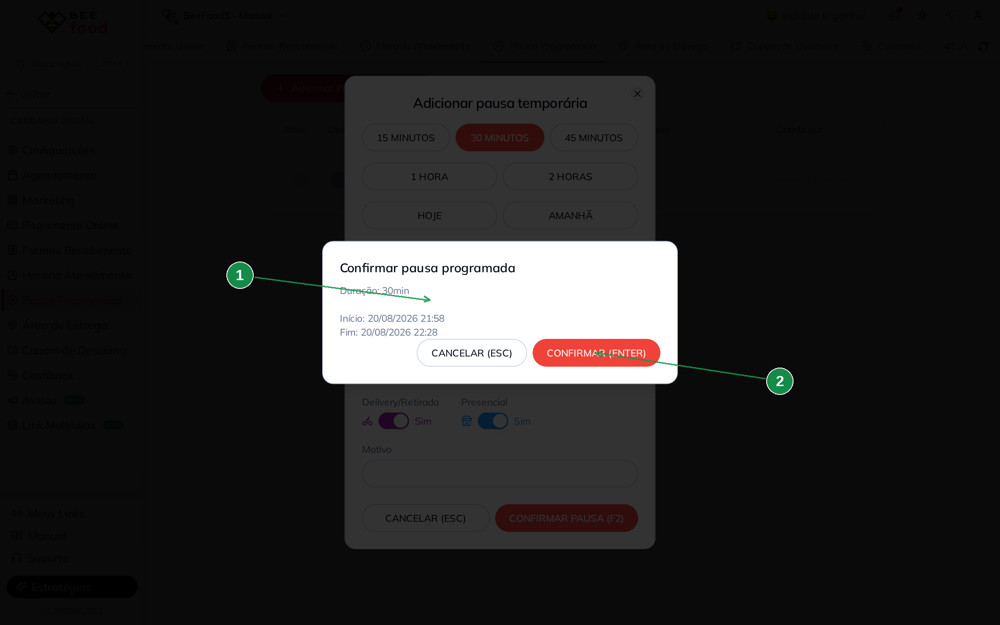
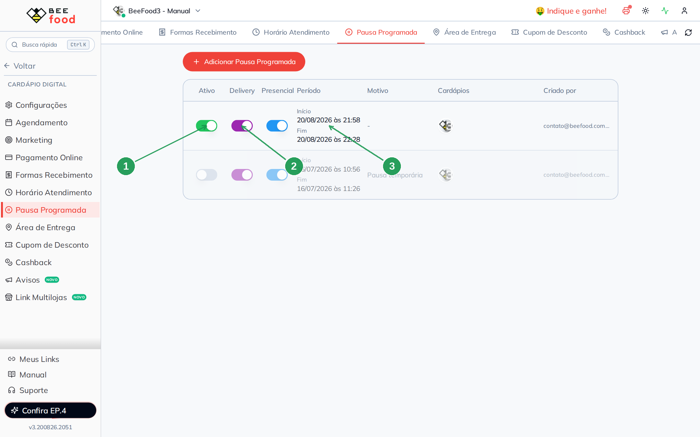
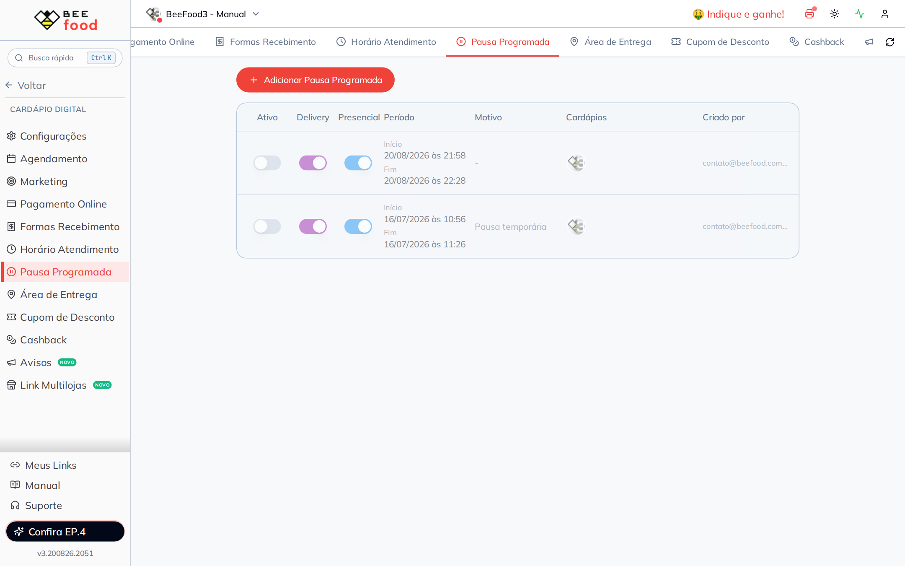
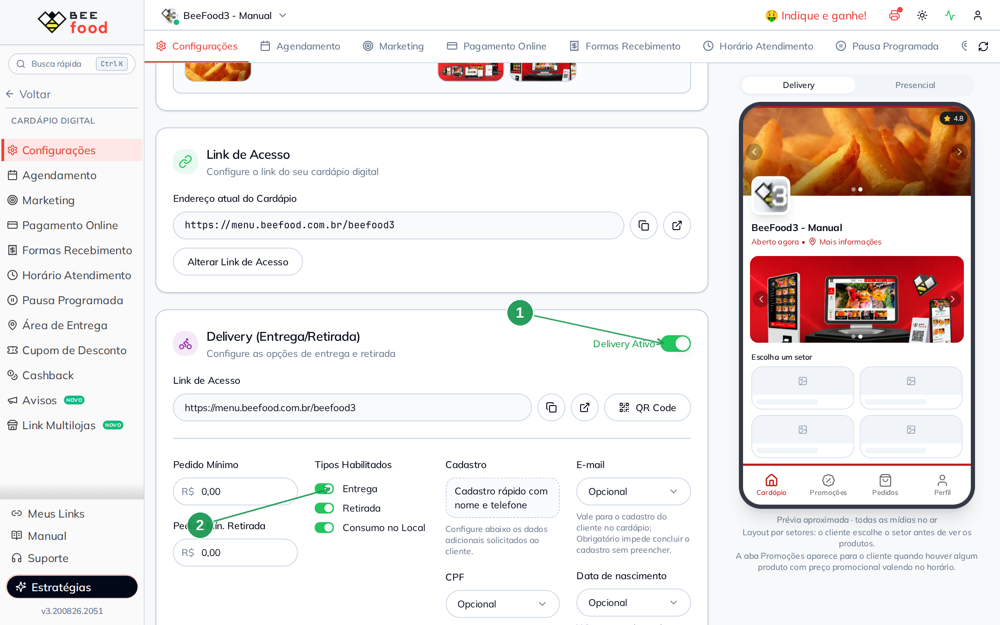
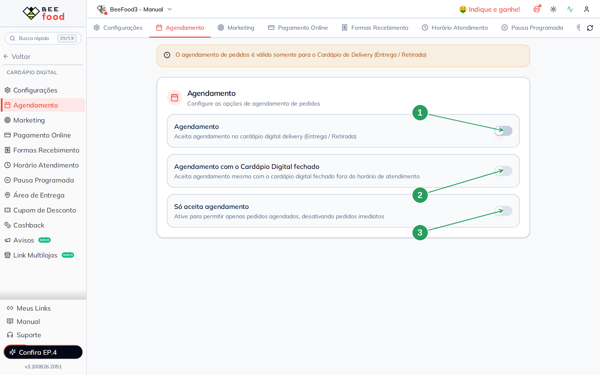

# Manual de Fechar a Loja Fora do Horário

Este manual ensina a **fechar a loja fora da grade semanal**: a cozinha atrasou e você precisa
parar de receber pedidos agora, vai emendar um feriado, ou quer desligar um canal por tempo
indeterminado.

> Para definir **que horas a loja abre e fecha** normalmente, veja o manual
> **Horário de atendimento** — é a grade da semana, e é outro caminho.

> As imagens têm **setas numeradas** (1, 2, 3…). Cada número indica o campo ou botão
> correspondente na tela.

---

## Os três jeitos de fechar (e quando usar cada um)

| Mecanismo | Onde fica | Duração | Serve para |
|-----------|-----------|---------|------------|
| **Pausa temporária** | Menu do cardápio, no topo | 15 min a "por hoje" | Fila cheia, cozinha atrasada, falta de entregador |
| **Pausa programada** | Cardápio Digital → Pausa Programada | Período com data e hora | Feriado, férias, manutenção, reforma |
| **Switch do canal** | Cardápio Digital → Configurações | Até alguém religar | Desligar entrega ou presencial por tempo indeterminado |

A diferença prática: as **pausas têm fim marcado** e a loja reabre sozinha; o **switch não tem
fim** e fica desligado até alguém lembrar de religar.

> ⚠️ **A atualização leva até um minuto** para chegar ao cliente. Não é instantâneo, e isso é
> normal.

---

## Parte 1 — Pausa temporária: o caminho mais rápido

É o atalho para quando o problema é agora. Clique no **nome do cardápio**, no topo do painel.

| Nº | Item | O que faz |
|----|------|-----------|
| 1 | **Nome do cardápio** | Abre este menu, de qualquer tela do sistema. |
| 2 | **Pausa Temporária** | As pausas rápidas. Ver abaixo. |
| 3 | **Status do canal** | Diz como o canal está **agora**: *Fora do horário de atendimento*, quando fechado. É por aqui que você confere se a loja está aberta. |
| 4 | **Switches de canal** | **Entrega**, **Retirada** e **Consumo Local**, cada um com *Habilitado · Clique para desabilitar*. Explicados na Parte 3. |

Clique em **Pausa Temporária**:

| Nº | Item | O que faz |
|----|------|-----------|
| 1 | **Pausas ativas · N** | Quantas pausas estão valendo. Clique para ver a lista. |
| 2 | **Pausar por 15 / 30 / 45 minutos** | Cada opção mostra **até que hora** vai (*até 22:17*). Um clique e está feito. |
| 3 | **Pausar por hoje** | Fecha até **amanhã às 05:00** — serve para encerrar o dia mais cedo. |

> A pausa rápida fecha **os dois canais** (delivery e presencial) de uma vez. Para pausar só um,
> use a Pausa Programada da Parte 2, que tem switch por canal.

> **Não precisa desfazer nada.** No fim do tempo a loja reabre sozinha, respeitando a grade.

---

## Parte 2 — Pausa programada: feriado e período marcado

Quando você já sabe o dia e a hora, vá em **Cardápio Digital → Pausa Programada**.

| Nº | Item | O que faz |
|----|------|-----------|
| 1 | **Adicionar Pausa Programada** | Cria uma pausa nova. |
| 2 | **Ativo** | Liga e desliga a pausa. Pausas antigas ficam guardadas desligadas. |
| 3 | **Período** e **Motivo** | O que a pausa cobre e por quê. As colunas seguintes mostram os cardápios afetados e quem criou. |

Clique em **Adicionar Pausa Programada**:

| Nº | Campo | O que fazer |
|----|-------|-------------|
| 1 | **15 / 30 / 45 MINUTOS · 1 HORA · 2 HORAS** | Atalhos que preenchem início e fim contando de agora. |
| 2 | **HOJE** e **AMANHÃ** | Preenchem o dia inteiro. |
| 3 | **Início** e **Fim** | Data e hora, se você quiser escolher à mão. É o caminho para feriado. |
| 4 | **Delivery/Retirada** e **Presencial** | Quais canais a pausa fecha. Dá para fechar só um. |
| 5 | **Motivo** | Texto livre. Aparece na lista e ajuda a equipe a entender depois. |

### Usando um atalho

No exemplo, o preset de **30 MINUTOS**:

| Nº | Item | O que confere |
|----|------|---------------|
| 1 | **30 MINUTOS** | O preset fica destacado. |
| 2 | **Início e Fim** | Preenchidos sozinhos, de agora até 30 minutos à frente. Abaixo aparece a duração calculada. |
| 3 | **CONFIRMAR PAUSA (F2)** | Segue para a confirmação. |

| Nº | Item | O que confere |
|----|------|---------------|
| 1 | **Duração, início e fim** | Última chance de conferir antes de fechar a loja. |
| 2 | **CONFIRMAR (ENTER)** | Cria a pausa. |

### A pausa valendo

| Nº | Item | O que confere |
|----|------|---------------|
| 1 | **Ativo ligado** | A pausa está valendo agora. |
| 2 | **Delivery e Presencial** | Os dois canais fechados nesta pausa. |
| 3 | **Período** | Início e fim. Passado o fim, a loja reabre sozinha. |

Com a pausa ativa, o status no topo muda para **Fora do horário de atendimento** — é assim que
você confirma que funcionou (é a seta 3 da imagem da Parte 1).

### Encerrar antes da hora

Se o problema resolveu antes, **desligue o switch Ativo** da pausa:

A loja volta a seguir a grade normal na hora (com o atraso de até um minuto). A pausa fica na
lista, desligada, e pode ser religada depois.

> **Vale guardar pausas recorrentes.** Se você fecha todo ano no mesmo feriado, deixe a pausa
> desligada na lista e ligue quando chegar a data — só ajuste as datas.

---

## Parte 3 — Desligar um canal por tempo indeterminado

Diferente das pausas, aqui não há hora de voltar: o canal fica desligado até alguém religar.

Vá em **Cardápio Digital → Configurações** e desça até o bloco do Delivery:

| Nº | Item | O que faz |
|----|------|-----------|
| 1 | **Delivery Ativo** | Liga e desliga **todo** o delivery. Desligado, o cardápio de entrega sai do ar. |
| 2 | **Entrega · Retirada · Consumo no Local** | Os três tipos dentro do delivery. Dá para deixar só a retirada funcionando, por exemplo. |

Os mesmos switches estão no menu do topo (Parte 1), o que é mais prático no dia a dia.

> **Quando usar o switch e não a pausa:** quando você não sabe quando volta. Exemplo: o
> entregador pediu demissão e a entrega fica suspensa até contratar — desligue **Entrega** e
> deixe **Retirada** ligada.

> ⚠️ **Switch desligado não avisa ninguém.** Não há alerta no painel lembrando que um canal está
> desligado — só o status no menu do topo. É a forma mais fácil de perder venda sem perceber.
> Para algo temporário, prefira a pausa, que reabre sozinha.

---

## Parte 4 — Continuar vendendo com a loja fechada

Fechar não precisa significar perder o pedido. Em **Cardápio Digital → Agendamento**:

| Nº | Switch | O que faz |
|----|--------|-----------|
| 1 | **Agendamento** | *Aceita agendamento no cardápio digital delivery (Entrega / Retirada)*. É a chave geral. |
| 2 | **Agendamento com o Cardápio Digital fechado** | *Aceita agendamento mesmo com o cardápio digital fechado fora do horário de atendimento*. **É este que faz o cliente conseguir pedir de madrugada para o dia seguinte.** Depende do primeiro estar ligado. |
| 3 | **Só aceita agendamento** | *Ative para permitir apenas pedidos agendados, desativando pedidos imediatos*. Útil para encomendas. |

O aviso no topo da tela é importante: o agendamento **vale só para o cardápio de Delivery
(Entrega / Retirada)** — não vale para o presencial.

> Ligando o segundo switch, o cliente que abre o cardápio fora do horário vê que a loja está
> fechada, mas consegue agendar. Os campos de prazo (quantos dias de antecedência, intervalo
> entre agendamentos, quantos pedidos por intervalo) ficam nesta mesma tela e merecem um manual
> próprio.

---

## Parte 5 — Avisar o cliente pelo WhatsApp

Quem manda mensagem com a loja fechada pode receber uma resposta automática com o seu horário.
O caminho é **WhatsApp → Respostas**, na linha **Mensagem de Loja Fechada**.

Nela existe a variável **`**MEU_HORARIO**`**, que o sistema troca pelo horário de funcionamento
que você configurou na grade semanal. Ou seja: você escreve a mensagem uma vez e ela sempre
mostra o horário atualizado.

Se a loja aceita agendamento com o cardápio fechado, dá para acrescentar essa informação na
mesma mensagem — o cliente já sai sabendo que pode encomendar.

---

## Resumo: o que usar em cada situação

| Situação | O que fazer |
|----------|-------------|
| Cozinha atolada, 20 minutos de atraso | **Pausa temporária** de 15 ou 30 min, no menu do topo |
| Acabou o ingrediente principal hoje | **Pausar por hoje** |
| Feriado na semana que vem | **Pausa programada** com data e hora |
| Férias de duas semanas | **Pausa programada** com o período todo |
| Sem entregador por tempo indefinido | Desligar o switch **Entrega**, mantendo a Retirada |
| Reforma no salão, delivery normal | **Pausa programada** só no **Presencial** |
| Quer receber pedido para amanhã mesmo fechado | **Agendamento com o Cardápio Digital fechado** |

---

## Perguntas frequentes

**Pausei e o cliente ainda consegue pedir.**
Espere até um minuto e recarregue. Se continuar, confira se a pausa está com o switch **Ativo**
ligado e se ela cobre o canal certo (delivery e presencial são switches separados na pausa).

**A pausa terminou e a loja não abriu.**
Verifique a grade semanal (manual **Horário de atendimento**) e os switches de canal. A pausa
só devolve o controle para a grade; se a grade estiver fechada naquele horário, a loja continua
fechada.

**Qual a diferença entre "Pausa Temporária" no topo e "Pausa Programada" na aba?**
É a mesma coisa por dentro — a diferença é a tela. O menu do topo é rápido e fecha os dois
canais; a aba permite escolher data, hora, canais e motivo, e guarda um histórico.

**Posso pausar só uma das minhas lojas?**
Sim. No modal da pausa, quando há mais de um cardápio, existe a opção **Aplicar para todos os
cardápios** — deixe desmarcada para pausar só a loja selecionada.

**A pausa cancela pedidos que já entraram?**
Não. Ela impede **novos** pedidos. Os que já estão na fila seguem normalmente.

**Como faço para fechar todo domingo?**
Isso não é pausa, é grade: desligue o domingo no **Horário de atendimento**. Pausa é para o que
sai da rotina.

**Desliguei o Delivery Ativo e o presencial parou também.**
Não deveria: eles são independentes. Confira se não há uma **pausa** ativa cobrindo os dois
canais, ou se o **QR Code Presencial** também está desligado.

---

## Manuais relacionados

| Manual | O que traz |
|--------|------------|
| **Horário de atendimento** | A grade semanal, dois turnos e a virada de meia-noite |
| **Cardápio — fundamentos** | Cadastro de produtos, grupos de opções e complementos |
