# Mapas do Google no Cardápio Digital

O BeeFood usa mapas, rotas e geolocalização do **Google Maps**. Para isso você precisa de
**uma chave de API** ligada a uma conta Google. Este manual cria a chave no Google Cloud
e cola no BeeFood, em **Aplicativos → Mapas Google**.

> As imagens do Google Cloud vêm do tutorial original. A tela em que a chave é **salva**
> é a tela **nova** do BeeFood.

---

## Vou pagar pela chave de API da Google?

### Crédito grátis de 300 dólares válidos por 90 dias

A criação de conta e chave de teste no Google é gratuita, mas um **cartão de crédito**
precisa ser vinculado, por questões de segurança. De imediato você recebe **US$ 300**
em créditos de teste a partir do momento em que criou a conta de faturamento.

Este crédito é oferecido **apenas uma vez** e **não** é renovado todo mês. A avaliação
gratuita termina quando você usa todo o crédito **ou** após 90 dias, o que ocorrer primeiro.

Quando o teste de 90 dias terminar, o Google pede um **upgrade gratuito** da conta para
continuar usando a API. Siga as etapas em
[cloud.google.com/free/docs/gcp-free-tier](https://cloud.google.com/free/docs/gcp-free-tier#how-to-upgrade).

### Crédito grátis de 200 dólares mensais

Depois do teste de 90 dias, você recebe ainda um crédito **mensal de US$ 200** para APIs
de mapas. Dá para usar de graça enquanto o uso do mês não passar desses US$ 200
(cerca de 28.500 requisições simples).

Se passar da cota, o Google cobra conforme a
[tabela de preços](https://cloud.google.com/maps-platform/pricing/sheet/). Os valores
são definidos pela Google e podem mudar.

---

## Parte 1 — Google: conta, faturamento, APIs e chave

### Passo 1. Criar uma conta Google (se ainda não tiver)

Acesse a [criação de conta](https://accounts.google.com/signup/v2/webcreateaccount?service=mail&continue=https%3A%2F%2Fmail.google.com%2Fmail%2F&flowName=GlifWebSignIn&flowEntry=SignUp)
e crie um Gmail.

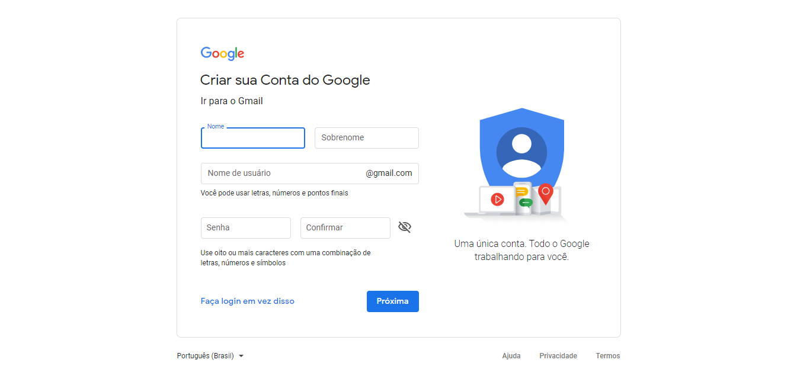

### Passo 2. Abrir a plataforma do Google Maps

Acesse [cloud.google.com/maps-platform](https://cloud.google.com/maps-platform/) e clique
em **Primeiros Passos**. Se não estiver logado, o Google pede o login.

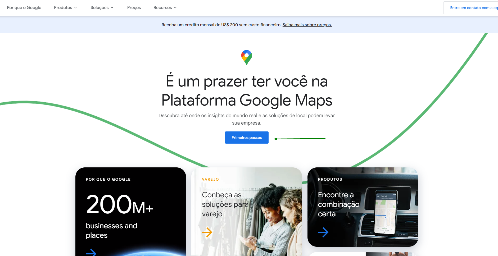

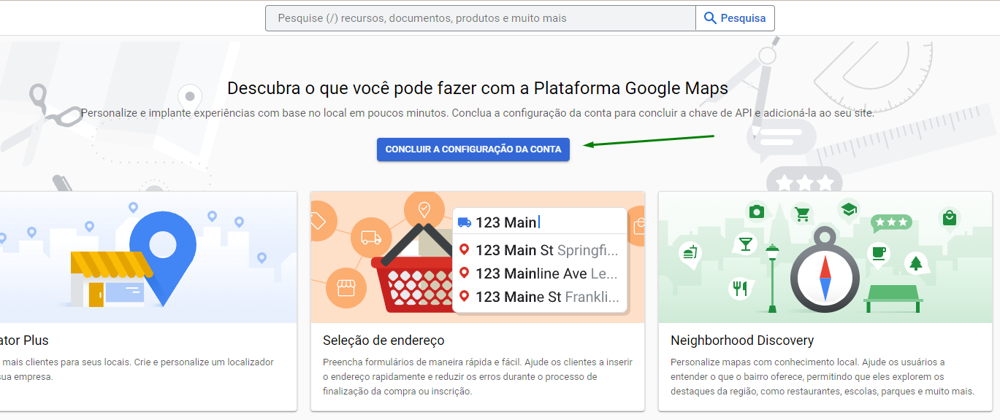

### Passo 3. Ativar a conta de faturamento (primeira vez)

Crie a conta de faturamento informando:

- País
- Dados pessoais: nome, CPF, data de nascimento
- Dados de faturamento: cartão de crédito internacional

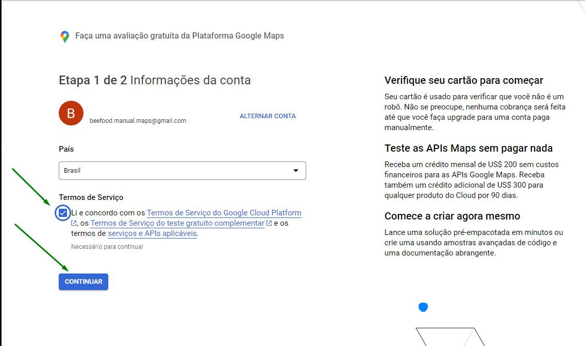

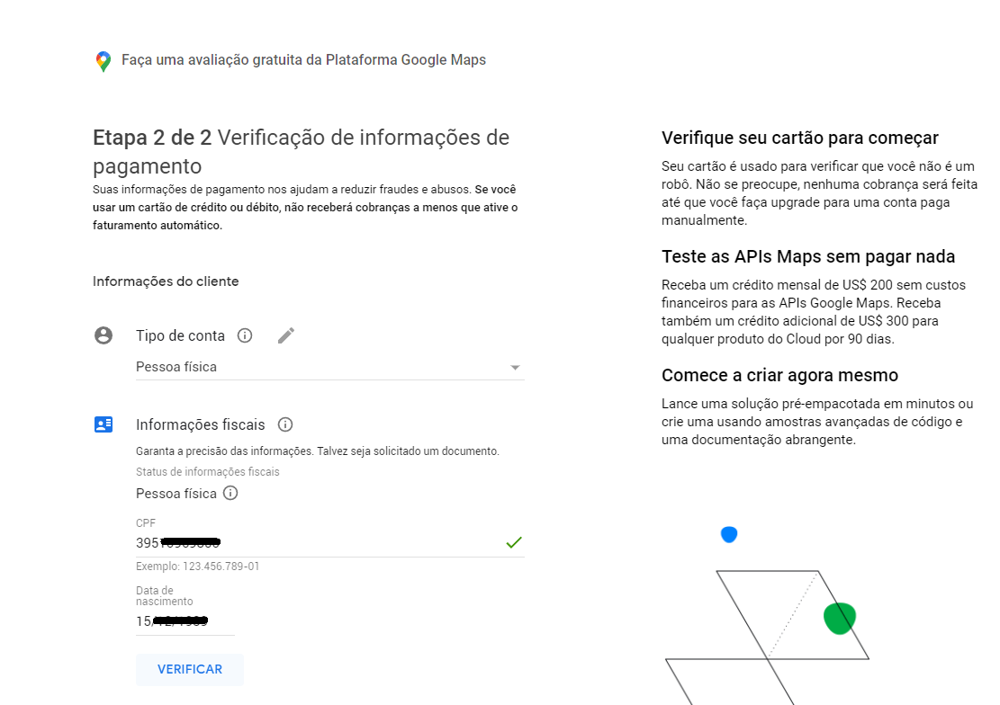

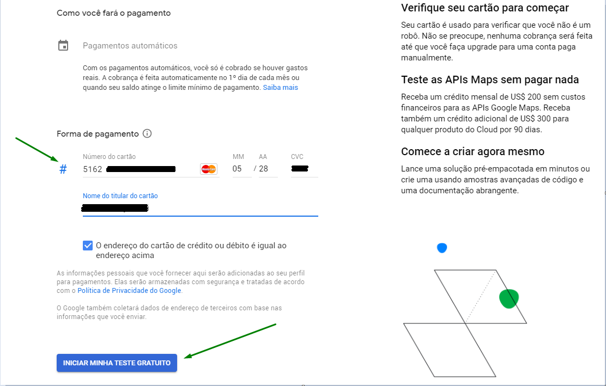

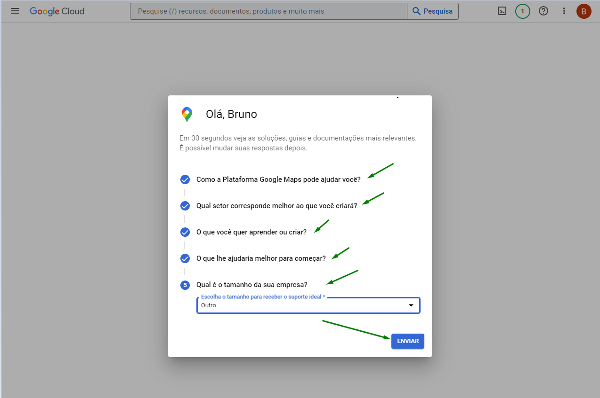

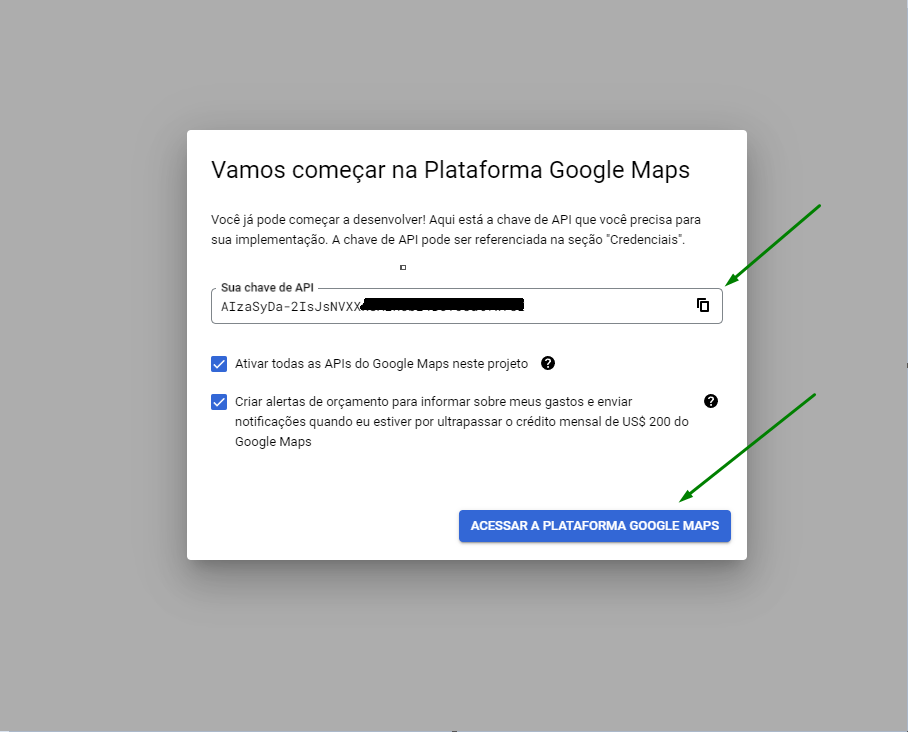

### Passo 4. Ativar as APIs necessárias

Para o BeeFood funcionar por completo, estas APIs precisam estar ativas:

- **Geocoding API**
- **Maps JavaScript API**
- **Places API (New)** (a partir de 2025) ou Places API
- **Routes API** (a partir de 2025) ou Distance Matrix API — necessária para calcular distância em km

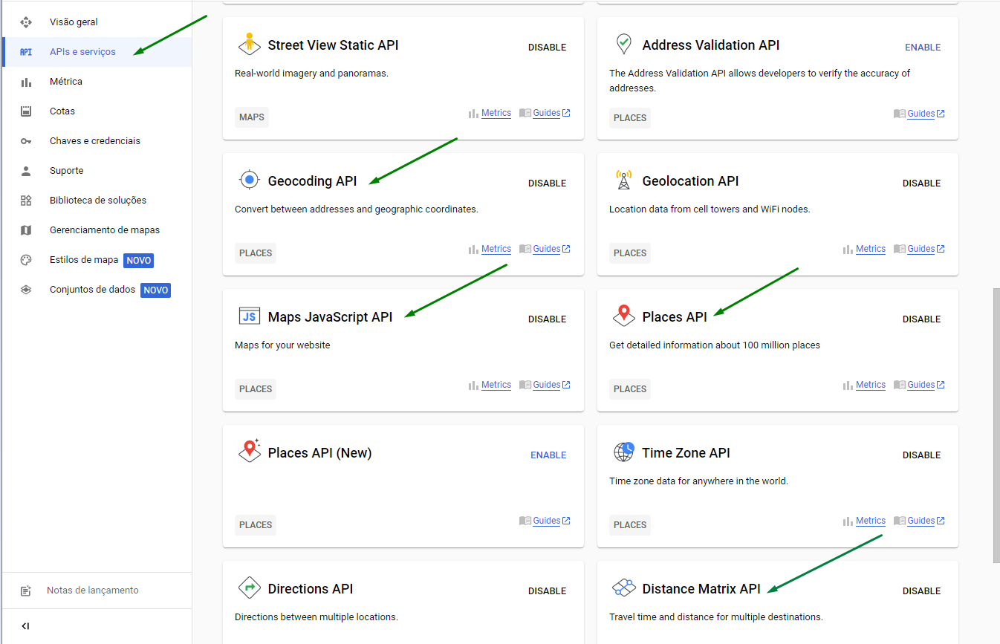

### Passo 5. Localizar as chaves já cadastradas

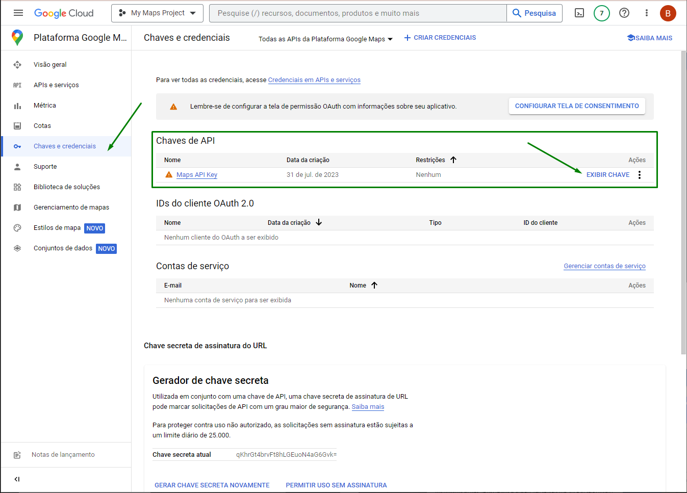

### Passo 6. Criar uma nova chave (se precisar)

Em **Chaves e credenciais**, no topo, clique em **CRIAR CREDENCIAIS** e depois em **Chave de API**.

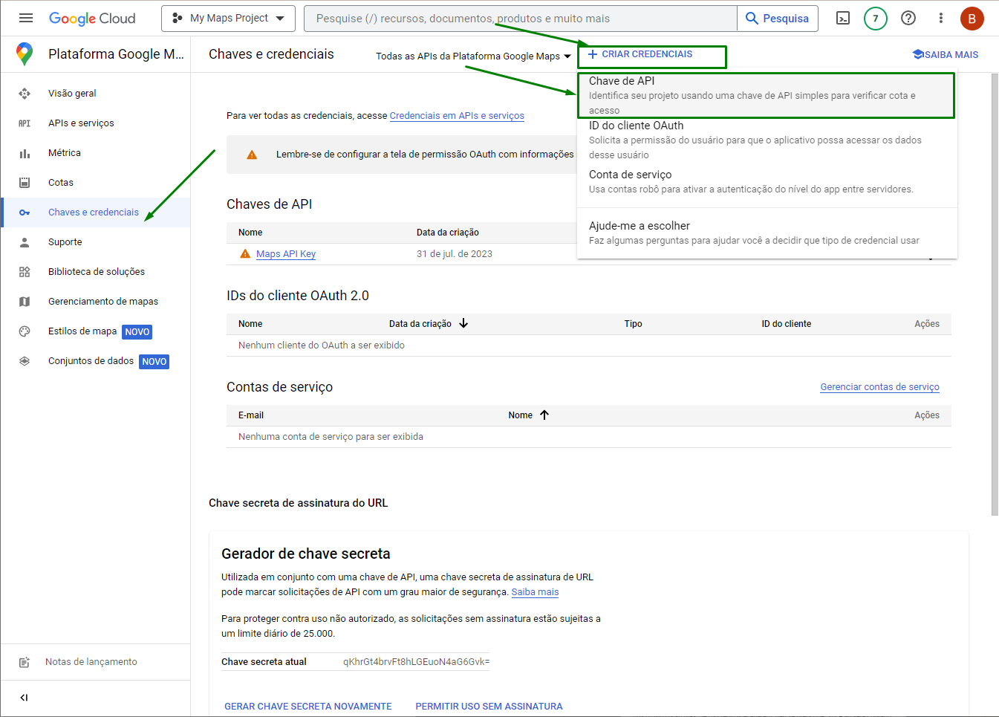

Copie a chave gerada (começa com `AIzaSy…`).

---

## Parte 2 — BeeFood: colar a chave e salvar

### Passo 7. Abrir Aplicativos → Mapas Google

No BeeFood, clique em **Aplicativos** (1). Role até a seção **Entrega** e abra o card
**Mapas Google** (2).

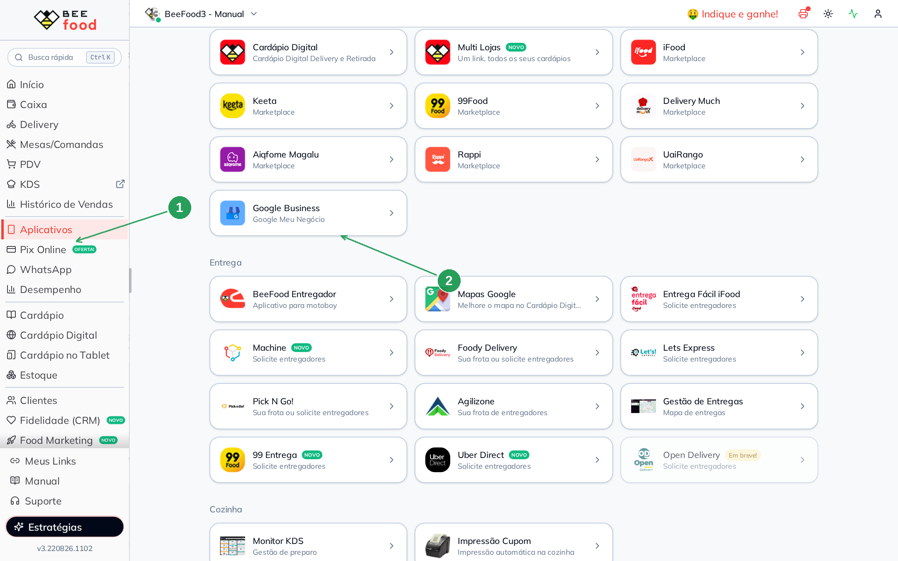

### Passo 8. Colar a chave e salvar

No modal **Configurar Google Maps**, cole a chave no campo **Chave da API do Google Maps** (1)
e clique em **SALVAR (F2)** (2).

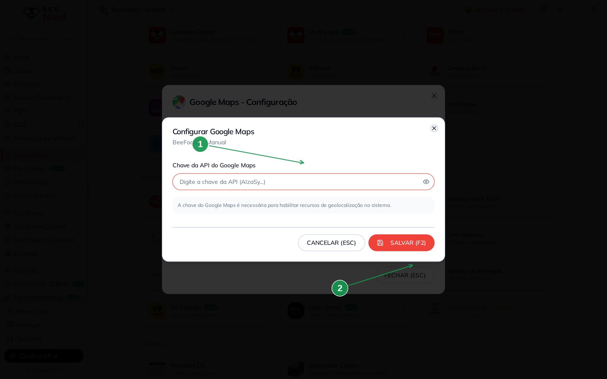

| Nº | Campo no BeeFood | O que fazer |
|----|------------------|-------------|
| 1. | **Chave da API do Google Maps** \* | Cole a chave copiada no Google Cloud |
| 2. | **SALVAR (F2)** | Grava. Se o BeeFood validar as APIs, confirme a validação |

A chave habilita geolocalização no cardápio e no sistema (busca de endereço, distância, mapa).
Desenhar área de entrega é outro assunto — veja os manuais de **Área de entrega**.

---

## Problemas comuns

| Sintoma | O que verificar |
|---------|-----------------|
| Mapa não carrega no cardápio | A chave foi salva no **cardápio certo**? As 4 APIs estão ativas no Cloud? |
| Cobrança inesperada | Confira o uso no faturamento do Google. O crédito mensal de US$ 200 tem teto |
| Validação reprova uma API | Ative a API que faltou (Places New / Routes) e tente salvar de novo |

---

## Precisa de ajuda?

Fale com o **suporte BeeFood** informando: nome da loja, **CNPJ** e um print do modal
(sem expor a chave inteira em canais públicos).

---

*Última atualização: agosto/2026 — BeeFood · Mapas do Google*
