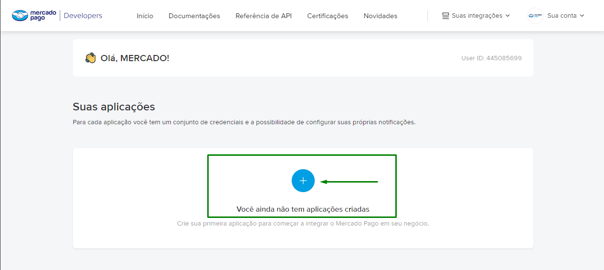
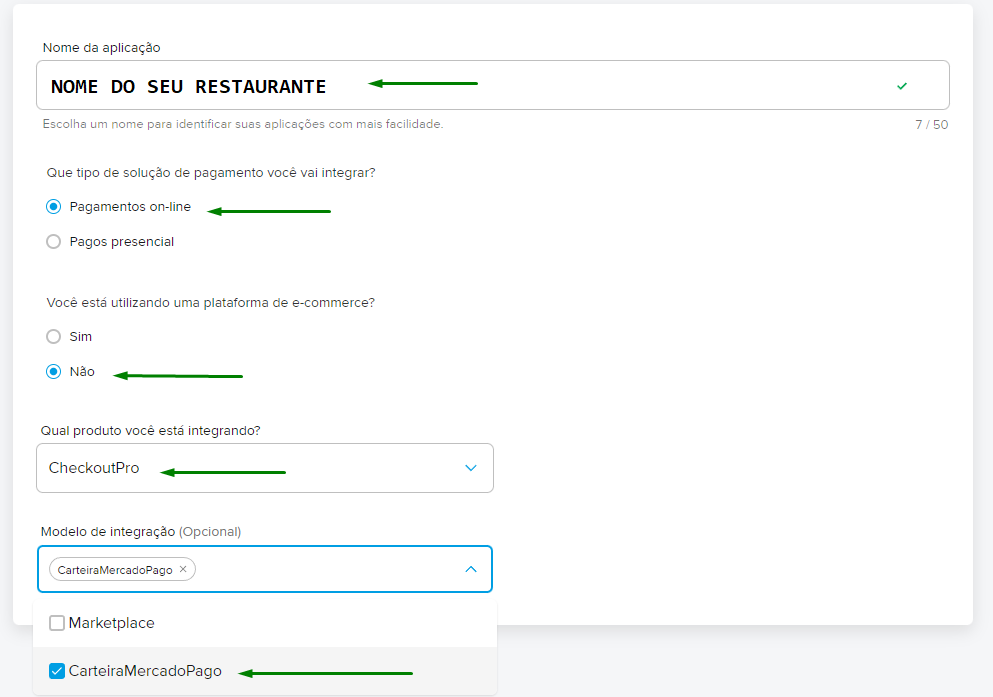
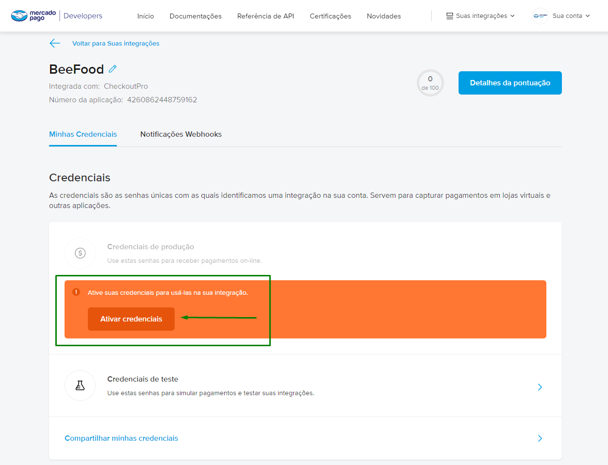
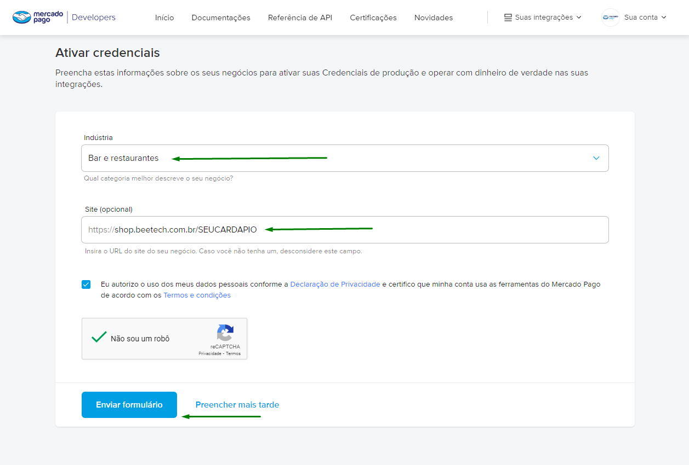
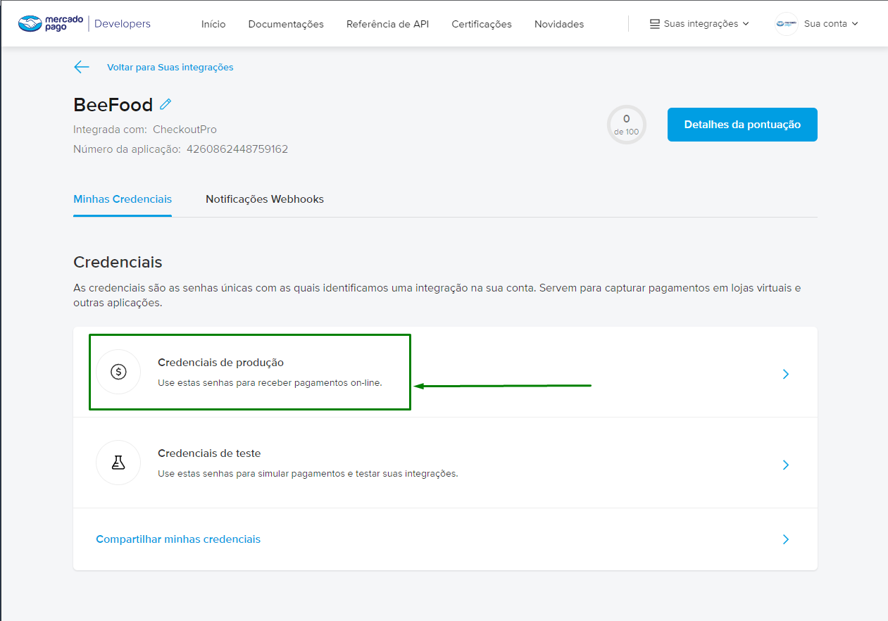
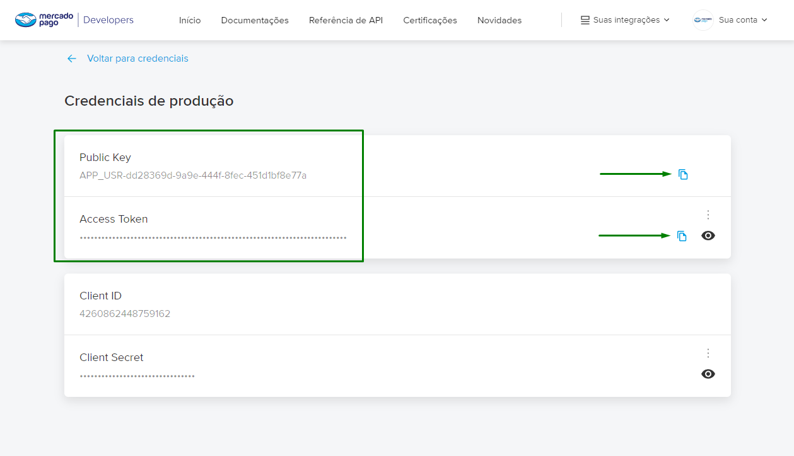
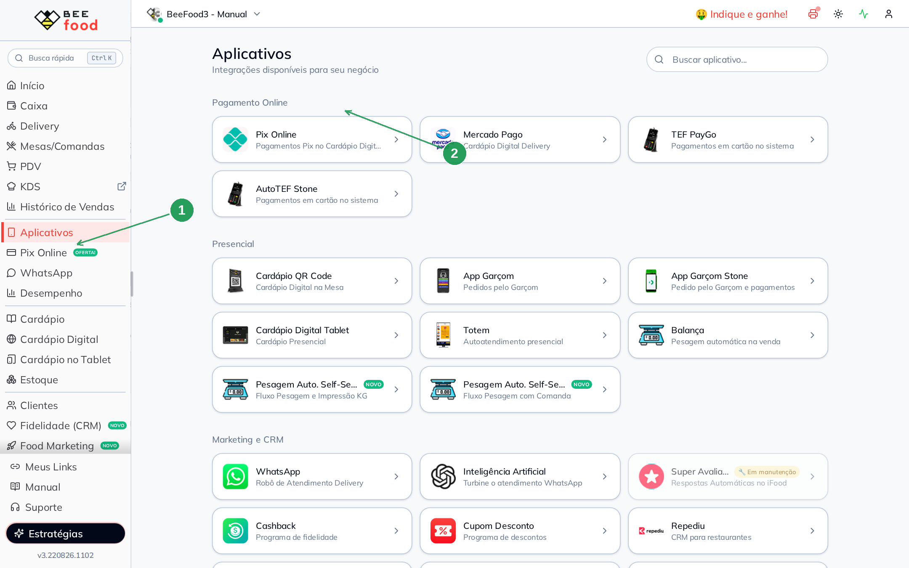
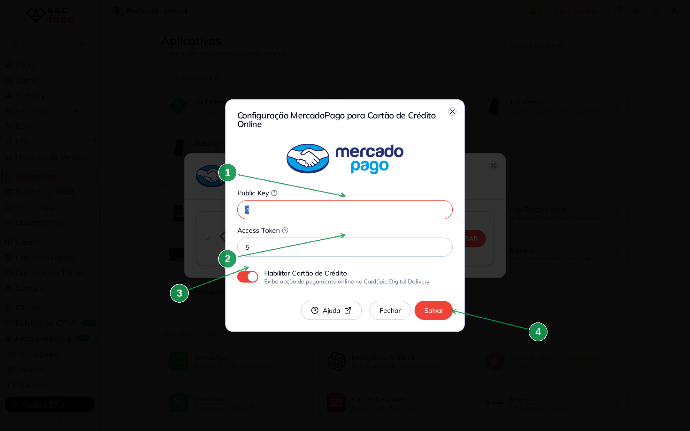

# Mercado Pago — cartão de crédito no Cardápio Digital

Ative o **cartão de crédito online** no cardápio digital BeeFood com as credenciais de
**produção** do Mercado Pago: **Public Key** e **Access Token**.

> **Cuidado:** **não** use o seu próprio cartão para fazer pedido de teste no cardápio.
> Isso pode **banir** a conta do Mercado Pago.

---

## Antes de começar

1. Conta Mercado Pago da loja (não uma conta pessoal de teste com o seu cartão).
2. Link do **cardápio digital** BeeFood.
3. Acesso a **Aplicativos** no BeeFood.

---

## Parte 1 — Mercado Pago: criar o aplicativo e copiar as chaves

### Passo 1. Abrir o portal de desenvolvedores e criar o aplicativo

Acesse o portal de desenvolvedores do Mercado Pago e clique no **+** para cadastrar
uma aplicação.

### Passo 2. Preencher os dados e criar

Preencha os campos. Em **Tipo de solução**, use **Pagamentos online**. Clique em
**CRIAR APLICATIVO**.

### Passo 3. Ativar as credenciais

Clique no botão laranja **Ativar credenciais**.

### Passo 4. Indústria e site

Em indústria, escolha **Bar e restaurantes**. Em site, cole o **link do Cardápio Digital**
BeeFood. Clique em **Enviar formulário**.

### Passo 5. Abrir as credenciais de produção

Clique em **Credenciais de produção**.

### Passo 6. Copiar Public Key e Access Token

Use o botão de copiar e guarde as duas chaves.

---

## Parte 2 — BeeFood: colar as chaves e salvar

### Passo 7. Abrir Aplicativos → Mercado Pago

No BeeFood, clique em **Aplicativos** (1). Na seção **Pagamento Online**, abra o card
**Mercado Pago** (2).

### Passo 8. Colar, habilitar e salvar

No modal **Configuração MercadoPago para Cartão de Crédito Online**:

| Nº | Campo no BeeFood | O que fazer |
|----|------------------|-------------|
| 1. | **Public Key** \* | Cole a Public Key de **produção** |
| 2. | **Access Token** \* | Cole o Access Token de **produção** |
| 3. | **Habilitar Cartão de Crédito** | Deixe **ligado** para aparecer no cardápio delivery |
| 4. | **Salvar** | Grava a configuração |

Não use credenciais de **teste** no cardápio em produção. Depois de salvar, o cliente
paga o pedido online com cartão no cardápio digital.

---

## Problemas comuns

| Sintoma | O que verificar |
|---------|-----------------|
| Cartão não aparece no cardápio | O switch **Habilitar Cartão de Crédito** está ligado? Salvou? |
| Pagamento recusado / conta em risco | Você testou com o **próprio** cartão? Pare e use outro cartão (não o da conta) |
| Chaves não salvam | Public Key e Access Token são os de **produção**, do aplicativo certo? |

---

## Precisa de ajuda?

Fale com o **suporte BeeFood** informando: nome da loja, **CNPJ** e um print do modal
(sem expor o Access Token inteiro em canais públicos).

---

*Última atualização: agosto/2026 — BeeFood · Mercado Pago (cartão no cardápio)*
