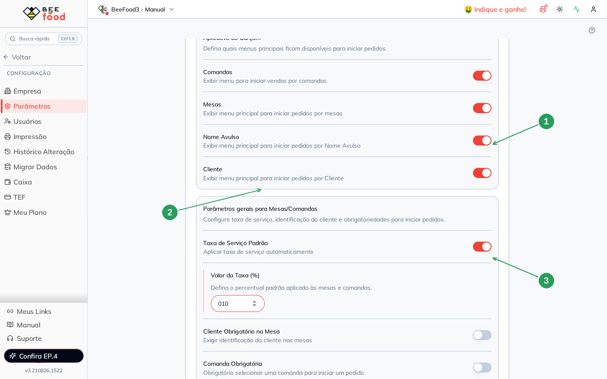
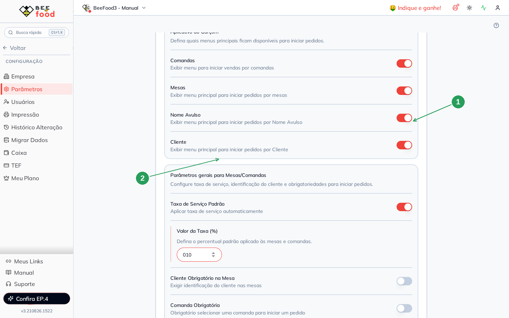
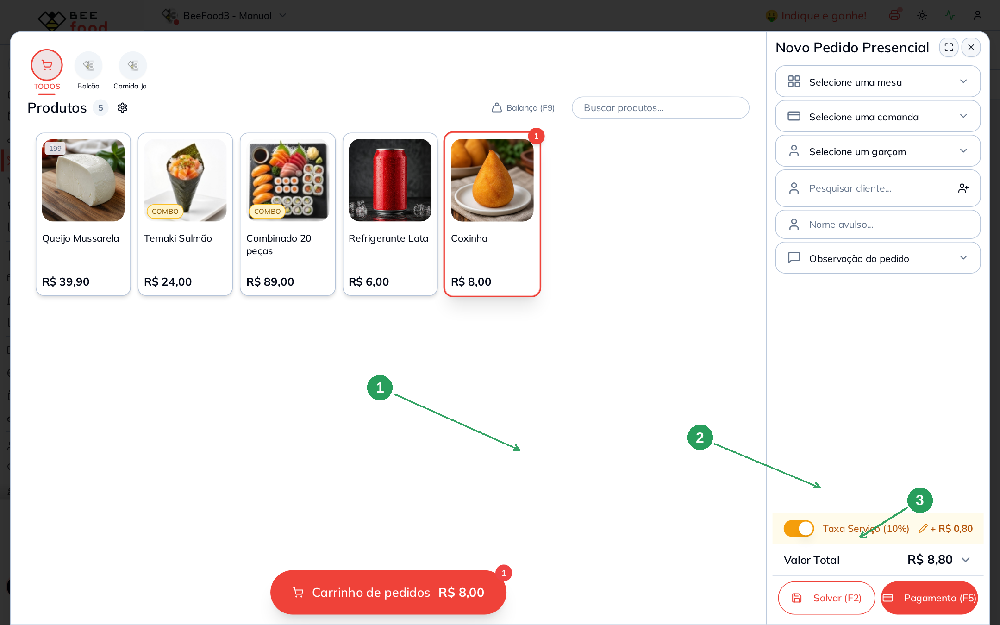
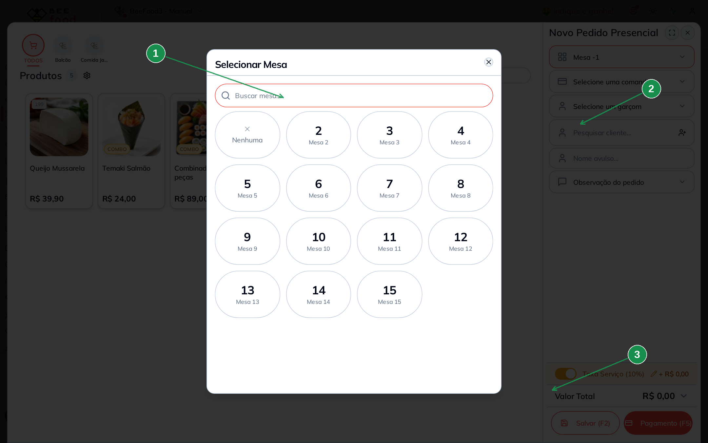
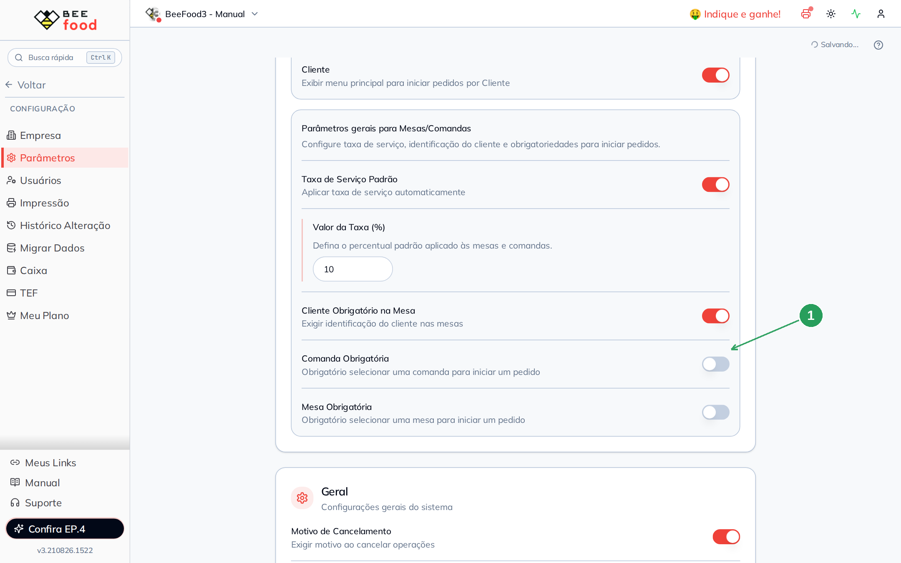
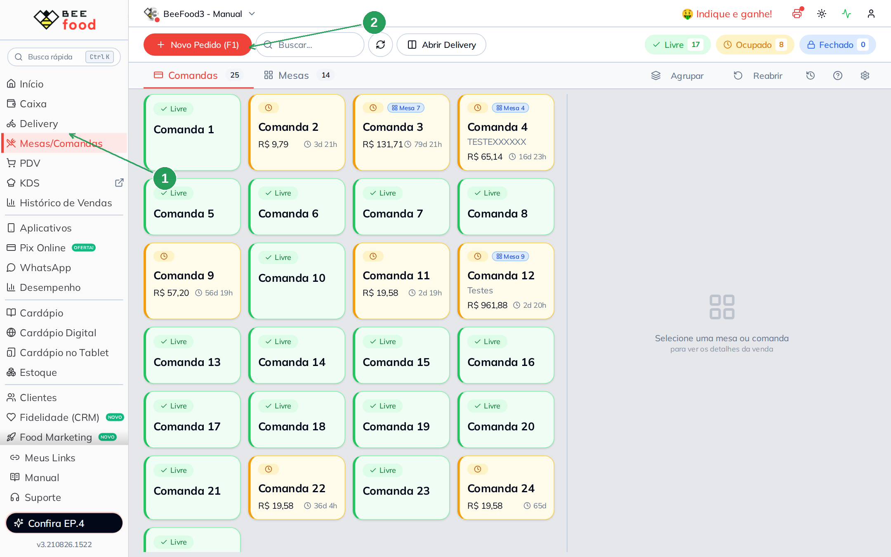

# Manual — Taxa e obrigatoriedades de mesa

Este manual mostra como a **taxa de serviço padrão** e as **obrigatoriedades** (cliente, mesa
e comanda) funcionam no **salão do painel web**.

> As imagens têm **setas numeradas** (1, 2, 3…). Cada número indica o campo ou botão
> correspondente na tela.

---

## O que estes parâmetros fazem

No card **Taxa de Serviço e Mesas** existem dois blocos. O de cima é o app do garçom
(outro manual). Este trata do bloco **Parâmetros gerais para Mesas/Comandas**:

| Campo | Efeito |
|-------|--------|
| **Taxa de Serviço Padrão** | Já deixa a taxa ligada no pedido novo |
| **Valor da Taxa (%)** | O percentual (neste exemplo: **10**) |
| **Cliente Obrigatório na Mesa** | Não deixa seguir sem identificar o cliente |
| **Comanda Obrigatória** | Exige escolher uma comanda |
| **Mesa Obrigatória** | Exige escolher uma mesa |

A alteração **grava sozinha**.

Estes flags valem no **web e no app**. A prova daqui é só no web — **Mesas/Comandas**.

---

## Onde fica

**Configuração → Parâmetros**, no mesmo card do App Garçom, bloco de baixo.

| Nº | Item | O que fazer |
|----|------|-------------|
| 1 | **Taxa de Serviço Padrão** | Ligue para aplicar sozinha. |
| 2 | **Valor da Taxa (%)** | Digite **10** (ou o percentual da casa). |
| 3 | **Cliente / Comanda / Mesa** | Ligue só o que a operação exige. |

Com a taxa em 10%:

| Nº | Item | O que conferir |
|----|------|----------------|
| 1 | O switch da taxa | Ligado. |
| 2 | O campo **10** | Percentual padrão. |

---

## Prova no salão — a taxa aparece no pedido

Abra **Mesas/Comandas** e clique em **Novo Pedido (F1)**. O painel **Novo Pedido Presencial**
já traz **Taxa Serviço (10%)** ligada.

Lance um item. A taxa vira dinheiro. Neste exemplo: Coxinha **R$ 8,00** + 10% =
**+ R$ 0,80**, total **R$ 8,80**.

| Nº | Item | O que conferir |
|----|------|----------------|
| 1 | O item no pedido | Qualquer produto serve. |
| 2 | **Taxa Serviço (10%)** | O switch laranja e o **+ R$ 0,80**. |
| 3 | **Valor Total** | R$ 8,80. |

O operador ainda pode desligar a taxa naquele pedido (o lápis ao lado do valor), mas o
**padrão** da loja já veio preenchido.

---

## Mesa obrigatória

Com **Mesa Obrigatória** ligada, o pedido novo abre o seletor **Selecionar Mesa**. Sem mesa,
**Salvar (F2)** fica indisponível.

| Nº | Item | O que fazer |
|----|------|-------------|
| 1 | **Selecionar Mesa** | Escolha a mesa do salão. |
| 2 | O campo **Mesa** | Precisa ficar preenchido. |
| 3 | **Salvar (F2)** | Só habilita depois da mesa (e dos outros obrigatórios). |

**Comanda obrigatória** funciona do mesmo jeito, no campo da comanda.

---

## Cliente obrigatório

Com **Cliente Obrigatório na Mesa** ligado, o pedido exige um cliente cadastrado (ou o
fluxo de identificação da tela). Sem cliente o sistema não deixa gravar o pedido.

| Nº | Item | O que fazer |
|----|------|-------------|
| 1 | **Cliente Obrigatório na Mesa** | Ligue se o salão não aceita pedido anônimo. |

---

## O mapa do salão

O mapa em **Mesas/Comandas** é o lugar da prova: **Novo Pedido (F1)** abre o painel em que
a taxa e as obrigatoriedades aparecem.

| Nº | Item | O que fazer |
|----|------|-------------|
| 1 | **Mesas/Comandas** | No menu lateral. |
| 2 | **+ Novo Pedido (F1)** | Abre o pedido presencial. |

---

## Resumo do caminho

1. **Parâmetros** → ligue a taxa e preencha o %.
2. Abra **Mesas → Novo Pedido**, lance um item e confira o **+ R$** da taxa.
3. Se a casa exige mesa, comanda ou cliente, ligue o switch correspondente e teste de novo.

---

## Perguntas frequentes

**A taxa não apareceu no PDV balcão.** A taxa padrão entra quando há **mesa ou comanda** no
pedido. Um PDV sem mesa não recebe o percentual sozinho.

**O app do garçom usa estes mesmos flags?** Sim. A configuração é uma só. Este manual prova
no web.

**Mudei o % e o pedido antigo não mudou.** O percentual vale nos **pedidos novos**. O que já
estava aberto guarda o valor da hora em que foi criado.

---

## Manuais relacionados

- **App do Garçom (parâmetros)** — o bloco de cima desta mesma tela
- **PDV — número e cupom** — o pedido no PDV, sem mesa
