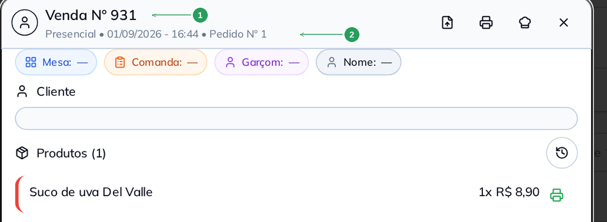
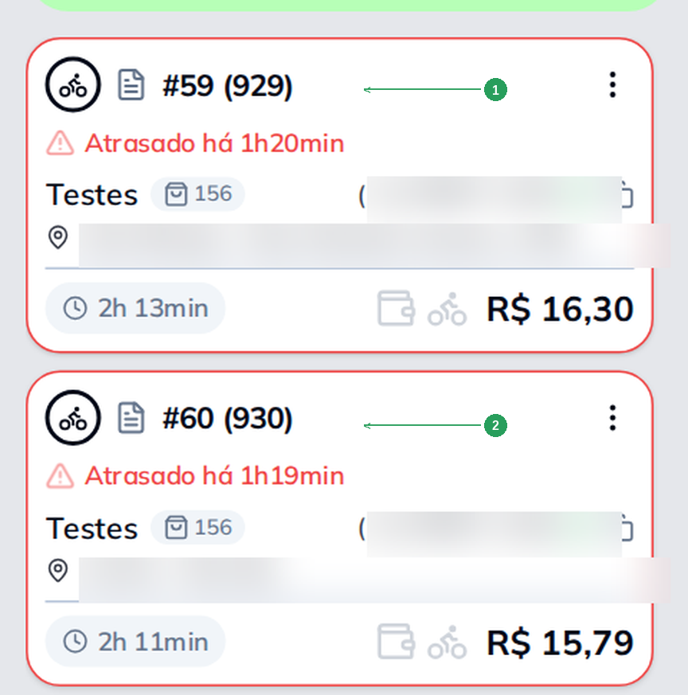
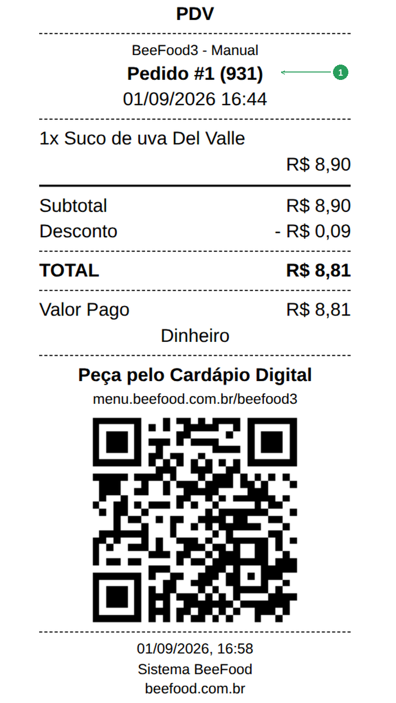
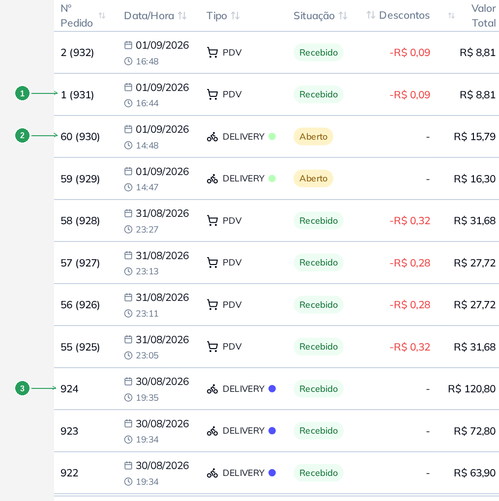
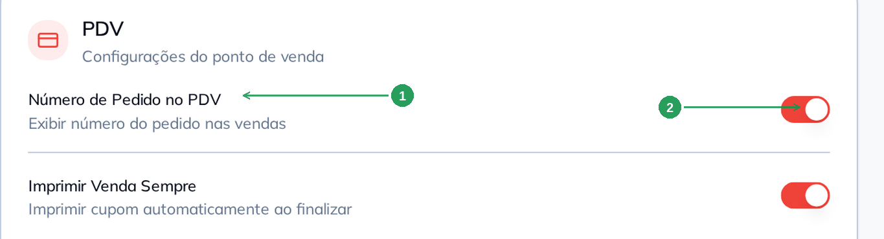
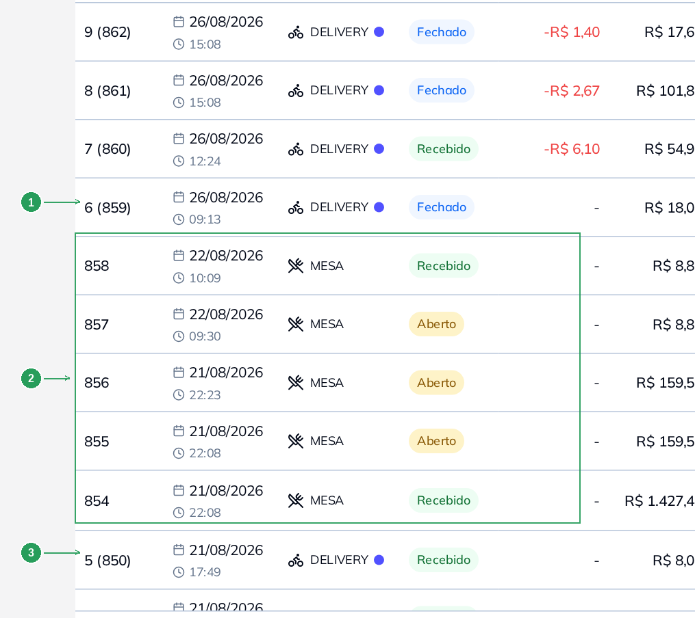

# Manual — Entendendo a numeração dos pedidos

Toda venda no BeeFood tem **dois números**, e eles servem para coisas diferentes. Este manual
explica qual é qual, por que um deles volta para 1 de vez em quando, e onde cada um aparece.

> As imagens têm **setas numeradas** (1, 2, 3…). Cada número indica o campo correspondente
> na tela.

---

## Os dois números

| Número | O que é | Reinicia? |
|--------|---------|-----------|
| **Número da venda** | O número oficial da venda. É único na sua loja: a venda 931 é a 931ª venda que a loja já registrou | **Nunca** |
| **Número do pedido** | O número do pedido **no caixa aberto**. Serve para chamar o cliente no balcão e para a cozinha se organizar | **Sim** — volta para 1 quando você abre um caixa novo |

Os dois aparecem juntos no detalhe da venda. Abra o **Histórico de Vendas** e toque na lupa de
qualquer venda: o número da venda vem no título (1) e o número do pedido no rodapé do título (2).

| Nº | Item | O que é |
|----|------|---------|
| 1 | **Venda Nº 931** | O número da venda — único na loja, nunca reinicia. |
| 2 | **Pedido Nº 1** | O número do pedido — é o 1º pedido do caixa que está aberto. |

Essa mesma venda é, ao mesmo tempo, a **venda 931** da loja e o **pedido 1** do caixa. Não é
erro: são duas contagens diferentes rodando ao mesmo tempo.

---

## Como o sistema escreve os dois

Quando a venda tem os dois números, o BeeFood escreve **o número do pedido primeiro e o número
da venda entre parênteses**. Quando ela só tem o número da venda, escreve **só ele**.

| Situação | Como aparece | Leia assim |
|----------|--------------|------------|
| Tem os dois | `1 (931)` | pedido 1, venda 931 |
| Só o da venda | `931` | venda 931 |

A palavra na frente muda de tela para tela, mas a ordem é sempre a mesma:

| Onde | Com os dois números | Só com o da venda |
|------|---------------------|-------------------|
| Histórico de Vendas (coluna **Nº Pedido**) | `1 (931)` | `931` |
| Delivery (card do pedido) | `#1 (931)` | `#931` |
| Cupom do cliente | `Pedido #1 (931)` | `Venda Nº 931` |
| Detalhe da venda | `Venda Nº 931 • Pedido Nº 1` | `Venda Nº 931` |
| Tela do PDV | *sempre o da venda:* `VENDA Nº 931` | `VENDA Nº 931` |

No **Delivery**, cada card traz o número do pedido e, entre parênteses, o da venda (1) e (2).

| Nº | Item | O que é |
|----|------|---------|
| 1 | **#59 (929)** | Pedido 59 do caixa, venda 929 da loja. |
| 2 | **#60 (930)** | Pedido 60 do caixa, venda 930 da loja. |

No **cupom que o cliente recebe** é o número do pedido que aparece em destaque (1) — é por ele
que você chama o cliente.

| Nº | Item | O que conferir |
|----|------|----------------|
| 1 | **Pedido #1 (931)** | O pedido em destaque e a venda entre parênteses. |

> **Atenção a um detalhe da tela do PDV.** Enquanto você monta a venda, o PDV mostra
> **VENDA Nº 931** — o número da venda. O número do pedido dessa venda existe, mas aparece
> depois: no Histórico de Vendas, no cupom e nos relatórios.

---

## O número da venda nunca reinicia

O número da venda é um contador único da loja. Ele só sobe, um a um, e **não volta para 1**
em nenhuma situação: nem ao fechar o caixa, nem na virada do mês, nem na virada do ano.

Três consequências práticas:

- **Cada venda tem um número que é só dela**, para sempre. Serve para achar a venda anos depois.
- **Venda cancelada mantém o número dela.** O número não é reaproveitado, e o próximo continua
  de onde parou.
- **Se dois números seguidos existem, não faltou venda no meio.** A contagem não pula.

> **Em breve:** a BeeFood vai disponibilizar um **reset opcional** desse número, para quem
> quiser reiniciar a contagem das vendas. Hoje ele ainda não existe — o número da venda segue
> subindo sempre.

---

## O número do pedido é a contagem do caixa

Aqui está o ponto que gera mais dúvida. O número do pedido **pertence ao caixa**, não à loja.
Cada vez que você abre um caixa novo, a contagem dos pedidos **começa do 1 outra vez**.

Veja no Histórico de Vendas o momento exato em que isso acontece. As duas vendas de cima são do
**caixa novo**; as de baixo, do caixa anterior.

| Nº | Item | O que aconteceu |
|----|------|-----------------|
| 1 | **1 (931)** | Primeiro pedido do caixa novo. O pedido voltou para **1**, mas a venda seguiu para **931**. |
| 2 | **60 (930)** | Último pedido do caixa anterior: ele tinha chegado ao pedido **60**. |
| 3 | **924** | Uma venda **sem** número de pedido — só o número da venda. Por que isso acontece está na seção seguinte. |

Repare no que os dois contadores fizeram no mesmo instante:

| | Caixa anterior (última venda) | Caixa novo (primeira venda) | O que fez |
|---|---:|---:|-----------|
| **Número do pedido** | 60 | **1** | **Reiniciou** |
| **Número da venda** | 930 | **931** | Continuou subindo |

O pedido caiu de 60 para 1 porque o caixa é outro. A venda foi de 930 para 931 porque a loja é a
mesma.

---

## Por que vale fechar o caixa todo dia

Como a contagem do pedido é do caixa, **o período que o caixa fica aberto é o período da
contagem**. Isso decide o que o número do pedido significa no seu dia a dia:

| Como você usa o caixa | O que o número do pedido passa a significar |
|-----------------------|--------------------------------------------|
| **Fecha todo dia** | A contagem do dia. O pedido 37 é o 37º pedido de hoje. |
| Fecha de vez em quando | A contagem do período inteiro. O pedido 412 pode ser o 412º de três semanas. |

Fechar o caixa **todos os dias** é o que faz o número do pedido virar uma informação útil:
número baixo e fácil de falar em voz alta no balcão, e uma contagem que bate com o movimento
do dia.

> Fechar o caixa é o mesmo procedimento de sempre (conferência dos valores e fechamento). Ele
> não muda nada no número da venda — só reinicia a contagem dos pedidos.

---

## Quem recebe número de pedido

Não são todas as vendas que ganham número de pedido. Depende do canal:

| Canal | Recebe número de pedido? | Depende de quê |
|-------|--------------------------|----------------|
| **Delivery** | Sim, automaticamente | Da contagem do caixa aberto. Não há nada para ligar |
| **PDV** (balcão) | Só se você ligar | Do parâmetro **Número de Pedido no PDV** |
| **Mesa / Comanda** | **Não**, nunca | Não existe opção para ligar |

### Ligando no PDV

Para as vendas de balcão receberem número de pedido, vá em **Configuração → Parâmetros**, card
**PDV**, e ligue **Número de Pedido no PDV** (1) pelo botão à direita (2). A alteração **grava
sozinha**.

| Nº | Item | O que fazer |
|----|------|-------------|
| 1 | **Número de Pedido no PDV** | Ligue para as vendas do balcão entrarem na contagem dos pedidos. |
| 2 | O botão à direita | Verde/ligado = as vendas de PDV recebem número de pedido. |

Com o parâmetro desligado, a venda de balcão continua funcionando igual — ela só fica **sem**
número de pedido, com o número da venda de sempre.

### Mesa e comanda não recebem — e não gastam número

Venda de mesa e de comanda nunca recebe número de pedido, e **não existe parâmetro** para
mudar isso. Elas usam apenas o número da venda.

E há uma segunda parte importante: **a mesa também não consome número de pedido**. A contagem
não pula por causa dela. No Histórico abaixo, cinco vendas de mesa (2) ficaram entre dois
pedidos de delivery — e a contagem do pedido foi de **5** (3) direto para **6** (1), sem buraco.

| Nº | Item | O que observar |
|----|------|----------------|
| 1 | **6 (859)** | Delivery: pedido 6, venda 859. |
| 2 | As cinco linhas **MESA** (854 a 858) | Só o número da venda. Nenhuma delas tem número de pedido. |
| 3 | **5 (850)** | O delivery anterior era o pedido 5. Entre ele e o pedido 6 houve cinco vendas de mesa, e **a contagem do pedido não pulou**. |

Ou seja: as vendas de mesa consumiram os números **de venda** 851 a 858, mas nenhum número
**de pedido**. A contagem dos pedidos só anda quando sai um pedido que recebe número.

---

## Resumo

1. **Número da venda** = contador único da loja. Nunca reinicia.
2. **Número do pedido** = contador do caixa aberto. Volta para 1 a cada caixa novo.
3. Quando os dois existem, o sistema escreve **`pedido (venda)`**: `1 (931)`.
4. **Feche o caixa todo dia** para o número do pedido virar a contagem do dia.
5. **Delivery** recebe sempre; **PDV** só com o parâmetro ligado; **mesa** nunca.

---

## Perguntas frequentes

**Por que meu pedido é o nº 1 se a loja já vendeu 900 vezes?**
São dois contadores. O 900 e tantos é o número da **venda**, que nunca reinicia. O 1 é o número
do **pedido**, que reiniciou porque você abriu um caixa novo.

**Apareceram dois pedidos "nº 1" no relatório. É erro?**
Não. Eles são de **caixas diferentes**. Para distinguir, use o número da venda entre
parênteses — esse não repete nunca.

**Liguei o parâmetro no PDV e a tela continua mostrando "VENDA Nº 931".**
É o esperado. A tela do PDV mostra o número da venda. O número do pedido dessa venda aparece no
**Histórico de Vendas** (como `1 (931)`), no cupom e nos relatórios.

**Como faço a mesa ter número de pedido?**
Não tem como. Mesa e comanda usam apenas o número da venda, e não existe parâmetro para mudar
isso.

**Uma venda apareceu sem número de pedido. Perdi alguma coisa?**
Não. Ou é uma venda de mesa/comanda, ou é uma venda de PDV feita com o parâmetro desligado. A
venda está completa e com o número de venda dela; só não entrou na contagem dos pedidos.

**Pulou um número da venda. Perdi uma venda?**
Não. O número da venda não pula. Se você não encontra uma venda no Histórico, confira o
**período do filtro** e o filtro de **situação** (uma venda cancelada mantém o número dela e
aparece no filtro *Cancelado*).

**Posso escolher ou corrigir o número de um pedido?**
Não. Os dois números são atribuídos pelo sistema no momento em que a venda é registrada, e não
há campo para digitá-los. Reabrir uma venda também não gera número novo: a venda reaberta
continua com os mesmos dois números.

**Dá para zerar o número da venda?**
Hoje não. A BeeFood vai disponibilizar em breve um reset opcional desse número.

---

## Manuais relacionados

- **Abrir caixa** — abrir o caixa é o que reinicia a contagem dos pedidos
- **Fechar caixa** — o fechamento diário que dá a contagem do dia
- **PDV — número e cupom** — o card PDV dos Parâmetros e o cupom que sai ao receber
