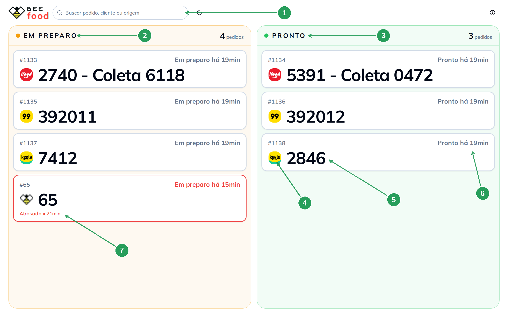
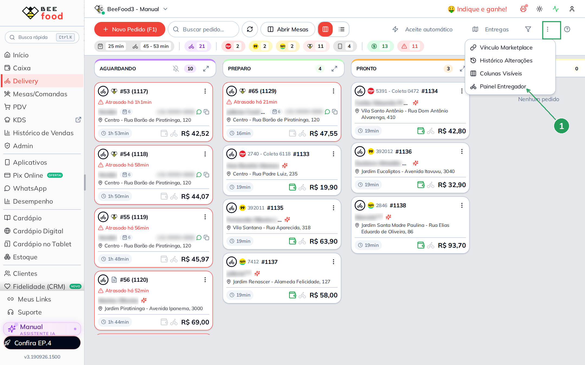
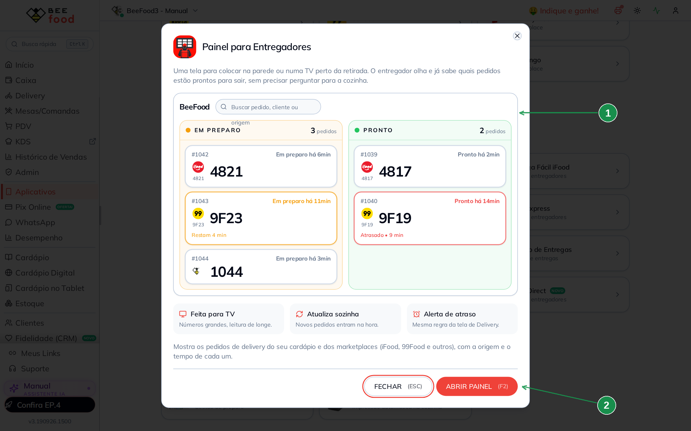
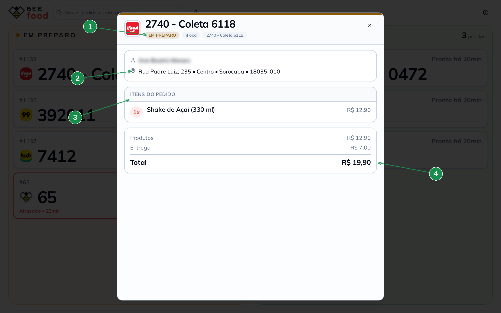

# Painel para Entregadores

Uma tela para pendurar na parede — ou numa TV — no lugar onde os entregadores esperam. Ela
mostra, em letra grande, quais pedidos ainda estão **em preparo** e quais já estão
**prontos** para sair. O entregador chega, olha e já sabe se pode pegar o pedido ou se
precisa esperar.

## Para que serve

Em hora de pico, a mesma pergunta se repete dezenas de vezes: *"o meu já saiu?"*. Cada
pergunta tira alguém da produção para responder, e a cozinha para de produzir para
conversar. O painel responde antes de a pergunta ser feita.

A mentalidade é essa: **informação na parede em vez de conversa no balcão**. Você não
gerencia nada por esta tela — ela é só leitura. Quem move o pedido continua sendo a
cozinha, no kanban da tela **Delivery**, e o painel acompanha na hora.

Três coisas que ele resolve:

- **Fim do "já saiu?".** O entregador se serve da informação sozinho.
- **Entregador certo, pedido certo.** Cada cartão mostra o logo do canal (iFood, 99Food,
  Keeta, Aiqfome, cardápio próprio) e o número que **aquela plataforma** usa — o mesmo
  número que aparece no aplicativo dele.
- **Atraso visível para todos.** O cartão muda de cor conforme o prazo aperta, com a mesma
  regra da tela Delivery.

## Pré-requisitos

- Acesso ao mapa **Gestão de Entregas**. É a mesma permissão das duas coisas: quem não vê
  a Gestão de Entregas não vê o painel.
- O recurso está **em liberação**. Se o item não aparecer no seu sistema, fale com o
  suporte.
- Um computador ligado na TV ou no monitor. O painel abre em **janela nova**, feito para
  ficar aberto o dia inteiro.

## 1. O que a tela mostra

São duas colunas. À esquerda, **Em preparo** (2): os pedidos que a cozinha ainda está
montando. À direita, **Pronto** (3): os que já podem sair. O cabeçalho de cada coluna diz
quantos pedidos ela tem, e o campo de busca no topo (1) procura nas duas ao mesmo tempo —
por número, por nome do cliente ou pelo canal.

Cada cartão conta a mesma história: o logo do canal (4), o número grande que **aquele
canal** usa (5), há quanto tempo o pedido está naquela etapa (6) e, quando o prazo aperta,
o aviso de atraso (7).

| Nº | Onde | O que é |
|---|---|---|
| 1. | Buscar pedido, cliente ou origem | Filtra as duas colunas juntas. Serve para o entregador achar o pedido dele quando a fila está grande |
| 2. | **EM PREPARO** | A cozinha ainda está montando. O contador ao lado diz quantos são |
| 3. | **PRONTO** | Pode sair. É a coluna que o entregador olha primeiro |
| 4. | Logo do canal | De onde o pedido veio: iFood, 99Food, Keeta, Aiqfome, cardápio próprio. Sem logo conhecido, aparece a abelha do BeeFood |
| 5. | Número grande | O número que **o canal** usa. No iFood é a coleta, no 99Food e na Keeta é o código deles. No pedido próprio é o número interno |
| 6. | Tempo da etapa | "Em preparo há 19min", "Pronto há 19min". É o tempo **naquela coluna**, e reinicia quando o pedido muda de etapa |
| 7. | Aviso de atraso | O cartão fica amarelo, laranja e depois vermelho conforme o prazo do pedido aperta. O texto diz *Restam Nmin* ou *Atrasado • Nmin* |

O `#1133` pequeno, em cima do número grande, é o número **interno** do pedido no seu caixa
— é por ele que você encontra a venda no Histórico de Vendas.

**O painel é do turno, não um histórico.** Ele mostra as últimas **6 horas** de pedidos.
Pedido de ontem não volta para a tela, nem mudando a situação dele.

**Ele se atualiza sozinho.** Pedido novo entra na hora, e o cartão salta de coluna no
mesmo instante em que a cozinha arrasta o pedido no kanban do Delivery. Não existe botão de
atualizar, e não precisa ter.

## 2. Abrir pela tela Delivery

É o caminho do dia a dia, para quem já está com o Delivery aberto. No cabeçalho da tela,
toque nos três pontinhos (a moldura verde da imagem) e escolha **Painel Entregador** (1).

| Nº | Onde | O que fazer |
|---|---|---|
| 1. | **Painel Entregador** | Abre o painel em **janela nova**. Arraste essa janela para a TV e deixe em tela cheia com **F11** |

No celular não existe esse menu: o painel fica num **botão de bicicleta** no cabeçalho do
Delivery. A tela funciona no celular, com as colunas uma embaixo da outra, mas ela foi
feita para tela grande.

## 3. Abrir por Aplicativos

É o caminho de quem está conhecendo o recurso. Vá em **Aplicativos**, categoria
**Entrega**, e toque no card **Painel para Entregadores**. Abre uma janela que explica o
recurso com um exemplo da tela (1). Para abrir de verdade, use **ABRIR PAINEL** (2), ou a
tecla **F2**.

| Nº | Onde | O que fazer |
|---|---|---|
| 1. | Exemplo da tela | Mostra como o painel fica, com os cartões e o alerta de atraso. É ilustração, não são os seus pedidos |
| 2. | **ABRIR PAINEL (F2)** | Abre o painel em janela nova. Pelo celular este botão vem desabilitado, com o aviso para abrir pelo computador |

## 4. Ver os detalhes de um pedido

Toque em qualquer cartão e abre uma janela com o pedido inteiro, em letra grande: a etapa e
o canal (1), o cliente e o endereço (2), os itens (3) e o total (4).

| Nº | Onde | O que é |
|---|---|---|
| 1. | Etapa, canal e referência | Repete o que o cartão mostra, agora com o nome do canal escrito |
| 2. | Cliente e endereço | Para onde o pedido vai. No print o nome está desfocado porque este manual é público |
| 3. | **ITENS DO PEDIDO** | Tudo que o entregador está levando, com as opções escolhidas e a observação do cliente |
| 4. | Total | Produtos, entrega e o valor final |

**Esta janela é só leitura.** Não há botão para mudar situação, atribuir entregador nem
imprimir. Se a ideia é que a TV fique exposta na área dos entregadores, é bom saber que
qualquer pessoa que toque na tela consegue ver nome e endereço do cliente — mas ninguém
consegue mexer em nada.

## Dicas

- **Deixe em tela cheia.** Depois de abrir, aperte **F11** no navegador. A tela não tem
  menu nem barra lateral, então o espaço todo vira pedido.
- **Tema claro ou escuro.** O botão de sol/lua no cabeçalho do painel troca só o tema
  **dele** — o resto do BeeFood continua como estava. Escolha pelo ambiente: claro em
  lugar iluminado, escuro em corredor de serviço.
- **A tela quanto maior, melhor.** A partir de 1500 pixels de largura cada etapa passa a
  usar duas colunas internas, e cabe mais pedido sem rolar.
- **O ℹ️ do canto explica o atraso.** Ele mostra a conta que pinta o cartão, que é a mesma
  do prazo de entrega configurado no seu delivery.
- **Pedido de retirada não aparece.** O painel é dos entregadores: só pedido de entrega
  entra. Balcão e mesa ficam fora.
- **Não existe filtro por canal nem por entregador.** Para achar um pedido específico, use
  a busca.

## Onde isto não serve

Se o que você precisa é **mover** o pedido, atribuir entregador, montar rota ou dar baixa,
a tela é outra: **Delivery** e **Gestão de Entregas**. O painel foi desenhado para ficar
ligado numa parede sem ninguém operando.
