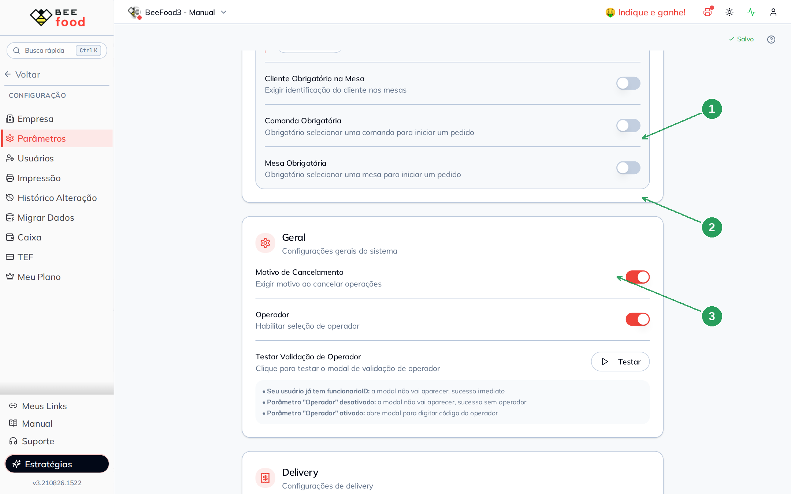
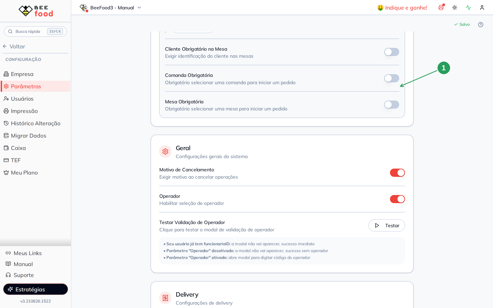
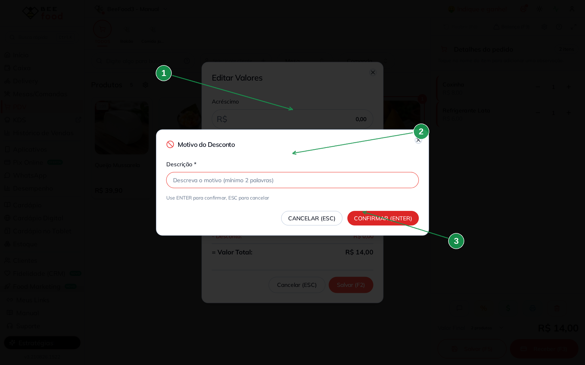
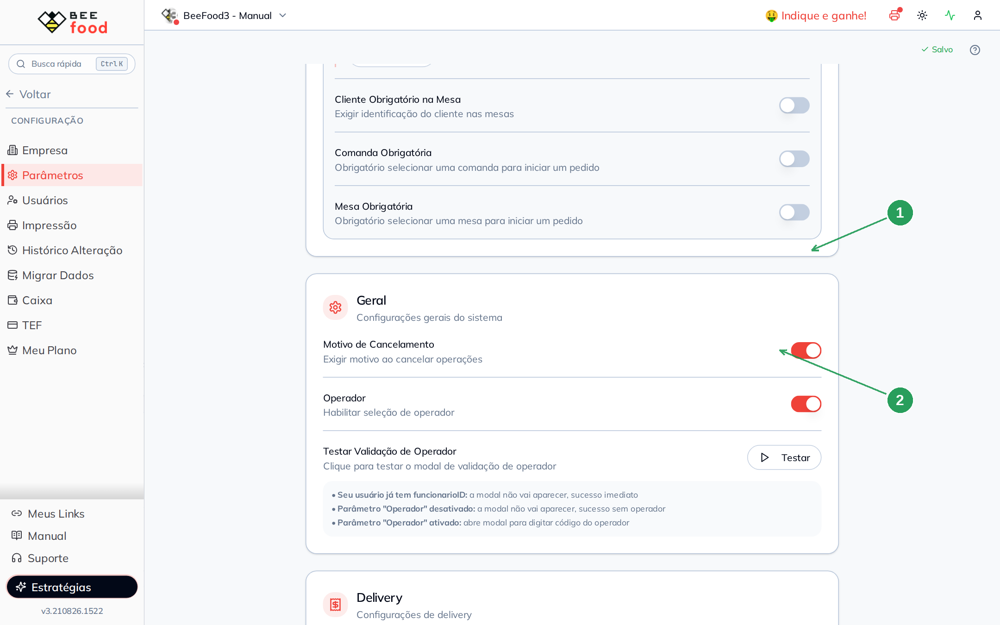
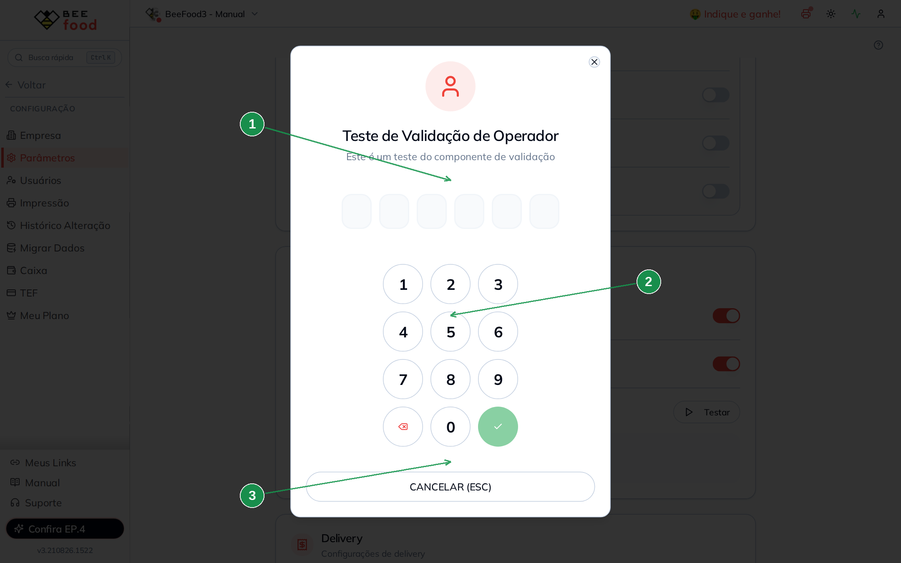

# Manual — Parâmetros gerais

Este manual mostra os dois switches do card **Geral**: **motivo ao cancelar** (e ao dar
desconto) e **código do operador** no PDV.

> As imagens têm **setas numeradas** (1, 2, 3…). Cada número indica o campo ou botão
> correspondente na tela.

---

## Onde fica

**Configuração → Parâmetros**, card **Geral**. A alteração **grava sozinha**.

| Nº | Item | O que é |
|----|------|---------|
| 1 | **Motivo de Cancelamento** | Exige texto ao cancelar — e também ao dar desconto. |
| 2 | **Operador** | Pede o código do funcionário ao entrar no PDV / Mesas. |
| 3 | **Testar** | Abre o teclado do operador (quando o parâmetro está ligado). |

---

## Motivo ao cancelar (e ao dar desconto)

Ligue **Motivo de Cancelamento**. A partir daí o sistema não aceita desconto nem cancelamento
sem uma **descrição** (mínimo duas palavras).

| Nº | Item | O que fazer |
|----|------|-------------|
| 1 | O switch | Ligue para exigir o texto. |

### Prova no PDV

No PDV, lance itens e toque em **%** para editar valores. Ao salvar um desconto, abre
**Motivo do Desconto** — o campo **Descrição** é obrigatório.

| Nº | Item | O que fazer |
|----|------|-------------|
| 1 | **Motivo do Desconto** | Aparece na frente de Editar Valores. |
| 2 | **Descrição *** | Mínimo duas palavras (ex.: *Cortesia do salão*). |
| 3 | **CONFIRMAR (ENTER)** | Sem o texto, não segue. |

O mesmo tipo de modal aparece ao **cancelar um item já gravado** ou uma venda. Se a senha
do gerente também estiver ligada, o motivo vem **antes** da senha.

---

## Código do operador

Ligue **Operador**. Quem não tem funcionário vinculado no login precisa se identificar
com o **código do cadastro de Funcionários** antes de operar o PDV ou o salão.

| Nº | Item | O que fazer |
|----|------|-------------|
| 1 | O switch **Operador** | Liga a identificação. |
| 2 | **Testar** | Abre o teclado na hora, nesta mesma tela. |

### Testar o teclado

O botão **Testar** abre **Teste de Validação de Operador**: seis casas e um teclado
numérico. É o mesmo componente que o PDV usa.

| Nº | Item | O que fazer |
|----|------|-------------|
| 1 | As casas do código | Digite o código do funcionário (ex.: 10). |
| 2 | O teclado | Números, apagar e confirmar (verde). |
| 3 | **CANCELAR (ESC)** | Fecha sem identificar. |

A própria tela avisa três casos:

- Seu usuário já tem funcionário vinculado: o modal **não abre** (sucesso imediato).
- Parâmetro **Operador** desligado: sucesso sem operador.
- Parâmetro **ligado** e sem funcionário no login: o modal pede o código.

O código existe em **Cadastros → Funcionários**. Sem um funcionário com código, o Testar
abre o teclado mas não tem o que validar.

No salão, com o parâmetro ligado, o mesmo teclado aparece como
**Identificação do Operador** ao tentar operar Mesas ou o PDV.

---

## Resumo do caminho

1. **Motivo**: ligue → dê um desconto no PDV → preencha a descrição.
2. **Operador**: ligue → **Testar** (ou entre no PDV) → digite o código do funcionário.
3. Se for usar os dois com a senha do gerente, o motivo vem primeiro.

---

## Perguntas frequentes

**O Testar não abre o teclado.** Você já tem funcionário no login, ou o switch Operador
está desligado. A tela lista exatamente esses três caminhos.

**Cadastrei o código e o PDV ainda pede.** Confira se o número no cadastro de Funcionários
é o mesmo que você está digitando. Zeros à esquerda não entram.

**Quero obrigar o operador sempre.** Existe uma flag na API (`operadorPDVObrigar`) que o
celular conhece. No **painel desktop desta tela não há switch** para ela.

---

## Manuais relacionados

- **Senha do gerente** — o modal que pode vir depois do motivo
- **Taxa e obrigatoriedades de mesa** — o card de cima
