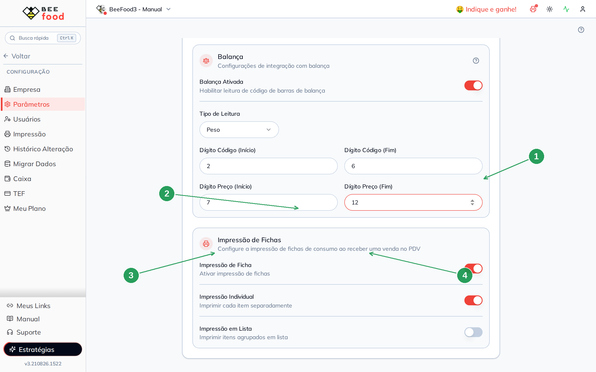
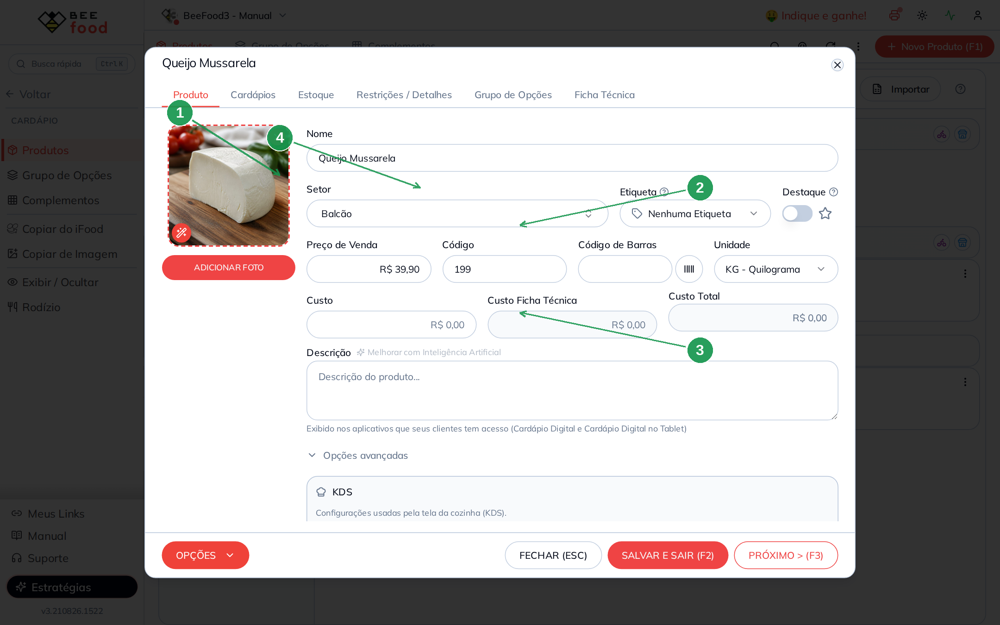
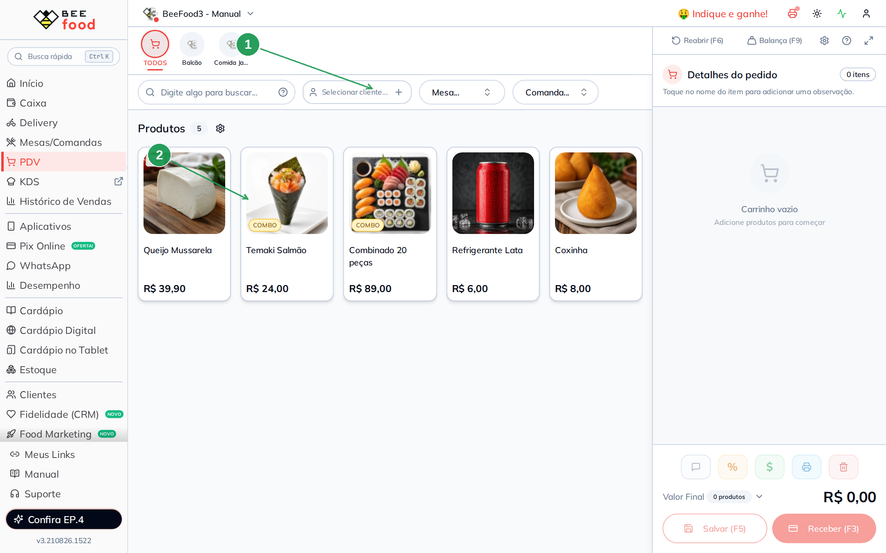
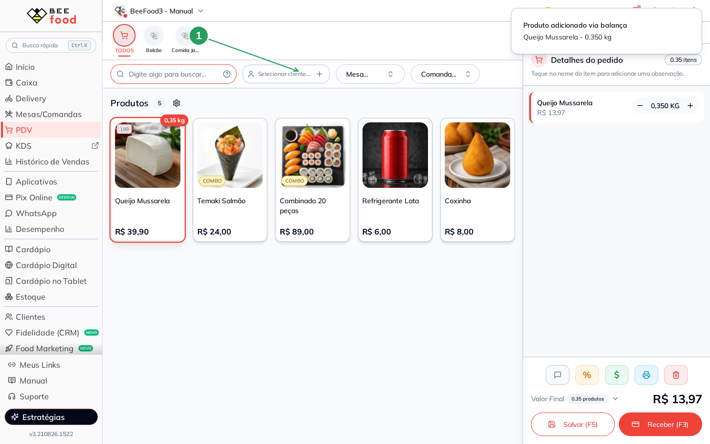
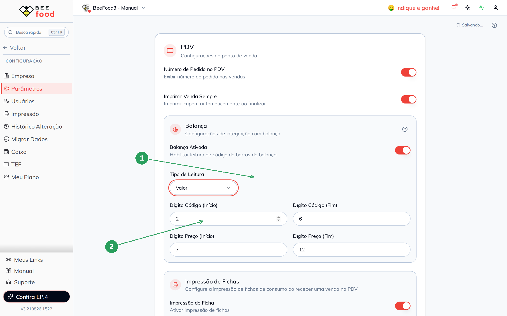
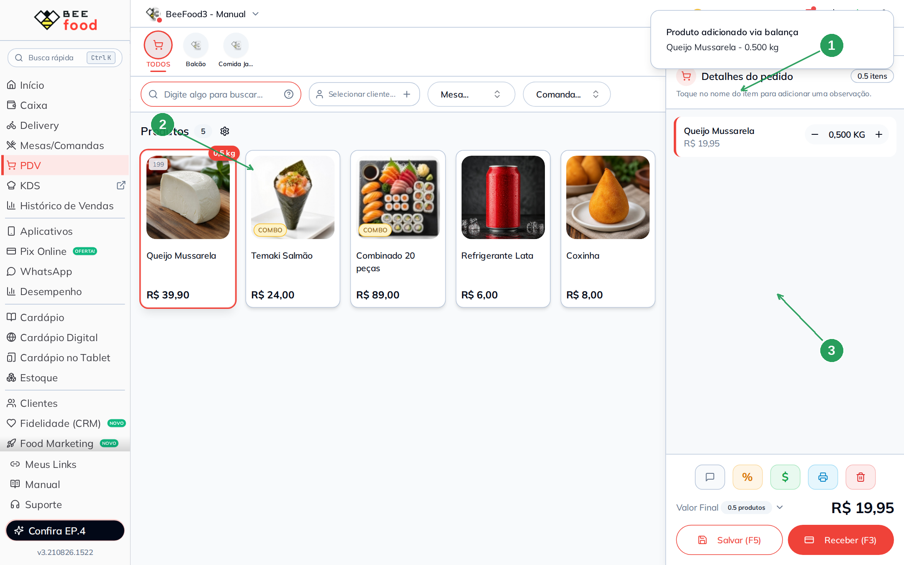

# Manual — Balança no PDV

Este manual ensina o BeeFood a **ler o código da etiqueta da balança**: o que cada
dígito significa, a diferença entre leitura por **Peso** e por **Valor**, e como
conferir no PDV **digitando o código** — sem balança física.

> As imagens têm **setas numeradas** (1, 2, 3…). Cada número indica o campo ou botão
> correspondente na tela.

---

## O que a balança imprime

Quase toda balança de checkout no Brasil gera um **EAN-13 de 13 dígitos começando com
`2`**. Não é o código de barras do fabricante: é um código **montado na hora**, com o
produto e o peso (ou o valor) daquela pesagem.

Se **Balança Ativada** estiver desligada, o PDV trata o número como busca comum e
**não extrai peso**.

O BeeFood só aceita o código se ele tiver **exatamente 13 dígitos**, começar com **`2`**
e for só número.

---

## Anatomia (posições 1 a 13)

O BeeFood conta os dígitos **de 1 a 13**, esquerda → direita, **incluindo o `2` inicial**.
Os quatro campos da tela são o recorte:

| Campo na tela | O que recorta | Padrão do código | Recomendado neste manual |
|---------------|---------------|------------------|--------------------------|
| Dígito Código (Início / Fim) | Código do produto | 1–5 | **2–6** |
| Dígito Preço (Início / Fim) | Peso **ou** valor | 6–11 | **7–12** |

O dígito 13 é o **verificador** do EAN-13. O 12 muitas vezes sobra, conforme o layout
da balança.

Layout de padaria/açougue (o `2` fica **fora** do código do produto):

```
posição   1  2 3 4 5 6  7 8 9 10 11 12  13
conteúdo  2  C C C C C  P P P  P  P  P   V
          prefixo   └── código ─┘ └── peso/valor ──┘  dígito
```

Zeros à esquerda do código extraído são removidos (`00199` vira `199`). O produto é
achado pelo campo **Código** do cadastro — não pelo código de barras do fabricante.

O default 1–5 / 6–11 **inclui o `2` no código do produto**. Se você cadastrou `199` e a
faixa começa em 1, o sistema tenta achar `20019` e **não encontra**.

---

## Onde configurar

**Configuração → Parâmetros**, bloco **Balança** (dentro do card PDV). Grava sozinha.



| Nº | Item | Valor deste exemplo |
|----|------|---------------------|
| 1 | **Balança Ativada** | Ligada. |
| 2 | **Tipo de Leitura** | **Peso**. |
| 3 | Código início / fim | **2** e **6**. |
| 4 | Preço/peso início / fim | **7** e **12**. |

---

## Cadastrar o produto em KG

O produto precisa de **unidade KG**, **código interno** igual ao recorte da etiqueta e
**preço por quilo**.

Neste manual: **Queijo Mussarela**, código **199**, R$ 39,90 / kg.



| Nº | Item | Valor |
|----|------|-------|
| 1 | A foto do produto | O PDV mostra o queijo na grade. |
| 2 | **Código** | **199** — é o que a faixa 2–6 recorta. |
| 3 | **Unidade** | **KG - Quilograma**. |
| 4 | **Preço de Venda** | **R$ 39,90** (o quilo). |

Não use o campo **Código de Barras** para o código da balança. A busca da etiqueta
olha o **Código**.

---

## Tipo Peso — a conta

No tipo **Peso**, os dígitos 7–12 estão em **gramas**. O PDV faz
`quantidade (kg) = número / 1000`.

Etiqueta de **0,350 kg** (350 g) do produto 199, layout 2–6 / 7–12:

```
2 00199 000350 V
código = 199
peso   = 000350 / 1000 = 0,350 kg
total  = 0,350 × 39,90 = R$ 13,97
```

O número completo usado neste exemplo: **`2001990003501`**.

---

## Prova no PDV — digitando o EAN (Peso)

Não precisa de leitor USB. O campo **Digite algo para buscar...** é o mesmo do scanner.
Cole ou digite os 13 dígitos. Em cerca de 180 ms o item entra sozinho.

PDV vazio:



| Nº | Item | O que fazer |
|----|------|-------------|
| 1 | A busca | É aqui que o código entra. |
| 2 | O card **199** | O queijo já cadastrado. |

Digitando o EAN na busca (o scanner faria o mesmo):



Depois de digitar o EAN:


| Nº | Item | O que conferir |
|----|------|----------------|
| 1 | O aviso | *Produto adicionado via balança — Queijo Mussarela - 0.350 kg*. |
| 2 | O badge **0,35 kg** | No card do produto. |
| 3 | **0,350 KG** e **R$ 13,97** | No carrinho (0,350 × 39,90). |

Se o código não começar com `2` ou não tiver 13 dígitos, vira busca normal e o queijo
não entra com peso.

---

## Tipo Valor — a outra conta

Troque **Tipo de Leitura** para **Valor**. Agora os dígitos 7–12 estão em **centavos**.
O PDV faz `quantidade = (número / 100) / preço do produto`.



| Nº | Item | O que fazer |
|----|------|-------------|
| 1 | **Tipo de Leitura** | **Valor**. |
| 2 | Os dígitos | Continuam 2–6 / 7–12. |

Etiqueta de **R$ 19,95** no mesmo queijo:

```
2 00199 001995 V
valor      = 001995 / 100 = R$ 19,95
quantidade = 19,95 / 39,90 = 0,500 kg
```

Número completo: **`2001990019957`**.



| Nº | Item | O que conferir |
|----|------|----------------|
| 1 | O aviso | *Produto adicionado via balança — 0.500 kg*. |
| 2 | O badge **0,5 kg** | No card. |
| 3 | **0,500 KG** e **R$ 19,95** | O total da etiqueta, não o quilo cheio. |

---

## Por que a faixa importa

O **mesmo** número `2001990003501`, lido com o default 1–5 / 6–11:

```
código extraído = 20019   ← não é 199
peso extraído   = 900035  ← não é 350 g
```

O PDV não acha o produto (ou acha outro). Por isso o manual recomenda **2–6 / 7–12**
quando a balança coloca o `2` só como prefixo.

---

## Armadilhas

- **Balança desligada:** o EAN vira busca e não pesa.
- **Código do cadastro diferente do recorte:** cadastrou `199` e a faixa pega `200199`
  — não acha. `00199` com a faixa 2–6 **acha** (os zeros caem).
- **Tipo Peso × Valor invertido:** 350 g lido como valor vira R$ 3,50 e uma quantidade
  absurda (3,50 / 39,90).
- Aplicativos → Balança (modelo, PLU, serial) é **outro produto**. Este manual é só a
  leitura do EAN-13 no PDV.

---

## Resumo do caminho

1. Ligue **Balança Ativada**, tipo **Peso**, dígitos **2–6 / 7–12**.
2. Cadastre o produto em **KG** com o **Código** que a faixa recorta.
3. No PDV, **digite** o EAN-13 de 13 dígitos na busca.
4. Confira peso, badge e total.
5. Se a balança imprime o **valor** na etiqueta, troque o tipo para **Valor** e refaça
   a conta em centavos.

---

## Perguntas frequentes

**Preciso de uma balança ligada no computador?** Não para este parâmetro. A etiqueta
já veio com o número; o PDV só interpreta. O scanner (ou a digitação) entrega os 13
dígitos.

**O queijo entrou com 1 KG.** Você digitou o código interno `199` e deu Enter — isso é
busca comum. O fluxo da balança usa os **13 dígitos** e entra sozinho, sem Enter.

**O 13º dígito precisa bater?** O parser do PDV não valida o dígito verificador. Mesmo
assim, use o EAN-13 completo que a balança imprime.

---

## Manuais relacionados

- **PDV — número e cupom** — o outro bloco do card PDV
- **PDV — fichas de consumo** — o ticket da produção, depois de receber
