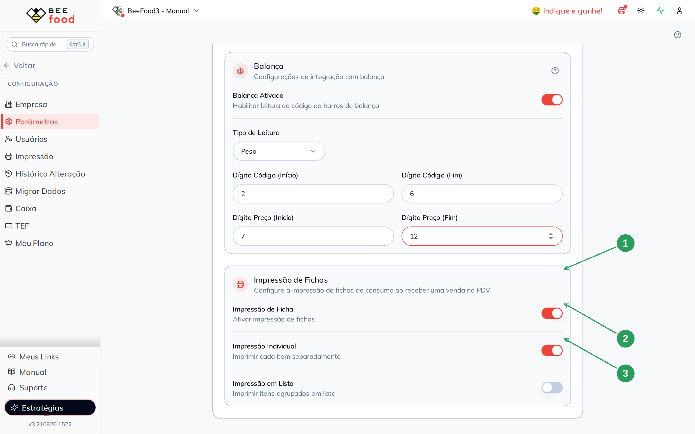
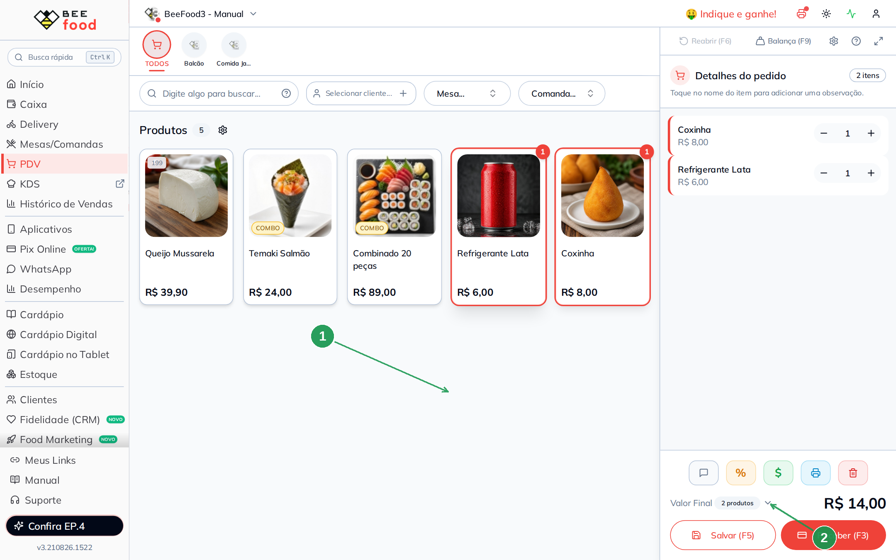
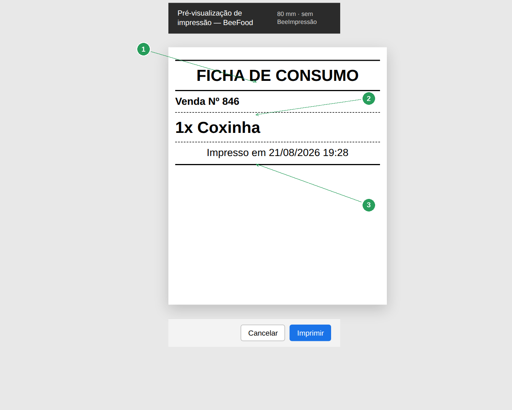
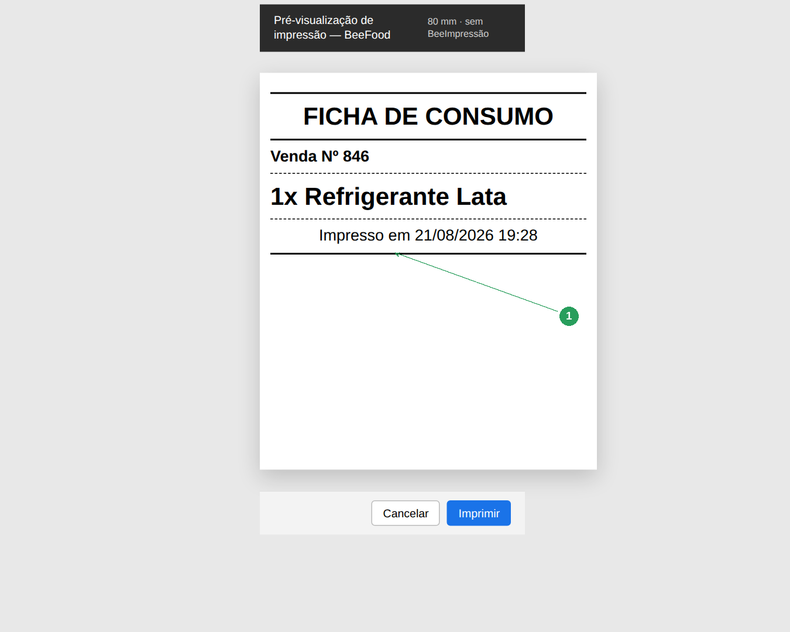
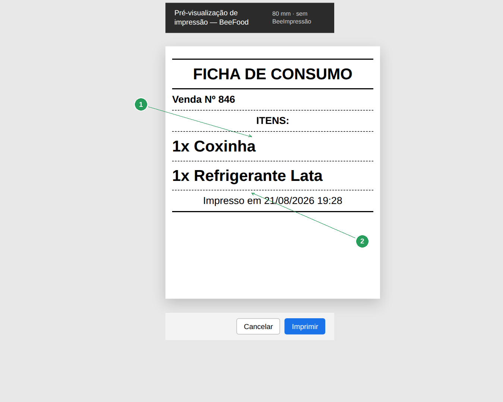

# Manual — Fichas de consumo no PDV

Este manual explica o que é a **ficha de consumo**, a diferença entre **Individual** e
**Lista**, e o que sai na impressão.

> As imagens têm **setas numeradas** (1, 2, 3…). Cada número indica o campo ou botão
> correspondente na tela.

---

## O que é a ficha

A ficha **não é cupom fiscal** e **não é o cupom do cliente**. É o ticket de passagem
(balcão / produção): o que foi pedido, para quem, em qual mesa ou comanda.

Ela dispara **ao receber a venda no PDV**, **antes** do cupom do cliente.

Sem o servidor BeeImpressão, o BeeFood abre o **preview do navegador** — é a mesma ficha,
só muda a porta de saída. O aviso *Impressão via navegador — Servidor offline* confirma
esse caminho.

---

## Os três switches

**Configuração → Parâmetros**, bloco **Impressão de Fichas**. A tela grava sozinha.

| Campo | Regra |
|-------|--------|
| **Impressão de Ficha** | O mestre. Se ligar e nenhum modo estiver on, o sistema força **Individual**. |
| **Impressão Individual** | Uma ficha **por item** (um preview para cada). |
| **Impressão em Lista** | **Uma** ficha com todos os itens. |

Individual e Lista são **um ou outro** (XOR). Não dá para desligar os dois ao mesmo tempo:
a tela ignora o clique.

| Nº | Item | O que fazer |
|----|------|-------------|
| 1 | **Impressão de Ficha** | O mestre precisa estar **ligado**. |
| 2 | **Impressão Individual** | Uma ficha por produto. |
| 3 | **Impressão em Lista** | Desligado neste exemplo. |

Para testar só as fichas, deixe **Imprimir Venda Sempre** desligado — senão o cupom do
cliente invade o preview.

---

## O que é impresso (os dois modos)

Cabeçalho **FICHA DE CONSUMO**; venda nº; cliente; mesa; comanda; o item em destaque
(`1x Coxinha`); opções (`• 1x …`); `Obs:`; rodapé `Impresso em dd/mm/aaaa hh:mm`.

**Individual:** esse bloco se **repete**, um preview por item.  
**Lista:** um único bloco com o título **ITENS:** e todos os produtos.

---

## Prova — Individual (dois previews)

No PDV, lance **dois** produtos (Coxinha + Refrigerante Lata) e **Receber (F3)**.

| Nº | Item | O que conferir |
|----|------|----------------|
| 1 | Coxinha e Refrigerante | Dois itens = duas fichas no Individual. |
| 2 | **Receber (F3)** | Dispara as fichas e depois o pagamento. |

No modo Individual saem **dois** previews:

| Nº | Item | O que conferir |
|----|------|----------------|
| 1 | **FICHA DE CONSUMO** | O título do ticket de produção. |
| 2 | **Venda Nº** | O número da venda. |
| 3 | **1x Coxinha** | Só este item. |

| Nº | Item | O que conferir |
|----|------|----------------|
| 1 | **1x Refrigerante Lata** | A segunda ficha, o outro item. |

Cancele o diálogo (Esc) entre uma ficha e outra — senão a fila de impressão empilha.

---

## Prova — Lista (um preview)

Desligue Individual e ligue **Impressão em Lista**. Faça de novo uma venda com os mesmos
dois produtos. Sai **uma** ficha:

| Nº | Item | O que conferir |
|----|------|----------------|
| 1 | **ITENS:** | O título que só existe no modo Lista. |
| 2 | **1x Coxinha** e **1x Refrigerante Lata** | Os dois no mesmo papel. |

---

## Individual × Lista

| | Individual | Lista |
|--|------------|-------|
| Quantos papéis | Um por item | Um para o pedido |
| Título extra | — | **ITENS:** |
| Quando usar | Cozinha por prato, cada um numa comanda | Balcão que junta o pedido numa via |

---

## Resumo do caminho

1. Ligue **Impressão de Ficha** (Individual entra sozinho se os dois modos estiverem off).
2. Venda com **dois** produtos → Receber → **dois** previews (Individual).
3. Troque para Lista → nova venda → **um** preview com os dois itens.
4. Sem BeeImpressão, o preview do navegador **é** a ficha.

---

## Perguntas frequentes

**Isso substitui o cupom do cliente?** Não. O cupom é o outro switch (**Imprimir Venda
Sempre**) e tem layout diferente — ver o manual **PDV — número e cupom**.

**Posso ligar Individual e Lista juntos?** Não. A tela mantém só um.

**A ficha saiu sem mesa.** Mesa e comanda só entram se o pedido tiver. No PDV balcão
elas ficam em branco.

---

## Manuais relacionados

- **PDV — número e cupom** — o cupom do cliente, no mesmo card
- **PDV — balança** — outro bloco do card PDV
