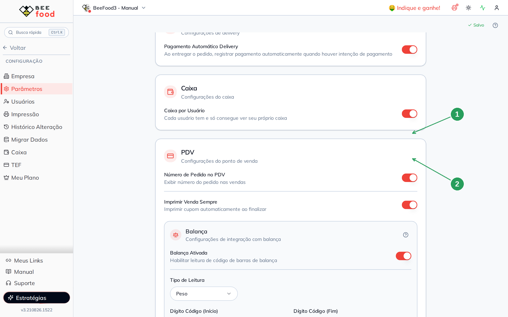
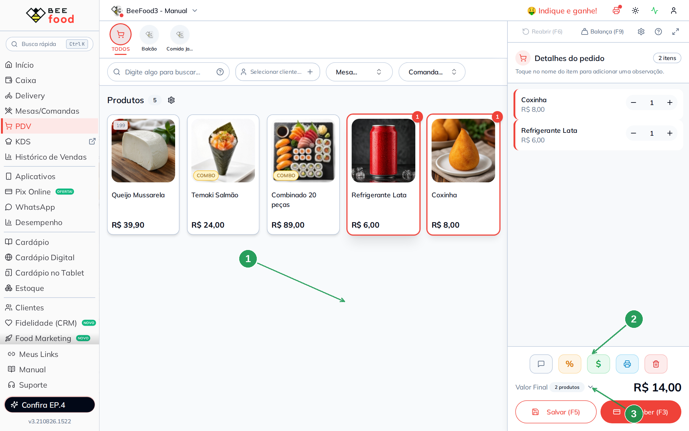
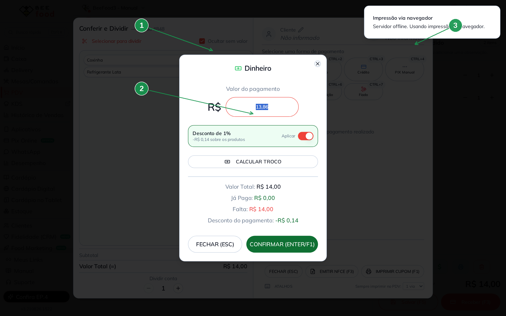
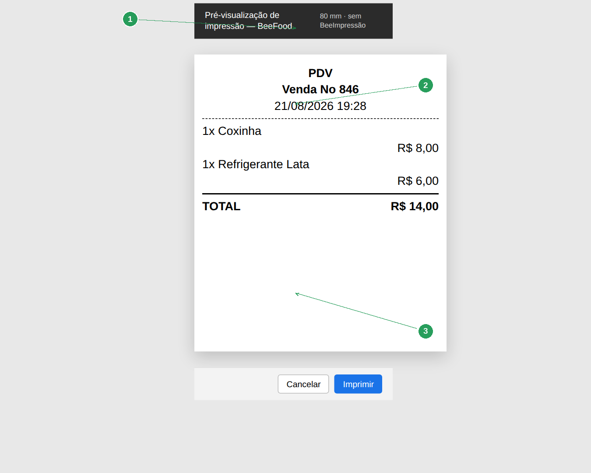

# Manual — Número do pedido e cupom no PDV

Este manual mostra os dois switches do card **PDV**: o **número da venda** na tela e o
**cupom que imprime sozinho** ao finalizar.

> As imagens têm **setas numeradas** (1, 2, 3…). Cada número indica o campo ou botão
> correspondente na tela.

---

## O que cada switch faz

| Campo | Efeito |
|-------|--------|
| **Número de Pedido no PDV** | Mostra o número da venda (ex.: *Venda #848*) |
| **Imprimir Venda Sempre** | Ao finalizar, dispara o cupom do cliente |

A alteração **grava sozinha**.

A **ficha de consumo** (ticket da produção) é outro bloco, outro manual. Deixe as fichas
desligadas enquanto testa só o cupom — senão o preview do navegador mistura os dois.

---

## Onde fica

**Configuração → Parâmetros**, card **PDV**.

| Nº | Item | O que fazer |
|----|------|-------------|
| 1 | **Número de Pedido no PDV** | Ligue para ver o # da venda. |
| 2 | **Imprimir Venda Sempre** | Ligue para o cupom sair ao receber. |

---

## Prova — o número na venda

Abra o **PDV**, lance os itens (aqui: Coxinha R$ 8,00 + Refrigerante Lata R$ 6,00) e
toque em **Receber (F3)**.

| Nº | Item | O que conferir |
|----|------|----------------|
| 1 | Os dois produtos | Qualquer combinação serve. |
| 2 | **Valor Final** | R$ 14,00 neste exemplo. |
| 3 | **Receber (F3)** | Abre Conferir e Dividir. |

O modal de pagamento traz o número no título: **Conferir e Dividir — Venda #848**.
Escolha **Dinheiro** (Ctrl+1).

| Nº | Item | O que conferir |
|----|------|----------------|
| 1 | **Venda #848** | O número do parâmetro, no título. |
| 2 | **Dinheiro** | Valor e o desconto de 1% da forma, se houver. |
| 3 | O aviso de impressão | *Impressão via navegador — Servidor offline.* |

O aviso **Impressão via navegador** é o comportamento certo quando não há BeeImpressão:
o BeeFood tenta o servidor local, não acha e cai no preview do navegador. **É o mesmo
cupom** — só muda a porta de saída.

---

## O cupom no preview do navegador

O cupom do cliente (não é ficha de produção) traz cabeçalho **PDV**, o número da venda,
data/hora, os itens e o **TOTAL**.

| Nº | Item | O que conferir |
|----|------|----------------|
| 1 | A faixa de preview | 80 mm, sem BeeImpressão. |
| 2 | **Venda No 848** (ou o número da sua venda) | O mesmo # da tela. |
| 3 | Os itens e o **TOTAL** | Coxinha + Refrigerante = R$ 14,00. |

Depois de pagar, o botão **IMPRIMIR CUPOM (F1)** no modal **Conferir e Dividir** dispara
o mesmo cupom de novo.

---

## Resumo do caminho

1. Ligue **Número de Pedido no PDV** e, se quiser o cupom sozinho, **Imprimir Venda Sempre**.
2. Venda no PDV → **Receber (F3)** → confira o **#** no título.
3. Sem servidor de impressão, o BeeFood abre o **preview do navegador**. É o cupom.

---

## Perguntas frequentes

**Não saiu papel na térmica.** Sem o aplicativo BeeImpressão o sistema não fala com a
impressora. O preview do navegador é a prova de que o cupom foi montado.

**Apareceram dois previews.** As **fichas** também imprimem ao receber. Desligue
*Impressão de Ficha* neste teste, ou veja o manual das fichas.

**O número não aparece.** Confira se o switch está ligado e recarregue o PDV.

---

## Manuais relacionados

- **PDV — fichas de consumo** — o ticket da produção, não o cupom do cliente
- **PDV — balança** — o outro bloco do mesmo card PDV
