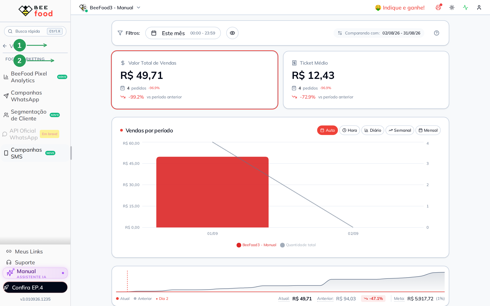
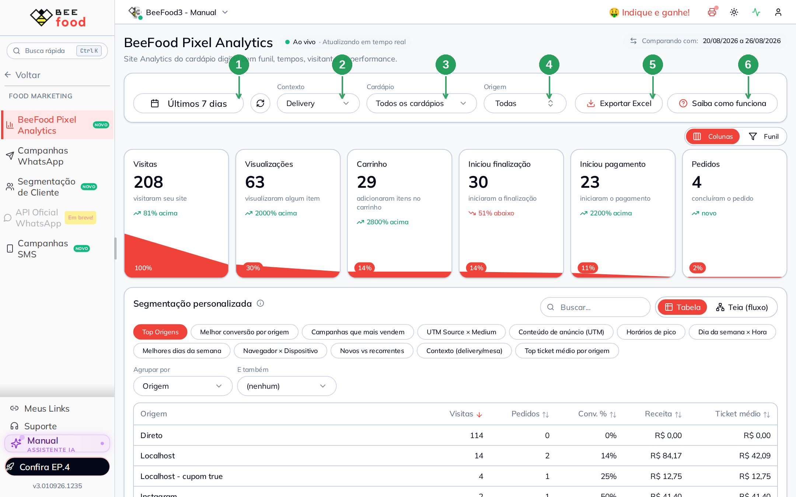
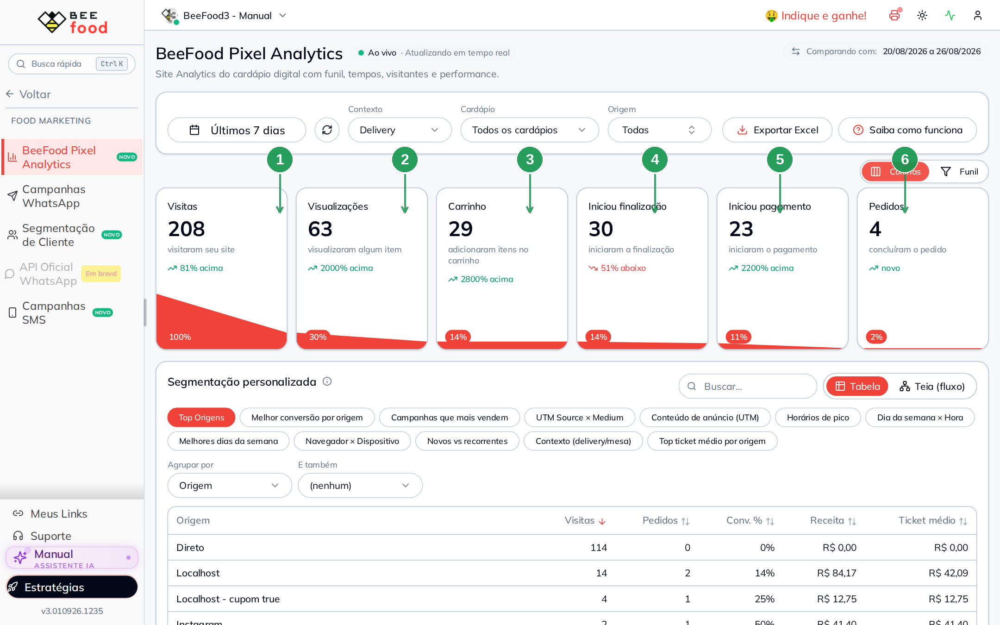
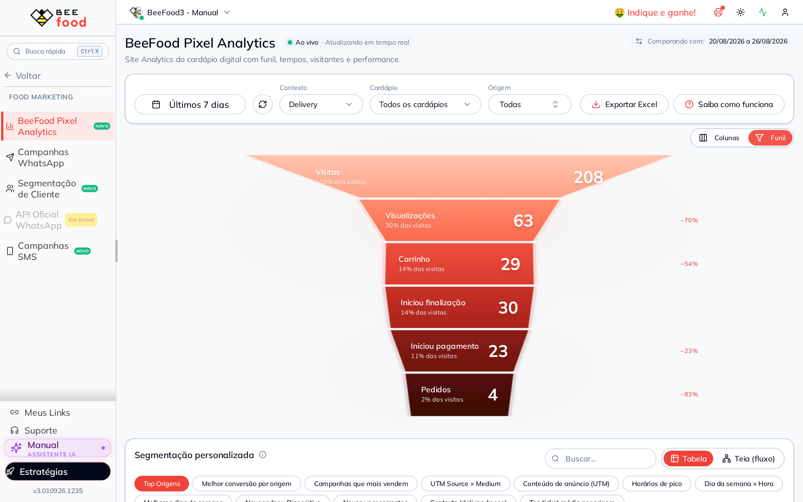
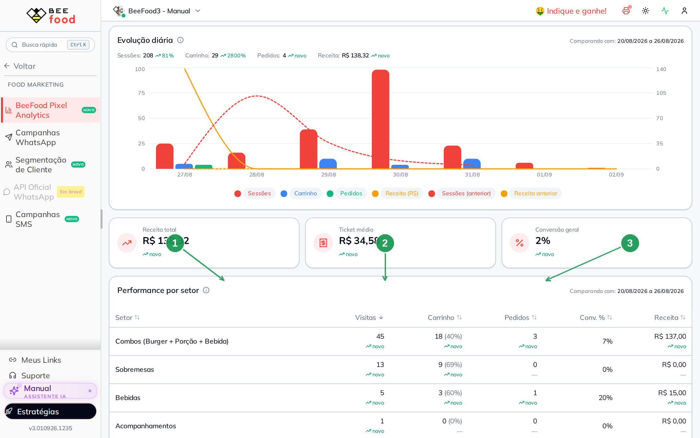
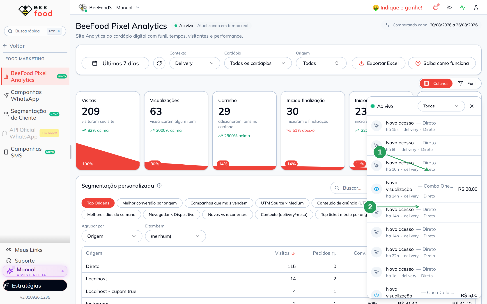
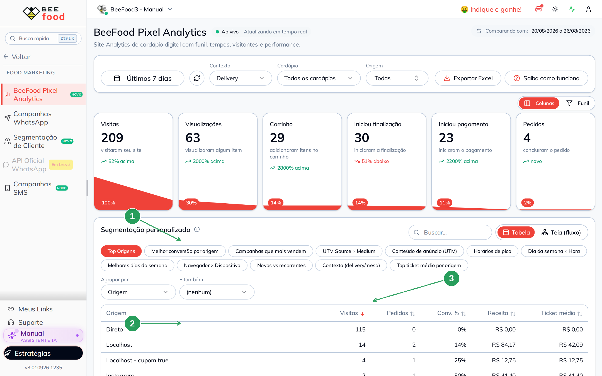
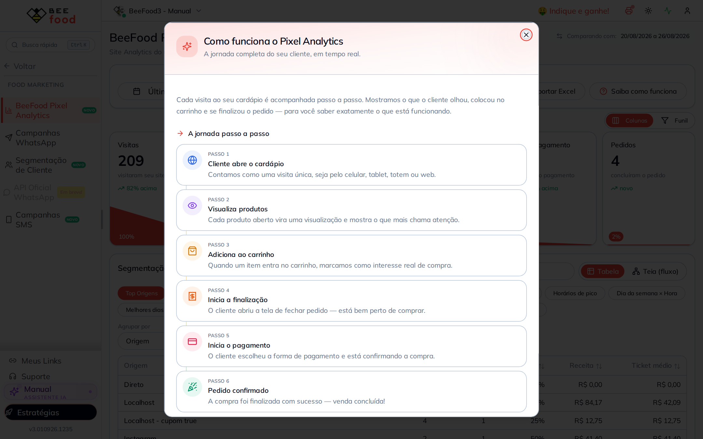

# BeeFood Pixel Analytics — ler o funil do cardápio

O **BeeFood Pixel Analytics** mostra o que acontece no seu cardápio digital:
quem entrou, o que olhou, o que colocou na sacola e quem fechou o pedido.

Ele já está ligado. Não precisa criar Pixel, colar código nem pedir chave
para a Meta ou o Google. É o analytics **do próprio BeeFood**.

Este manual ensina a **ler** a tela: o funil, os filtros, os três números
de resultado e o painel **Ao vivo**.

> As imagens têm **setas com números** (1, 2, 3…). No texto, cada número
> indica exatamente o campo ou botão correspondente na tela.

O Pixel da Meta (Facebook) é outra coisa: fica em **Aplicativos → Facebook
Pixel** e serve para anúncio. Aqui o assunto é só o painel de Food Marketing.

---

## Onde encontrar

No menu lateral, abra **Food Marketing** (1) e clique em **BeeFood Pixel
Analytics** (2).

| Nº | O que é | O que faz |
|----|---------|-----------|
| 1. | **Food Marketing** | Grupo do menu com o analytics, campanhas e segmentação |
| 2. | **BeeFood Pixel Analytics** | Abre o painel |

A permissão é a mesma do grupo: se o item não aparece, o grupo de acesso
tirou **BeeFood Pixel Analytics**.

O rastreio existe desde **1º de junho de 2026**. O calendário não deixa
escolher data anterior.

---

## Os filtros do topo

A tela abre no contexto **Delivery**, nos **últimos 7 dias**, em todos os
cardápios e em todas as origens. Trocar o período já recarrega os números.
Trocar contexto, cardápio ou origem só recorta o que já veio.

| Nº | Campo | O que faz |
|----|--------|-----------|
| 1. | **Período** | Recorte das datas. O selo ao lado compara com o intervalo imediatamente anterior, de mesmo tamanho |
| 2. | **Contexto** | Delivery, Presencial (QR Code na mesa), Totem ou Tablet. **Todos** junta os canais |
| 3. | **Cardápio** | Aparece quando a conta tem mais de um cardápio com visita no período |
| 4. | **Origem** | De onde a pessoa chegou: Direto, Instagram, campanha, cupom, SMS… |
| 5. | **Exportar Excel** | Baixa a tela e as segmentações numa planilha |
| 6. | **Saiba como funciona** | Abre o resumo da jornada (a mesma jornada deste manual) |

O ponto verde **Ao vivo** no título confirma que o painel está recebendo
eventos. Os números da tela também atualizam sozinhos enquanto ela fica aberta.

---

## Como ler o funil

São **seis etapas**. Cada card conta **quantas sessões chegaram naquela
etapa**. A porcentagem vermelha na base é **em relação às visitas**, não
em relação ao card anterior.

| Nº | Etapa | O que conta |
|----|--------|-------------|
| 1. | **Visitas** | Alguém abriu o cardápio. Sempre 100% |
| 2. | **Visualizações** | Abriu a ficha de algum produto |
| 3. | **Carrinho** | Colocou item na sacola |
| 4. | **Iniciou finalização** | Abriu a tela de fechar o pedido |
| 5. | **Iniciou pagamento** | Escolheu a forma de pagamento. Some no contexto **Presencial** — mesa e QR Code não passam por essa etapa |
| 6. | **Pedidos** | Pedido confirmado |

A seta verde ou vermelha embaixo do número compara com o período anterior
(“81% acima”, “novo” quando o período passado não tinha aquele valor).

O botão **Funil**, no canto do bloco, troca as colunas pelo desenho clássico:
cada faixa é uma etapa e o **−N%** à direita é a perda **para a etapa de cima**.

Use as colunas no dia a dia. Use o funil clássico quando quiser enxergar
a queda de um passo para o outro.

---

## Os três números de resultado

Role a tela. Depois do gráfico de evolução diária ficam os três KPIs.

| Nº | KPI | Como nasce |
|----|-----|------------|
| 1. | **Receita total** | Soma do valor dos pedidos do recorte |
| 2. | **Ticket médio** | Receita ÷ pedidos. Sem pedido, fica R$ 0,00 |
| 3. | **Conversão geral** | Pedidos ÷ visitas, em % |

No exemplo da imagem: 4 pedidos em 208 visitas = **2%**, ticket **R$ 34,58**.
A tabela **Performance por setor**, logo abaixo, mostra o mesmo recorte
quebrado por categoria do cardápio (combos, sobremesas, bebidas…).

---

## O painel Ao vivo

No canto inferior direito fica o feed. Ele pergunta a cada poucos segundos
o que aconteceu agora no cardápio.

| Nº | O que é | O que mostra |
|----|---------|--------------|
| 1. | **Ao vivo** | Abre ou fecha a lista. A bolinha verde confirma a conexão |
| 2. | **Evento** | Tipo (Novo acesso, Nova visualização, Novo carrinho, Novo pedido…), produto ou valor, contexto e origem |

Quando um pedido fecha, a tela solta um foguete. O card do funil daquela
etapa também pisca. Dá para filtrar a lista em **Todos**, **Pedidos**,
**Carrinhos** ou **Visualizações**.

---

## De onde veio o cliente

Abaixo do funil está a **Segmentação personalizada**. O atalho **Top
Origens** (1) já abre a tabela por origem: visitas, pedidos, conversão,
receita e ticket (3). No sandbox, **Direto** concentra a maior parte das
visitas (2); Instagram e campanhas aparecem com conversão própria.

Os outros atalhos cruzam UTM, dia e hora, navegador, novos × recorrentes
e contexto. **Tabela** lista os números; **Teia (fluxo)** desenha o
caminho entre dois agrupamentos.

---

## O resto da página

Tudo abaixo obedece aos mesmos filtros do topo. Não precisa configurar
nada — só ler.

| Bloco | Para que serve |
|-------|----------------|
| **Análise de tempo** | Tempo médio entre as etapas. Menos tempo é melhor |
| **Engajamento** | Quantos produtos foram vistos ou adicionados (com repetição) e a duração média da visita |
| **Análise de visitantes** | Novos × recorrentes, dia a dia |
| **Evolução diária** | Sessões, sacola, pedidos e receita no gráfico |
| **Performance de produtos** | Ranking por visita, sacola, pedido e receita |
| **Cupom & Cashback** | Sessões que usaram cupom ou saldo |
| **Dispositivos** | PC, celular, tablet e Android × iOS |

---

## A jornada em uma tela

O botão **Saiba como funciona** (seta 6 da imagem dos filtros) abre este
resumo. É o mesmo funil, em texto.

---

## Dicas

- Comece pelo **Delivery** (já vem selecionado) e compare com **Presencial**
  ou **Totem** se a loja usa esses canais.
- Uma origem com pouca visita e muita conversão (um anúncio, um cupom)
  pode valer mais do que “Direto” com volume alto e pedido nenhum.
- Queda grande de **Carrinho → Pedidos** pede olhar pagamento, taxa e
  tempo de entrega — não o cardápio em si.
- Queda grande de **Visitas → Visualizações** pede capa, busca e foto
  do produto.
- O Excel exporta o recorte atual e as segmentações. Use quando for
  mandar o número para fora do BeeFood.

---

*Última atualização: setembro/2026 — BeeFood · BeeFood Pixel Analytics*
