# Pixel da Meta + API de Conversões — rastreie o cardápio digital

Conecte o **Pixel da Meta** com a **API de Conversões** ao seu cardápio digital BeeFood.
É o método **recomendado**: o evento vai pelo navegador **e** pelo servidor, e some menos
dado quando o celular do cliente bloqueia cookies.

Ao configurar com sucesso, o cardápio passa a enviar estes eventos:

- **Visualizar conteúdo** — toda vez que um produto ou página é vista
- **Adicionar ao Carrinho** — toda vez que um produto entra no carrinho
- **Inicialização de Compra** — quando o cliente informa o login e começa a finalizar
- **Compra** — toda vez que uma compra é realizada

> As imagens têm **marcações em verde** (setas e números) nas telas do BeeFood.

---

## Antes de começar

1. Conta **Business** da Meta com acesso ao **Gerenciador de Eventos**.
2. Conta BeeFood com pelo menos um **cardápio digital**.
3. Ter em mãos o **Identificador** (Pixel ID) e o **Token de acesso** gerados na Meta.

Se você só tem o Pixel ID (sem token), use o manual **Pixel da Meta somente**.

---

## Parte 1 — Meta: criar a fonte e copiar Identificador + Token

### Passo 1. Abrir o Gerenciador de Eventos

Na conta Business, no menu superior, abra **Gerenciador de Eventos**.

### Passo 2. Conectar uma fonte de dados

Clique em **Conectar fontes de dados**.

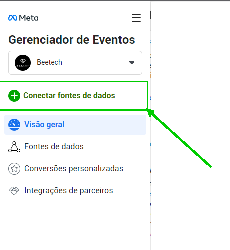

### Passo 3. Escolher a fonte Web

Selecione **Web** e clique em **Avançar**.

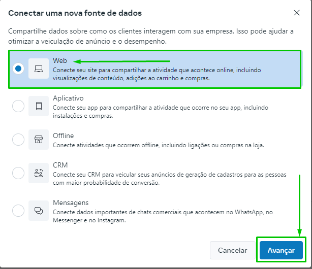

### Passo 4. Nomear o Pixel

Use um nome fácil de achar depois, por exemplo **Cardápio Digital BeeFood**, e clique em **Avançar**.

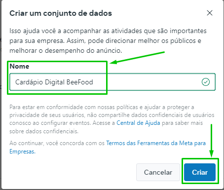

### Passo 5. Escolher API de Conversões e Pixel da Meta

Selecione **API de Conversões e Pixel da Meta** e clique em **Avançar**.

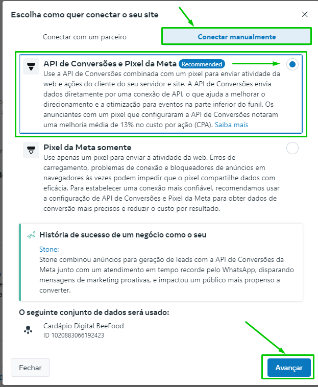

### Passo 6. Concluir a criação

Clique em **Concluir**.

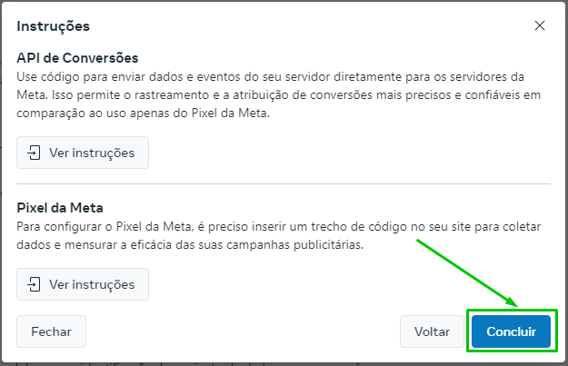

### Passo 7. Copiar o Identificador (Pixel ID)

Abra a fonte recém-criada, vá na aba **Configurações** e clique em **Identificação do conjunto de dados** para copiar o número.

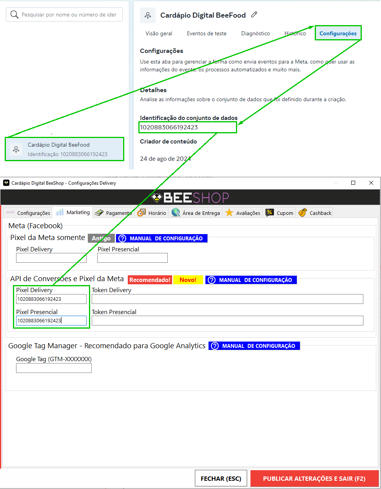

Esse número é o **Pixel ID Delivery** no BeeFood.

### Passo 8. Gerar o token de acesso

Ainda em **Configurações**, localize **Configurar integração direta** e clique em **Gerar token de acesso**.

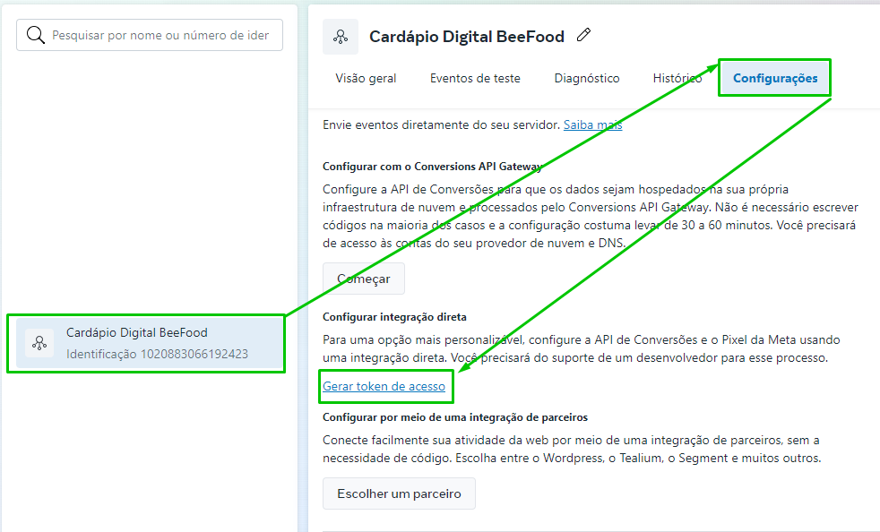

### Passo 9. Copiar o token

Clique sobre o token gerado para copiar. Guarde em lugar seguro: ele não volta a aparecer inteiro.

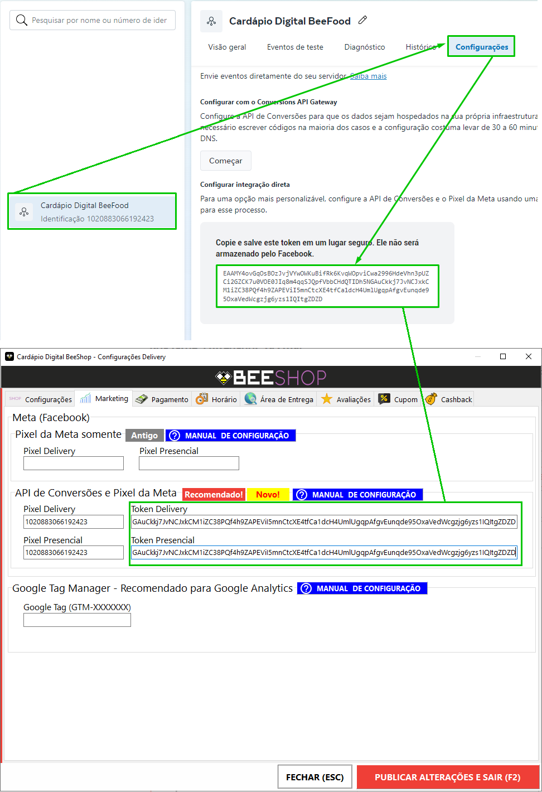

Esse valor é o **Token Delivery** no BeeFood.

---

## Parte 2 — BeeFood: colar e salvar

### Passo 10. Abrir Aplicativos → Facebook Pixel

No BeeFood, clique em **Aplicativos** (1) no menu lateral. Role até **Marketing e CRM** e abra o card **Facebook Pixel** (2).

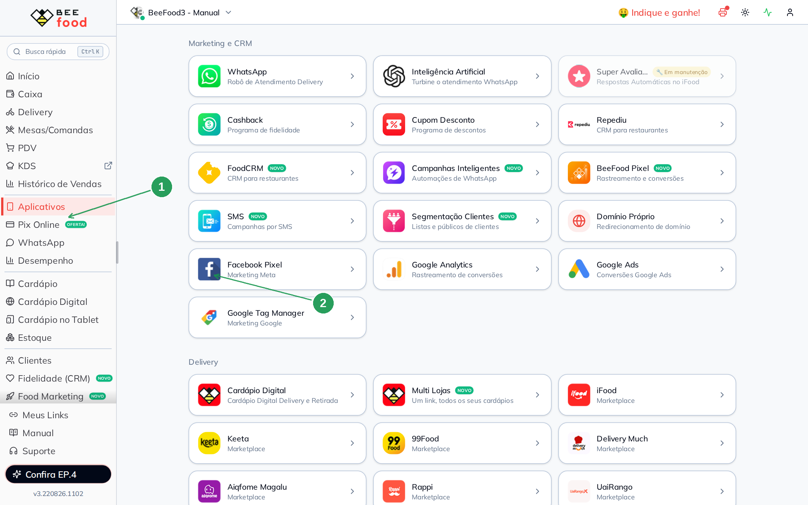

### Passo 11. Escolher o cardápio

Na janela **Facebook Pixel**, clique em **CONFIGURAR** (1) no cardápio que vai receber o rastreamento.

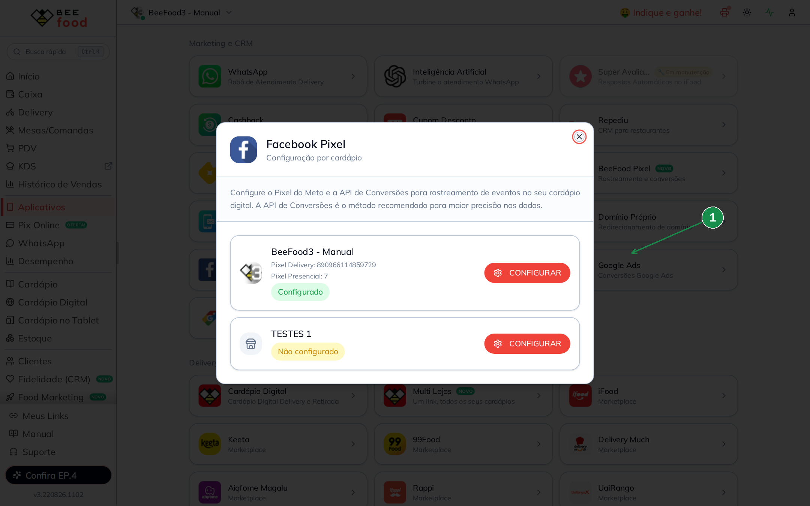

A API de Conversões é o método recomendado — o próprio texto da janela confirma isso.

### Passo 12. Colar Pixel ID, Token e salvar

No modal **Pixel da Meta (Facebook)**:

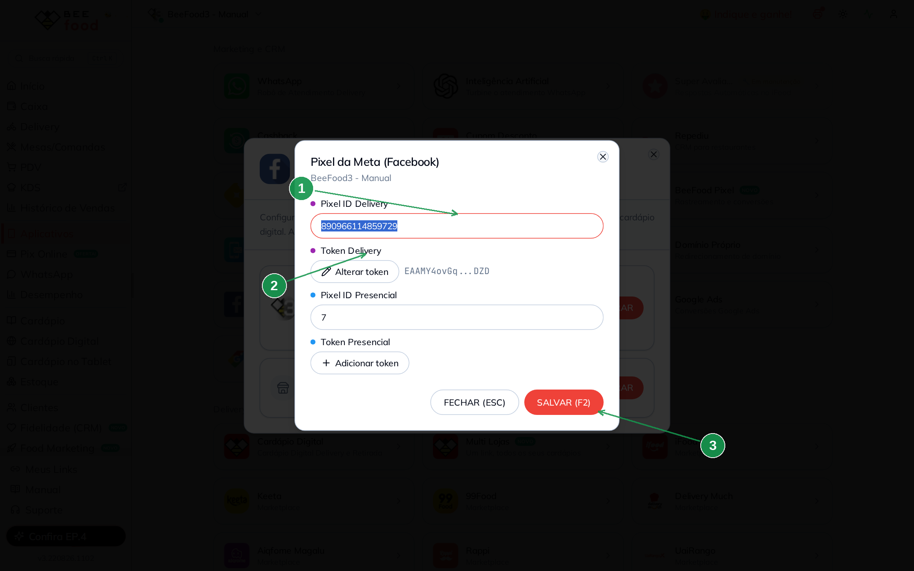

| Nº | Campo no BeeFood | O que colar |
|----|------------------|-------------|
| 1. | **Pixel ID Delivery** \* | Identificador copiado no Passo 7 |
| 2. | **Token Delivery** \* | Clique em **Adicionar token** (ou **Alterar token**) e cole o token do Passo 9 |
| 3. | **SALVAR (F2)** | Grava a configuração |

Não preencha **Pixel ID Presencial** nem **Token Presencial** neste manual — eles são para o cardápio da mesa, não para o delivery.

---

## O que passa a ser rastreado

Depois de salvar, o cardápio digital envia:

- Visualizar conteúdo
- Adicionar ao Carrinho
- Inicialização de Compra
- Compra

---

## Problemas comuns

| Sintoma | O que verificar |
|---------|-----------------|
| Eventos não aparecem na Meta | O **Pixel ID** e o **Token** foram colados no cardápio certo? Salvou com **SALVAR (F2)**? |
| Só o Pixel ID, sem token | Este manual precisa dos **dois**. Sem token, use o caminho **Pixel da Meta somente** |
| Token parece cortado | É normal: o BeeFood mostra só o começo e o fim (`abc…xyz`) |

---

## Precisa de ajuda?

Fale com o **suporte BeeFood** informando: nome da loja e **CNPJ**, qual **cardápio digital** e um print do modal (sem expor o token inteiro em canais públicos).

---

*Última atualização: agosto/2026 — BeeFood · Pixel da Meta + API de Conversões*
