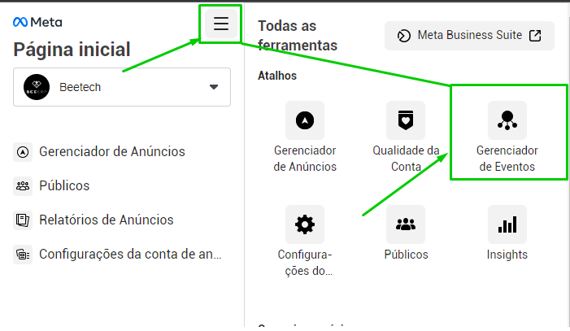
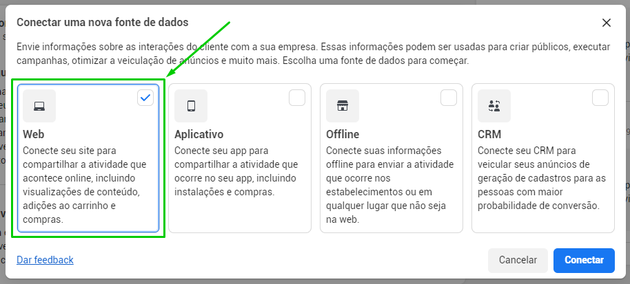
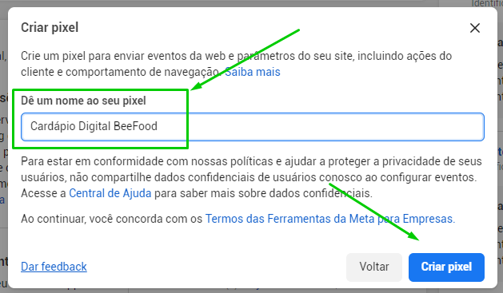
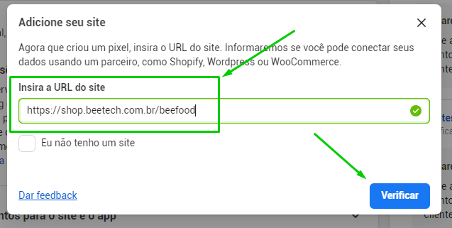
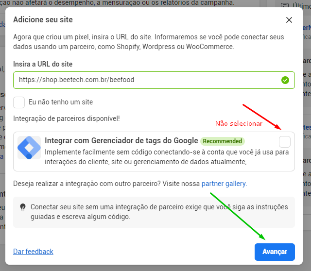
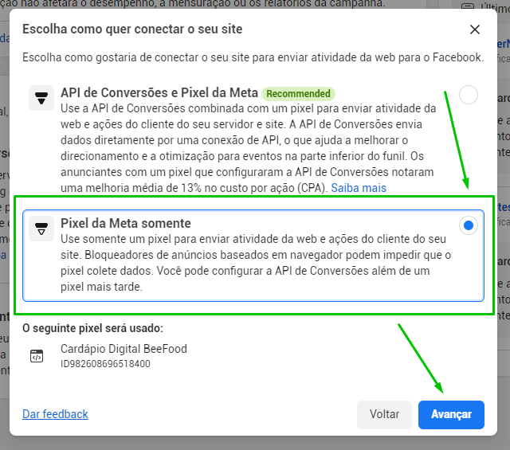
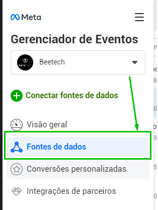
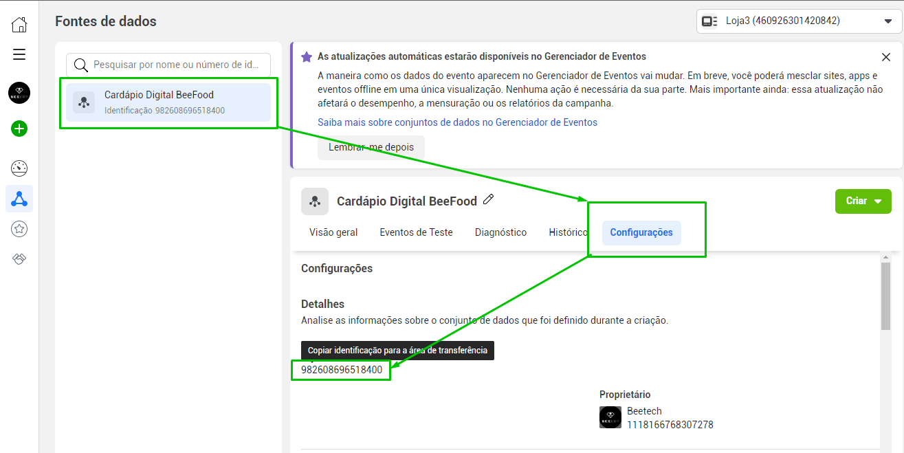
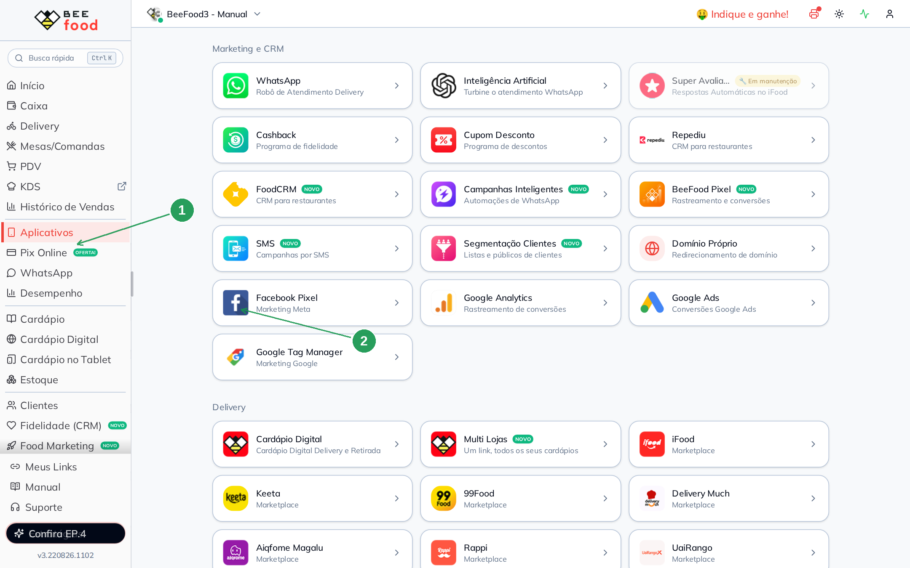
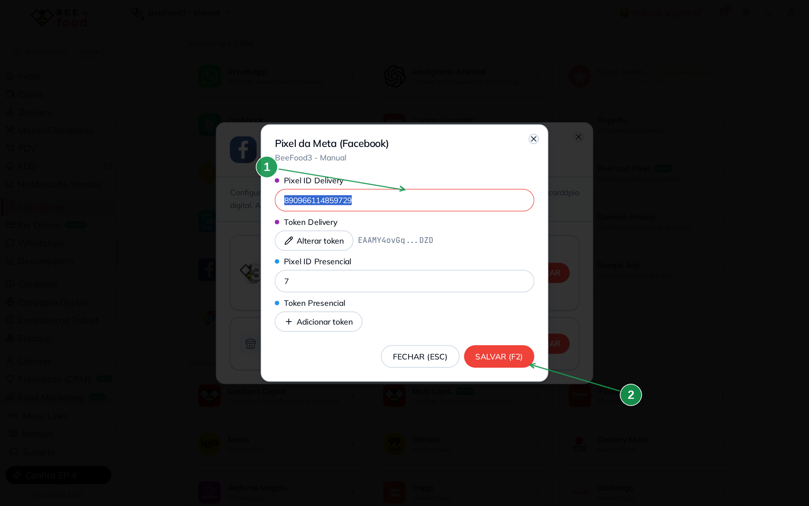

# Pixel da Meta somente — caminho antigo (só o Pixel ID)

Este é o caminho **antigo**: você cria o Pixel na Meta e cola **só o Pixel ID** no BeeFood,
sem token da API de Conversões.

O método **recomendado** hoje é o manual **Pixel da Meta + API de Conversões** (Identificador
**e** Token). Use este aqui se a Meta já gerou o Pixel no modo **Pixel da Meta somente**,
ou se você ainda não tem o token.

Alguns dados podem não ser capturados em celulares com a privacidade ativa — por isso a
API de Conversões é mais precisa.

Eventos rastreados depois de salvar:

- **Visualizar conteúdo**
- **Adicionar ao Carrinho**
- **Inicialização de Compra**
- **Compra**

> As imagens têm **marcações em verde** nas telas do BeeFood.

---

## Antes de começar

1. Conta **Business** da Meta com acesso ao **Gerenciador de Eventos**.
2. Conta BeeFood com pelo menos um **cardápio digital**.
3. URL do seu cardápio digital (para a Meta verificar o site).

---

## Parte 1 — Meta: criar o Pixel e copiar o ID

### Passo 1. Abrir o Gerenciador de Eventos

Na conta Business, no menu superior, abra **Gerenciador de Eventos**.

### Passo 2. Conectar uma fonte de dados

Clique em **Conectar fontes de dados**.

### Passo 3. Escolher Web e Conectar

Selecione a versão **Web** e clique em **Conectar**.

### Passo 4. Nomear o Pixel

Use **Cardápio Digital BeeFood** (ou outro nome fácil) e clique em **Criar Pixel**.

### Passo 5. Informar a URL do cardápio e Verificar

Cole a URL do seu cardápio digital e clique em **Verificar**.

### Passo 6. Desmarcar o Gerenciador de Tags do Google

**Desmarque** a opção **Integrar com o Gerenciador de Tags do Google** e clique em **Avançar**.

### Passo 7. Escolher Pixel da Meta somente

Selecione **Pixel da Meta somente**.

### Passo 8. Abrir a fonte criada

No Gerenciador de Eventos, clique em **Fontes de dados** e abra o Pixel novo.

### Passo 9. Copiar o código de identificação

Selecione o Pixel, abra **Configurações** e clique sobre o **número do Pixel** para copiar.

Esse número é o **Pixel ID Delivery** no BeeFood.

---

## Parte 2 — BeeFood: colar só o Pixel ID

### Passo 10. Abrir Aplicativos → Facebook Pixel

No BeeFood, clique em **Aplicativos** (1) e, em **Marketing e CRM**, abra **Facebook Pixel** (2).

### Passo 11. Colar o Pixel ID Delivery e salvar

Clique em **CONFIGURAR** no cardápio desejado. No modal **Pixel da Meta (Facebook)**,
preencha **somente** o Pixel ID — **não** adicione token.

| Nº | Campo no BeeFood | O que fazer |
|----|------------------|-------------|
| 1. | **Pixel ID Delivery** \* | Cole o número copiado no Passo 9 |
| 2. | **SALVAR (F2)** | Grava a configuração |

Deixe **Token Delivery** sem preencher. Pixel / Token **Presencial** também ficam de fora
neste caminho.

---

## Problemas comuns

| Sintoma | O que verificar |
|---------|-----------------|
| Eventos falhos no celular | Privacidade do aparelho bloqueia o Pixel. Prefira a **API de Conversões** |
| Não sei qual caminho usar | Se você tem Identificador **e** Token, use o manual **Pixel da Meta + API de Conversões** |

---

## Precisa de ajuda?

Fale com o **suporte BeeFood** informando: nome da loja e **CNPJ**, qual **cardápio digital**.

---

*Última atualização: agosto/2026 — BeeFood · Pixel da Meta somente*
