# Portal do contador

Este manual é para o **escritório contábil**. O restaurante autoriza o seu CPF/CNPJ (manual
*Autorizar o contador*) e você entra em **beefood.app/contador** — não no painel do restaurante.

A senha é **uma só**, para todos os clientes que usam o mesmo documento. O fechamento que você
vê é o **mesmo** que o lojista vê em Fiscal → Fechamento Fiscal.

> As imagens têm **setas com números** (1, 2, 3...). No texto, cada número indica exatamente o
> campo ou botão correspondente na tela.

---

## Índice

- [1. O e-mail de autorização](#1-o-e-mail-de-autorização)
- [2. Entrar no portal](#2-entrar-no-portal)
- [3. Meus clientes](#3-meus-clientes)
- [4. Competências e o ZIP do mês](#4-competências-e-o-zip-do-mês)
- [5. O fechamento do mês](#5-o-fechamento-do-mês)
- [6. Produtos e documentos](#6-produtos-e-documentos)
- [7. NFe recebidas](#7-nfe-recebidas)
- [8. Edição fiscal](#8-edição-fiscal)
- [9. Perguntas rápidas](#9-perguntas-rápidas)

---

## 1. O e-mail de autorização

O remetente é **BeeFood Fiscal**. O botão muda se você já tem senha.

**Primeira vez:** **CRIAR MINHA SENHA**. No portal, informe o documento e escolha a senha.
Ela vale para todos os clientes deste CPF/CNPJ.

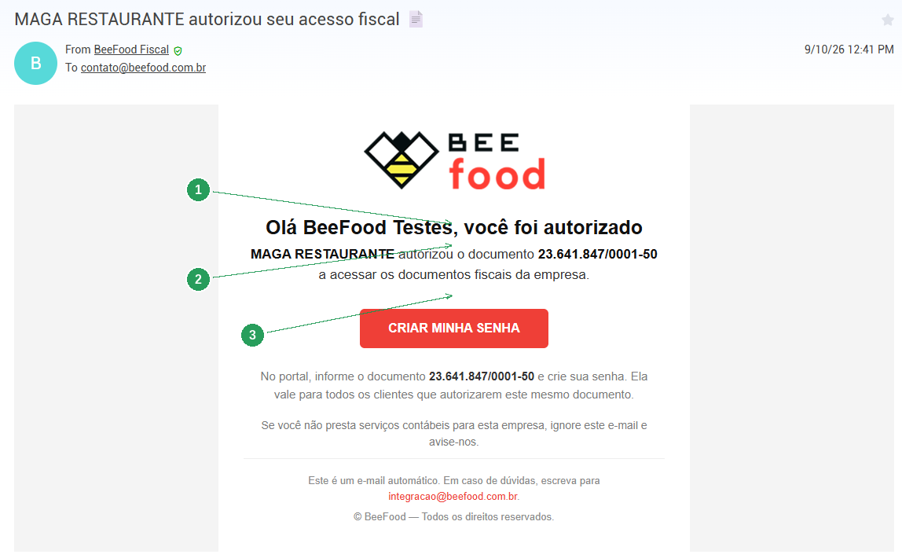

| Nº | Item | O que fazer |
|----|------|-------------|
| 1 | A empresa que autorizou | Confira se é o seu cliente. |
| 2 | O documento | O mesmo CPF/CNPJ que você vai digitar no portal. |
| 3 | **CRIAR MINHA SENHA** | Abre `beefood.app/contador`. |

**Já tem senha:** **ACESSAR O PORTAL**. Use a senha antiga. Se a empresa tiver mais de um CNPJ,
o e-mail diz quantos você vai ver na lista.

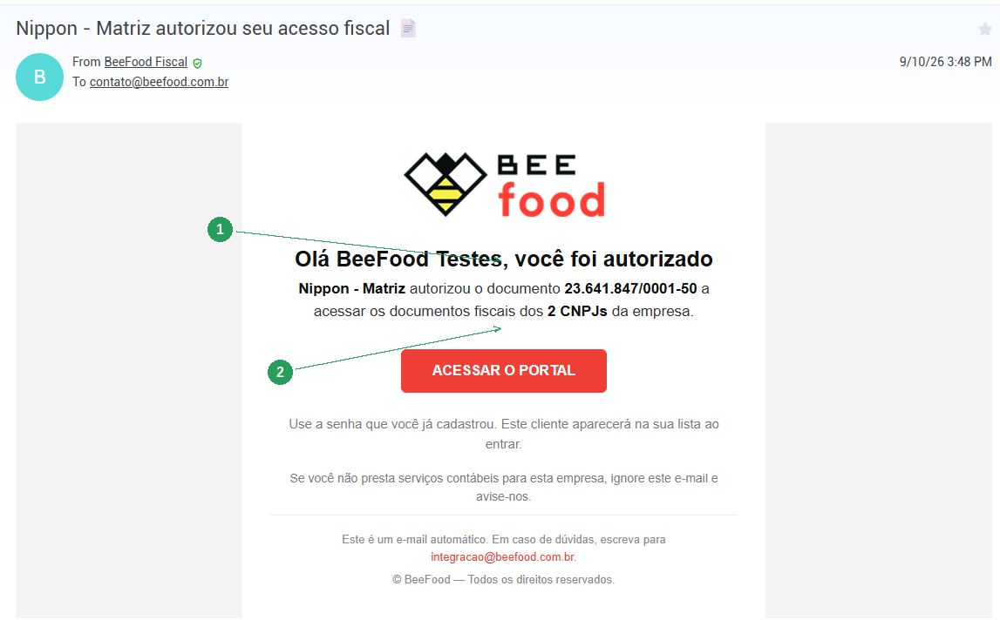

| Nº | Item | O que observar |
|----|------|----------------|
| 1 | **2 CNPJs** | Matriz e filial entram juntos. |
| 2 | **ACESSAR O PORTAL** | Não cria senha de novo. |

Se você **não** presta serviço para aquela empresa, ignore o e-mail e avise em
`integracao@beefood.com.br`.

---

## 2. Entrar no portal

Abra [beefood.app/contador](https://beefood.app/contador). É uma área **separada** do painel
do restaurante: login, senha e sessão próprios.

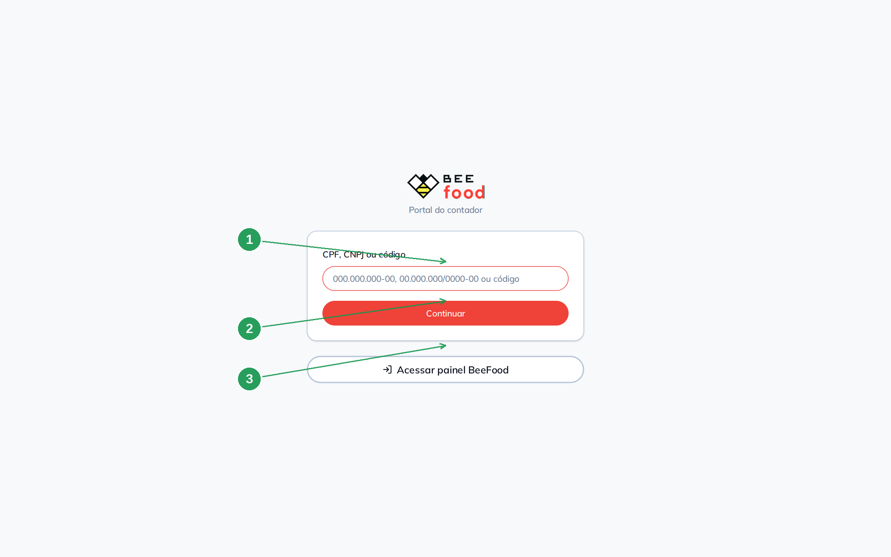

| Nº | Item | O que fazer |
|----|------|-------------|
| 1 | **CPF, CNPJ ou código** | O documento autorizado. Aceita com ou sem máscara. |
| 2 | **Continuar** | O portal descobre se é primeiro acesso ou login. |
| 3 | **Acessar painel BeeFood** | Volta ao login do restaurante. Não é aqui que o contador entra. |

Se for o primeiro acesso, a próxima tela pede para **criar a senha**. Se a conta já existe,
pede a senha.

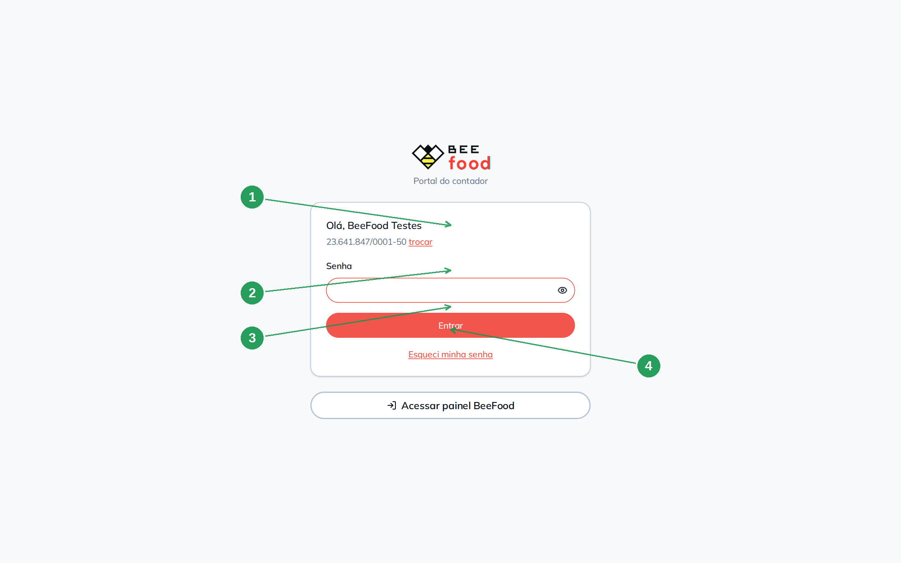

| Nº | Item | O que fazer |
|----|------|-------------|
| 1 | O nome e o documento | Confira se é a sua conta. **trocar** volta ao passo anterior. |
| 2 | **Senha** | A que você criou. |
| 3 | **Entrar** | Abre *Meus clientes*. |
| 4 | **Esqueci minha senha** | Envia o link para o e-mail cadastrado. |

A sessão dura **12 horas**. Depois, entre de novo. Sair está no menu do seu nome, no canto
direito.

---

## 3. Meus clientes

Cada CNPJ autorizado vira um cartão. Empresas com mais de um CNPJ aparecem **agrupadas**,
com selo **Matriz** ou **Filial**.

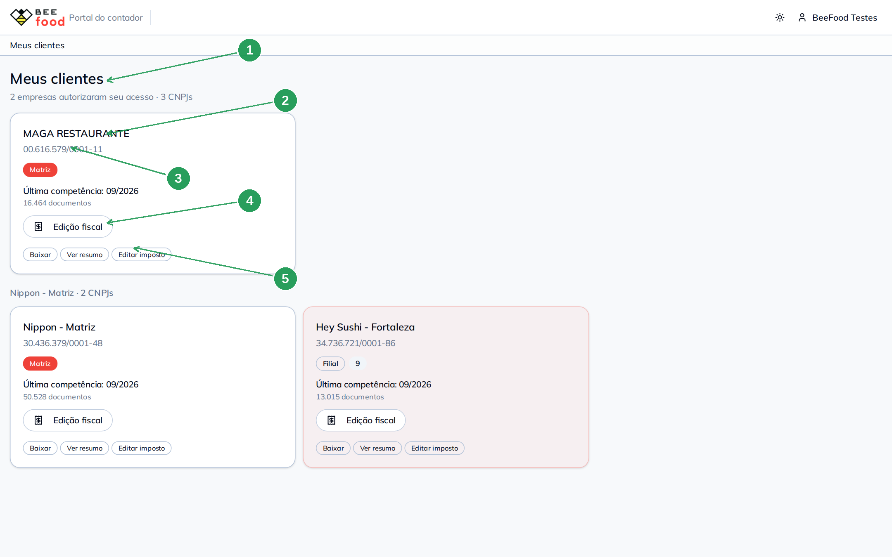

| Nº | Item | O que é |
|----|------|---------|
| 1 | O resumo | Quantas empresas e quantos CNPJs autorizaram você. |
| 2 | O cartão | Nome, CNPJ, última competência e quantidade de documentos. |
| 3 | **Matriz** / **Filial** | Qual estabelecimento da rede. |
| 4 | **Edição fiscal** | Atalho, se o cliente ligou essa permissão. |
| 5 | As permissões | *Baixar*, *Ver resumo*, *Editar imposto* — o que o lojista ligou. |

Clique no cartão (não só no botão) para abrir as competências daquele CNPJ.

Com muitos clientes, a busca por nome ou CNPJ aparece acima da lista.

---

## 4. Competências e o ZIP do mês

A primeira aba do cliente é a lista de meses com movimento.

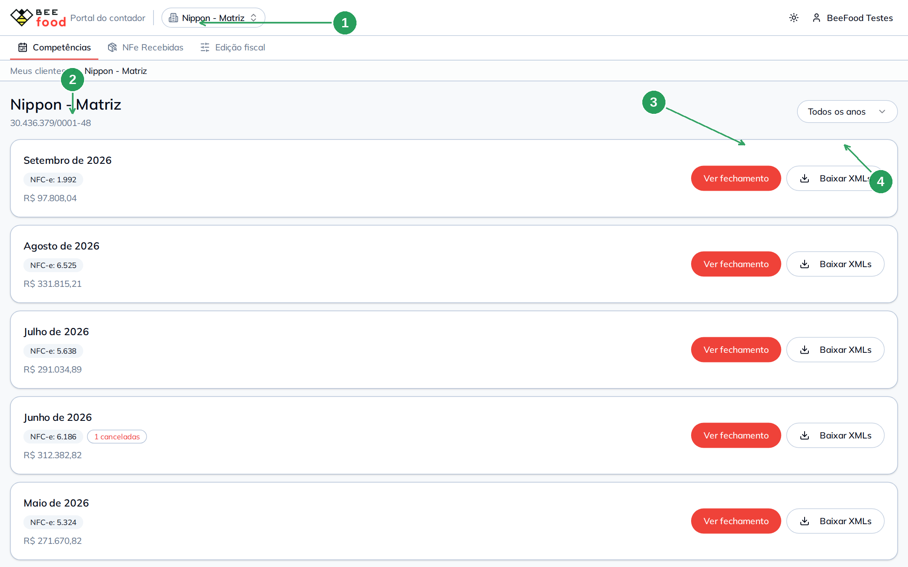

| Nº | Item | O que é |
|----|------|---------|
| 1 | O seletor de cliente | Troca de CNPJ sem voltar para a lista. |
| 2 | O mês | *Setembro de 2026*, chips de NFC-e / NF-e, canceladas e o total. |
| 3 | **Ver fechamento** | Abre o resumo daquele mês. |
| 4 | **Baixar XMLs** | ZIP do mês. O botão avisa enquanto monta o arquivo. |

Se faltar arquivo no mês, um aviso âmbar aparece **acima** dos números. Confira antes de
usar o total na apuração.

Acima de 1.000 documentos o portal pede confirmação: o download pode levar alguns segundos e
alguns megabytes. Há um limite de ZIPs por hora — se estourar, a mensagem do servidor
aparece na tela.

---

## 5. O fechamento do mês

É a mesma visão do lojista: totais, tributos, tipo de nota e lacunas de numeração.

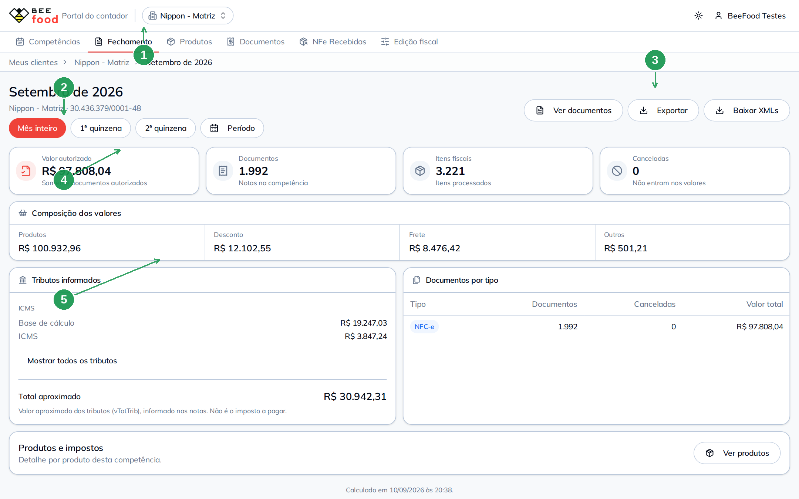

| Nº | Item | O que é |
|----|------|---------|
| 1 | As abas do cliente | Competências, Fechamento, Produtos, Documentos, NFe Recebidas, Edição fiscal. |
| 2 | O recorte de período | Mês inteiro ou intervalo de dias, igual ao painel. |
| 3 | **Exportar** | PDF e Excel. |
| 4 | Os cartões | Valor autorizado, documentos, itens, canceladas. |
| 5 | Tributos e por tipo | Impostos informados e a quebra NFC-e / NF-e. |

O aviso de integridade, quando existe, vem **antes** dos totais. Não assine um fechamento
sem ler esse recado.

---

## 6. Produtos e documentos

**Produtos** agrupa o que saiu nas notas, com CFOP, CST e NCM.

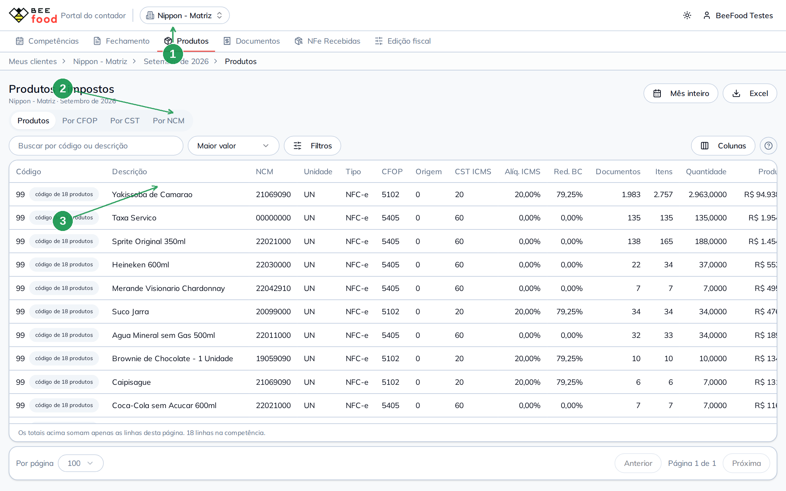

| Nº | Item | O que é |
|----|------|---------|
| 1 | Aba **Produtos** | Os mesmos totais do fechamento, item a item. |
| 2 | **Por CFOP**, **Por CST**, **Por NCM** | Os mesmos itens, agrupados. |
| 3 | A tabela | Código, NCM, CFOP, CST, quantidade e valor. |

O mesmo código pode aparecer mais de uma vez se a tributação mudou no mês. São duas linhas
de apuração, não cadastro duplicado.

**Documentos** lista as notas, com **Ver itens**, **Ver XML** e **Baixar**.

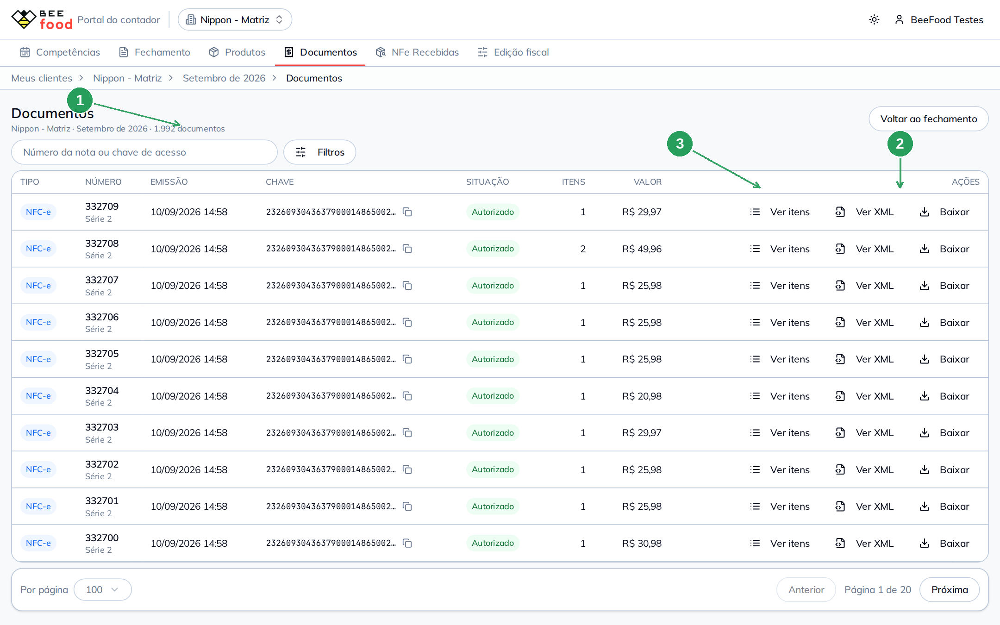

| Nº | Item | O que fazer |
|----|------|-------------|
| 1 | A busca | Número ou chave de acesso. |
| 2 | **Ver XML** / **Baixar** | O arquivo daquela nota. |
| 3 | **Ver itens** | Os itens sem baixar o XML. |

Sem a permissão de baixar, os botões de ZIP e de XML avulso não saem.

---

## 7. NFe recebidas

São as notas que os **fornecedores** emitiram contra o CNPJ do cliente (entradas), não as
que o restaurante emitiu. O recorte é por **período** (semana, quinzena), não por competência
de emissão.

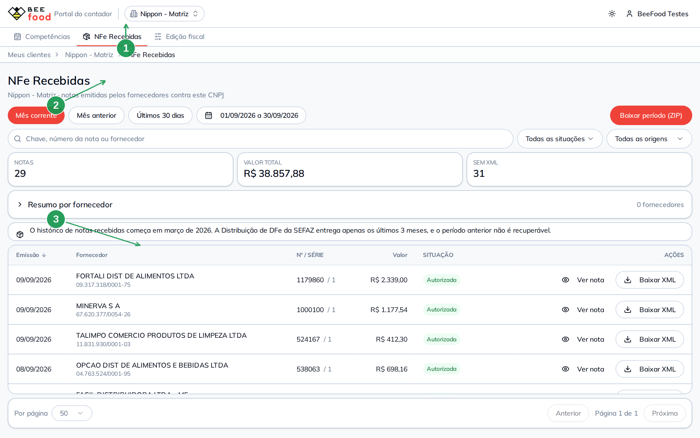

| Nº | Item | O que é |
|----|------|---------|
| 1 | Aba **NFe Recebidas** | Independente do mês do fechamento. |
| 2 | O intervalo de datas | A conciliação de compra se faz por semana ou quinzena. |
| 3 | A lista | Fornecedor, número, valor; XML e ZIP no mesmo espírito das emitidas. |

O histórico começa em **março de 2026**. A Distribuição de DFe da SEFAZ entrega os últimos
três meses; o que veio antes disso não é recuperável. A tela avisa.

---

## 8. Edição fiscal

Só aparece se o lojista ligou **Editar impostos**. A tela é a **mesma** da Edição Fiscal do
restaurante: lote em três passos e taxa de serviço nas 11 abas.

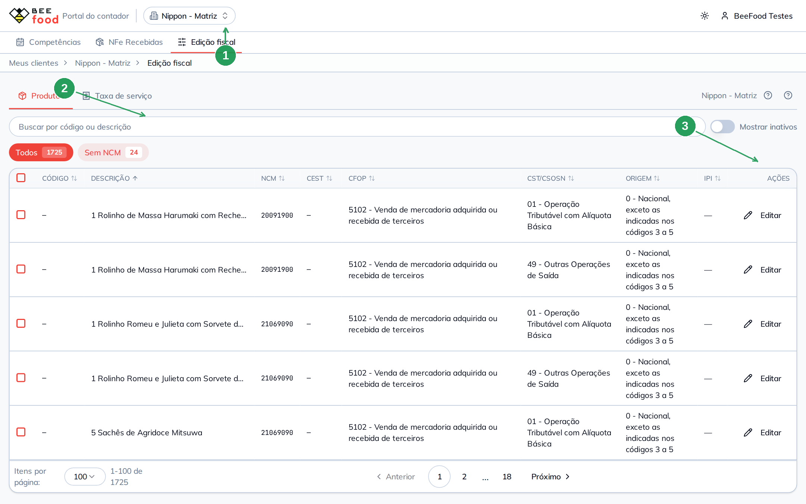

| Nº | Item | O que observar |
|----|------|----------------|
| 1 | Aba **Edição fiscal** | Produtos e **Taxa de serviço**. |
| 2 | Os filtros | Sem NCM, sem CFOP, sem CST/CSOSN — o que falta preencher. |
| 3 | **Editar** / lote | Os mesmos campos do lojista, inclusive IBS/CBS e benefício SC. |

Dois avisos que a tela mostra e este manual repete:

1. **Não corrige o passado.** O XML autorizado é assinado. A mudança vale para as notas
   **futuras**.
2. **Alcance da empresa.** Produto é cadastro da empresa. Editar num CNPJ alcança as filiais
   daquela empresa.

O lojista vê a alteração no histórico de logs, com o **nome do contador** no campo de quem
alterou. Não vai e-mail automático.

---

## 9. Perguntas rápidas

**O login do restaurante serve aqui?**
Não. O portal tem conta própria (CPF/CNPJ + senha). O dono que também é contador de si mesmo
pode ter as duas sessões no mesmo navegador, sem uma expulsar a outra.

**Esqueci a senha.**
Na tela de senha, **Esqueci minha senha**. O lojista também pode disparar o link pela lista
de contadores — ele não escolhe a senha nova.

**Não vejo um cliente novo.**
Peça para ele conferir se autorizou o **mesmo** documento. Sem convite, o portal responde
que nenhum cliente autorizou aquele documento — a mensagem é a mesma se a conta não existe,
de propósito.

**Os totais diferem do que o cliente me mandou.**
Confira CNPJ (matriz × filial) e o recorte de período. Os dois lados usam o mesmo cálculo.

**Posso apagar uma nota pelo portal?**
Não. O portal lê e, com permissão, ajusta o cadastro fiscal. Cancelar ou inutilizar nota
continua no painel fiscal do restaurante.
