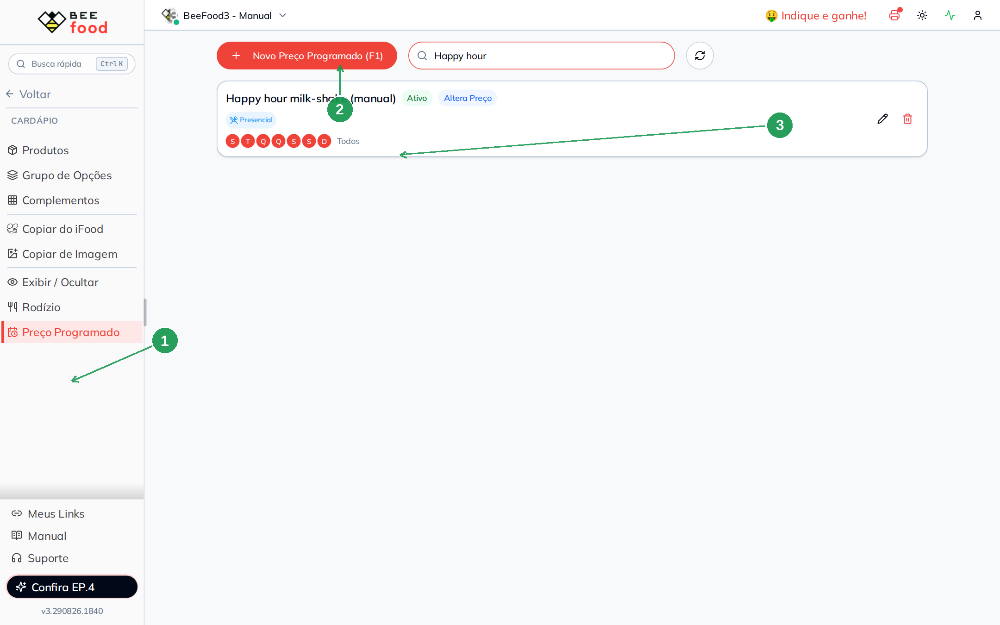
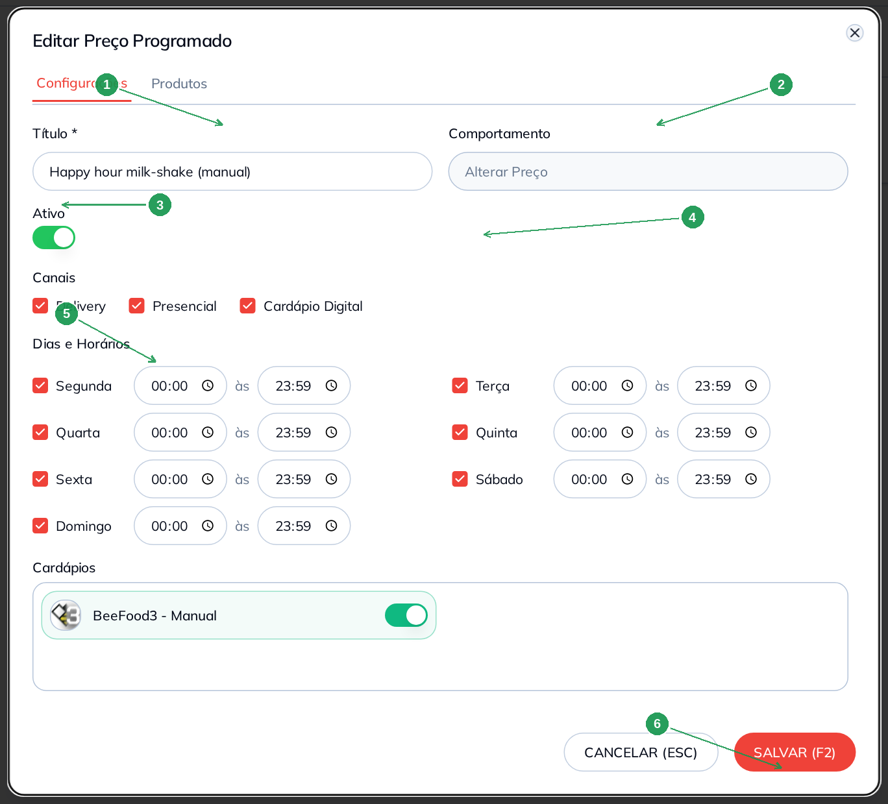
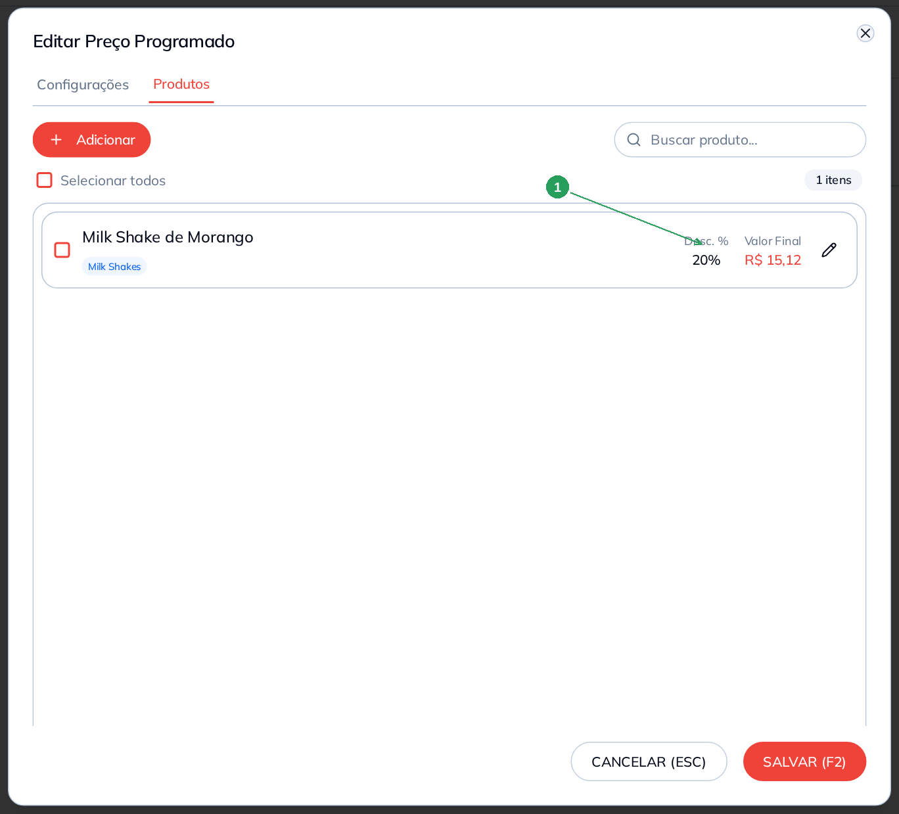
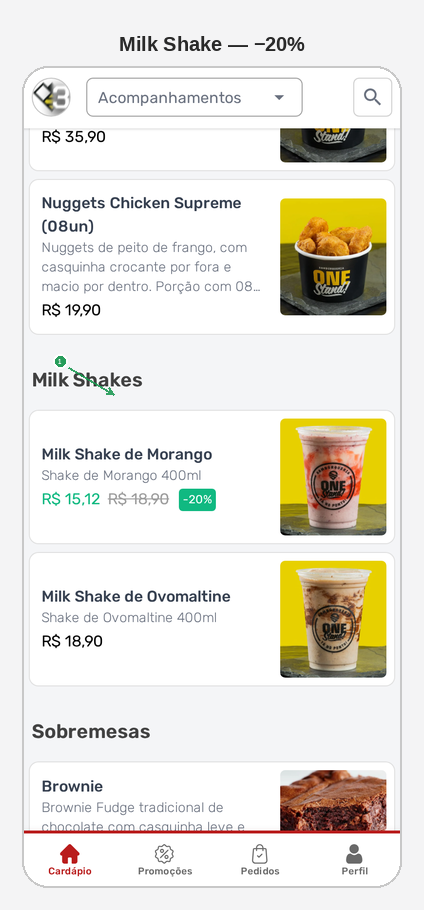

# Preço programado

Use **Preço Programado** quando o valor de um item muda em certos dias
ou horários — happy hour, promoção da semana — **sem** alterar o preço
cadastrado.

O cliente vê o preço novo e o antigo riscado, com o percentual. Neste
manual: **20%** no **Milk Shake de Morango** (de R$ 18,90 para
**R$ 15,12**), todos os dias, no cardápio digital.

> As imagens têm **setas com números** (1, 2, 3…). No texto, cada número
> indica o campo ou botão correspondente na tela. Campos com **\*** são
> obrigatórios.

---

## Antes de começar

1. Menu **Cardápio → Preço Programado**.
2. O produto já existe (aqui: **Milk Shake de Morango**).
3. Marque **pelo menos um dia**. Tabela sem dia fica `0d` e **não vale**.
4. Para a loja online, ligue o canal **Cardápio Digital**.

Depois de gravar, o cardápio do cliente pode levar **até 5 minutos**.

Esta tela **só muda preço**. Para esconder o item, use
**Exibir / Ocultar**. Rodízio é outra tela.

---

## Parte 1 — Onde fica

No menu: **Cardápio → Preço Programado** (1). O botão é **Novo Preço
Programado (F1)** (2). Cada tabela vira um card: título, **Ativo**,
badge **Altera Preço** e os dias (3). No card da lista o selo de
canal é o **Presencial**; os três canais (incluindo **Cardápio
Digital**) ficam no modal.

| Nº | Campo | O que faz |
|----|--------|-----------|
| 1. | **Preço Programado** | Abre esta tela |
| 2. | **Novo Preço Programado (F1)** | Cria uma tabela nova |
| 3. | Card **Happy hour milk-shake** | Ativa, **Altera Preço**, 7 dias |

O lápis edita. A lixeira apaga — não tem volta. A busca filtra pelo
nome da tabela.

---

## Parte 2 — Configurar a tabela

**Título \*** (1) — um nome que você reconheça. Exemplo:
`Happy hour milk-shake`. Vazio + aba Produtos = o sistema completa
(`Preço dd/mm hh:mm`).

**Comportamento** (2) vem fixo: **Alterar Preço**. Não dá para mudar
nesta tela.

**Ativo** (3) ligado = o preço novo vale agora.

**Canais** (4): **Delivery**, **Presencial** e **Cardápio Digital**.
No exemplo os três estão ligados. Sem **Cardápio Digital**, a loja
online não muda o valor.

**Dias e Horários** (5): marque o dia. Horário vazio vira **00:00 às
23:59**. Para happy hour de verdade, preencha o intervalo (ex.: 17:00
às 20:00). No exemplo: os **7 dias**, o dia todo.

**SALVAR (F2)** (6) ou vá para **Produtos** — tabela nova **salva
sozinha** ao trocar de aba.

| Nº | Campo | O que faz |
|----|--------|-----------|
| 1. | **Título \*** | Nome da promoção |
| 2. | **Comportamento** | Fixo: **Alterar Preço** |
| 3. | **Ativo** | Liga ou pausa a promoção |
| 4. | **Cardápio Digital** | Sem isto, o menu público não muda |
| 5. | **Dias e Horários** | Sem dia marcado a tabela não vale |
| 6. | **SALVAR (F2)** | Grava |

**Cardápios** (mais abaixo) escolhe a filial. Deixe a loja marcada.

---

## Parte 3 — Produtos e o desconto

Aba **Produtos**. **Adicionar** inclui o item. O desconto em massa só
aparece **depois de selecionar** o produto.

1. Marque o item (ou **Selecionar todos**).
2. Clique em **Desconto (1)**.
3. Tipo: **Porcentagem (%)** (ou Valor Fixo em R$).
4. Valor: `20`.
5. **APLICAR (F2)** — o modal de desconto fecha; a lista mostra
   **Desc. 20%** e o **Valor Final**.
6. **SALVAR (F2)** no modal grande.

No exemplo: Milk Shake de Morango, preço de cadastro **R$ 18,90**,
desconto **20%**, valor final **R$ 15,12** (1).

| Nº | Campo | O que faz |
|----|--------|-----------|
| 1. | **Milk Shake de Morango** | Desc. **20%**, valor final **R$ 15,12** |

O lápis da linha edita um item só (valor, % ou R$). **Excluir** tira
da tabela — o preço cadastrado no cardápio **não muda**.

---

## Parte 4 — O que o cliente vê

No cardápio, o Milk Shake de Morango mostra o preço novo, o antigo
riscado e o percentual (1): **R$ 15,12** | **R$ 18,90** | **−20%**.

| Nº | O que o cliente vê |
|----|--------------------|
| 1. | **R$ 15,12** (novo), **R$ 18,90** riscado e **−20%** |

Pode levar **até 5 minutos**. Se o preço cheio continua sozinho,
confira: tabela **Ativa**, dia de hoje marcado, canal **Cardápio
Digital**, e o desconto **aplicado** no produto (não basta adicionar
o item — precisa do **Desconto** + **APLICAR**).

Para voltar ao preço cheio, desligue **Ativo** (ou tire o produto) e
espere o cache. O cadastro permanece **R$ 18,90**.

---

## Problemas comuns

| Sintoma | O que verificar |
|---------|-----------------|
| Cliente ainda vê o preço cheio | Esperou **5 minutos**? Tabela **Ativa**? Canal **Cardápio Digital**? |
| Produto na tabela, sem −20% | Faltou selecionar + **Desconto** + **APLICAR** |
| Botão Desconto some | Ele só aparece com item **marcado** |
| Tabela no card com **0d** | Nenhum dia marcado |
| Queria esconder o item | Isso é **Exibir / Ocultar** |
| Queria rodízio | Outra tela: **Cardápio → Rodízio** |

---

## O que esta tela não é

- **Exibir / Ocultar:** esconde o produto. Não muda preço.
- **Rodízio:** produto que libera o rodízio no presencial.
- Desconto da **forma de recebimento** (PIX, dinheiro): isso é
  Cardápio Digital → Formas Recebimento.
- Reajuste permanente do cadastro: isso é **Cardápio → Produtos**.

---

*Última atualização: agosto/2026 — BeeFood · Preço Programado*
