# Programa de pontos — o cliente junta pontos e troca por recompensa

O **Programa de pontos** faz o cliente ganhar pontos a cada compra e trocar esses pontos por
**desconto em reais** ou por um **produto grátis**. Você define quanto vale cada real gasto, por
quanto tempo os pontos valem e quais recompensas estão na vitrine.

Ele funciona no **sistema BeeFood** (PDV, mesas e delivery manual), no **cardápio digital**, no
**totem de autoatendimento** e no **cardápio digital tablet**. Este manual mostra as telas do
**cardápio digital**, que é onde o cliente vê e usa os pontos sozinho — os outros canais acumulam
pelas mesmas regras, e a seção 12 explica o que muda em cada um.

> As imagens têm **setas numeradas** (1, 2, 3…). Cada número indica o campo ou o botão
> correspondente na tela. As capturas são do cardápio de demonstração, com cliente de teste:
> nome, telefone e e-mail de cliente real nunca aparecem aqui.

## Para que serve

Cashback devolve dinheiro. Pontos criam **uma meta**. São duas mecânicas diferentes de fidelidade,
e a dos pontos tem três efeitos que o cashback não tem:

- **O cliente volta para fechar a conta.** Quem tem 80 pontos e vê uma recompensa de 100 tem
  motivo para pedir de novo *esta semana*. A tela dele diz, em pontos, o quanto falta.
- **A recompensa é sua, não um desconto genérico.** *"Chicken Deluxe grátis"* custa a você o preço
  de um lanche e vale, para o cliente, um pedido inteiro.
- **Você escolhe a régua.** Um ponto por real é o padrão, mas nada impede dois pontos por real
  numa campanha — e a mesma conta aparece pronta na tela do cliente.

**Cashback e pontos não convivem no mesmo cardápio.** O sistema deixa apenas um dos dois ligado, e
avisa na hora de trocar. A seção 11 mostra como levar o saldo de um para o outro sem perder nada.

## Antes de começar

1. Acesso a **Fidelidade (CRM) → Programa de pontos** (a mesma permissão do **Cashback**: quem vê
   um, vê o outro).
2. **Cardápio digital** contratado e com link publicado, se você quiser a parte que o cliente usa
   sozinho.
3. Decidir se a loja vai de **pontos** ou de **cashback**. Ligar os pontos **desliga o cashback**
   naquele cardápio.
4. Saber que **o ponto não cai na hora**: o sistema processa **toda madrugada**, e só pedido
   **pago e finalizado** gera ponto.

---

## 1. Ligar o programa

No menu, abra **Fidelidade (CRM)** e clique em **Programa de pontos** (1). A tela abre na aba
**Configuração** (2), com um aviso permanente sobre o processamento da madrugada (3). Ligue o
switch **Ativar programa de Pontos** (4). No alto, à direita, ficam os dois botões que trocam de
programa levando o saldo (5) — eles são da seção 11, e não se clica neles por engano.

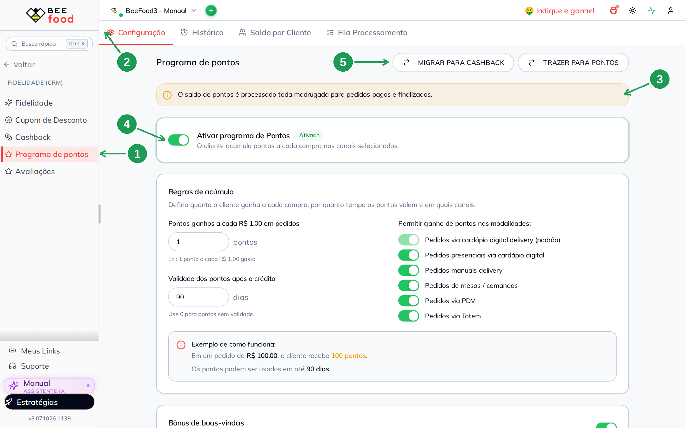

| Nº | Campo | O que faz |
|----|-------|-----------|
| 1. | **Programa de pontos**, no menu | Abre o programa. Fica em **Fidelidade (CRM)**, logo abaixo de **Cashback** |
| 2. | Aba **Configuração** | As regras. As outras três abas (**Histórico**, **Saldo por Cliente**, **Fila Processamento**) são o acompanhamento, nas seções 9 e 10 |
| 3. | A faixa amarela | *"O saldo de pontos é processado toda madrugada para pedidos pagos e finalizados."* Não é enfeite: é a resposta para *"fiz o pedido e não ganhei ponto"* |
| 4. | **Ativar programa de Pontos** | Liga e desliga tudo. O selo ao lado mostra **Ativado** ou **Desativado**, e com ele desligado os outros cartões ficam apagados e travados |
| 5. | **MIGRAR PARA CASHBACK** e **TRAZER PARA PONTOS** | Trocam de programa convertendo o saldo de **todos** os clientes. Ação irreversível — seção 11 |

**Não existe botão de salvar.** Cada campo grava sozinho, cerca de meio segundo depois de você
parar de digitar. Trocar de cardápio no seletor do alto não perde nada.

**Se o cashback estiver ligado neste cardápio**, o sistema não deixa ligar os pontos em silêncio.
Aparece primeiro um aviso dentro do cartão — *"Ao ativar os pontos, o Cashback será desligado neste
cardápio."* — e, no clique, a pergunta:

> **Ativar Programa de Pontos?**
> Cashback e Programa de Pontos são exclusivos por cardápio. Ao ativar o Programa de Pontos, o
> Cashback será desativado agora neste cardápio. Os saldos já acumulados dos clientes **não são
> apagados** (use "Migrar/Trazer saldo" se quiser convertê-los). Deseja continuar?

O botão de confirmação diz, com todas as letras, **ATIVAR E DESATIVAR O CASHBACK**. É de propósito:
quem clica sabe o que está desligando.

---

## 2. Quanto o cliente ganha, por quanto tempo e em quais canais

O cartão **Regras de acúmulo** tem as três decisões que definem o programa: o quanto (1), o
prazo (2) e o onde (3 e 4). Embaixo, o sistema mostra a conta pronta num pedido de R$ 100,00 (5).

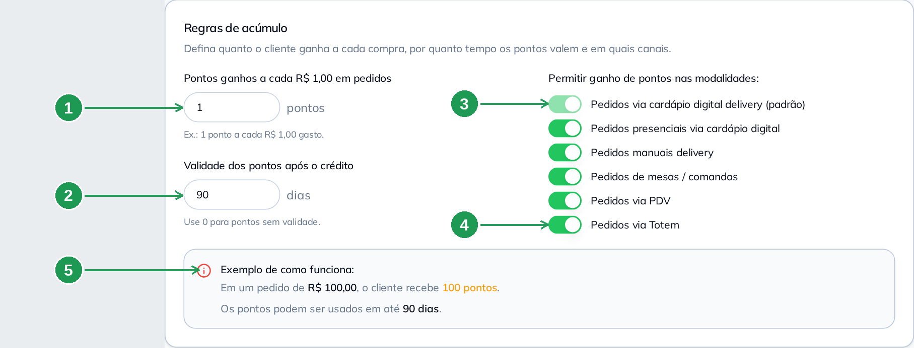

| Nº | Campo | O que faz |
|----|-------|-----------|
| 1. | **Pontos ganhos a cada R$ 1,00 em pedidos** | A régua do programa. Com **1**, um pedido de R$ 100,00 dá 100 pontos. Aceita casa decimal (0,5 dá meio ponto por real) |
| 2. | **Validade dos pontos após o crédito** | Em dias, contados **de cada crédito**, não do último pedido. **0** = os pontos nunca expiram |
| 3. | **Pedidos via cardápio digital delivery (padrão)** | Fica **sempre ligado** e não se desliga: é o canal padrão do programa |
| 4. | Os outros cinco canais | **Presenciais via cardápio digital**, **manuais delivery**, **mesas / comandas**, **PDV** e **Totem**. Desligado, a venda daquele canal não gera ponto |
| 5. | **Exemplo de como funciona** | Repete a sua configuração em forma de frase, com o número e a validade atuais. Serve de conferência rápida |

**A validade conta por crédito.** Cada lote de pontos tem a sua própria data: os 100 pontos de
hoje valem 90 dias a partir de hoje, e os 40 da semana que vem valem 90 dias a partir de lá. O
cliente não perde tudo de uma vez, e o extrato dele mostra a data de cada lote.

**Canal desligado não avisa nada.** A venda entra normal, o cliente não ganha ponto e nenhuma tela
reclama. Se um garçom disser que a mesa não acumula, confira a lista da seta 4 antes de procurar
defeito em outro lugar.

---

## 3. Bônus de boas-vindas e pontos sobre a taxa de entrega

Role a tela. São dois cartões independentes, cada um com o seu switch (1 e 3) e o seu número
(2 e 5). O segundo tem o nome mais enganoso da tela, e o subtítulo dele (4) é que diz a verdade.

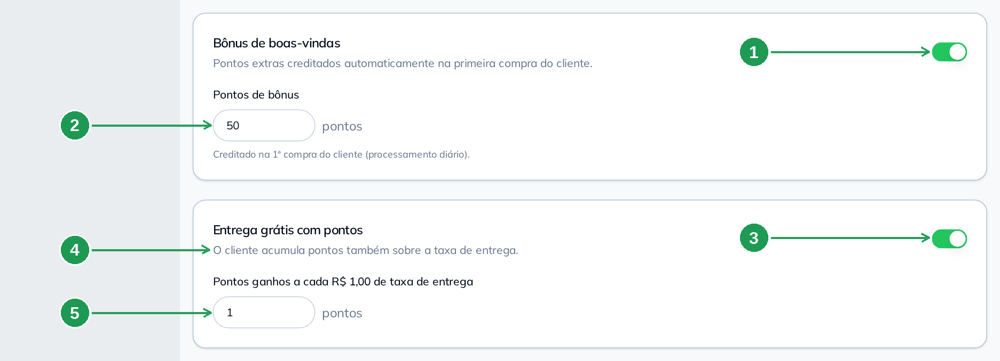

| Nº | Campo | O que faz |
|----|-------|-----------|
| 1. | Switch do **Bônus de boas-vindas** | Liga o crédito automático na **primeira** compra do cliente |
| 2. | **Pontos de bônus** | Quantos pontos entram nessa primeira compra, **além** dos pontos normais do pedido |
| 3. | Switch do **Entrega grátis com pontos** | Liga o acúmulo **sobre a taxa de entrega** |
| 4. | *"O cliente acumula pontos também sobre a taxa de entrega."* | O que o cartão realmente faz. Ele **não** dá entrega grátis automática: entrega grátis você cadastra como recompensa de desconto (seção 4) |
| 5. | **Pontos ganhos a cada R$ 1,00 de taxa de entrega** | A régua da taxa, separada da régua dos produtos. Dá para acumular mais (ou menos) por real de frete |

**O bônus de boas-vindas também cai de madrugada.** O próprio campo avisa: *"Creditado na 1ª compra
do cliente (processamento diário)."* Ele não aparece no instante em que o cliente termina o
primeiro pedido.

---

## 4. Recompensas de desconto

Recompensa de desconto é **valor em reais**, e é o tipo que funciona em qualquer cardápio. Cada
linha cadastrada (1) mostra, em cinza, quanto de compra aquilo representa — e a lixeira (2) tira a
recompensa da vitrine. Para criar uma, preencha o valor (3) e os pontos (4) e clique em
**ADICIONAR** (5).

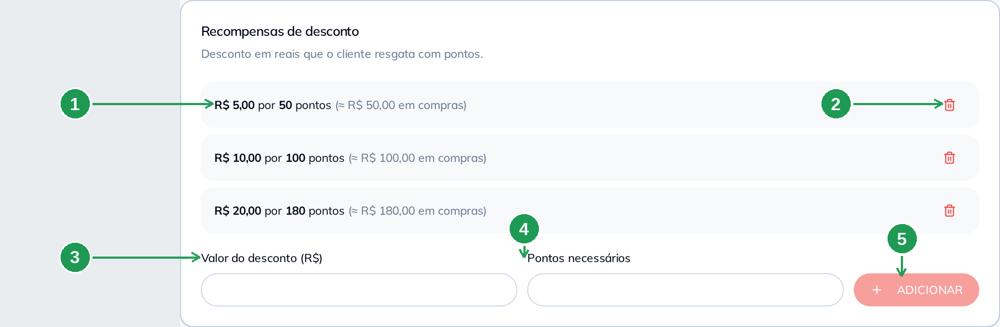

| Nº | Campo | O que faz |
|----|-------|-----------|
| 1. | A linha cadastrada | **R$ 5,00 por 50 pontos**. O *(≈ R$ 50,00 em compras)* ao lado é calculado com a sua régua: é o quanto o cliente gasta para chegar lá |
| 2. | A lixeira | Remove a recompensa. Sai da vitrine do cliente na hora; o que já foi resgatado em pedido fechado não muda |
| 3. | **Valor do desconto (R$)** | Quanto sai do total do pedido |
| 4. | **Pontos necessários** | O preço da recompensa, em pontos |
| 5. | **ADICIONAR** | Grava a recompensa. Ela aparece na lista acima e na vitrine do cliente |

**Monte uma escada, não um degrau.** Três recompensas (R$ 5,00, R$ 10,00 e R$ 20,00) deixam o
cliente trocar cedo e ainda sonhar com a maior — e é a maior que faz ele voltar. Com uma
recompensa só, metade do público nunca chega nela.

**Entrega grátis como recompensa:** cadastre um desconto no valor da sua taxa (R$ 8,00, por
exemplo). É assim que se dá frete grátis por pontos — o cartão *Entrega grátis com pontos* da
seção 3 faz outra coisa.

---

## 5. Recompensas de produto

Recompensa de produto é **um item do seu cardápio, de graça**. O cadastro é igual ao do desconto,
trocando o valor pelo produto: escolha o item em **Selecionar produto** (3), diga o preço em pontos
(4) e clique em **ADICIONAR** (5). Na lista, uma recompensa pode aparecer com **código** (1) ou com
o **nome** do produto (2) — e essa diferença importa.

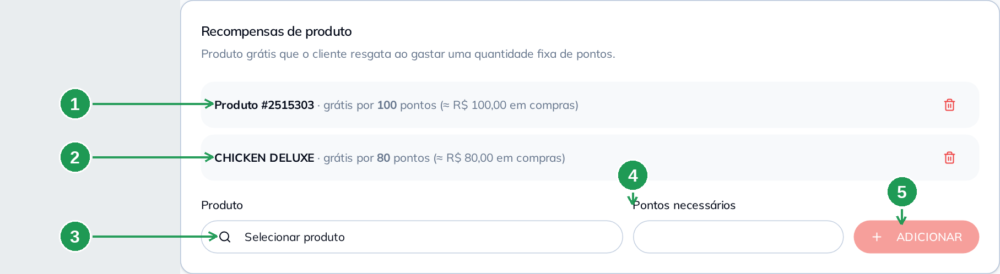

| Nº | Campo | O que faz |
|----|-------|-----------|
| 1. | **Produto #2515303 · grátis por 100 pontos** | Quando o painel não acha o produto na lista do cardápio atual, ele mostra o **código** em vez do nome. A recompensa continua valendo |
| 2. | **CHICKEN DELUXE · grátis por 80 pontos** | O normal: o nome do produto, como ele está cadastrado |
| 3. | **Selecionar produto** | Abre a busca no seu cardápio. Escolha um produto simples, sem grupo de opções obrigatório |
| 4. | **Pontos necessários** | O preço da recompensa, em pontos |
| 5. | **ADICIONAR** | Grava. Confira em seguida no cardápio, pelo próprio celular — a dica abaixo explica por quê |

A lixeira funciona igual à da seção 4 (a seta 2 da imagem anterior).

> **Confira a recompensa de produto no cardápio depois de cadastrar.** Hoje o código que o painel
> grava e o código que o cardápio público usa para o mesmo produto **podem não ser o mesmo**, e
> quando isso acontece a recompensa fica cadastrada no painel e **não aparece** para o cliente. O
> sintoma é exatamente o da seta 1: a linha que o painel mostra como `Produto #número` é a que o
> cliente vê, e a linha com nome bonito pode ser a que ele não vê. Abra o cardápio, toque em
> **Perfil → Programa de pontos → Ver o que você pode ganhar** e confirme que a recompensa está
> na lista. Se não estiver, fale com o **suporte BeeFood** com o nome do produto e o número de
> pontos. Recompensa de **desconto** não tem esse risco.

**Escolha produto sem obrigatoriedade.** Item com grupo de opções marcado como **OBRIGATÓRIO**
(ponto da carne, sabor, tamanho) trava o cliente no resgate: ele precisa abrir o produto e
escolher. Lanche simples, bebida e sobremesa são as melhores recompensas.

---

## 6. O que o cliente vê no cardápio digital

Com o programa ligado, a **faixa amarela** aparece na home do cardápio (1). Nos produtos que são
recompensa, um **selo de presente** marca o item (2). E o caminho para tudo o mais passa por
**Perfil**, no rodapé (3).

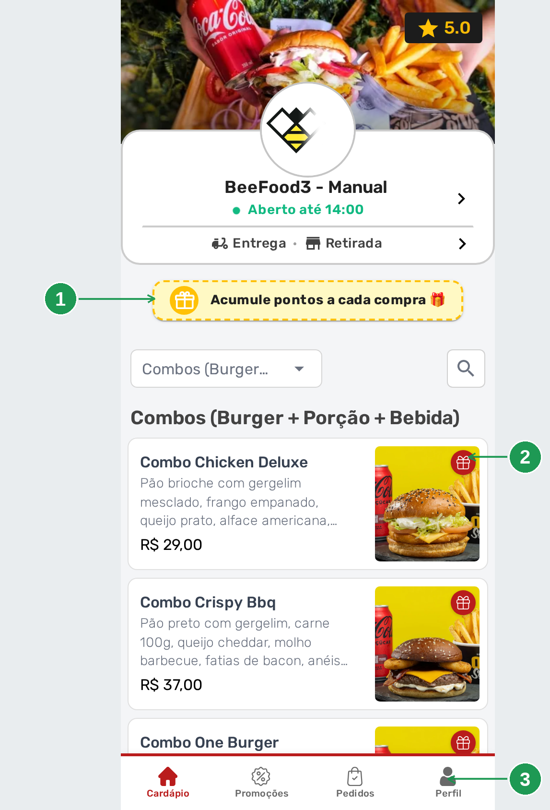

| Nº | Onde | O que é |
|----|------|---------|
| 1. | **Acumule pontos a cada compra 🎁** | A faixa pontilhada amarela. Ela aparece **só por o programa estar ativo** — não depende de recompensa cadastrada nem de o cliente estar identificado |
| 2. | O selo de presente na foto | Marca o produto que é recompensa. Quem está juntando pontos reconhece o alvo enquanto navega |
| 3. | **Perfil** | A porta do programa. É por aqui que o cliente entra com o telefone e chega ao saldo |

**A mudança leva até um minuto para aparecer.** O cardápio público guarda a configuração em cache.
Se você acabou de ligar o programa e a faixa não está lá, espere um minuto e recarregue antes de
suspeitar de defeito.

### O cliente se identifica e o programa aparece no Perfil

Tocando em **Perfil**, quem ainda não está identificado cai na tela de entrada por **telefone de
WhatsApp**. Identificado, o mesmo **Perfil** fica aceso (1) e o menu dele ganha o item **Programa
de pontos** (2).

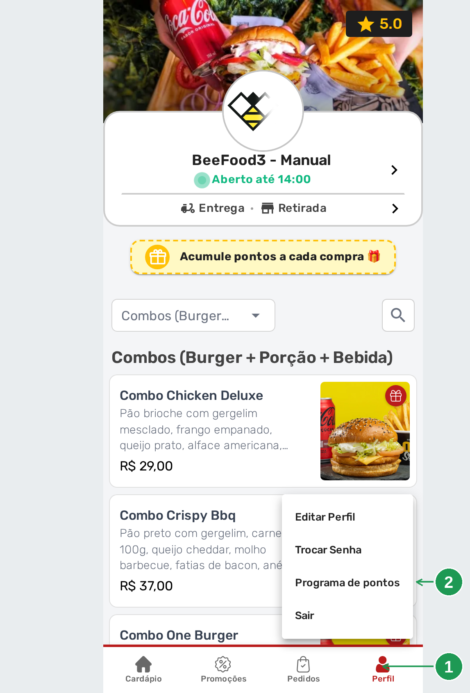

| Nº | Onde | O que é |
|----|------|---------|
| 1. | **Perfil** aceso | O cliente está identificado. Sem identificação o programa não tem saldo para mostrar: pontos são por pessoa |
| 2. | **Programa de pontos** | Abre o saldo e o extrato dele. O item só existe quando o programa está **ativo** — e nunca no cardápio **presencial** (QR Code de mesa) |

Logo acima pode haver um item **Programa de fidelidade**: é outro recurso, mais antigo, e não tem
relação com os pontos.

### Meus pontos: o saldo e o extrato

O item abre **Meus pontos**, com o saldo em destaque (1) e o **Extrato** logo abaixo (2) — uma
linha por lançamento, com **Ganhou** (3), o motivo que você digitou (4) e **Usou** (5). No pé,
o atalho para a vitrine de recompensas (6).

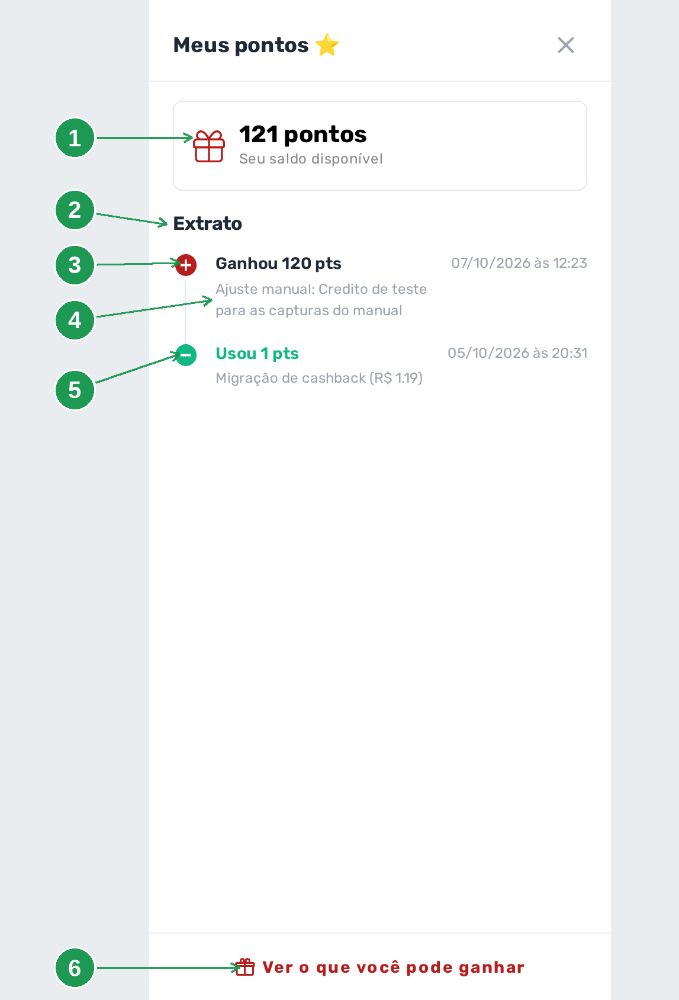

| Nº | Onde | O que é |
|----|------|---------|
| 1. | **121 pontos / Seu saldo disponível** | O saldo de hoje. É o mesmo número que você vê em **Saldo por Cliente**, no painel |
| 2. | **Extrato** | O histórico do cliente, do mais novo para o mais antigo |
| 3. | **Ganhou 120 pts** | Um crédito. Em pedido normal a linha diz a venda; aqui diz *Ajuste manual*, porque foi crédito feito pelo painel |
| 4. | *"Ajuste manual: Credito de teste para as capturas do manual"* | **O texto que você digitou no campo Motivo aparece aqui, inteiro, para o cliente.** Escreva pensando nisso |
| 5. | **Usou 1 pts** | Um débito: resgate, remoção pelo painel ou expiração |
| 6. | **Ver o que você pode ganhar** | Abre a vitrine de recompensas, a próxima tela |

### A vitrine: o que ele pode ganhar

A mesma janela tem a segunda metade: as **regras em uma frase** (1) e a lista de recompensas, com
desconto (2) e produto (5). Cada linha traz um selo que diz se dá ou não dá: **Disponível** (3) ou
**Faltam N pts** (4). No pé, o caminho de volta para o extrato (6).

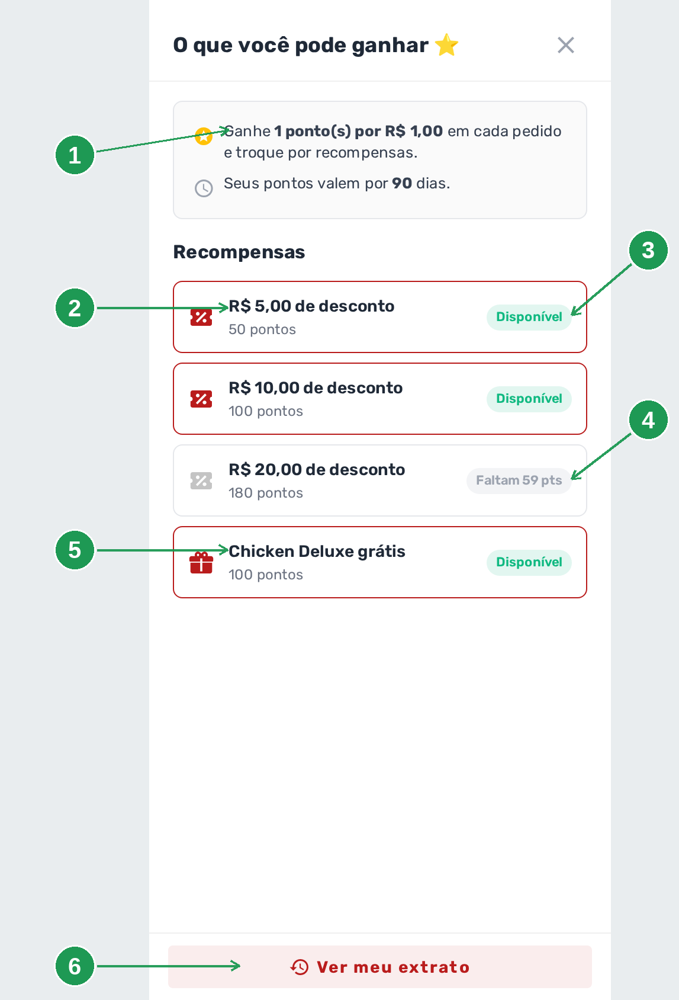

| Nº | Onde | O que é |
|----|------|---------|
| 1. | *"Ganhe 1 ponto(s) por R$ 1,00 em cada pedido"* e *"Seus pontos valem por 90 dias"* | A sua configuração da seção 2, escrita para o cliente. Mudou o número no painel, muda aqui |
| 2. | **R$ 5,00 de desconto / 50 pontos** | Uma recompensa de desconto, com o preço em pontos |
| 3. | **Disponível** | Ele tem pontos para essa |
| 4. | **Faltam 59 pts** | A meta. É esta frase que faz o cliente pedir de novo |
| 5. | **Chicken Deluxe grátis / 100 pontos** | Uma recompensa de produto, com o ícone de presente |
| 6. | **Ver meu extrato** | Volta para a tela anterior |

**Sem recompensa cadastrada, a vitrine abre vazia** e diz *"Nenhuma recompensa disponível no
momento."* A faixa amarela continua na home, prometendo acúmulo — então programa ligado sem
recompensa é promessa sem vitrine. Cadastre ao menos uma antes de divulgar.

---

## 7. O resgate acontece na sacola

Pontos não se trocam na vitrine: eles se trocam **dentro do pedido**. Com itens na sacola e a
modalidade escolhida, aparecem dois cartões. O primeiro (1) é o do ganho, e o segundo diz quanto
ele tem (2) e lista as recompensas, com **RESGATAR** no que dá (3), **INSUFICIENTE** no que não dá
(4) e **ADICIONAR** no produto grátis (5). No rodapé, o quanto este pedido vai render (6).

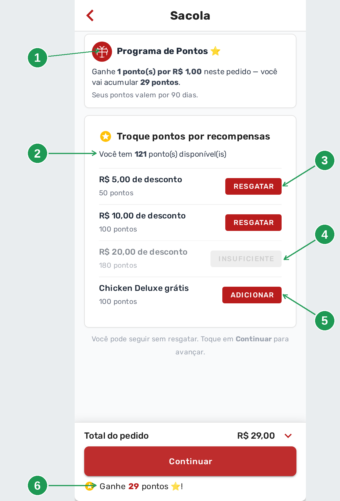

| Nº | Onde | O que é |
|----|------|---------|
| 1. | **Programa de Pontos** | *"Ganhe 1 ponto(s) por R$ 1,00 neste pedido — você vai acumular 29 pontos"*, com a validade embaixo. A conta é deste pedido, não do saldo |
| 2. | **Você tem 121 ponto(s) disponível(is)** | O saldo, dentro da sacola |
| 3. | **RESGATAR** | Aplica o desconto no pedido |
| 4. | **INSUFICIENTE** | A recompensa existe, mas o saldo não alcança. O botão fica apagado e não clica |
| 5. | **ADICIONAR** | A recompensa de produto: em vez de desconto, ela **põe o item** na sacola |
| 6. | **Ganhe 29 pontos ⭐!** | O rodapé repete o ganho deste pedido, ao lado do **Continuar** |

A frase cinza no meio — *"Você pode seguir sem resgatar. Toque em Continuar para avançar."* — está
ali porque muita gente trava achando que precisa escolher alguma coisa. Não precisa.

**O cartão só aparece depois da modalidade escolhida.** Enquanto o cliente não disser se é
**Entrega** ou **Retirada**, a sacola fica na etapa do endereço e os pontos não entram na tela.

### Resgatado: o total cai e as outras recompensas somem

Tocando em **RESGATAR**, a recompensa escolhida fica marcada e o botão dela vira **REMOVER** (2).
As outras ficam apagadas (3), o **Total do pedido** cai (4) — e o ganho do pedido continua o mesmo
(5).

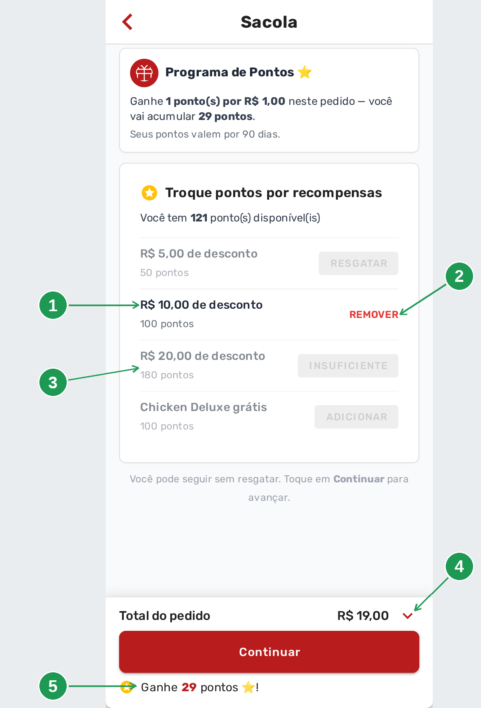

| Nº | Onde | O que é |
|----|------|---------|
| 1. | **R$ 10,00 de desconto** | A recompensa resgatada é a única que fica em destaque |
| 2. | **REMOVER** | Desfaz o resgate antes de fechar o pedido. Os pontos voltam para o saldo |
| 3. | As outras recompensas, apagadas | **É um resgate por pedido.** Depois de escolher uma, as outras param de responder |
| 4. | **Total do pedido R$ 19,00** | Era R$ 29,00. O desconto da recompensa entra no total como qualquer desconto |
| 5. | **Ganhe 29 pontos ⭐!** | Continua 29: na tela, o ganho é calculado sobre os **itens**, não sobre o total já descontado |

**O ponto sai do saldo quando o pedido é fechado**, não no toque em RESGATAR. Pedido abandonado na
sacola não gasta ponto de ninguém.

---

## 8. A mesma coisa no computador

No computador a faixa amarela não aparece: o programa vira um **cartão fixo** na coluna da direita
do cardápio (1), com as regras escritas e o atalho para a vitrine (2).

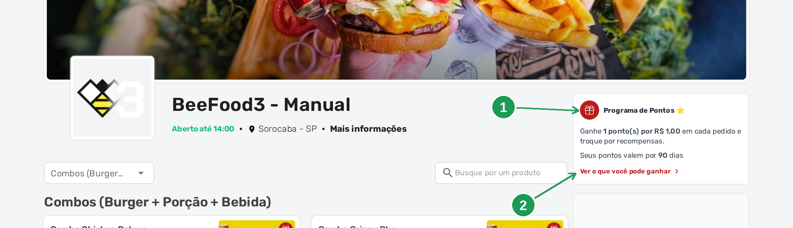

| Nº | Onde | O que é |
|----|------|---------|
| 1. | **Programa de Pontos ⭐** | O cartão, logo abaixo do nome da loja, com a régua e a validade |
| 2. | **Ver o que você pode ganhar ›** | Abre a mesma vitrine da seção 6 |

**É a mesma página e o mesmo link.** Não existe versão de computador para você manter ou divulgar.

---

## 9. Acompanhar no painel

As outras três abas do **Programa de pontos** são de consulta e de ajuste manual. Comece pelo
**Histórico**: a busca por texto (1), o filtro por tipo de lançamento (2), a coluna **Tipo** (3)
e a coluna **Pontos**, com sinal (4).

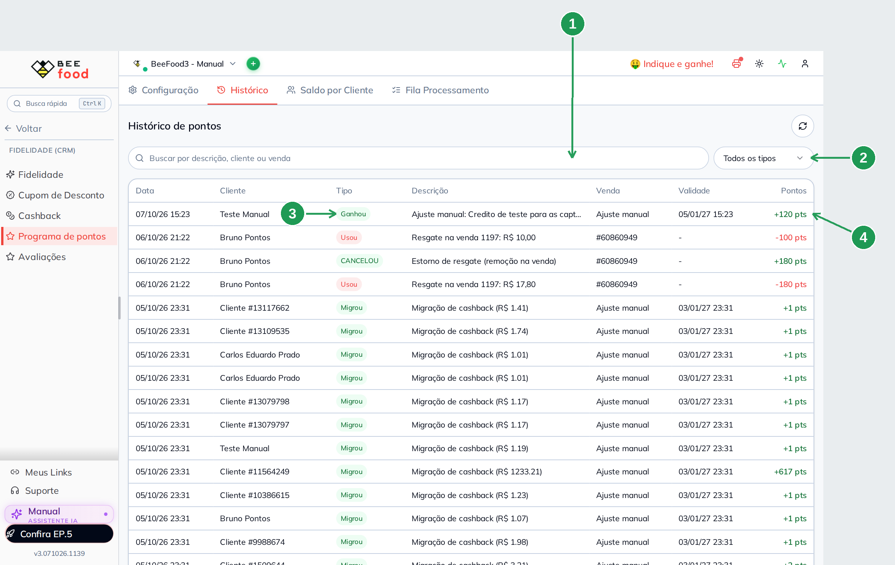

| Nº | Campo | O que faz |
|----|-------|-----------|
| 1. | **Buscar por descrição, cliente ou venda** | Acha pelo nome do cliente, pelo número da venda ou por um pedaço da descrição |
| 2. | **Todos os tipos** | Filtra por tipo de lançamento |
| 3. | Coluna **Tipo** | **Ganhou**, **Usou**, **CANCELOU** (estorno de resgate, quando o pedido é cancelado) e **Migrou** (saldo que veio do cashback) |
| 4. | Coluna **Pontos** | Com sinal: **+120 pts** entrou, **−100 pts** saiu |

As demais colunas são **Data**, **Cliente**, **Descrição** (que repete o motivo ou a venda) e
**Validade** — a data em que aquele lote de pontos expira, vazia quando não expira.

**O histórico é do cardápio inteiro**, de todos os clientes. Para olhar um cliente só, use a aba
seguinte.

### Saldo por Cliente

A aba abre com quatro totais (1), o botão que credita saldo para um cliente novo (2), e uma linha
por cliente com o saldo dele (3) e o olho que abre o extrato (4).

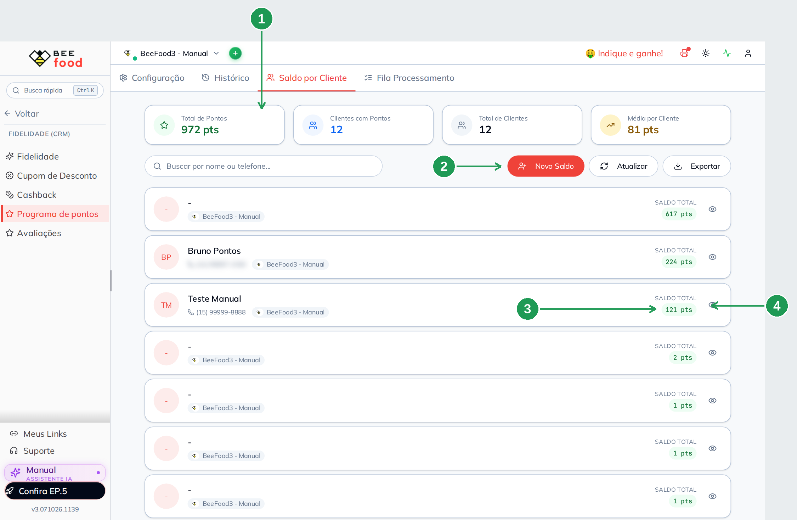

| Nº | Campo | O que faz |
|----|-------|-----------|
| 1. | Os quatro totais | **Total de Pontos** em circulação, **Clientes com Pontos**, **Total de Clientes** e **Média por Cliente**. É o tamanho do seu passivo de fidelidade |
| 2. | **Novo Saldo** | Procura um cliente e credita pontos para ele. Cliente que ainda não existe precisa ser cadastrado primeiro |
| 3. | **SALDO TOTAL** | O saldo daquele cliente, o mesmo número que ele vê no celular |
| 4. | O olho, no fim da linha | Abre o extrato do cliente, a próxima tela |

Acima da lista há a busca **por nome ou telefone**, o seletor de cardápio e os botões **Atualizar**
e **Exportar**. Nas capturas deste manual, os telefones dos outros clientes saem borrados: o
repositório é público.

### O extrato de um cliente

O olho abre um painel lateral com o saldo (1), os três botões de ajuste (2), o resumo em três
cartões (3) e o extrato lançamento por lançamento (4), com o motivo à vista (5).

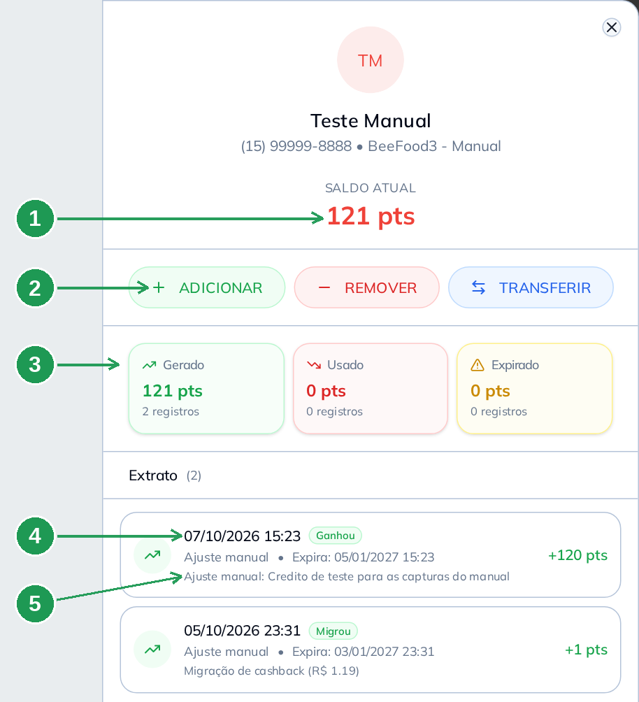

| Nº | Campo | O que faz |
|----|-------|-----------|
| 1. | **SALDO ATUAL** | O saldo do cliente |
| 2. | **ADICIONAR**, **REMOVER** e **TRANSFERIR** | Crédito manual, débito manual e conversão entre pontos e cashback **deste** cliente. **REMOVER** fica travado com saldo zero |
| 3. | **Gerado**, **Usado** e **Expirado** | O total de cada coisa, com o número de lançamentos |
| 4. | A linha do extrato | Data, tipo, a data de validade daquele lote e os pontos |
| 5. | A terceira linha de cada lançamento | **O motivo, como o cliente lê.** É o mesmo texto da seta 4 da tela *Meus pontos* |

### Creditar ou tirar pontos à mão

**ADICIONAR** abre uma janela de três campos. Os pontos (1), a validade só deste crédito (2), o
motivo (3) — e **CONFIRMAR (F2)** (4).

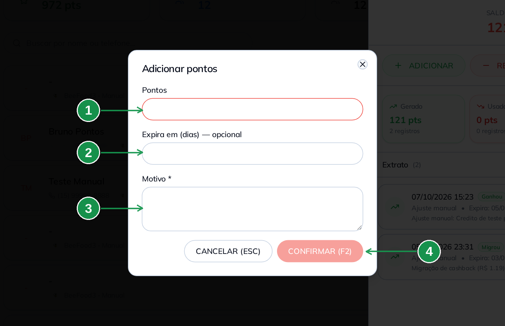

| Nº | Campo | O que faz |
|----|-------|-----------|
| 1. | **Pontos** | Quantos pontos entram agora. O crédito manual **não** espera a madrugada |
| 2. | **Expira em (dias) — opcional** | Validade só deste lote. Vazio = usa a validade do programa |
| 3. | **Motivo \*** | **Obrigatório — e o cliente lê.** *"Cortesia pelo atraso do pedido 1197"* é um bom motivo; um código interno, não |
| 4. | **CONFIRMAR (F2)** | Grava. O saldo muda na hora, no painel e no celular do cliente |

**REMOVER** tem os mesmos campos sem a validade, e mostra o saldo disponível. **TRANSFERIR** pede
a direção (**Pontos → Cashback** ou **Cashback → Pontos**), a taxa de conversão e um teto
opcional, e converte **todo** o saldo daquele cliente.

---

## 10. A fila de processamento

É a aba que explica o *"o cliente comprou e não ganhou ponto"*. Ela mostra a mesma faixa da
madrugada (1), quatro contadores (2) e uma linha por venda, com o **Status** (3) e, quando algo
impediu o crédito, a **Mensagem** do motivo (4).

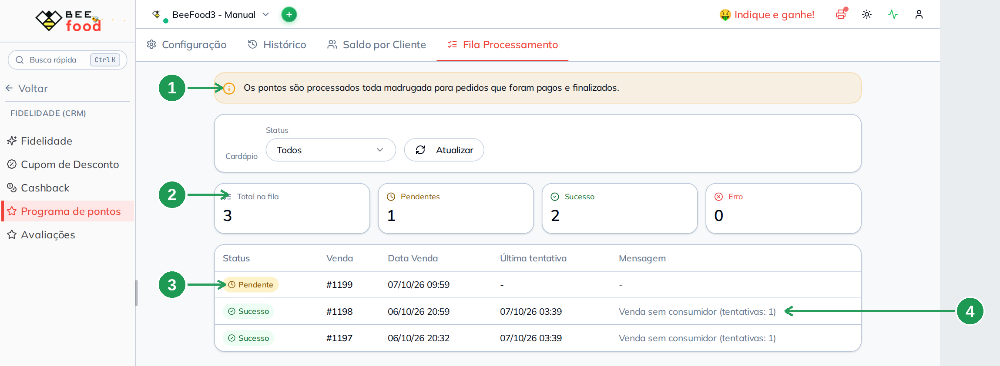

| Nº | Campo | O que faz |
|----|-------|-----------|
| 1. | A faixa amarela | *"Os pontos são processados toda madrugada para pedidos que foram pagos e finalizados."* |
| 2. | **Total na fila**, **Pendentes**, **Sucesso** e **Erro** | O retrato da fila. **Pendentes** é o que ainda vai ser processado |
| 3. | Coluna **Status** | **Pendente**, **Sucesso** ou **Erro**, venda por venda |
| 4. | Coluna **Mensagem** | O motivo, quando há. *"Venda sem consumidor (tentativas: 1)"* é o mais comum: a venda não tem cliente identificado, e ponto é por pessoa |

As outras colunas são **Venda** (o número do pedido), **Data Venda** e **Última tentativa**. Acima
da tabela ficam o filtro de **Status** e o botão **Atualizar**.

**Venda sem consumidor não gera ponto, e isso não é defeito.** Pedido de balcão digitado sem
telefone não tem a quem creditar. Se a loja quer acumular no PDV, o atendente precisa identificar
o cliente na venda.

---

## 11. Trocar de cashback para pontos (e voltar)

Os dois botões do alto da aba **Configuração** (a seta 5 da imagem da seção 1) existem para a loja
trocar de programa **sem o cliente perder saldo**:

| Botão | Janela | O que faz |
|-------|--------|-----------|
| **TRAZER PARA PONTOS** | *Converter cashback em pontos* | Desliga o cashback, liga os pontos e converte o saldo de cashback de **cada cliente** em pontos, pela taxa que você digitar em **Pontos por R$ 1,00**. O saldo de cashback é **zerado** |
| **MIGRAR PARA CASHBACK** | *Converter pontos em cashback* | O contrário: desliga os pontos, liga o cashback, converte pelos **centavos por ponto** que você digitar e aceita um **teto por cliente**. O saldo de pontos é **zerado** |

As duas janelas abrem com o mesmo aviso em vermelho: **não é reversível automaticamente**. O
resultado vem num aviso com números — *"Migração concluída: N clientes, N pontos gerados."* — e
cada conversão deixa rastro no **Histórico**, com o tipo **Migrou**.

**Antes de converter, decida a taxa com conta na mão.** Com *1 ponto por R$ 1,00*, um cliente com
R$ 12,00 de cashback vira 12 pontos — e, se a sua menor recompensa custa 50, ele sai da conversão
sem nada ao alcance. Ou a taxa é mais generosa, ou as recompensas são mais baratas.

**É irreversível: ensaie.** Abra a janela, preencha e **leia** o resumo antes de confirmar. Se não
tiver certeza da taxa, cancele e teste primeiro em **um** cliente, pelo **TRANSFERIR** do extrato
dele (seção 9).

---

## 12. Os outros canais: sistema BeeFood, totem e tablet

As regras são as mesmas em todos os canais; o que muda é **quem identifica o cliente** e **o que a
tela mostra**.

| Canal | Acumula? | O cliente vê o saldo? | O que você precisa saber |
|-------|----------|-----------------------|--------------------------|
| **Cardápio digital** (delivery) | Sempre — é o canal padrão, e não se desliga | Sim: faixa, Perfil, vitrine e resgate na sacola | É o canal deste manual |
| **Cardápio digital presencial** (QR Code na mesa) | Se o canal estiver ligado | **Não.** O programa não aparece no presencial | O cliente acumula sem ver; para consultar, ele abre o cardápio de delivery |
| **Sistema BeeFood** — PDV, mesas/comandas e delivery manual | Se o canal estiver ligado | Não. Quem vê é o operador, na tela do cliente no painel | O atendente **precisa identificar o cliente** na venda. Venda sem consumidor cai na fila com erro (seção 10) |
| **Totem de autoatendimento** | Se **Pedidos via Totem** estiver ligado | Não nesta versão | O totem ainda não tem tela de pontos. Quem pediu no totem identificado acumula e resgata depois, pelo cardápio |
| **Cardápio digital tablet** | Pelo canal do pedido que ele registra | Conforme a tela do aparelho | O tablet é o cardápio rodando no aparelho da loja; o acúmulo segue o canal da venda |

**Em todos eles, ponto é por pessoa.** Sem telefone na venda não há ponto — e esse é, de longe, o
motivo número um de "o programa não funciona".

---

## Perguntas frequentes

**Como ativar o programa de pontos no BeeFood?**
Fidelidade (CRM) → Programa de pontos → aba Configuração → switch **Ativar programa de Pontos**.
Não existe botão de salvar (seção 1).

**Posso ter cashback e pontos ao mesmo tempo?**
Não. Eles são **exclusivos por cardápio**: ligar um desliga o outro, e o sistema pergunta antes.
Os saldos já acumulados não são apagados — use os botões de migração da seção 11.

**O cliente comprou e não ganhou ponto. Por quê?**
Três motivos, nesta ordem: o crédito só acontece **de madrugada**; o pedido precisa estar **pago e
finalizado**; e a venda precisa ter **cliente identificado**. A aba **Fila Processamento** diz qual
dos três foi (seção 10).

**Quantos pontos o cliente ganha por real?**
O que você definir em **Pontos ganhos a cada R$ 1,00 em pedidos**. O padrão é 1.

**Os pontos expiram?**
Expiram em **N dias contados de cada crédito**, com N na **Validade dos pontos após o crédito**.
Com **0**, não expiram. O extrato do cliente mostra a data de cada lote.

**Como o cliente troca os pontos por desconto?**
Ele põe os itens na sacola, escolhe entrega ou retirada e toca em **RESGATAR** na recompensa que
quiser. O desconto entra no total do pedido (seção 7).

**Dá para resgatar duas recompensas no mesmo pedido?**
Não. É **um resgate por pedido**: escolhida uma, as outras ficam apagadas.

**O cliente diz que não vê nada no cardápio.**
Confira, em ordem: o programa está **Ativado**? Já passou **um minuto** da mudança? Ele está
**identificado** pelo telefone? E é o cardápio de **delivery** — no **presencial** (QR Code de
mesa) o programa não aparece.

**Cadastrei uma recompensa de produto e ela não apareceu para o cliente.**
Acontece: o código do produto no painel e no cardápio público podem divergir (seção 5). Confira
pelo celular depois de cadastrar e, se não aparecer, fale com o suporte. Recompensa de **desconto**
não tem esse problema.

**O que o cliente lê no extrato dele?**
Data, tipo, pontos **e o motivo que você digitou**. Qualquer coisa escrita em **Motivo** vai para
a tela do cliente, inteira (seções 6 e 9).

**Como dou pontos de cortesia para um cliente?**
Saldo por Cliente → o olho na linha dele → **ADICIONAR**. Esse crédito é imediato, não espera a
madrugada.

**Como dar entrega grátis por pontos?**
Cadastre uma **recompensa de desconto** com o valor da sua taxa. O cartão *Entrega grátis com
pontos* faz outra coisa: ele faz o cliente **acumular** sobre a taxa de entrega (seção 3).

**O que significa "Migrou" no histórico?**
Saldo que veio de uma conversão de cashback, pelos botões da seção 11 ou pelo **TRANSFERIR** de um
cliente.

**O bônus de boas-vindas cai na hora?**
Não. Ele é creditado no processamento da madrugada da primeira compra.

**No extrato do cliente, o sinal do ganho aparece em vermelho e o do uso em verde.**
É só a cor dos ícones na tela do cliente; os valores estão certos, e o painel mostra os mesmos
lançamentos com **+** e **−** (seção 9).

**A hora do painel não é a mesma do cardápio.**
O painel mostra a hora do servidor, três horas à frente do horário de Brasília; o cardápio mostra
a hora local. É o mesmo lançamento, com o mesmo valor.

**Preciso cadastrar recompensa para ligar o programa?**
Para ligar, não. Mas sem recompensa a vitrine do cliente abre vazia, e a faixa amarela continua
prometendo acúmulo. Cadastre ao menos uma antes de divulgar (seção 6).

---

## Precisa de ajuda?

Fale com o **suporte BeeFood** com o **cardápio**, o **telefone do cliente** e o que você viu na
aba **Fila Processamento** (status e mensagem) — é o que resolve mais rápido qualquer caso de
"ponto que não entrou".

---

## Onde continuar

| Manual | O que cobre |
|--------|-------------|
| [Cashback — configurar o programa](../cashback-configurar/cashback-configurar.md) | O outro programa de fidelidade, o que não convive com os pontos |
| [Cashback — operar](../cashback-operar/cashback-operar.md) | Saldo, ajuste e uso do cashback na venda, antes de migrar |
| [Cupom de desconto](../cupom-desconto/cupom-desconto.md) | Desconto por código, que convive com os pontos |
| [Classificação RFV](../classificacao-rfv/classificacao-rfv.md) | Quem são os clientes que mais voltam, para medir o efeito do programa |
| [Cupom e cashback no totem](../totem-cupom-cashback/totem-cupom-cashback.md) | Como as regras do CRM aparecem na tela do totem |
| [Cardápio digital presencial (QR Code)](../cardapio-digital-presencial-qrcode/cardapio-digital-presencial-qrcode.md) | O canal em que o programa acumula mas não aparece |

*Última atualização: outubro/2026 — BeeFood · Fidelidade (CRM) · Programa de pontos*
