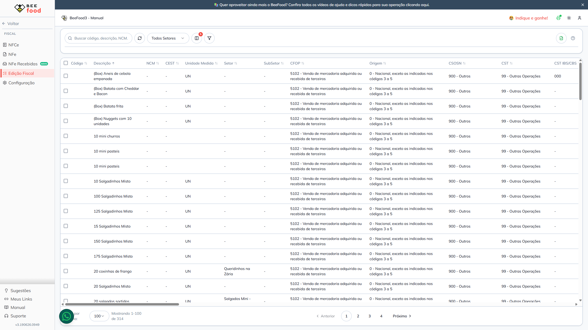
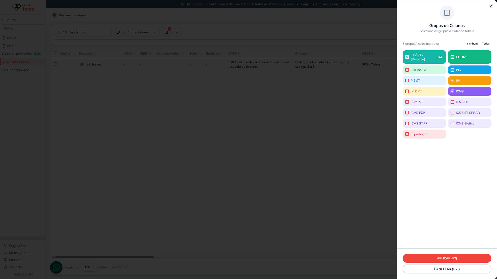
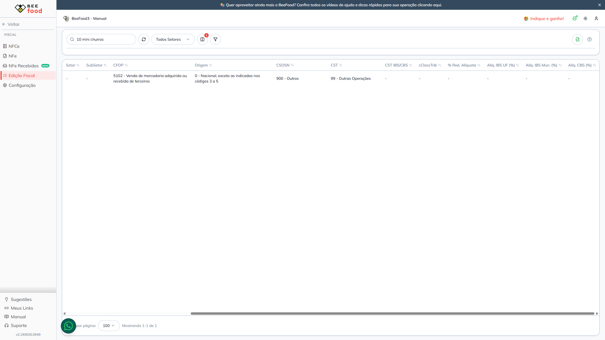
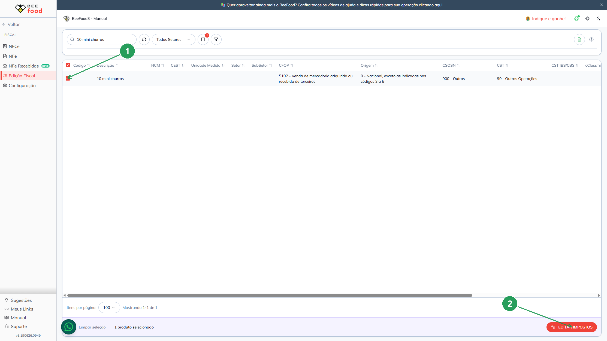
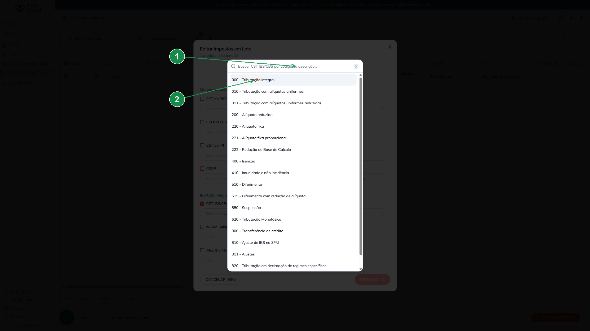
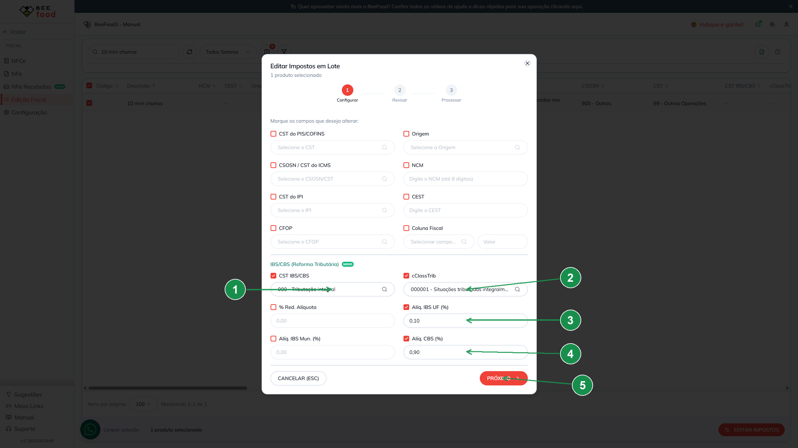
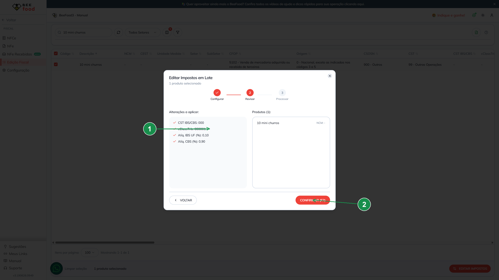
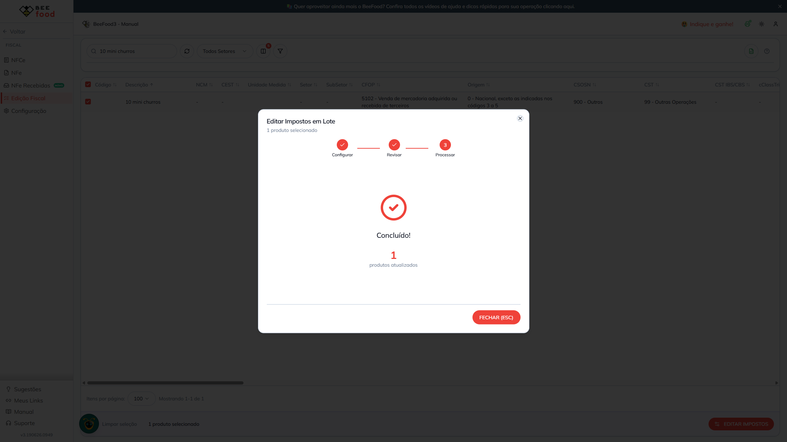

# Reforma Tributária (IBS/CBS) — Configurando os campos fiscais do produto

> **Para quem é este manual:** responsável fiscal / administrador do restaurante.
> **O que você vai aprender:** o que são os novos campos da Reforma Tributária (IBS/CBS),
> **como preenchê-los** no menu **Edição Fiscal** e **como eles aparecem na nota**.
>
> ⚠️ **Importante:**
> - A tela **Edição Fiscal** funciona **somente no computador (desktop)**.
> - Preencher os campos **grava no cadastro do produto**, mas **não emite nota** — é reversível.
> - O exemplo de "como sai na nota" (final deste manual) é **ilustrativo/fictício**: aqui **não**
>   geramos XML nem emitimos NFC-e/NF-e.

---

## 1. O que é a Reforma Tributária (IBS/CBS)?

A partir da **NT 2025.002 / LC 214/2025**, as notas passam a carregar dois novos tributos:

- **IBS** — Imposto sobre Bens e Serviços (parte **estadual** + parte **municipal**).
- **CBS** — Contribuição sobre Bens e Serviços (parte **federal**).

Em **2026** (fase de transição), o sistema **apenas configura e exibe** esses campos por produto.
O **cálculo dos valores** e a **montagem do XML** acontecem no servidor de emissão na hora de emitir a nota.

Cada produto passa a ter **6 campos** novos:

| # | Campo na tela | Para que serve | Exemplo |
|---|---------------|----------------|---------|
| 1 | **CST IBS/CBS** | Situação tributária do IBS/CBS (3 dígitos) | `000` – Tributação integral |
| 2 | **cClassTrib** | Classificação tributária (6 dígitos) — **as opções mudam conforme o CST** | `000001` |
| 3 | **% Red. Alíquota** | Percentual de redução da alíquota (quando houver) | `0` |
| 4 | **Alíq. IBS UF (%)** | Alíquota do IBS estadual | `0,10` |
| 5 | **Alíq. IBS Mun. (%)** | Alíquota do IBS municipal | `0` |
| 6 | **Alíq. CBS (%)** | Alíquota da CBS (federal) | `0,90` |

> 💡 Produtos com **CST IBS/CBS em branco não emitem** o grupo IBS/CBS na nota — o sistema ignora,
> para evitar tributar errado. Por isso, configure ao menos o **CST** dos produtos que vão para a nota.

---

## 2. Onde ficam os campos: menu Edição Fiscal

No menu lateral, acesse **Fiscal → Edição Fiscal**. Essa tela mostra todos os produtos em forma de
planilha.



### Exibindo as colunas de IBS/CBS (opcional)

Se as colunas de IBS/CBS não estiverem visíveis, abra o **seletor de grupos de colunas** e ative o
grupo **"IBS/CBS (Reforma)"**.



Com o grupo ativo, as colunas **CST IBS/CBS, cClassTrib, % Red. Alíquota, Alíq. IBS UF (%),
Alíq. IBS Mun. (%) e Alíq. CBS (%)** aparecem na planilha.



---

## 3. Como editar os campos (passo a passo)

### Passo 1 — Selecione o produto e abra o editor

Use a busca para localizar o produto (no exemplo, **"10 mini churros"**). Depois:

1. **Marque a caixa de seleção** do produto.
2. Clique no botão **EDITAR IMPOSTOS** (canto inferior direito).



> Você pode marcar **vários produtos** e editar todos de uma vez (edição em lote).

### Passo 2 — Preencha os campos IBS/CBS

Abre a janela **"Editar Impostos em Lote"**. Role até a seção **IBS/CBS (Reforma Tributária)** e
**marque apenas os campos que deseja alterar**.

Ao abrir o **CST IBS/CBS**, o sistema lista o catálogo completo de CSTs. Escolha o adequado
(no exemplo, **000 – Tributação integral**).



Em seguida preencha os demais campos:



| Seta | Campo | O que fazer | Exemplo |
|------|-------|-------------|---------|
| **1** | **CST IBS/CBS** | Selecione a situação tributária | `000 – Tributação integral` |
| **2** | **cClassTrib** | Selecione a classificação. **As opções já vêm filtradas** pelo CST escolhido | `000001` |
| **3** | **Alíq. IBS UF (%)** | Informe a alíquota do IBS estadual (aceita vírgula) | `0,10` |
| **4** | **Alíq. CBS (%)** | Informe a alíquota da CBS | `0,90` |
| **5** | **PRÓXIMO** | Avança para a revisão | — |

> 🔎 **Detalhe importante (seta 2):** o **cClassTrib depende do CST**. Para o CST `000`, por exemplo,
> aparecem apenas `000001`, `000002`, `000003` e `000004`. Sempre escolha o **CST primeiro**.
> Os campos **% Red. Alíquota** e **Alíq. IBS Mun. (%)** só precisam ser preenchidos quando se aplicam
> ao seu produto/município.

### Passo 3 — Revise as alterações

A tela de **revisão** mostra exatamente o que será gravado e em quais produtos. Confira e clique em
**CONFIRMAR (F2)**.



| Seta | Item | Descrição |
|------|------|-----------|
| **1** | **Alterações a aplicar** | Lista dos campos e valores que serão gravados |
| **2** | **CONFIRMAR (F2)** | Grava as alterações nos produtos selecionados |

### Passo 4 — Concluído

Ao final, o sistema confirma quantos produtos foram atualizados.



Pronto: o produto já está configurado para a Reforma Tributária. ✅

---

## 4. Como esses campos aparecem na nota (exemplo ilustrativo)

> ⚠️ **Exemplo fictício, apenas para entendimento.** Os valores abaixo são calculados
> **automaticamente pelo servidor de emissão** no momento de emitir a nota — você **não** digita
> esses valores. Aqui **não** emitimos nenhuma nota.

**Cenário fictício:** venda de **1 × "10 mini churros"** por **R$ 10,00**, com a configuração feita
acima (CST `000`, cClassTrib `000001`, IBS UF `0,10%`, IBS Mun `0%`, CBS `0,90%`).

O sistema calcula sobre o valor do produto (`vBC = R$ 10,00`):

| Tributo | Alíquota | Cálculo | Valor |
|---------|----------|---------|-------|
| IBS UF (estadual) | 0,10% | 10,00 × 0,10% | **R$ 0,01** |
| IBS Municipal | 0,00% | 10,00 × 0,00% | **R$ 0,00** |
| **IBS total** | — | 0,01 + 0,00 | **R$ 0,01** |
| CBS (federal) | 0,90% | 10,00 × 0,90% | **R$ 0,09** |

E monta o grupo **IBSCBS** dentro do item da nota. Veja, de forma simplificada, **como ficaria**
no XML (trecho **fictício/ilustrativo**):

```xml
<!-- EXEMPLO FICTÍCIO — ilustra o grupo IBSCBS gerado a partir da configuração do produto -->
<imposto>
  <IBSCBS>
    <CST>000</CST>
    <cClassTrib>000001</cClassTrib>
    <gIBSCBS>
      <vBC>10.00</vBC>
      <gIBSUF>
        <pIBSUF>0.10</pIBSUF>
        <vIBSUF>0.01</vIBSUF>
      </gIBSUF>
      <gIBSMun>
        <pIBSMun>0.00</pIBSMun>
        <vIBSMun>0.00</vIBSMun>
      </gIBSMun>
      <gCBS>
        <pCBS>0.90</pCBS>
        <vCBS>0.09</vCBS>
      </gCBS>
      <vIBS>0.01</vIBS>
    </gIBSCBS>
  </IBSCBS>
</imposto>
```

Resumindo o caminho: **o que você configura no produto** (Edição Fiscal) é o que **alimenta o grupo
IBS/CBS da nota** quando ela for emitida.

---

## 5. Dúvidas rápidas

- **Preciso preencher os 6 campos?** Não. No mínimo, configure o **CST IBS/CBS** (sem ele, o grupo
  não é emitido). Os demais dependem da sua regra fiscal.
- **Posso configurar vários produtos de uma vez?** Sim — marque vários na planilha e use **EDITAR IMPOSTOS**.
- **Editar aqui emite nota?** Não. Só **grava o cadastro** do produto; é reversível.
- **O cClassTrib não mostra o código que eu quero.** Verifique o **CST**: o cClassTrib é filtrado por ele.
- **As alíquotas aceitam vírgula?** Sim (vírgula ou ponto).

---

### Referências internas (não publicar)
Detalhes técnicos (colunas, APIs e cálculo no emissor) em [`fluxo-codigo.md`](fluxo-codigo.md).
