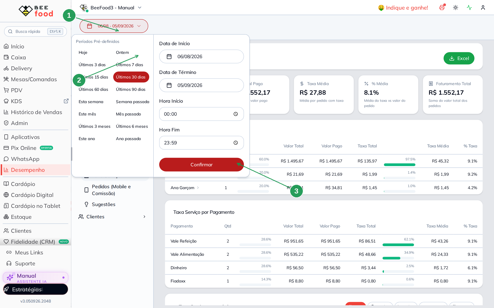
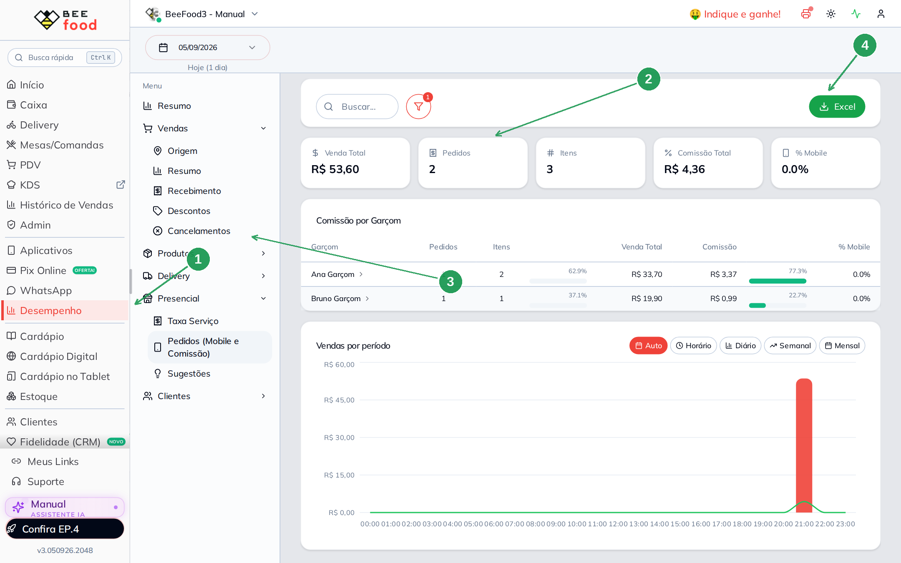
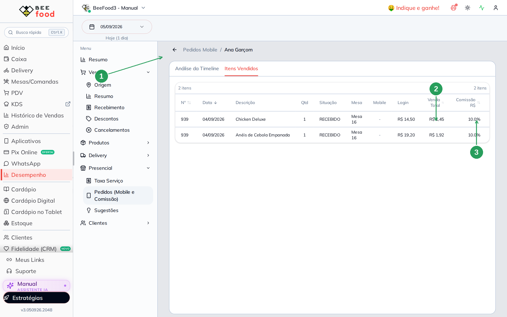
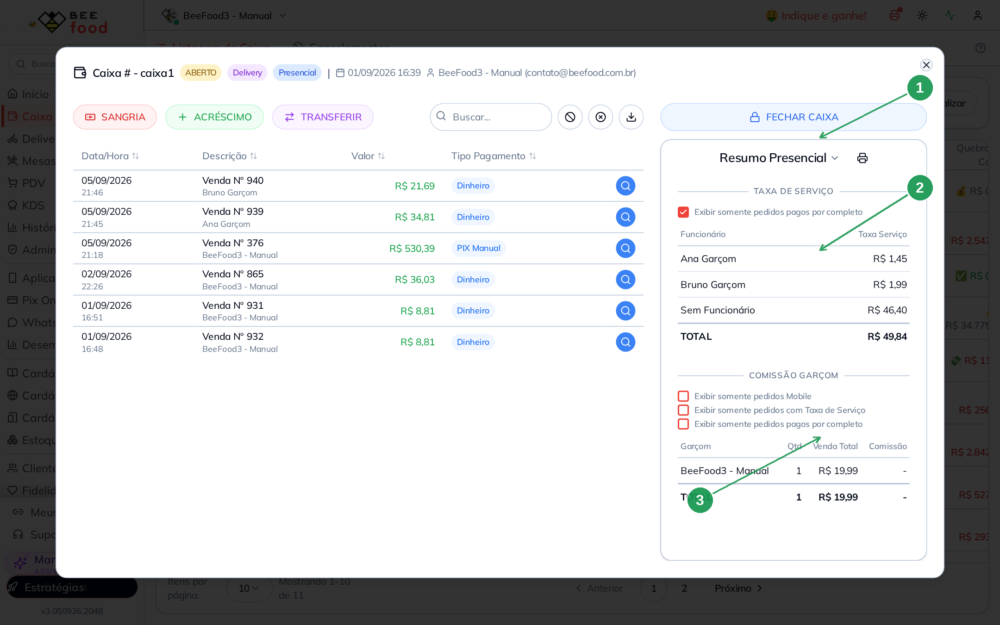

# Relatório de comissão do garçom

Este manual mostra como **fechar a comissão da equipe**: quanto cada garçom ganhou no
período, item a item. O cadastro do percentual está no
[Comissão do garçom: cadastrar e lançar](https://ajuda.beefood.com.br/comissao-garcom-cadastrar).

Comissão **não** é taxa de serviço. A gorjeta (10% da mesa) é o
[Relatório de taxa de serviço](https://ajuda.beefood.com.br/relatorio-taxa-servico).

> As imagens têm **setas numeradas** (1, 2, 3…). Cada número indica o campo ou botão
> correspondente na tela.

---

## Onde fica

**Desempenho → Presencial → Pedidos (Mobile e Comissão)**.

O nome **Mobile** no título é histórico: o relatório traz **todo item com garçom
identificado**, do aplicativo **e** do painel web. O KPI **% Mobile** só diz qual fatia
saiu do celular.

---

## 1. Filtre o dia — senão mistura o caixa antigo

O padrão do Desempenho é **últimos 30 dias**. Se o caixa da loja está aberto há semanas,
a tela enche de venda que não é da conferência de hoje.

Abra o calendário no topo, escolha **Hoje** (ou Data de Início e Data de Fim do período
que você quer fechar) e clique em **Confirmar**.

| Nº | Item | O que fazer |
|----|------|-------------|
| 1 | O botão da data | Mostra o intervalo atual. O padrão longo mistura tudo. |
| 2 | **Hoje** | Isola o dia. Dá para marcar início e fim à mão (incluindo o dia seguinte). |
| 3 | **Confirmar** | Aplica. Sem este clique, o período pendente não muda. |

No exemplo, o filtro do dia isolou **só** o que a Ana e o Bruno lançaram: 2 pedidos,
3 itens, comissão **R$ 4,36**. Sem o filtro, o relatório puxa o caixa aberto desde o
início do mês.

O filtro de situação já vem em **RECEBIDO**. Pedido aberto, sem pagamento, não entra no
fechamento.

---

## 2. Ler o relatório

Com o período certo, a tela mostra os KPIs, a tabela **Comissão por Garçom** e a grade
de itens.

| Nº | Item | O que é |
|----|------|---------|
| 1 | **Presencial → Pedidos (Mobile e Comissão)** | O relatório. |
| 2 | Os cinco KPIs | Venda Total, Pedidos, Itens, **Comissão Total**, **% Mobile**. |
| 3 | **Comissão por Garçom** | Clique no nome para abrir o detalhe. |
| 4 | **Excel** | Exporta a grade. |

Números do exemplo (painel web, % Mobile **0,0%**):

| Garçom | Itens | Venda | Comissão | % |
|--------|------:|------:|---------:|--:|
| Ana Garçom | 2 | R$ 33,70 | R$ 3,37 | 10 |
| Bruno Garçom | 1 | R$ 19,90 | R$ 0,99 | 5 |
| **Total** | **3** | **R$ 53,60** | **R$ 4,36** | — |

Clique na Ana. A aba **Itens Vendidos** é o fechamento fino: cada produto, o R$ e o %.

| Nº | Item | O que conferir |
|----|------|----------------|
| 1 | O caminho | Pedidos Mobile / **Ana Garçom** — é o detalhe dela. |
| 2 | **Comissão R$** | 10% de R$ 14,50 = **R$ 1,45**; 10% de R$ 19,20 = **R$ 1,92**. |
| 3 | **Comissão %** | Veio do cadastro do funcionário, copiado na linha do item. |

Colunas úteis da grade: Nº da venda, Data, Garçom, Descrição, Qtd, Situação, Mesa,
Mobile (Sim/Não), Login, Venda, Comissão R$, Comissão %.

---

## 3. Atalho no caixa: Resumo Presencial

No caixa aberto, **Caixa → ver o caixa →** no título **Resumo**, mude para
**Resumo Presencial**. É o mesmo caixa, outro recorte: taxa de serviço (só **Função
Gerente** vê essa seção) e **Comissão Garçom**.

A conferência **item a item** continua sendo o relatório de Desempenho. O resumo do
caixa agrupa o **período inteiro daquele caixa** (se ele está aberto há dias, mistura
venda antiga) e aplica três filtros na comissão:

- **Exibir somente pedidos Mobile**
- **Exibir somente pedidos com Taxa de Serviço**
- **Exibir somente pedidos pagos por completo**

| Nº | Item | O que é |
|----|------|---------|
| 1 | **Resumo Presencial** | O seletor no topo do painel direito. |
| 2 | **Taxa de Serviço** | Gorjeta por funcionário. No exemplo, Ana **R$ 1,45** e Bruno **R$ 1,99**. Detalhe no [relatório de taxa](https://ajuda.beefood.com.br/relatorio-taxa-servico). |
| 3 | **Comissão Garçom** | Qtd, Venda Total, Comissão. Os três checkboxes mudam o que entra. |

No exemplo, a taxa do caixa listou Ana e Bruno, mas a **Comissão Garçom** não — só uma
venda antiga do usuário da loja, sem %. O fechamento fino da comissão (os R$ 4,36 do
dia) está no Desempenho, acima. Deixe **somente Mobile** desmarcado para incluir o
painel web; o app continua no Desempenho, com **% Mobile** acima de zero.

---

## Perguntas rápidas

**O relatório só conta o aplicativo?** Não. Mobile no título é o nome da tela. Web com
usuário do garçom (ou código de operador) também entra; o % Mobile é que fica 0%.

**Por que apareceu venda de outro dia?** O calendário estava em 30 dias, ou o caixa
aberto atravessou a madrugada. Filtre **Hoje** (ou o intervalo do fechamento).

**Situação diferente de RECEBIDO entra?** O padrão é só RECEBIDO. Abra o filtro se
quiser ver aberto ou cancelado — não use isso para pagar a equipe.
