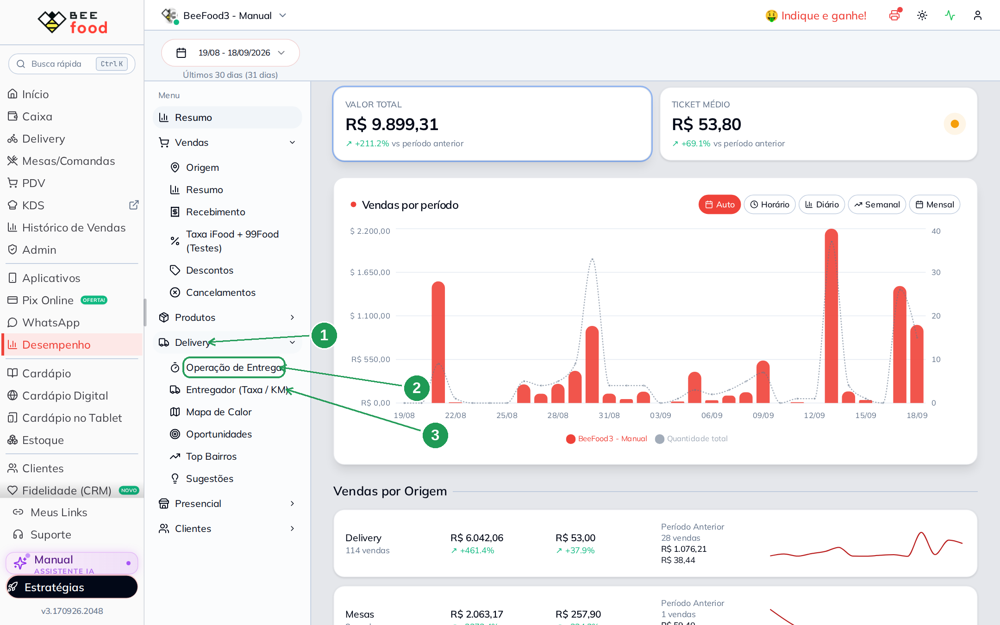
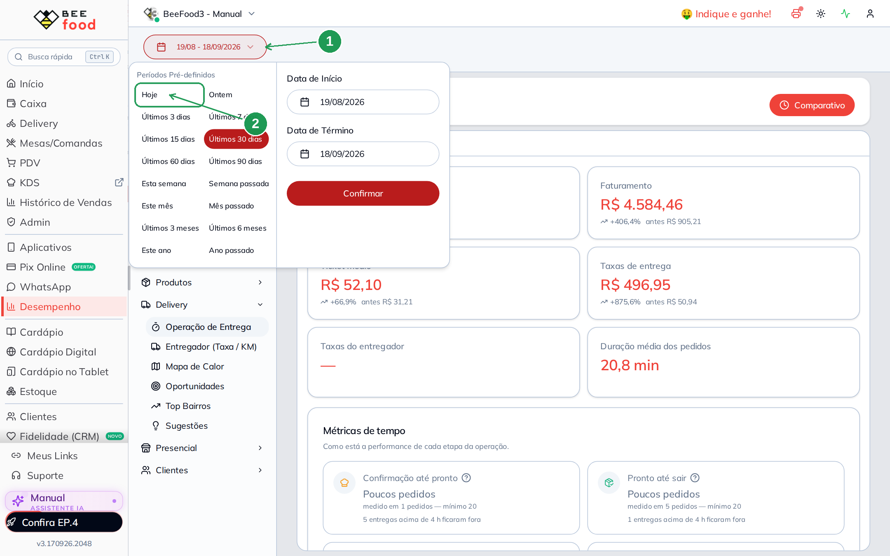
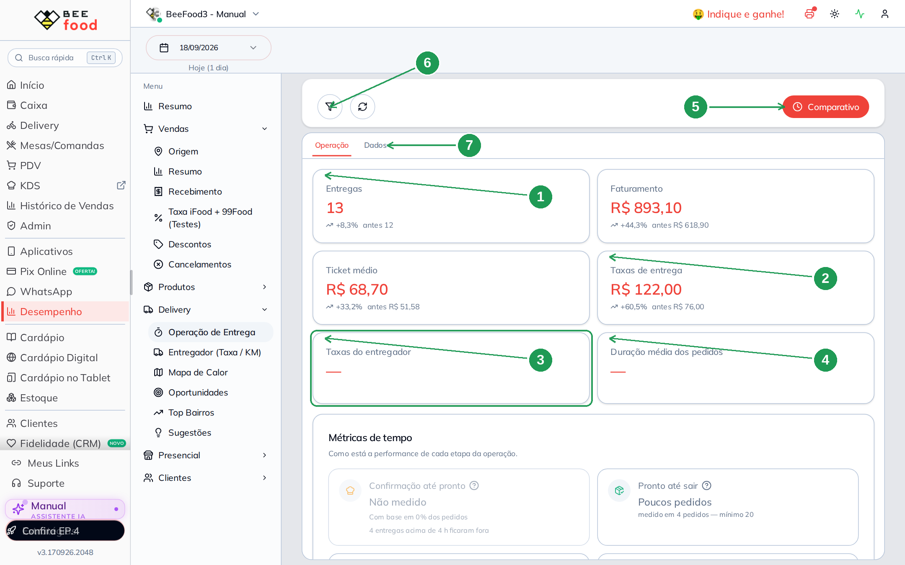
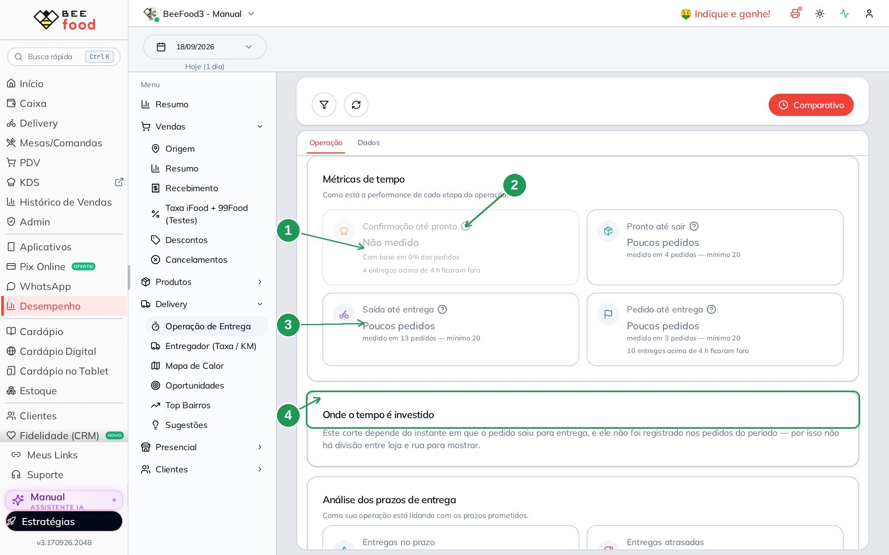
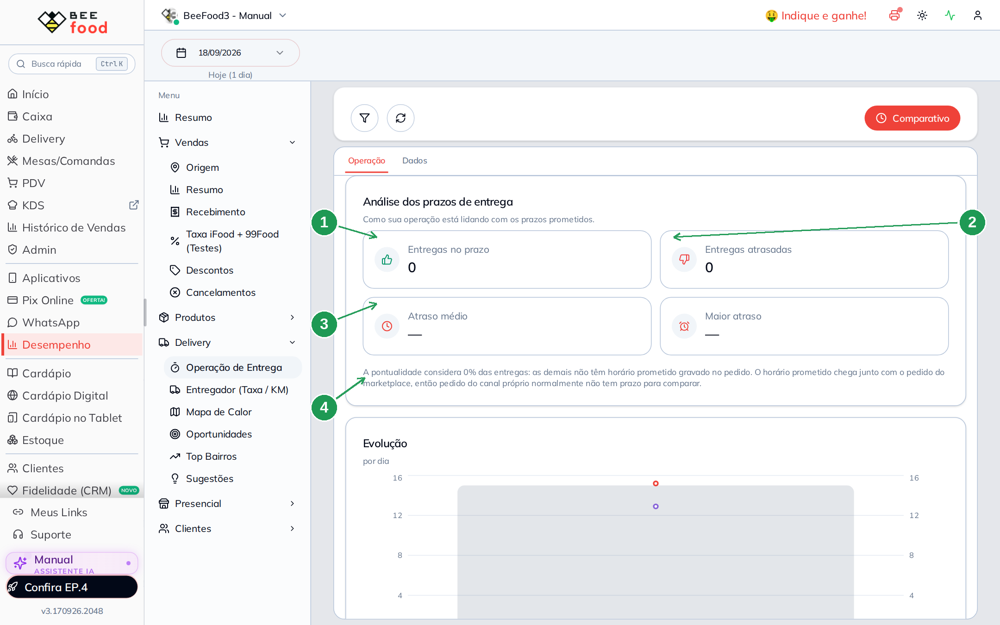
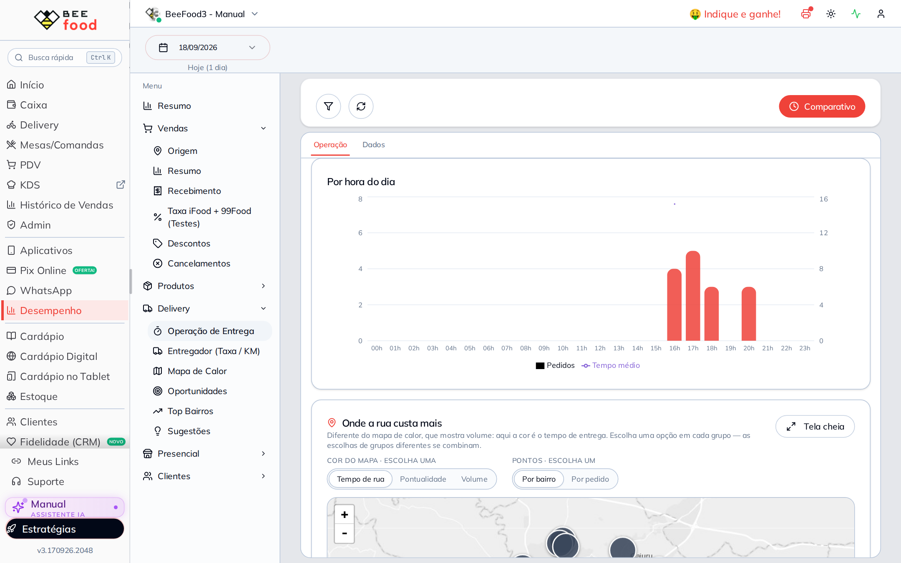
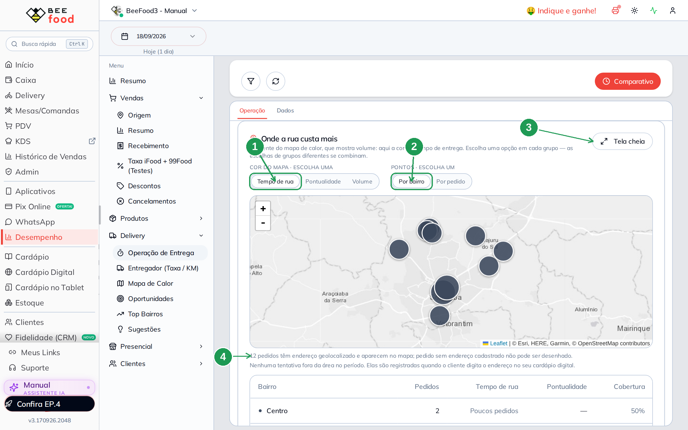
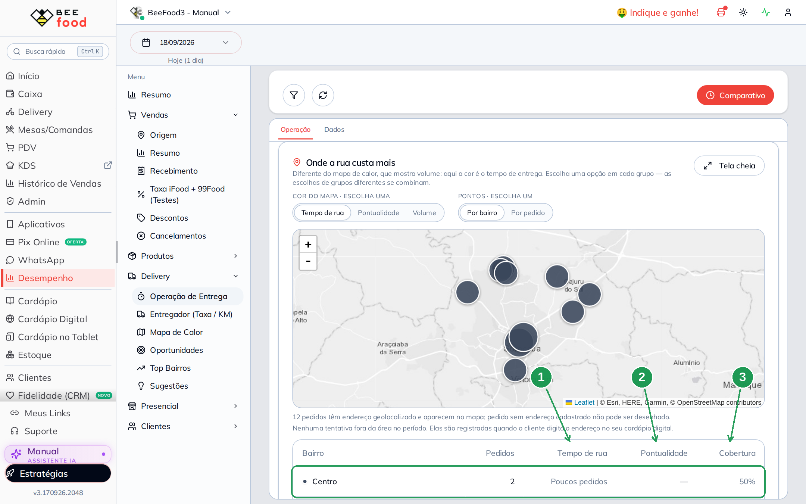
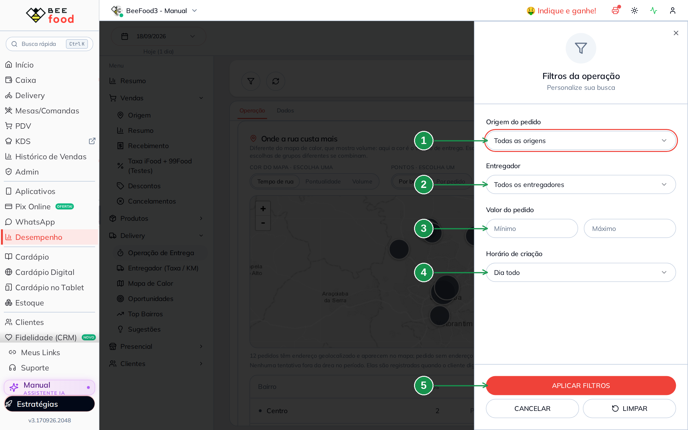
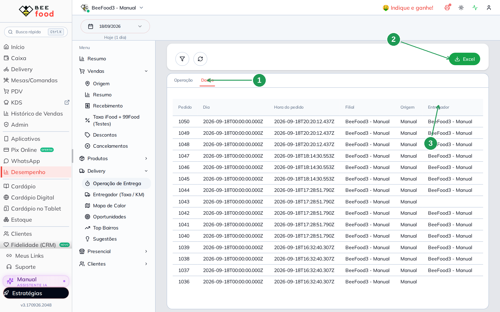

# Relatório Operação de Entrega: onde o tempo da entrega se perde

Este relatório responde a uma pergunta só, e responde bem: **onde o tempo da sua entrega
está sendo gasto**. Quanto o pedido espera na cozinha, quanto ele passa na rua, em que hora do
dia a operação trava e em que bairro a rua custa mais.

Ele nasce junto com a **Gestão de Entregas 2.0** e lê o que a operação do dia produziu: as
rotas que você montou, despachou e fechou no painel aparecem aqui como número.

> A Gestão de Entregas está em liberação. Se o item não aparecer no seu menu, fale com o
> suporte.

## Para que serve

- Ver o tempo de cada etapa: do pedido até o pronto, do pronto até a saída, da saída até a
  entrega.
- Comparar o dia de hoje com o dia anterior, ou o mês com o mês passado.
- Achar a hora do dia e o bairro onde a entrega demora mais.
- Conferir quanto você cobrou de taxa de entrega no período.

## Antes de começar

- O relatório só mostra número depois que alguém **entregou**: pedido pronto na bancada não
  entra na conta.
- Algumas médias só aparecem com **20 pedidos ou mais** no período. Em dia fraco, o normal é
  ver *Poucos pedidos* — não é erro.
- Para o mapa funcionar, o endereço do cliente precisa estar geolocalizado.

---

## 1. Achar o relatório

Vá em **Desempenho**. No menu da esquerda, abra o grupo **Delivery** e clique em
**Operação de Entrega**.

| Nº | Onde | O que é |
|----|------|---------|
| 1. | **Delivery** | O grupo de relatórios de entrega. |
| 2. | **Operação de Entrega** | Este relatório. É o primeiro do grupo. |
| 3. | **Entregador (Taxa / KM)** | O relatório vizinho, que fecha **quanto pagar** a cada entregador. |

---

## 2. Escolher o período

O botão de data fica no alto da tela, com o período escrito nele.

| Nº | Onde | O que faz |
|----|------|-----------|
| 1. | **Botão de período** | Mostra o período atual. Abre os atalhos e o calendário. |
| 2. | **Hoje** | O atalho do dia. Depois de escolher, clique em **Confirmar**. |

> **Sem Confirmar, nada muda.** Escolher o atalho não basta: a tela só refaz a busca quando
> você confirma. É a pegadinha mais comum aqui.

Com **Hoje** você vê a operação do dia — é assim que se acompanha o almoço e o jantar
enquanto eles acontecem. Com **Últimos 30 dias** você vê a média do mês, que é onde as
comparações ficam confiáveis.

---

## 3. Os seis números do topo

| Nº | Indicador | O que conta |
|----|-----------|-------------|
| 1. | **Entregas** | Pedidos **entregues** no período. Abaixo, a variação e o valor do período anterior. |
| 2. | **Taxas de entrega** | A soma do frete que o **cliente** pagou nessas entregas. |
| 3. | **Taxas do entregador** | Quanto você paga aos entregadores. Traço aqui significa que o valor não veio dos pedidos — quem fecha pagamento é o relatório **Entregador (Taxa / KM)**. |
| 4. | **Duração média dos pedidos** | Do pedido até a entrega. Precisa de volume para aparecer. |
| 5. | **Comparativo** | Liga e desliga a comparação com o período anterior (o *antes* embaixo de cada número). |
| 6. | **Filtros** | Origem, entregador, faixa de valor e faixa de horário. Veja a seção 8. |
| 7. | **Dados** | A aba com a tabela crua, pedido por pedido. Veja a seção 9. |

Os outros dois cartões são **Faturamento** (o valor dos pedidos entregues) e **Ticket médio**.

> **Traço não é zero.** Em toda esta tela, `—` quer dizer *não medido*. Zero é zero; traço é
> "não há como calcular com o que está gravado". Confundir os dois leva a decisão errada.

---

## 4. Métricas de tempo: as quatro etapas

Aqui a entrega é quebrada em pedaços, na ordem em que acontecem.

| Nº | Onde | O que lê |
|----|------|----------|
| 1. | **Confirmação até pronto** | *Não medido*: nenhum pedido do período tem essa marcação. O cartão fica apagado, e isso é normal em loja que não usa o KDS. |
| 2. | **Ponto de interrogação** | Explica a etapa em uma frase. Todas as quatro têm. |
| 3. | **Saída até entrega** | O tempo de rua. *Poucos pedidos* com o aviso **mínimo 20**: a média só sai a partir de vinte. |
| 4. | **Onde o tempo é investido** | A divisão entre cozinha e rua. Só aparece quando o **horário de saída** está gravado nos pedidos. |

As etapas são estas quatro:

| Etapa | Do quê até quê |
|---|---|
| Confirmação até pronto | do aceite do pedido até a cozinha marcar pronto |
| Pronto até sair | do pronto até o entregador sair com ele |
| Saída até entrega | da saída até a baixa da entrega |
| Pedido até entrega | o total, da entrada do pedido até a porta do cliente |

Duas linhas pequenas aparecem embaixo dos cartões e valem leitura:

- **"Com base em X% dos pedidos"** — a cobertura. Média de 30% dos pedidos é pista, não
  verdade.
- **"N entregas acima de 4 h ficaram fora"** — entrega que passou de quatro horas é tratada
  como erro de registro e sai da média, para não estragar o número.

---

## 5. Análise dos prazos de entrega

| Nº | Onde | O que lê |
|----|------|----------|
| 1. | **Entregas no prazo** | Quantas chegaram dentro do horário prometido. |
| 2. | **Entregas atrasadas** | Quantas passaram do prometido. |
| 3. | **Atraso médio** e **Maior atraso** | O tamanho do atraso, quando ele acontece. |
| 4. | **Nota de cobertura** | Quantas entregas entraram na conta — e por que as outras não. |

> **Sem horário prometido, não há pontualidade.** O prazo prometido chega junto com o pedido
> do **marketplace** (iFood, 99Food). Pedido do seu cardápio digital normalmente não tem
> prazo gravado, então numa loja que vende só pelo canal próprio estes quatro cartões ficam
> em zero e traço — e a nota embaixo explica exatamente isso.

---

## 6. Por hora do dia

As barras são os pedidos e a linha é o tempo médio. As 24 horas aparecem sempre, mesmo as
vazias, porque é a comparação entre elas que mostra o pico.

É o gráfico mais útil para decidir **escala de entregador**: onde as barras sobem e a linha
sobe junto, falta gente na rua.

---

## 7. Onde a rua custa mais

O mapa do fim da tela não é o mapa de calor de vendas. Ali a cor é **tempo**, não volume.

| Nº | Onde | O que faz |
|----|------|-----------|
| 1. | **Cor do mapa** | Escolha uma: *Tempo de rua*, *Pontualidade* ou *Volume*. |
| 2. | **Pontos** | *Por bairro* agrupa; *Por pedido* mostra cada entrega. |
| 3. | **Tela cheia** | Abre o mapa grande, para olhar bairro por bairro. |
| 4. | **Nota embaixo do mapa** | Quantos pedidos têm endereço no mapa. Pedido sem endereço cadastrado não pode ser desenhado. |

Embaixo do mapa vem a mesma informação em tabela, e é nela que se decide coisa prática.

| Nº | Coluna | O que lê |
|----|--------|----------|
| 1. | **Tempo de rua** | Média do bairro. *Poucos pedidos* quando não há volume para média. |
| 2. | **Pontualidade** | Só preenche com horário prometido gravado. |
| 3. | **Cobertura** | O quanto do bairro entrou na conta. Cobertura baixa = número frágil. |

---

## 8. Filtrar

O funil do alto abre os filtros da operação.

| Nº | Filtro | Para que serve |
|----|--------|----------------|
| 1. | **Origem do pedido** | Separar iFood, 99Food e o seu cardápio digital. |
| 2. | **Entregador** | Olhar a operação de uma pessoa só. |
| 3. | **Valor do pedido** | Mínimo e máximo, para isolar ticket alto. |
| 4. | **Horário de criação** | *Dia todo*, almoço, jantar ou uma faixa sua. |
| 5. | **APLICAR FILTROS** | Refaz a busca. **LIMPAR** volta tudo ao padrão. |

O filtro de origem é o que mais muda a leitura: misturar marketplace com canal próprio faz a
pontualidade parecer pior do que é, porque só o marketplace manda prazo.

---

## 9. A aba Dados

| Nº | Onde | O que tem |
|----|------|-----------|
| 1. | **Dados** | A tabela crua: uma linha por pedido do período. |
| 2. | **Excel** | Baixa a mesma tabela. |
| 3. | **Entregador** | Quem levou. Linha sem entregador é pedido que ninguém pegou. |

Cada linha traz os horários de cada etapa e os tempos calculados. É onde se confere uma
entrega específica quando o número do topo parece estranho — e é o que se manda para o
contador ou para a planilha da operação.

---

## Dicas

- **Comece pelo período certo.** *Hoje* serve para acompanhar o turno; para decidir escala e
  raio de entrega, use 30 dias.
- **Olhe a cobertura antes de acreditar na média.** Todo número desta tela vem com a
  cobertura embaixo; é ela que diz se dá para confiar.
- **Traço em *Taxas do entregador* não é bug de conta.** Ele indica que o valor do entregador
  não está gravado nos pedidos. Quem fecha pagamento é o relatório **Entregador (Taxa / KM)**.
- **Se a divisão loja × rua não aparece**, é porque falta o horário de saída nos pedidos — o
  que acontece quando a entrega não passou pela Gestão de Entregas.
- **Compare bairro com bairro, não bairro com a média.** A tabela do mapa existe para isso.

---

## Onde continuar

| Manual | O que cobre |
|--------|-------------|
| [Quanto o entregador recebe](../entregador-quanto-recebe/entregador-quanto-recebe.md) | Taxa do cliente, valor do entregador, diária, KM e o relatório de fechamento |
| [Fechar a entrega no painel](../gestao-entregas-fechar-entrega/gestao-entregas-fechar-entrega.md) | A baixa que alimenta este relatório |
| [Ler o mapa e o painel de entregas](../gestao-entregas-mapa-painel/gestao-entregas-mapa-painel.md) | O vocabulário da Gestão de Entregas |
| [Despachar e acompanhar](../gestao-entregas-despachar/gestao-entregas-despachar.md) | O despacho, que é o horário de saída deste relatório |
